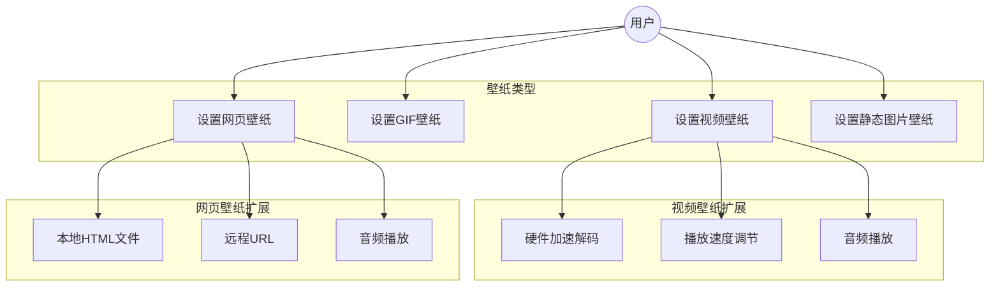
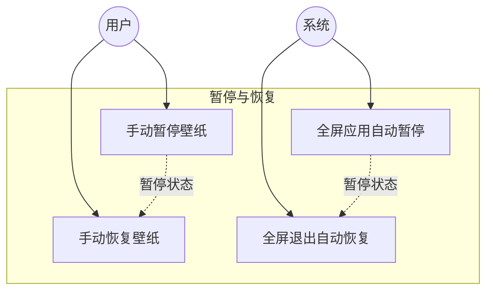

# MirrorStar Wallpaper（镜星壁纸）需求文档 — 用例

[← 返回文档索引](../README.md) > [需求文档](./overview.md) > 用例

> 相关文档：[项目概述](./overview.md) | [功能性需求](./functional-requirements.md) | [非功能性需求](./non-functional-requirements.md) | [约束与术语](./constraints.md)

## 7. 用例图

### 7.1 系统用例图

```mermaid
graph TB
    Actor((用户))

    subgraph MirrorStar Wallpaper
        UC1[设置视频壁纸]
        UC2[设置GIF壁纸]
        UC3[设置网页壁纸]
        UC4[设置静态图片壁纸]
        UC5[切换壁纸]
        UC6[删除壁纸]
        UC7[拖放添加壁纸]
        UC8[暂停/恢复壁纸]
        UC9[调节音量]
        UC10[多显示器独立设置]
        UC11[系统托盘操作]
        UC12[开机自启设置]
        UC13[配置管理]
        UC18[壁纸缩放模式]
        UC19[Explorer 重启恢复]
        UC20[电池供电暂停]
        UC21[重复启动提示]
        UC22[壁纸预览]
        UC23[壁纸搜索]
    end

    Actor --> UC1
    Actor --> UC2
    Actor --> UC3
    Actor --> UC4
    Actor --> UC5
    Actor --> UC6
    Actor --> UC7
    Actor --> UC8
    Actor --> UC9
    Actor --> UC10
    Actor --> UC11
    Actor --> UC12
    Actor --> UC13
    Actor --> UC18
    Actor --> UC19
    Actor --> UC20
    Actor --> UC21
    Actor --> UC22
    Actor --> UC23
```

### 7.2 壁纸类型用例图

### 7.3 暂停/恢复用例图

---

## 8. 用例描述

### UC-001：设置视频壁纸

| 项目 | 内容 |
|------|------|
| 用例 ID | UC-001 |
| 用例名称 | 设置视频壁纸 |
| 参与者 | 用户 |
| 前置条件 | 程序已启动，系统托盘图标可见 |
| 基本流程 | 1. 用户打开主窗口 2. 用户通过文件选择对话框或拖放方式添加视频文件 3. 系统识别文件为视频类型 4. 系统生成首帧缩略图并添加到壁纸库 5. 系统启动 mpv 子进程播放视频 6. 系统将 mpv 窗口嵌入 WorkerW 层 7. 视频壁纸在桌面背景显示 |
| 替代流程 | 3a. 文件格式不支持：系统提示"不支持的文件格式" 5a. mpv 启动失败：系统显示错误信息，回退到上一壁纸 |
| 后置条件 | 视频壁纸在桌面背景播放，壁纸库中新增该壁纸 |
| 非功能约束 | 壁纸切换时间 < 1秒（NFR-007），CPU 占用 < 5%（NFR-004） |

### UC-002：设置网页壁纸

| 项目 | 内容 |
|------|------|
| 用例 ID | UC-002 |
| 用例名称 | 设置网页壁纸 |
| 参与者 | 用户 |
| 前置条件 | 程序已启动，系统已安装 WebView2 Runtime |
| 基本流程 | 1. 用户打开主窗口 2. 用户添加本地 HTML 文件或输入 URL 3. 系统识别为网页类型 4. 系统生成默认缩略图并添加到壁纸库 5. 系统启动 mirrorstar-wp-proc.exe 子进程，通过 WebView2 渲染网页 6. 系统将 WebView2 窗口嵌入 WorkerW 层 7. 网页壁纸在桌面背景显示 |
| 替代流程 | 5a. WebView2 不可用：系统提示"需要安装 WebView2 Runtime" 5b. URL 无法访问：系统显示加载失败提示 |
| 后置条件 | 网页壁纸在桌面背景渲染，壁纸库中新增该壁纸 |
| 非功能约束 | 内存占用 < 50MB（NFR-002，不含 WebView2 子进程） |

### UC-003：全屏应用自动暂停

| 项目 | 内容 |
|------|------|
| 用例 ID | UC-003 |
| 用例名称 | 全屏应用自动暂停 |
| 参与者 | 系统 |
| 前置条件 | 壁纸正在播放 |
| 基本流程 | 1. 系统监测到全屏应用程序启动（如游戏、全屏视频播放器） 2. 系统通过 pause_all_fast 暂停所有壁纸播放 3. 壁纸显示当前帧的静态画面 4. 系统切换托盘菜单文本为“恢复壁纸”（图标本身不变化） 5. 全屏应用退出 6. 系统自动恢复所有壁纸播放 7. 系统切换托盘菜单文本为“暂停壁纸”（图标本身不变化） |
| 替代流程 | 2a. 用户已手动暂停：不重复操作 5a. 用户在全屏期间手动恢复：尊重用户操作，恢复播放 |
| 后置条件 | 壁纸暂停时 CPU 占用为 0%（NFR-003） |
| 非功能约束 | 暂停响应时间 < 500ms |

### UC-004：拖放添加壁纸

| 项目 | 内容 |
|------|------|
| 用例 ID | UC-004 |
| 用例名称 | 拖放添加壁纸 |
| 参与者 | 用户 |
| 前置条件 | 程序主窗口已打开 |
| 基本流程 | 1. 用户从资源管理器拖拽文件到主窗口 2. 系统检测到拖放事件 3. 系统识别文件类型（视频/GIF/网页/图片） 4. 系统将文件添加到壁纸库并生成缩略图 5. 系统自动设置为当前壁纸 |
| 替代流程 | 3a. 文件类型不支持：系统提示"不支持的文件类型" 3b. 多个文件拖入：逐个添加到壁纸库，最后一个设为当前壁纸 |
| 后置条件 | 壁纸库新增壁纸，当前壁纸已切换 |
| 非功能约束 | 支持同时拖入多个文件 |

### UC-005：多显示器独立壁纸设置

| 项目 | 内容 |
|------|------|
| 用例 ID | UC-005 |
| 用例名称 | 多显示器独立壁纸设置 |
| 参与者 | 用户 |
| 前置条件 | 系统连接了多个显示器 |
| 基本流程 | 1. 用户打开主窗口 2. 系统显示所有已连接的显示器列表 3. 用户选择目标显示器 4. 用户为该显示器选择壁纸 5. 系统在目标显示器上设置指定壁纸 6. 其他显示器壁纸不受影响 |
| 替代流程 | 2a. 仅一个显示器：跳过选择步骤，直接设置壁纸 |
| 后置条件 | 目标显示器显示新壁纸，其他显示器不变 |
| 非功能约束 | 每个显示器的壁纸进程独立管理 |

### UC-006：系统托盘操作

| 项目 | 内容 |
|------|------|
| 用例 ID | UC-006 |
| 用例名称 | 系统托盘操作 |
| 参与者 | 用户 |
| 前置条件 | 程序已启动 |
| 基本流程 | 1. 程序启动后在系统托盘显示图标 2. 用户右键托盘图标 3. 系统显示上下文菜单：    - 打开主窗口    - 暂停/恢复壁纸    - 退出 4. 用户选择菜单项 5. 系统执行对应操作 |
| 替代流程 | 2a. 用户双击托盘图标：打开主窗口 4a. 用户选择"退出"：程序保存配置后退出 |
| 后置条件 | 对应操作已执行 |
| 非功能约束 | 托盘菜单响应时间 < 200ms |

### UC-007：配置持久化

| 项目 | 内容 |
|------|------|
| 用例 ID | UC-007 |
| 用例名称 | 配置持久化 |
| 参与者 | 系统 |
| 前置条件 | 用户修改了设置或切换了壁纸 |
| 基本流程 | 1. 用户修改配置（切换壁纸、调节音量等） 2. 系统将配置变更写入配置文件 3. 程序重启时读取配置文件 4. 系统恢复上次壁纸和设置 |
| 替代流程 | 3a. 配置文件不存在：使用默认配置 3b. 配置文件损坏：使用默认配置，记录警告日志 |
| 后置条件 | 用户设置在重启后完整恢复 |
| 非功能约束 | 配置文件使用 TOML 格式，人类可读可编辑 |

### UC-008：设置静态图片壁纸

| 项目 | 内容 |
|------|------|
| 用例 ID | UC-008 |
| 用例名称 | 设置静态图片壁纸 |
| 参与者 | 用户 |
| 前置条件 | 程序已启动，系统托盘图标可见 |
| 基本流程 | 1. 用户打开主窗口 2. 用户通过文件选择对话框或拖放方式添加图片文件 3. 系统识别文件为图片类型 4. 系统生成缩略图并添加到壁纸库 5. 系统使用 image crate 解码图片，通过 GDI 双缓冲（CreateCompatibleDC + StretchDIBits + BitBlt）渲染到壁纸窗口 6. 系统将壁纸窗口嵌入 WorkerW 层 7. 图片壁纸在桌面背景显示 |
| 替代流程 | 3a. 图片格式不支持：系统提示"不支持的图片格式" |
| 后置条件 | 图片壁纸在桌面背景显示，壁纸库中新增该壁纸 |
| 非功能约束 | 图片加载时间 < 500ms |

### UC-009：删除壁纸

| 项目 | 内容 |
|------|------|
| 用例 ID | UC-009 |
| 用例名称 | 删除壁纸 |
| 参与者 | 用户 |
| 前置条件 | 壁纸库中至少有一个壁纸 |
| 基本流程 | 1. 用户在壁纸库中选择要删除的壁纸 2. 用户点击删除按钮 3. 系统弹出确认对话框，询问是否同时删除源文件 4. 用户选择"仅从库中移除" 5. 系统从壁纸库中移除该壁纸条目 6. 系统删除对应的缩略图文件 7. 如果该壁纸正在使用，壁纸继续运行（当前版本不处理活跃壁纸的终止，未来改进） |
| 替代流程 | 4a. 用户选择"移除并删除文件"：系统同时删除壁纸源文件和壁纸库条目 |
| 后置条件 | 壁纸从壁纸库中移除，缩略图已清理。注：如该壁纸正在使用，壁纸不会自动停止 |
| 非功能约束 | 删除操作不可撤销，需确认对话框 |

### UC-010：调节壁纸音量

| 项目 | 内容 |
|------|------|
| 用例 ID | UC-010 |
| 用例名称 | 调节壁纸音量 |
| 参与者 | 用户 |
| 前置条件 | 壁纸正在播放（视频或网页壁纸，含音频） |
| 基本流程 | 1. 用户在设置面板中调节音量滑块或点击静音按钮 2. 系统通过 Core Audio API 设置壁纸子进程的音量 3. 音量变更立即生效 4. 系统持久化音量设置到配置文件 |
| 替代流程 | 2a. 音频会话未找到：系统记录警告日志，音量设置在下次播放时生效 |
| 后置条件 | 壁纸音量已调整，配置已保存 |
| 非功能约束 | 音量调节响应时间 < 100ms |

### UC-011：开机自启设置

| 项目 | 内容 |
|------|------|
| 用例 ID | UC-011 |
| 用例名称 | 开机自启设置 |
| 参与者 | 用户 |
| 前置条件 | 程序已启动 |
| 基本流程 | 1. 用户在设置面板中切换"开机自启"开关 2. 系统通过写入注册表启动项（HKEY_CURRENT_USER\Software\Microsoft\Windows\CurrentVersion\Run）设置开机自启 3. 系统更新设置面板的开关状态 |
| 替代流程 | 2a. 注册表写入失败：系统显示错误提示，记录错误日志 |
| 后置条件 | 开机自启状态已更新 |
| 非功能约束 | 注册表操作响应时间 < 200ms |

### UC-012：壁纸缩放模式设置

| 项目 | 内容 |
|------|------|
| 用例 ID | UC-012 |
| 用例名称 | 壁纸缩放模式设置 |
| 参与者 | 用户 |
| 前置条件 | 壁纸正在播放 |
| 基本流程 | 1. 用户在壁纸设置中选择缩放模式（填充/适应/拉伸/居中） 2. 系统根据缩放模式重新计算壁纸渲染区域 3. 系统根据壁纸类型更新渲染参数：Image/GIF 通过 PostMessageW 消息触发壁纸线程重绘（更新 scaling_mode + InvalidateRect）；Video 通过 mpv 启动参数设置（运行时仅记录，需重启 mpv 生效）；Web 仅记录模式（WebView2 自行处理渲染） 4. 壁纸按新模式渲染 |
| 替代流程 | 无 |
| 后置条件 | 壁纸按指定缩放模式渲染 |
| 非功能约束 | 缩放模式切换响应时间 < 200ms |

### UC-013：Explorer 重启后自动恢复

| 项目 | 内容 |
|------|------|
| 用例 ID | UC-013 |
| 用例名称 | Explorer 重启后自动恢复 |
| 参与者 | 系统 |
| 前置条件 | 壁纸正在播放 |
| 基本流程 | 1. Windows Explorer 进程重启（用户手动重启或系统更新） 2. 系统检测到 WorkerW 窗口句柄失效 3. 系统重新查找 Progman 窗口 4. 系统发送 0x052C 消息创建新的 WorkerW 5. 系统将所有活跃壁纸窗口重新嵌入新的 WorkerW 6. 壁纸恢复正常显示 |
| 替代流程 | 3a. WorkerW 失效兜底：5 分钟轮询检测 WorkerW 句柄有效性（is_workerw_valid），失效时调用 check_and_reinitialize 重新初始化。同时 TaskbarCreated 事件驱动即时检测（注册窗口消息，收到时立即重新初始化） |
| 后置条件 | 壁纸在新的 WorkerW 中正常显示 |
| 非功能约束 | Explorer 重启后壁纸恢复时间 < 5 秒（TaskbarCreated 事件驱动即时恢复；5 分钟轮询作为兜底） |

### UC-014：电池供电自动暂停

| 项目 | 内容 |
|------|------|
| 用例 ID | UC-014 |
| 用例名称 | 电池供电自动暂停 |
| 参与者 | 系统 |
| 前置条件 | 壁纸正在播放，用户已启用"电池供电暂停"设置 |
| 基本流程 | 1. 系统检测到电源状态从交流电切换到电池供电 2. 系统暂停所有壁纸播放 3. 壁纸显示当前帧静态画面 4. 系统切换托盘菜单文本为“恢复壁纸”（图标本身不变化） 5. 系统检测到电源状态恢复为交流电 6. 系统自动恢复壁纸播放 7. 系统切换托盘菜单文本为“暂停壁纸”（图标本身不变化） |
| 替代流程 | 5a. 用户在电池供电期间手动恢复：尊重用户操作，恢复播放 |
| 后置条件 | 电池供电时壁纸暂停，接通电源后自动恢复 |
| 非功能约束 | 电源状态切换检测延迟 < 1 秒 |

### UC-015：重复启动提示

| 项目 | 内容 |
|------|------|
| 用例 ID | UC-015 |
| 用例名称 | 重复启动提示 |
| 参与者 | 用户 |
| 前置条件 | 镜星壁纸已在运行 |
| 基本流程 | 1. 用户尝试再次启动镜星壁纸 2. 系统检测到已有实例运行（通过命名互斥体） 3. 系统弹出提示对话框"镜星壁纸已在运行中" 4. 新实例自动退出 |
| 替代流程 | 无 |
| 后置条件 | 原有实例继续运行，新实例已退出 |
| 非功能约束 | 检测和提示时间 < 500ms |

### UC-016：壁纸预览

| 项目 | 内容 |
|------|------|
| 用例 ID | UC-016 |
| 用例名称 | 壁纸预览 |
| 参与者 | 用户 |
| 前置条件 | 壁纸库中至少有一个壁纸 |
| 基本流程 | 1. 用户在壁纸库中点击壁纸卡片 2. 系统弹出全屏模态框，显示壁纸原图 3. 模态框内显示“设为壁纸”按钮 4. 用户点击“设为壁纸” 5. 系统将该壁纸设置到当前选中显示器 6. 系统关闭模态框并显示成功状态 |
| 替代流程 | 3a. 用户点击遮罩区域：关闭模态框 3b. 用户按 ESC 键：关闭模态框 3c. 用户点击关闭按钮：关闭模态框 |
| 后置条件 | 壁纸已设置或模态框已关闭 |
| 非功能约束 | 模态框打开时间 < 200ms |

### UC-017：壁纸搜索

| 项目 | 内容 |
|------|------|
| 用例 ID | UC-017 |
| 用例名称 | 壁纸搜索 |
| 参与者 | 用户 |
| 前置条件 | 壁纸库中至少有一个壁纸 |
| 基本流程 | 1. 用户在搜索框中输入关键词 2. 系统实时过滤壁纸列表，仅显示文件名包含关键词的壁纸 3. 搜索不区分大小写 |
| 替代流程 | 2a. 无匹配结果：显示“未找到匹配的壁纸”提示 3a. 用户清空搜索框：恢复显示全部壁纸 |
| 后置条件 | 壁纸列表已按关键词过滤 |
| 非功能约束 | 搜索响应时间 < 50ms（本地过滤） |
