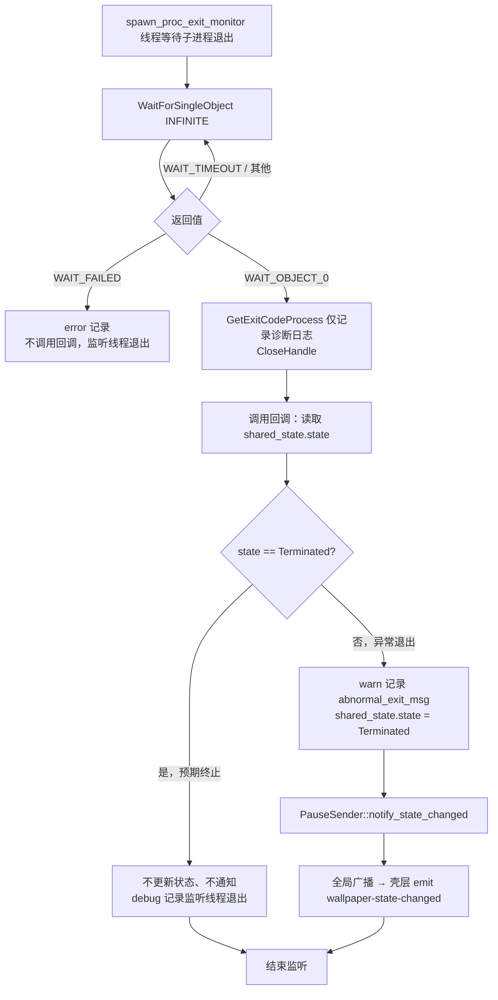

[← 返回文档索引](../index.md) > 架构与技术栈 > 错误处理

# MirrorStar Wallpaper（镜星壁纸）— 错误处理策略

| 项目   | 内容                        |
| ---- | ------------------------- |
| 项目名称 | MirrorStar Wallpaper（镜星壁纸） |
| 文档版本 | v3.0                      |
| 更新日期 | 2026-11-24                |
| 文档状态 | 已实现（已按真实代码合并重组，2026-10；2026-11-24 校准）        |

***

## 1. 错误库选择

### 选择：thiserror 2（库级）

workspace 使用 `thiserror = "2"`，**未引入 anyhow**（早期文档中的 anyhow 为虚构依赖）。

- **`mirrorstar-core`**：定义具体错误类型 `MirrorStarError`（`#[derive(thiserror::Error)]`），覆盖桌面集成、WorkerW 查找、子进程启动、IPC、音频控制、配置文件解析/写入、图片解码、文件监视、Win32、IO 等类别；`pub type Result<T> = std::result::Result<T, MirrorStarError>;`
- **应用层（`src-tauri` / `mirrorstar-ui` / `mirrorstar-wp-proc`）**：Tauri 命令边界将 `MirrorStarError` 序列化为 `{ code, message }` 结构返回前端，保持前端可判定的稳定错误码。

***

## 2. Rust Result-based 错误传播

MirrorStar 使用 Rust 的 `Result<T, E>` 类型系统进行错误处理，避免异常和 panic。

### 2.1 错误类型层次（实测自 `mirrorstar-core/src/lib.rs`）

```rust
/// MirrorStar 全局错误类型
#[derive(Debug, thiserror::Error)]
pub enum MirrorStarError {
    // ── 桌面集成 / 进程 / IPC ──
    #[error("桌面集成失败: {0}")]
    DesktopIntegration(String),
    #[error("未找到 WorkerW 窗口")]
    WorkerWNotFound,
    #[error("子进程启动失败: {0}")]
    ProcessSpawnFailed(String),
    #[error("IPC 通信失败: {0}")]
    IpcError(String),

    // ── 音频控制 ──
    #[error("音频控制失败: {0}")]
    AudioControl(String),
    #[error("未找到进程 {pid} 的音频会话")]
    AudioSessionNotFound { pid: u32 },

    // ── 配置 ──
    #[error("配置文件解析失败: {0}")]
    ConfigParse(String),
    #[error("配置文件写入失败: {0}")]
    ConfigWrite(String),

    // ── 图片 / 文件监视 ──
    #[error("图片解码失败: {0}")]
    ImageDecode(String),
    #[error("文件监视器失败: {0}")]
    FileWatcher(String),

    // ── 并发原语 ──
    #[error("锁中毒: {0}")]
    LockPoisoned(String),
    #[error("任务 join 失败: {0}")]
    TaskJoin(String),

    // ── IPC 细分 ──
    #[error("IPC 超时: {0}")]
    IpcTimeout(String),
    #[error("IPC 连接断开: {0}")]
    IpcDisconnected(String),
    #[error("IPC 未连接: {0}")]
    IpcNotConnected(String),

    // ── 底层 From 转换 ──
    #[error("Win32 错误: {0}")]
    Win32(#[from] windows::core::Error),
    #[error("IO 错误: {0}")]
    Io(#[from] std::io::Error),

    // ── 安全校验（SEC-001/002/004）与参数校验（N-009） ──
    #[error("无效的壁纸文件路径: {reason}")]
    InvalidPath { reason: String },
    #[error("无效的配置字段: {reason}")]
    InvalidConfig { reason: String },
    #[error("无效的 URL 协议: {scheme}")]
    InvalidUrl { scheme: String },
    #[error("无效参数: {reason}")]
    InvalidArgument { reason: String },

    // ── WebView2 ──
    #[error("WebView2 操作超时: {0}")]
    WebView2Timeout(String),
}

pub type Result<T> = std::result::Result<T, MirrorStarError>;
```

`MirrorStarError` 实现了 `serde::Serialize`，序列化输出 `{ "code": "<枚举变体名>", "message": "<Display 文本>" }`，供 Tauri 命令边界透传给前端。同时实现了若干 `From` 转换（`serde_json::Error` / `toml::de::Error` / `toml::ser::Error` → `ConfigParse` / `ConfigWrite`，`image::ImageError` → `ImageDecode`，`notify::Error` → `FileWatcher`）。

### 2.2 错误处理原则

| 原则          | 说明                 | 示例                               |
| ----------- | ------------------ | -------------------------------- |
| **不 panic** | 所有可恢复错误使用 `Result` | 文件不存在返回 `Err`，不 `unwrap`         |
| **尽早返回**    | 使用 `?` 运算符传播错误     | `let hwnd = find_window()?;`     |
| **上下文丰富**   | 错误消息包含足够诊断信息       | `"未找到进程 1234 的音频会话"`    |
| **降级处理**    | 非关键错误不阻断主流程        | 配置热重载失败保留旧配置                     |
| **日志记录**    | 错误发生时记录完整上下文       | `tracing::error!(pid, "子进程崩溃");` |

***

## 3. 进程崩溃恢复

### 3.1 子进程退出监听

MirrorStar **不实现**子进程/渲染线程的异常退出自动重启（respawn）。当前只有单一的退出监听器：

- 实现位置：`crates/mirrorstar-core/src/wallpaper/mod.rs:195-293` 的 `spawn_proc_exit_monitor`（线程名 `mirrorstar-proc-monitor`）。
- 调用方：视频/网页渲染器共用 `SubprocessRenderer::spawn_exit_monitor`（`subprocess_base.rs:337`），分别传入 mpv / wp-proc 的异常退出日志文案。
- 工作方式：`WaitForSingleObject(proc_handle, INFINITE)` 等待子进程句柄；仅 `WAIT_OBJECT_0` 时关闭复制的句柄并调用回调。`GetExitCodeProcess` 仅用于诊断日志（exit_code=0 → info，非 0 → warn），**不参与状态判定**。`WAIT_FAILED` 记录 error 并退出线程、**不调用回调**（无法确认子进程真正退出）；`WAIT_TIMEOUT`/其他值防御性继续等待。线程 spawn 失败仅 `warn`，闭包 drop 时由 `OwnedProcHandle::drop` 关闭句柄。

### 3.2 退出处理流程


```mermaid
flowchart TD
    A[spawn_proc_exit_monitor 线程等待子进程退出] --> B[WaitForSingleObject INFINITE]
    B --> C{返回值}
    C -->|WAIT_FAILED| D[error 记录<br/>不调用回调，监听线程退出]
    C -->|WAIT_TIMEOUT / 其他| B
    C -->|WAIT_OBJECT_0| E[GetExitCodeProcess 仅记录诊断日志<br/>CloseHandle]
    E --> F[调用回调：读取 shared_state.state]
    F --> G{state == Terminated?}
    G -->|是，预期终止| H[不更新状态、不通知<br/>debug 记录监听线程退出]
    G -->|否，异常退出| I[warn 记录 abnormal_exit_msg<br/>shared_state.state = Terminated]
    I --> J[PauseSender::notify_state_changed]
    J --> K[全局广播 → 壳层 emit wallpaper-state-changed]
    H --> L[结束监听]
    K --> L
```

上图的判断要点：

- `spawn_proc_exit_monitor`（`wallpaper/mod.rs:195-293`）是**唯一**的子进程退出监听器，无重试循环；**无独立看门狗进程**。子进程异常退出**不自动 respawn**。
- 状态判定看 `shared_state.state` 是否为 `Terminated`（预期终止），**不看 exit_code**；异常退出时写入 `Terminated` 并通过 `PauseSender::notify_state_changed` 通知，壳层转发为 `wallpaper-state-changed` 事件刷新 UI。
- 进程内另有 `liveness_watchdog`（5s 采样 / 1.3s 确认 / 60s 冷却）做视频停滞自愈，见 §3.4；桌面层自愈见 §3.5。

### 3.3 恢复策略现状

> **重要说明**：异常崩溃的自动重启（respawn）**未实现**，处于观察中。不存在"重新 spawn 子进程 3 次""重启 GIF 渲染线程 3 次""连续崩溃(3 次/分钟)放弃恢复并切换静态壁纸"等自动重启/重试流程。全屏 `terminate` 后的子进程由 `resume_all_fast` / 后台复查线程重建，不属于异常崩溃 respawn；`liveness_watchdog` 的视频停滞重建与桌面层自愈的渲染器重建是**受控自愈**，也不属于异常崩溃 respawn。

| 场景        | 现状                          | 后续方向      |
| ---------- | --------------------------- | --------- |
| 子进程异常退出  | 仅监听并更新状态为 Terminated，通知前端；**不自动 respawn**    | 自动重启（respawn）待评估，处于观察中 |
| 主进程崩溃    | 操作系统自动回收子进程（父子进程关系），**无独立看门狗进程**；进程内 `liveness_watchdog` 仅做视频停滞自愈（5s 采样 / 1.3s 确认 / 60s 冷却）；mpv / wp-proc 子进程退出统一由 `spawn_proc_exit_monitor` 感知 | - |
| 视频输出停滞（进程未退出） | `liveness_watchdog` 确认两段采样均钉住后 `heal_stalled_renderer` → `rebuild_renderer`（terminate + revive），单屏 60s 冷却 | 观察误判率，必要时调整确认区间 |
| 桌面层窗口被销毁（Explorer 重启 / 解锁 / 唤醒） | 事件驱动 + 300s 兜底 `heal_desktop_layer`：重初始化桌面句柄、重嵌脱离窗口、重建已销毁渲染器（暂停中不重建） | - |

### 3.4 视频停滞自愈（liveness_watchdog）

`src-tauri/src/platform/liveness_watchdog.rs` 以低开销周期任务看护"应为播放"的视频壁纸：

| 参数 | 值 | 说明 |
|------|----|------|
| 采样间隔 `LIVENESS_WATCH_INTERVAL` | 5s | `tokio::time::interval` + `MissedTickBehavior::Skip` |
| 确认采样 `CONFIRM_INTERVAL` | 1.3s | 与 5s 互不整除，消除"循环时长整除采样周期"的周期混叠误报 |
| 自愈冷却 `HEAL_COOLDOWN` | 60s | 单显示器冷却期内只 warn，不重复自愈 |

- 判据：连续两段采样的 `time-pos` 均未前进且未暂停（`video_playback_stalled`），才判定停滞。
- 跳过条件（任一命中即本轮不动作且**不更新采样基线**）：应用退出清理已开始（`SHUTDOWN_DONE`）、纯净壁纸模式、轮换原子交换中、`pause_reasons` 非空、engine 锁忙（`try_lock`）；纯净模式/原子交换在锁外前置判定与锁内复核各判一次，收口 TOCTOU。
- 自愈：仅对确认停滞的显示器逐屏调用 `heal_stalled_renderer`（内部 `rebuild_renderer` = `terminate` + `revive_terminated`）；单屏失败仅 warn，不阻断其他屏。
- 锁与阻塞：采样/自愈在 `spawn_blocking` 内，engine 锁用 `try_lock`；确认采样的 1.3s `sleep` 在**锁外**，避免长时间占锁。

### 3.5 桌面层自愈

Explorer 重启、Win+Tab 抬起/放下桌面、锁屏-解锁、睡眠唤醒都可能销毁 `Progman`/`WorkerW`，壁纸窗口作为其子窗口会被一并销毁。自愈编排：

| 触发源 | 去抖 | 入口 |
|--------|------|------|
| `WorkerW` / `Progman` 销毁（WinEvent，`WINEVENT_OUTOFCONTEXT`） | 1s | `explorer.rs::trigger_heal_desktop_layer(..., true)` |
| `TaskbarCreated`（新 shell 就绪） | 无 | `trigger_heal_desktop_layer("TaskbarCreated", false)` |
| 会话解锁 / 睡眠恢复 | 无 | `trigger_heal_desktop_layer(..., false)` |
| 300s 定时兜底 | — | `workerw_check.rs`（原子交换中跳过） |

- 统一入口 `state::try_heal_desktop_layer()`：纯净模式 / 原子交换守卫命中或 `try_lock` 失败返回 `None`；成功则调用 `WallpaperEngine::heal_desktop_layer()`（`manager.rs:1414`）。
- `heal_desktop_layer`：纯净模式直接返回；`desktop.check_and_reinitialize()` 重初始化桌面句柄；逐屏按窗口健康分流——仍附着则仅修复 z 序、半脱离则重嵌、窗口已销毁且**非暂停中**才 `rebuild_renderer`；单屏失败记录 error 后继续，不修改模式/来源/缩放注册表。
- 返回值 `did_reinit` 表示桌面句柄是否实际重初始化；300s 任务据此 emit `desktop-status-changed`，失败也 emit 让前端启动补救轮询。

### 3.6 崩溃日志（crash.log）

- `src-tauri/src/lib.rs:264` 在其它线程 spawn 之前安装全局 `std::panic::set_hook`（`Once` 防重入），覆盖所有线程 panic。
- `trace_panic_info`（`lib.rs:196`）格式化 UTC 时间戳、线程名、panic 位置与 payload，追加写入数据根目录的 `crash.log`，并同步 `tracing::error!`；hook 内全部吞错，**禁止再次 panic**。
- 自限幅：每次追加前调用 `log_retention::rotate_crash_log`，`crash.log` 超过 1 MiB（`CRASH_LOG_MAX_BYTES`）时轮转为 `crash.log.1`（仅保留一份备份）；启动期日志清理也会轮转一次。
- 子进程（mpv / wp-proc）崩溃不写入主进程 `crash.log`，由退出监听与实例日志（mpv 实例日志保留 20 份）覆盖。

***

## 4. 优雅降级

| 故障场景               | 降级方案                              |
| ------------------ | --------------------------------- |
| WorkerW 未找到        | Native 模式下不影响静态图片壁纸；WorkerW 模式下嵌入失败并返回 `DesktopIntegration`/`WorkerWNotFound` 错误（不自动降级为普通底层窗口） |
| WebView2 不可用       | 网页壁纸/预览不可用，程序无内置引导安装，需用户自行安装 WebView2 Runtime |
| mpv.exe 缺失/启动失败   | 视频壁纸不可用，提示用户检查 mpv.exe（随程序分发或 PATH 查找）         |
| 配置文件损坏             | 使用默认配置启动，记录警告日志                   |
| 音频控制失败             | 壁纸正常播放，仅音频控制不可用                   |
| SetWinEventHook 失败 | **系统事件钩子**（返回 0）：记录 `error` 并退出全屏监控线程；**对象事件钩子**（返回 0）：记录 `warn` 并继续——前台切换事件仍可用。两种情况下已启动的 500ms 轻量探针 + 每 2s 全量兜底仍会继续检测进入与退出（时延上升） |
| Native 壁纸 API 失败  | 返回错误，**不回退** WorkerW 嵌入模式，记录错误日志           |

> **SetWinEventHook 降级说明**：全屏检测注册**两个** `WINEVENT_OUTOFCONTEXT` 钩子——系统事件（`EVENT_SYSTEM_FOREGROUND..EVENT_SYSTEM_MINIMIZEEND`）与对象事件（`EVENT_OBJECT_DESTROY..EVENT_OBJECT_UNCLOAKED`，附加 `WINEVENT_SKIPOWNPROCESS`）。**对象事件用于发现"独占全屏在同一个前台窗口内部切换"**：D3D `ChangeDisplaySettings` / borderless→exclusive 不产生前台事件，可依靠对象事件中的 `LOCATIONCHANGE` / `STATECHANGE` 识别，并由 500ms QUNS 轻量探针兜底。
>
> - **系统事件钩子失败（返回 0）**：`fullscreen.rs` 记录 `error` 并停止全屏监控线程（置 `FULLSCREEN_MONITOR_RUNNING=false`）；对象钩子不会安装，但已启动的 `mirrorstar-fullscreen-probe` 仍以 500ms 快照 + 每 2s 全量调和检测进入/退出，只是响应时延上升（≤1s / 最坏 2s）。
> - **对象事件钩子失败（返回 0）**：记录 `warn` 并继续运行；前台切换（`EVENT_SYSTEM_FOREGROUND`）与最小化/还原事件仍可用，独立线程 `mirrorstar-fullscreen-probe` 的 500ms 轻量探针在快照变化时触发调和，并每 2s 执行一次全量兜底，**同时覆盖漏检的进入与退出**（不再是"仅退出"），但独占全屏的即时性会下降。
> - **`SHQueryUserNotificationState` 调用失败**：`fullscreen.rs` 仅 `debug` 记录（"SHQueryUserNotificationState 调用失败，回退矩形判定"）并按"无全屏证据"处理，不影响事件钩子与暂停/恢复主流程。级别解析为**会话优先**模型，QUNS 只负责触发 / 维持 / 确认证据，因此调用失败时仍可由「可信且 100% 覆盖的前台窗口 + 已有会话」正常解析；**不会因 QUNS 失败创建错误的全屏会话**（覆盖层不会被当成全屏身份）。
> - **`DwmGetWindowAttribute(DWMWA_EXTENDED_FRAME_BOUNDS)` 失败或返回空矩形**：回退 `GetWindowRect`；两者都失败时本次级别判定返回 `None`。
> - **`DwmGetWindowAttribute(DWMWA_CLOAKED)` 失败**：按"未 Cloak"处理，避免因查询失败而误判为非全屏并提前恢复壁纸。
> - 以上三者均为只读查询，失败只影响单次全屏级别判定的精度，**不影响壁纸显示与暂停/恢复主流程**。

***

**相关文档：**

- [01-架构与技术栈总览](./01-架构与技术栈总览-Architecture-and-Tech-Stack-Overview.md)
- [02-模块设计](./02-模块设计-Module-Design.md)
- [03-进程架构与IPC](./03-进程架构与IPC-Process-Architecture-and-IPC.md)
- [06-暂停恢复机制](./06-暂停恢复机制-Pause-Resume.md)
- [08-依赖与数据流](./08-依赖与数据流-Dependency-and-Data-Flow.md)
- [09-性能优化](./09-性能优化-Performance.md)