[← 返回文档索引](../../README.md) > 架构设计 > 架构概述与系统架构

# MirrorStar Wallpaper（镜星壁纸）架构设计 — 架构概述与系统架构

| 项目   | 内容                        |
| ---- | ------------------------- |
| 项目名称 | MirrorStar Wallpaper（镜星壁纸） |
| 文档版本 | v2.0                      |
| 更新日期 | 2026-08-29                |
| 文档状态 | 已实现（基于最新代码审计）        |

***

## 1. 架构概述

### 1.1 架构哲学

MirrorStar Wallpaper 的架构设计遵循 **"少即是多"** 的哲学——通过精简功能集、选择高效的技术方案、采用事件驱动模型，实现极致的轻量化与高性能。架构设计的每一个决策都围绕以下核心问题展开：**如何在提供完整动态壁纸体验的同时，将系统资源占用降到最低？**

MirrorStar 的架构围绕以下几项关键设计决策进行根本性重构，以达到轻量化与高性能的目标：

* **事件驱动进程监控**：采用 `SetWinEventHook` 消息钩子替代固定间隔轮询，仅在前台窗口切换时触发检测，暂停态 CPU 占用趋近 0%。
* **精简壁纸类型**：聚焦 4 种核心壁纸类型（视频/GIF/网页/静态图），静态图支持 Native（原生 API）/ WorkerW（窗口嵌入）双路径。
* **统一命名管道 IPC**：对外部渲染进程建立两套独立命名管道协议（mpv 原生 JSON IPC + wp-proc 自定义协议），实现稳定的跨进程通信。
* **TOML 配置**：使用 TOML（serde）作为配置格式，简洁、类型安全且便于解析。
* **编译期内存安全**：依托 Rust 所有权模型在编译期保证无数据竞争、无悬垂指针、无缓冲区溢出，规避运行时 GC 泄漏风险。
* **精简进程模型**：采用"主进程 + 壁纸子进程"模型，不引入独立看门狗进程（watchdog 已移除），子进程异常退出由操作系统自动回收。

### 1.2 设计原则

#### 1.2.1 轻量化（Lightweight）

* **功能精简**：仅保留视频、GIF、网页、静态图片四种壁纸类型，去除 Unity/Godot/模拟器/YouTube/壁纸创建器等非核心功能

* **依赖最小化**：无 .NET Runtime 依赖，仅依赖系统自带的 WebView2 Runtime 和随程序分发的外部 mpv.exe

* **体积控制**：目标二进制 < 10MB，单文件部署

* **静态壁纸零资源**：JPG/JPEG/PNG/BMP/TIF/TIFF/DIB 使用 Windows 原生壁纸 API（`SystemParametersInfoW`），无需创建窗口、线程或 GDI 对象

* **WebView2 懒创建**：主窗口不在启动时创建，仅创建系统托盘图标；窗口关闭时隐藏（hide），保留 WebView2 实例

#### 1.2.2 高性能（High Performance）

* **事件驱动**：以 SetWinEventHook 替代轮询，暂停态 CPU 占用目标为 0%

* **零成本抽象**：利用 Rust 的 trait 系统实现多态，编译期单态化，无虚函数表开销

* **硬件加速**：视频播放利用 GPU 硬件解码，GIF 渲染利用 CPU 软件渲染

* **PauseSender 快速通道**：暂停/恢复/音量/静音操作绕过引擎 Mutex，通过 `tokio::sync::mpsc::UnboundedSender<PauseCommand>` 直接发送到渲染器线程，消除锁竞争

* **WorkerW 异步初始化**：`DesktopIntegrator::new()` 通过后台线程预初始化 WorkerW，不阻塞主进程启动

#### 1.2.3 内存安全（Memory Safety）

* **所有权模型**：Rust 编译器在编译期保证无数据竞争、无悬垂指针、无缓冲区溢出

* **无 GC**：确定性析构，无垃圾回收停顿

* **进程隔离**：壁纸渲染在独立子进程中运行，崩溃不影响主进程

#### 1.2.4 模块化（Modularity）

* **Trait 抽象**：壁纸后端通过 `WallpaperRenderer` trait 统一抽象，便于扩展

* **松耦合**：模块间通过消息传递和事件总线通信，减少直接依赖

* **可测试性**：核心逻辑与平台 API 解耦，便于单元测试

***

## 2. 系统架构图

### 2.1 分层架构

```mermaid
graph TB
    subgraph UI["UI 层 (Tauri WebView2 Frontend)"]
        UI_Main["主窗口（懒创建）<br/>WebviewWindowBuilder 按需创建<br/>关闭即隐藏（hide），保留 WebView2 实例便于快速恢复"]
        UI_Tray["系统托盘<br/>图标 / 右键菜单<br/>启动时仅创建托盘图标"]
        UI_DnD["拖放处理<br/>文件类型识别"]
    end

    subgraph BIZ["业务逻辑层 (Rust Core)"]
        BIZ_Engine["壁纸引擎<br/>WallpaperEngine<br/>WallpaperMode 双路径（Native/WorkerW）"]
        BIZ_ProcMgr["进程管理器<br/>ProcessManager"]
        BIZ_Config["配置管理器<br/>ConfigManager"]
        BIZ_Audio["音频控制<br/>AudioController"]
        BIZ_PauseSender["PauseSender 快速通道<br/>绕过 Mutex，直接 mpsc 通道"]
    end

    subgraph SYS["系统层 (Rust Core + windows-rs)"]
        SYS_Desktop["桌面集成<br/>DesktopIntegrator<br/>异步初始化（后台线程）"]
        SYS_Native["原生壁纸 API<br/>SystemParametersInfoW + 注册表"]
    end

    subgraph OS["OS 层 (Windows APIs)"]
        OS_User32["user32.dll<br/>SetParent / SetWinEventHook"]
        OS_SysParams["SystemParametersInfoW<br/>SPI_SETDESKWALLPAPER"]
        OS_Registry["注册表<br/>WallPaperStyle / TileWallpaper"]
        OS_CoreAudio["Core Audio API<br/>ISimpleAudioVolume"]
        OS_Kernel32["kernel32.dll<br/>CreateProcessW"]
        OS_WebView2["WebView2 Runtime<br/>Edge Chromium"]
        OS_mpv["mpv.exe<br/>视频解码（外部子进程）"]
    end

    UI --> BIZ
    BIZ --> SYS
    SYS --> OS

    style UI fill:#4FC3F7,stroke:#0288D1,color:#000
    style BIZ fill:#81C784,stroke:#388E3C,color:#000
    style SYS fill:#FFB74D,stroke:#F57C00,color:#000
    style OS fill:#E57373,stroke:#D32F2F,color:#FFF
```

### 2.2 层次职责说明

| 层次        | 职责                      | 关键技术                                        |
| --------- | ----------------------- | ------------------------------------------- |
| **UI 层**  | 用户交互、壁纸库展示、设置面板、拖放处理；主窗口懒创建，关闭即隐藏（hide）；系统托盘在 Tauri 应用层构建（lib.rs setup + state.rs 状态管理，3 项菜单：打开/暂停-恢复/退出）；全屏检测在 platform/fullscreen.rs（SetWinEventHook 事件驱动） | Tauri (Rust + WebView2)、HTML/CSS/TypeScript、WebviewWindowBuilder、tray-icon |
| **业务逻辑层** | 壁纸生命周期管理（WallpaperMode 双路径）、进程调度、配置读写、音频控制、PauseSender 快速通道 | Rust、tokio 异步运行时、mpsc 通道 |
| **系统层**   | 桌面窗口嵌入（异步初始化）、原生壁纸 API（SystemParametersInfoW + 注册表） | windows-rs、SetWinEventHook、SystemParametersInfoW |
| **OS 层**  | Windows 系统调用、硬件加速、进程操作、原生壁纸设置 | Win32 API、Core Audio、mpv.exe（外部子进程）、WebView2、SystemParametersInfoW、注册表 |

***

**相关文档：**

- [模块设计](./03-模块设计-Module-Design.md)
- [进程架构](./04-进程架构-Process-Architecture.md)
- [依赖与数据流](./05-依赖与数据流-Dependency-and-Data-Flow.md)
- [桌面集成](./06-桌面集成-Desktop-Integration.md)
- [暂停恢复机制](./07-暂停恢复机制-Pause-Resume.md)
- [错误处理](./08-错误处理-Error-Handling.md)
- [性能优化](./09-性能优化-Performance.md)
