[← 返回文档索引](../../README.md) > [架构设计](./01-架构概述-Architecture-Overview.md) > 系统架构

# MirrorStar Wallpaper（镜星壁纸）架构设计 — 系统架构图

| 项目   | 内容                        |
| ---- | ------------------------- |
| 文档版本 | v2.0                      |
| 更新日期 | 2026-08-29                |
| 文档状态 | 已实现（基于最新代码审计）        |

***

## 2. 系统架构图

### 2.1 分层架构

```mermaid
graph TB
    subgraph UI["UI 层 (Tauri WebView2 Frontend)"]
        UI_Main["主窗口（懒创建）<br/>WebviewWindowBuilder 按需创建<br/>关闭即隐藏（hide），保留 WebView2 实例便于快速恢复"]
        UI_Tray["系统托盘<br/>图标 / 右键菜单<br/>启动时仅创建托盘图标"]
        UI_DnD["拖放处理<br/>文件类型识别"]
    end

    subgraph BIZ["业务逻辑层 (Rust Core)"]
        BIZ_Engine["壁纸引擎<br/>WallpaperEngine<br/>WallpaperMode 双路径（Native/WorkerW）"]
        BIZ_ProcMgr["进程管理器<br/>ProcessManager"]
        BIZ_Config["配置管理器<br/>ConfigManager"]
        BIZ_Audio["音频控制<br/>AudioController"]
        BIZ_PauseSender["PauseSender 快速通道<br/>绕过 Mutex，直接 mpsc 通道"]
    end

    subgraph SYS["系统层 (Rust Core + windows-rs)"]
        SYS_Desktop["桌面集成<br/>DesktopIntegrator<br/>异步初始化（后台线程）"]
        SYS_Native["原生壁纸 API<br/>SystemParametersInfoW + 注册表"]
    end

    subgraph OS["OS 层 (Windows APIs)"]
        OS_User32["user32.dll<br/>SetParent / SetWinEventHook"]
        OS_SysParams["SystemParametersInfoW<br/>SPI_SETDESKWALLPAPER"]
        OS_Registry["注册表<br/>WallPaperStyle / TileWallpaper"]
        OS_CoreAudio["Core Audio API<br/>ISimpleAudioVolume"]
        OS_Kernel32["kernel32.dll<br/>CreateProcessW"]
        OS_WebView2["WebView2 Runtime<br/>Edge Chromium"]
        OS_mpv["mpv.exe<br/>视频解码（外部子进程）"]
    end

    UI --> BIZ
    BIZ --> SYS
    SYS --> OS

    style UI fill:#4FC3F7,stroke:#0288D1,color:#000
    style BIZ fill:#81C784,stroke:#388E3C,color:#000
    style SYS fill:#FFB74D,stroke:#F57C00,color:#000
    style OS fill:#E57373,stroke:#D32F2F,color:#FFF
```

### 2.2 层次职责说明

| 层次        | 职责                      | 关键技术                                        |
| --------- | ----------------------- | ------------------------------------------- |
| **UI 层**  | 用户交互、壁纸库展示、设置面板、拖放处理；主窗口懒创建，关闭即隐藏（hide）；系统托盘在 Tauri 应用层构建（lib.rs setup + state.rs 状态管理，3 项菜单：打开/暂停-恢复/退出）；全屏检测在 platform/fullscreen.rs（SetWinEventHook 事件驱动） | Tauri (Rust + WebView2)、HTML/CSS/TypeScript、WebviewWindowBuilder、tray-icon |
| **业务逻辑层** | 壁纸生命周期管理（WallpaperMode 双路径）、进程调度、配置读写、音频控制、PauseSender 快速通道 | Rust、tokio 异步运行时、mpsc 通道 |
| **系统层**   | 桌面窗口嵌入（异步初始化）、原生壁纸 API（SystemParametersInfoW + 注册表） | windows-rs、SetWinEventHook、SystemParametersInfoW |
| **OS 层**  | Windows 系统调用、硬件加速、进程操作、原生壁纸设置 | Win32 API、Core Audio、mpv.exe（外部子进程）、WebView2、SystemParametersInfoW、注册表 |

***

**相关文档：**

- [架构概述](./01-架构概述-Architecture-Overview.md)
- [模块设计](./03-模块设计-Module-Design.md)
- [桌面集成](./06-桌面集成-Desktop-Integration.md)
- [进程架构](./04-进程架构-Process-Architecture.md)
- [依赖与数据流](./05-依赖与数据流-Dependency-and-Data-Flow.md)
- [暂停恢复机制](./07-暂停恢复机制-Pause-Resume.md)
- [错误处理](./08-错误处理-Error-Handling.md)
- [性能优化](./09-性能优化-Performance.md)