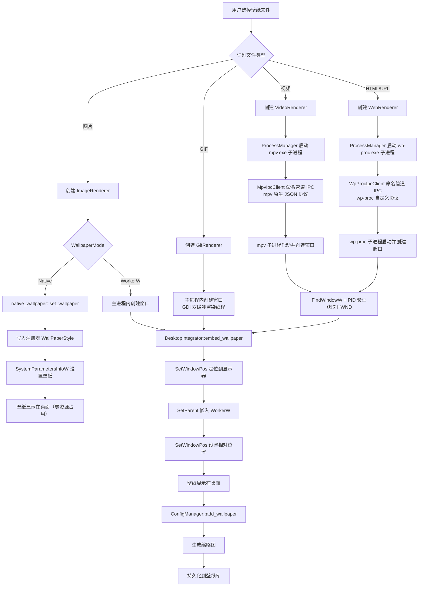
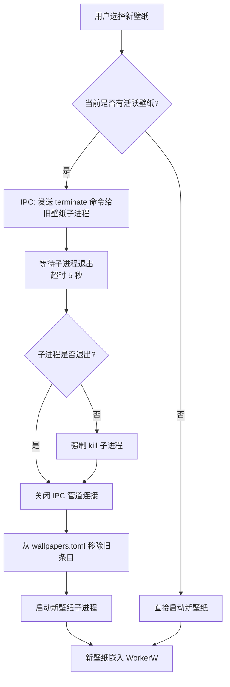

[← 返回文档索引](../../README.md) > [架构设计](./01-架构概述与系统架构-Architecture-Overview.md) > 依赖与数据流

# MirrorStar Wallpaper（镜星壁纸）架构设计 — 依赖图与数据流

| 项目   | 内容                        |
| ---- | ------------------------- |
| 项目名称 | MirrorStar Wallpaper（镜星壁纸） |
| 文档版本 | v2.0                      |
| 更新日期 | 2026-08-29                |
| 文档状态 | 已实现（基于最新代码审计）        |

## 4. 模块依赖图

```mermaid
graph LR
    Engine["壁纸引擎<br/>WallpaperEngine"]
    Desktop["桌面集成<br/>DesktopIntegrator"]
    Native["原生壁纸<br/>native_wallpaper"]
    ProcMgr["进程管理<br/>ProcessManager"]
    Config["配置管理<br/>ConfigManager"]
    Audio["音频控制<br/>AudioController"]
    Tray["系统托盘<br/>（lib.rs setup + state.rs）"]
    IPC["IPC 通信<br/>MpvIpcClient / WpProcIpcClient"]

    Engine --> Desktop : 嵌入壁纸窗口<br/>（WorkerW 模式）
    Engine --> Native : 设置原生壁纸<br/>（Native 模式）
    Engine --> ProcMgr : 创建/终止子进程
    Engine --> Config : 读取壁纸配置
    Engine --> Audio : 控制音频

    Native --> winreg["winreg crate<br/>注册表操作"]
    Native --> SPI["windows::Win32::UI::<br/>WindowsAndMessaging<br/>SystemParametersInfoW"]

    ProcMgr --> IPC : 与子进程通信<br/>（mpv 原生 + wp-proc 自定义两套协议）

    Tray --> Engine : 暂停/恢复/退出
    Tray --> Config : 读取/修改设置

    Config -.-> Engine : 配置热重载通知

    style Engine fill:#81C784,stroke:#388E3C,color:#000
    style Desktop fill:#FFB74D,stroke:#F57C00,color:#000
    style Native fill:#FFB74D,stroke:#F57C00,color:#000
    style winreg fill:#E0E0E0,stroke:#9E9E9E,color:#000
    style SPI fill:#E0E0E0,stroke:#9E9E9E,color:#000
    style ProcMgr fill:#81C784,stroke:#388E3C,color:#000
    style Config fill:#81C784,stroke:#388E3C,color:#000
    style Audio fill:#81C784,stroke:#388E3C,color:#000
    style Tray fill:#4FC3F7,stroke:#0288D1,color:#000
    style IPC fill:#CE93D8,stroke:#7B1FA2,color:#000
```

### 依赖关系说明

| 依赖          | 方向 | 说明                      |
| ----------- | -- | ----------------------- |
| 壁纸引擎 → 桌面集成 | 单向 | 引擎调用桌面集成将壁纸窗口嵌入 WorkerW（仅 WorkerW 模式，Native 模式不依赖桌面集成） |
| 壁纸引擎 → 原生壁纸 | 单向 | 引擎调用 native_wallpaper 模块通过 Windows 原生 API 设置静态壁纸（Native 模式） |
| 原生壁纸 → winreg | 单向 | native_wallpaper 通过 winreg crate 读写注册表（WallPaperStyle/TileWallpaper） |
| 原生壁纸 → Windows API | 单向 | native_wallpaper 调用 SystemParametersInfoW（windows::Win32::UI::WindowsAndMessaging）设置壁纸 |
| 壁纸引擎 → 进程管理 | 单向 | 引擎通过进程管理器创建和终止壁纸子进程（视频→mpv.exe，网页→wp-proc.exe）     |
| 壁纸引擎 → 配置管理 | 单向 | 引擎读取壁纸配置和用户设置           |
| 壁纸引擎 → 音频控制 | 单向 | 引擎控制壁纸音频的音量和静音          |
| 进程管理 → IPC  | 单向 | 进程管理器通过两套独立 IPC 与子进程通信（mpv 原生 JSON IPC + wp-proc 自定义协议）      |
| 系统托盘 → 壁纸引擎 | 单向 | 托盘菜单操作（内联于 lib.rs，仅 open / pause_resume / quit 三项）触发引擎暂停/恢复         |
| 系统托盘 → 配置管理 | 单向 | 托盘菜单修改设置（如开机自启）         |
| 配置管理 → 壁纸引擎 | 事件 | 配置热重载时通知引擎应用新配置         |

***

## 5. 数据流图

### 5.1 设置壁纸数据流



### 5.1a 壁纸切换清理流程

壁纸切换时，必须先清理旧壁纸再启动新壁纸，避免资源泄漏：



**清理步骤详解：**

1. **发送 terminate 命令**：通过 IPC 通知子进程优雅退出
2. **等待退出**：设置 5 秒超时，等待子进程自行退出
3. **强制终止**：超时后调用 `child.kill()` 强制终止
4. **关闭管道**：关闭命名管道连接，释放资源
5. **更新持久化**：从 `wallpapers.toml` 中移除旧条目
6. **启动新壁纸**：创建新的子进程和 IPC 连接

### 5.2 暂停/恢复数据流

> **PauseSender 快速通道**：暂停/恢复/音量/静音等高频操作通过 `AppState.pause_senders`（mpsc 通道）直接发送到各渲染线程，绕过引擎 Mutex，避免锁竞争导致的延迟。

```mermaid
flowchart TD
    A[SetWinEventHook 回调触发] --> B[is_foreground_fullscreen 检测]
    B --> C{前台窗口类型?}
    C -->|桌面/任务栏/自身窗口| D[恢复壁纸]
    C -->|普通窗口| E{窗口矩形是否完全<br/>覆盖显示器矩形?}

    E -->|是| F[暂停壁纸]
    E -->|否| D

    F --> G[WallpaperEngine::pause_wallpaper]
    G --> H[IPC: 发送 {"command":"pause","request_id":1}]
    H --> I[子进程暂停播放]
    G --> J[AudioController::mute_wallpaper]
    J --> K[ISimpleAudioVolume::SetMute(true)]
    G --> L[切换托盘菜单文本为"恢复壁纸"]

    D --> M[WallpaperEngine::resume_wallpaper]
    M --> N[IPC: 发送 {"command":"resume","request_id":2}]
    N --> O[子进程恢复播放]
    M --> P[AudioController::unmute_wallpaper]
    P --> Q[ISimpleAudioVolume::SetMute(false)]
    M --> R[切换托盘菜单文本为"暂停壁纸"]
```

### 5.3 配置变更数据流

```mermaid
flowchart TD
    A[配置文件变更] --> B[notify crate 触发事件]
    B --> C[ConfigManager 防抖处理]
    C --> D[重新解析 TOML]
    D --> E{解析是否成功?}
    E -->|是| F[更新内存中的配置]
    E -->|否| G[保留旧配置 + 记录日志]

    F --> H{配置项类型}
    H -->|音量变更| I[AudioController::set_volume]
    H -->|暂停策略变更| J[更新全屏检测逻辑<br/>（platform/fullscreen.rs SetWinEventHook 回调）]
    H -->|壁纸排列变更| K[WallpaperEngine::update_positions]
    H -->|开机自启变更| L[注册表/启动文件夹操作]

    I --> M[IPC: {"command":"set_volume","request_id":3,"volume":0.8}]
    J --> N[更新 Hook 回调逻辑]
    K --> O[重新计算所有壁纸位置]
    L --> P[写入/删除注册表项]
```

***

## 6. 通信机制

MirrorStar 采用两套独立的命名管道协议（mpv 原生 JSON IPC + wp-proc 自定义协议），配合 Tauri invoke、mpsc 通道与事件钩子实现跨进程、跨线程的高效通信。

### 6.1 通信方式概览

| 通信方式 | 说明 |
|----------|------|
| **前端 ↔ 后端** | Tauri `invoke` (IPC)，跨 WebView2 与 Rust 后端 |
| **主线程 → 渲染线程** | mpsc 通道 + PostMessageW |
| **视频播放控制** | 命名管道 JSON IPC（MpvIpcClient，mpv 原生协议，`ipc/mpv_protocol.rs`） |
| **Web 壁纸通信** | 命名管道 JSON IPC（WpProcIpcClient，wp-proc 自定义协议，`ipc/wp_proc.rs`） |
| **全屏检测通知** | SetWinEventHook 回调 → AtomicBool 去抖 |
| **配置变更通知** | notify crate → RwLock（500ms 防抖） |
| **暂停/恢复控制** | PauseSender 快速通道（绕过引擎互斥锁） |
| **崩溃恢复** | Web 子进程异常退出通过退出监听（spawn_proc_exit_monitor）识别，OS 自动回收子进程，无自动 respawn |

### 6.2 关键设计说明

1. **两套独立 IPC 协议**：视频壁纸通过 `MpvIpcClient`（`ipc/mpv_protocol.rs`）使用 mpv 原生 JSON IPC 协议与 mpv.exe 通信；Web 壁纸通过 `WpProcIpcClient`（`ipc/wp_proc.rs`）使用 wp-proc 自定义协议与 wp-proc.exe 通信。两套协议独立设计，分别针对不同子进程的通信需求。

2. **IPC 连接重试参数**：`ipc/mod.rs`（28 行）与 `client.rs`（1021 行）提供共用连接重试模式，`subprocess_base.rs` 定义具体参数——mpv 连接重试 `MPV_CONNECT_RETRIES=40×50ms=2s` 总超时；wp-proc 连接重试 `WP_PROC_CONNECT_RETRIES=160×50ms=8s` 总超时；窗口查找 `WINDOW_FIND_RETRIES=20×100ms=2s`。

3. **前端-后端通信**：使用 Tauri 的 `invoke` IPC 机制，前端 TypeScript 通过异步函数调用 Rust 后端命令，天然跨进程安全，前后端职责清晰、解耦。

4. **渲染线程通信**：图片/GIF 渲染器在专用线程中运行，通过 mpsc 通道发送命令，PostMessageW 唤醒消息循环处理。该设计保证线程安全，避免并发阻塞 UI 主线程。

5. **PauseSender 快速通道**：绕过引擎互斥锁直接发送暂停/恢复/音量命令，避免高优先级操作被引擎锁阻塞，显著降低响应延迟。

6. **崩溃恢复**：Web 壁纸子进程异常退出由退出监听（`spawn_proc_exit_monitor`）识别并通知引擎；主进程崩溃时操作系统自动回收子进程（父子进程关系）。无需独立看门狗进程，依赖 Rust 的线程安全和 RAII 保证资源释放。

***

**相关文档：**
- [架构概述与系统架构](./01-架构概述与系统架构-Architecture-Overview.md)
- [模块设计](./03-模块设计-Module-Design.md)
- [进程架构](./04-进程架构-Process-Architecture.md)
- [桌面集成](./06-桌面集成-Desktop-Integration.md)
- [暂停恢复机制](./07-暂停恢复机制-Pause-Resume.md)
- [错误处理](./08-错误处理-Error-Handling.md)
- [性能优化](./09-性能优化-Performance.md)