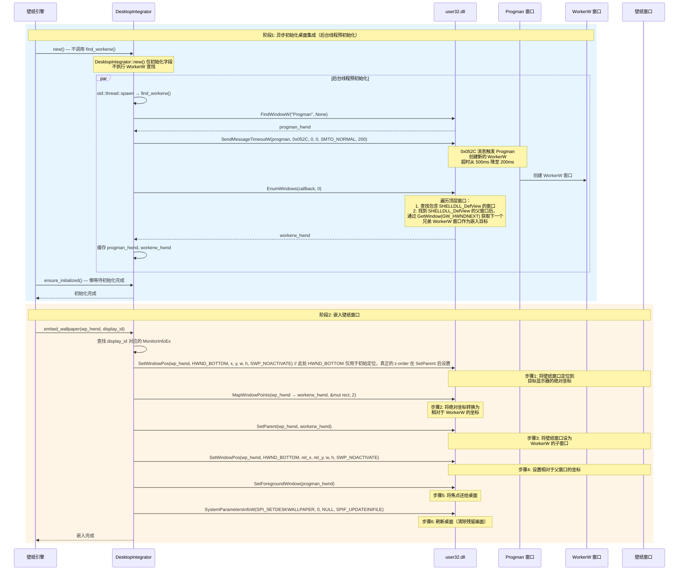
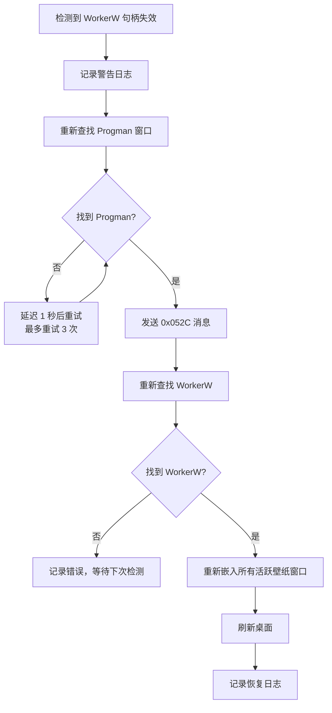

[← 返回文档索引](../../README.md) > [架构设计](./01-架构概述-Architecture-Overview.md) > 桌面集成

# MirrorStar Wallpaper（镜星壁纸）架构设计 — 桌面集成详细设计

| 项目   | 内容                        |
| ---- | ------------------------- |
| 项目名称 | MirrorStar Wallpaper（镜星壁纸） |
| 文档版本 | v2.0                      |
| 更新日期 | 2026-08-29                |
| 文档状态 | 已实现（基于最新代码审计）        |

## 8. 桌面集成详细设计

### 8.0 原生壁纸 API

对于 jpg/jpeg/png/bmp/tif/tiff/dib 静态图片壁纸，MirrorStar 优先使用 Windows 原生壁纸 API（`SystemParametersInfoW`），而非 WorkerW 嵌入方案。原生 API 路径实现零资源占用——无需创建窗口、线程或 GDI 对象。

#### 8.0.1 SystemParametersInfoW 方案

```rust
/// 使用原生 API 设置静态壁纸
fn set_native_wallpaper(file_path: &str, scaling_mode: ScalingMode) -> Result<()> {
    // 1. 设置注册表缩放模式
    let hkcu = RegKey::predef(HKEY_CURRENT_USER);
    let desktop_key = hkcu.open_subkey_with_flags(
        r"Control Panel\Desktop",
        KEY_SET_VALUE,
    )?;

    match scaling_mode {
        ScalingMode::Fill => {
            desktop_key.set_value("WallPaperStyle", &"10")?;  // 填充
            desktop_key.set_value("TileWallpaper", &"0")?;
        }
        ScalingMode::Stretch => {
            desktop_key.set_value("WallPaperStyle", &"2")?;   // 拉伸
            desktop_key.set_value("TileWallpaper", &"0")?;
        }
        ScalingMode::Fit => {
            desktop_key.set_value("WallPaperStyle", &"6")?;   // 适配
            desktop_key.set_value("TileWallpaper", &"0")?;
        }
        ScalingMode::Center => {
            desktop_key.set_value("WallPaperStyle", &"0")?;   // 居中
            desktop_key.set_value("TileWallpaper", &"0")?;
        }
        ScalingMode::Original => {
            desktop_key.set_value("WallPaperStyle", &"0")?;   // 原始大小（同居中）
            desktop_key.set_value("TileWallpaper", &"0")?;
        }
    }

    // 2. 调用 SystemParametersInfoW 设置壁纸
    let wide_path = encode_wide(file_path);
    unsafe {
        SystemParametersInfoW(
            SPI_SETDESKWALLPAPER,
            0,
            Some(wide_path.as_ptr() as *mut _),
            SPIF_UPDATEINIFILE | SPIF_SENDCHANGE,
        )?;
    }

    Ok(())
}
```

#### 8.0.2 WallpaperMode 双路径

```rust
/// 判断文件格式是否支持原生壁纸 API
pub fn is_native_supported(file_path: &str) -> bool {
    let ext = Path::new(file_path)
        .extension()
        .and_then(|e| e.to_str())
        .unwrap_or("")
        .to_lowercase();

    matches!(ext.as_str(), "jpg" | "jpeg" | "png" | "bmp" | "tif" | "tiff" | "dib")
}
```

**路径选择：**

| 文件格式 | WallpaperMode | 说明 |
|----------|---------------|------|
| jpg/jpeg/png/bmp/tif/tiff/dib | `Native` | 使用 `SystemParametersInfoW` + 注册表，零资源 |
| WebP | `WorkerW` | 不支持原生 API，回退到 GDI 双缓冲 + WorkerW 嵌入 |

#### 8.0.3 原生模式 vs WorkerW 模式对比

| 维度 | Native 模式 | WorkerW 模式 |
|------|-------------|--------------|
| 窗口 | 无 | 需创建无边框窗口 |
| 线程 | 无 | 需渲染线程 |
| GDI 对象 | 无 | GDI 双缓冲表面 |
| 内存占用 | ~0MB | ~10-30MB |
| 暂停/恢复 | 空操作（no-op） | 需控制渲染循环 |
| 缩放模式 | 注册表 `WallPaperStyle`/`TileWallpaper` | GDI 双缓冲缩放算法 |
| 支持格式 | jpg/jpeg/png/bmp/tif/tiff/dib | 所有格式（含 WebP） |

### 8.1 WorkerW 嵌入完整流程



### 8.2 窗口样式修改

壁纸窗口嵌入 WorkerW 前需要修改窗口样式，去除边框和任务栏显示：

#### 8.2.1 去除边框（Borderless Window）

```rust
fn make_borderless(hwnd: HWND) -> Result<()> {
    unsafe {
        // 移除标准窗口样式中的标题栏、边框、系统菜单等
        let style = GetWindowLongPtrW(hwnd, GWL_STYLE) as u32;
        let new_style = WINDOW_STYLE(style)
            & !(WS_CAPTION | WS_THICKFRAME | WS_SYSMENU | WS_MAXIMIZEBOX | WS_MINIMIZEBOX);
        let _ = SetWindowLongPtrW(hwnd, GWL_STYLE, new_style.0 as isize);

        // 移除扩展样式中的对话框边框、窗口边缘等
        let ex_style = GetWindowLongPtrW(hwnd, GWL_EXSTYLE) as u32;
        let new_ex_style = WINDOW_EX_STYLE(ex_style)
            & !(WS_EX_DLGMODALFRAME | WS_EX_COMPOSITED | WS_EX_WINDOWEDGE
                | WS_EX_CLIENTEDGE | WS_EX_LAYERED | WS_EX_STATICEDGE
                | WS_EX_TOOLWINDOW | WS_EX_APPWINDOW);
        let _ = SetWindowLongPtrW(hwnd, GWL_EXSTYLE, new_ex_style.0 as isize);
    }
    Ok(())
}
```

#### 8.2.2 从任务栏移除

```rust
fn remove_from_taskbar(hwnd: HWND) {
    unsafe {
        // 读-改-写模式：保留必要样式，添加 TOOLWINDOW 和 NOACTIVATE
        let ex_style = GetWindowLongPtrW(hwnd, GWL_EXSTYLE);
        let new_ex_style = (ex_style as usize)
            & !(WS_EX_APPWINDOW.0 as usize)   // 移除任务栏显示标志
            | (WS_EX_TOOLWINDOW.0 as usize)    // 添加工具窗口标志（不在任务栏显示）
            | (WS_EX_NOACTIVATE.0 as usize);   // 添加不激活标志
        let _ = SetWindowLongPtrW(hwnd, GWL_EXSTYLE, new_ex_style as isize);

        // 需要调用 SetWindowPos 刷新窗口样式
        let _ = SetWindowPos(hwnd, HWND::default(), 0, 0, 0, 0,
            SWP_NOMOVE | SWP_NOSIZE | SWP_NOZORDER | SWP_FRAMECHANGED);
    }
}
```

### 8.3 多显示器定位详解

多显示器环境下，每个显示器的壁纸窗口需要精确定位到对应的屏幕区域。关键挑战是 Windows 的多显示器坐标系——副显示器的坐标可能为负值（在主显示器左侧）或大于主显示器分辨率（在右侧/下方）。

```rust
impl DesktopIntegrator {
    /// 将壁纸窗口嵌入到指定显示器
    fn embed_to_display(&self, hwnd: HWND, display_id: &str) -> Result<()> {
        // 1. 获取目标显示器的边界
        let monitor = self.get_monitor_info(display_id)?;
        let bounds = monitor.monitor;

        // 2. 将壁纸窗口定位到屏幕绝对坐标
        unsafe {
            SetWindowPos(
                hwnd,
                HWND_BOTTOM,
                bounds.left,
                bounds.top,
                bounds.right - bounds.left,
                bounds.bottom - bounds.top,
                SWP_NOACTIVATE | SWP_FRAMECHANGED,
            )?;
        }

        // 3. 坐标转换：绝对坐标 → 相对于 WorkerW 的坐标
        let mut rect = RECT {
            left: bounds.left,
            top: bounds.top,
            right: bounds.right,
            bottom: bounds.bottom,
        };
        unsafe {
            // HWND::default() (NULL) 作为 hwndFrom 表示源坐标是屏幕绝对坐标
            MapWindowPoints(HWND::default(), self.workerw, &mut rect as *mut _ as *mut POINT, 2)?;
        }

        // 4. 设为 WorkerW 子窗口
        unsafe {
            SetParent(hwnd, self.workerw)?;
        }

        // 5. 设置相对坐标
        unsafe {
            SetWindowPos(
                hwnd,
                HWND_BOTTOM,
                rect.left,
                rect.top,
                bounds.right - bounds.left,
                bounds.bottom - bounds.top,
                SWP_NOACTIVATE | SWP_FRAMECHANGED,
            )?;
        }

        Ok(())
    }
}
```

### 8.4 跨显示器拉伸模式

当壁纸排列方式为 `span` 时，单个壁纸窗口覆盖所有显示器：

```rust
fn span_all_displays(&self, hwnd: HWND) -> Result<()> {
    // 获取 WorkerW 的完整区域
    let mut workerw_rect = RECT::default();
    unsafe {
        GetWindowRect(self.workerw, &mut workerw_rect)?;
    }

    // 设为 WorkerW 子窗口
    unsafe {
        SetParent(hwnd, self.workerw)?;
    }

    // 填充整个 WorkerW 区域
    unsafe {
        SetWindowPos(
            hwnd,
            HWND_BOTTOM,
            0,
            0,
            workerw_rect.right - workerw_rect.left,
            workerw_rect.bottom - workerw_rect.top,
            SWP_NOACTIVATE | SWP_FRAMECHANGED,
        )?;
    }

    Ok(())
}
```

### 8.5 DPI 感知处理

MirrorStar 声明为 Per-Monitor DPI Aware V2 应用，确保在不同 DPI 缩放比例的显示器上正确显示壁纸。

#### 8.5.1 DPI 感知声明

在应用程序 manifest 中声明 Per-Monitor DPI Aware V2：

```xml
<application xmlns="urn:schemas-microsoft-com:asm.v3">
  <windowsSettings>
    <dpiAwareness xmlns="http://schemas.microsoft.com/SMI/2016/WindowsSettings">PerMonitorV2</dpiAwareness>
    <dpiAware xmlns="http://schemas.microsoft.com/SMI/2005/WindowsSettings">true/pm</dpiAware>
  </windowsSettings>
</application>
```

#### 8.5.2 DPI 缩放处理策略

| 场景 | 处理方式 |
|------|----------|
| 壁纸窗口定位 | 使用物理像素坐标（GetMonitorInfo 返回的 rcMonitor 已是物理像素） |
| 壁纸窗口尺寸 | 使用物理像素尺寸，与显示器实际分辨率匹配 |
| DPI 变更 | 监听 WM_DPICHANGED 消息，重新计算壁纸窗口位置和尺寸 |
| 多显示器不同 DPI | 每个显示器的壁纸窗口独立处理，使用该显示器的 DPI 值 |

#### 8.5.3 WM_DPICHANGED 处理

```rust
/// 处理 DPI 变更消息
fn on_dpi_changed(hwnd: HWND, new_rect: &RECT) {
    unsafe {
        // 按系统建议的新矩形调整窗口大小
        let _ = SetWindowPos(
            hwnd,
            HWND::default(),
            new_rect.left,
            new_rect.top,
            new_rect.right - new_rect.left,
            new_rect.bottom - new_rect.top,
            SWP_NOZORDER | SWP_NOACTIVATE,
        );
    }
}
```

### 8.6 Explorer 重启检测与 WorkerW 重新嵌入

Windows Explorer（explorer.exe）可能在运行期间重启（如用户通过任务管理器重启、系统更新等），导致 WorkerW 窗口句柄失效。MirrorStar 需要检测 Explorer 重启并重新嵌入壁纸窗口。

#### 8.6.1 检测方案

通过 `start_workerw_check()`（`crates/mirrorstar-core/src/desktop/workerw_check.rs`，236 行）实现：使用 `tokio interval(300s)` + `Notify` 事件触发结构，事件驱动为主（`TaskbarCreated` 消息），并在超时（5 分钟）后周期性地调用`check_and_reinitialize()` 校验/重建 WorkerW。辅助地通过定时验证 WorkerW 句柄有效性来兜底检测 Explorer 重启：

```rust
impl DesktopIntegrator {
    /// 检测 Explorer 重启并重新初始化
    fn check_and_reinitialize(&mut self) -> Result<()> {
        // 验证缓存的 WorkerW 句柄是否仍然有效
        if self.is_workerw_valid() {
            return Ok(());
        }

        tracing::warn!("WorkerW 句柄失效，可能是 Explorer 重启，正在重新初始化...");

        // 重新查找 WorkerW
        self.find_workerw()?;

        // 重新嵌入所有活跃壁纸
        for (display_id, hwnd) in &self.active_wallpapers {
            self.embed_to_display(*hwnd, display_id)?;
        }

        tracing::info!("WorkerW 重新初始化完成，壁纸已重新嵌入");
        Ok(())
    }

    /// 验证 WorkerW 句柄是否有效
    fn is_workerw_valid(&self) -> bool {
        if self.workerw.is_invalid() {
            return false;
        }
        unsafe {
            // 检查窗口是否仍然存在
            IsWindow(self.workerw).as_bool()
        }
    }
}
```

#### 8.6.2 检测触发方式

| 方式 | 优点 | 缺点 |
|------|------|------|
| TaskbarCreated 消息（事件驱动） | 精确，Explorer 重启时系统必定广播此消息 | 需要注册消息接收 |
| 5 分钟（300 秒）定时兜底 | 简单可靠 | 有延迟（最多 5 分钟） |
| 监听 Progman 窗口重建 | 精确 | 实现复杂 |
| SetWinEventHook 监听 | 事件驱动，即时响应 | Explorer 重启不一定触发此事件 |

**推荐方案**：使用 `TaskbarCreated` 消息作为主要检测方式（Explorer 重启时系统必定广播此消息），辅以 `start_workerw_check()`（将 Explorer 重启事件通知触发 + tokio interval 300 秒 + Notify，`is_workerw_valid()` + `check_and_reinitialize()`）作为兜底。

#### 8.6.3 重嵌入流程



***

### 壁纸缩放模式设计

FR-034 定义了五种壁纸缩放模式，各模式渲染逻辑如下：

| 模式 | 说明 | 视频实现 | GIF/图片实现 | 网页实现 | 原生壁纸实现 |
|------|------|----------|-------------|----------|-------------|
| Fill | 填满屏幕，保持比例，裁剪溢出 | mpv --panscan=1.0 | GDI 双缓冲缩放+裁剪 | CSS object-fit: cover | 注册表 WallPaperStyle=10, TileWallpaper=0 |
| Fit | 适配屏幕，保持比例，留黑边 | mpv --keepaspect | GDI 双缓冲缩放+居中 | CSS object-fit: contain | 注册表 WallPaperStyle=6, TileWallpaper=0 |
| Stretch | 拉伸填满，不保持比例 | mpv --no-keepaspect | GDI 双缓冲拉伸 | CSS object-fit: fill | 注册表 WallPaperStyle=2, TileWallpaper=0 |
| Center | 原始大小居中，超出裁剪 | mpv --no-keepaspect --panscan=0 | GDI 双缓冲居中+裁剪 | CSS object-fit: none | 注册表 WallPaperStyle=0, TileWallpaper=0 |
| Original | 原始大小，左上角对齐 | mpv 默认 | GDI 双缓冲原始大小 | CSS 无缩放 | 注册表 WallPaperStyle=0, TileWallpaper=0 |

缩放模式通过 IPC `set_scaling_mode` 命令传递给子进程，子进程的 WallpaperRenderer 实现类根据模式调整渲染参数。对于原生壁纸模式（jpg/jpeg/png/bmp/tif/tiff/dib），缩放模式通过注册表 `WallPaperStyle` 和 `TileWallpaper` 值控制。

### 鼠标输入处理设计

FR-031（鼠标穿透）和 FR-033（鼠标交互模式）的实现机制：

#### 鼠标穿透模式（FR-031）

通过 `WS_EX_TRANSPARENT` 扩展窗口样式实现鼠标点击穿透：

```rust
fn set_mouse_passthrough(hwnd: HWND, enabled: bool) {
    unsafe {
        let ex_style = GetWindowLongPtrW(hwnd, GWL_EXSTYLE);
        let new_style = if enabled {
            ex_style | WS_EX_TRANSPARENT.0 as isize
        } else {
            ex_style & !(WS_EX_TRANSPARENT.0 as isize)
        };
        let _ = SetWindowLongPtrW(hwnd, GWL_EXSTYLE, new_style);
    }
}
```

启用 `WS_EX_TRANSPARENT` 后，鼠标事件会穿透壁纸窗口到达下方的桌面图标。

#### 鼠标交互模式（FR-033）

交互模式用于网页壁纸，允许用户直接与网页内容交互（如点击链接）：
- 交互模式开启：壁纸窗口正常接收鼠标消息，WebView2 处理输入
- 交互模式关闭：同鼠标穿透模式，使用 `WS_EX_TRANSPARENT`

两种模式通过 IPC `set_mouse_passthrough` 和 `set_interaction_mode` 命令控制，互为补充。

***

### WorkerW 异步初始化

`DesktopIntegrator::new()` 不再同步调用 `find_workerw()`，而是通过后台线程预初始化，避免阻塞主进程启动。

```rust
impl DesktopIntegrator {
    /// 创建 DesktopIntegrator 实例（不执行 WorkerW 查找）
    pub fn new() -> Self {
        let initialized = Arc::new(AtomicBool::new(false));
        let workerw = Arc::new(Mutex::new(None));

        // 后台线程预初始化
        let init_flag = initialized.clone();
        let workerw_handle = workerw.clone();
        std::thread::spawn(move || {
            if let Ok((progman, wkw)) = Self::find_workerw() {
                *workerw_handle.lock().unwrap() = Some((progman, wkw));
                init_flag.store(true, Ordering::Release);
            }
        });

        Self {
            progman: None,
            workerw: None,
            initialized,
            workerw_handle: workerw,
        }
    }

    /// 懒等待初始化完成（首次设置壁纸时调用）
    pub fn ensure_initialized(&self) -> Result<()> {
        if self.initialized.load(Ordering::Acquire) {
            return Ok(());
        }
        // 后台线程仍在初始化中，由调用方按需重试或等待
        Ok(())
    }
}
```

**关键变更：**

| 项目 | 旧方案 | 新方案 |
|------|--------|--------|
| `new()` 行为 | 同步调用 `find_workerw()` | 仅初始化字段，后台线程预初始化 |
| 初始化时机 | 构造时阻塞 | 后台线程异步，`ensure_initialized()` 懒等待 |
| `SendMessageTimeoutW` 超时 | 500ms | 200ms |
| 主进程启动影响 | 阻塞直到 WorkerW 查找完成 | 不阻塞，启动更快 |

***

### 包结构规模参考

- `desktop` 模块：`mod.rs` 948 行 / `native_wallpaper.rs` 547 行 / `window.rs` 257 行 / `worker_w.rs` 910 行
- 全屏检测：`fullscreen.rs` 1145 行，纯 `SetWinEventHook(EVENT_SYSTEM_FOREGROUND)` 事件驱动，失败仅记录并退出监控线程（无轮询回退）

***

**相关文档：**
- [架构概述](./01-架构概述-Architecture-Overview.md)
- [系统架构](./02-系统架构-System-Architecture.md)
- [模块设计](./03-模块设计-Module-Design.md)
- [进程架构](./04-进程架构-Process-Architecture.md)
- [依赖与数据流](./05-依赖与数据流-Dependency-and-Data-Flow.md)
- [暂停恢复机制](./07-暂停恢复机制-Pause-Resume.md)
- [错误处理](./08-错误处理-Error-Handling.md)
- [性能优化](./09-性能优化-Performance.md)