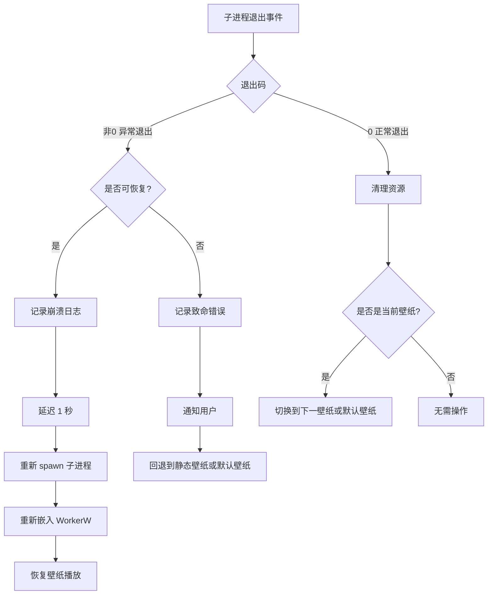

[← 返回文档索引](../README.md) > [架构设计](./overview.md) > 错误处理

# MirrorStar Wallpaper（镜星壁纸）架构设计 — 错误处理策略

## 10. 错误处理策略

### 10.1 Rust Result-based 错误传播

MirrorStar 使用 Rust 的 `Result<T, E>` 类型系统进行错误处理，避免异常和 panic。

#### 10.1.1 错误类型层次

```rust
/// MirrorStar 全局错误类型
#[derive(Debug, thiserror::Error)]
pub enum MirrorStarError {
    // 桌面集成错误
    #[error("桌面集成失败: {0}")]
    DesktopIntegration(String),

    #[error("未找到 WorkerW 窗口")]
    WorkerWNotFound,

    #[error("高对比度模式已启用，无法嵌入壁纸")]
    HighContrastMode,

    // 进程管理错误
    #[error("子进程启动失败: {0}")]
    ProcessSpawnFailed(String),

    #[error("子进程异常退出: pid={pid}, code={code}")]
    ProcessExited { pid: u32, code: Option<i32> },

    #[error("IPC 通信失败: {0}")]
    IpcError(String),

    // 音频控制错误
    #[error("音频控制失败: {0}")]
    AudioControl(String),

    // 配置错误
    #[error("配置文件解析失败: {0}")]
    ConfigParse(String),

    #[error("配置文件写入失败: {0}")]
    ConfigWrite(String),

    // Windows API 错误
    #[error("Win32 错误: {0}")]
    Win32(#[from] windows::core::Error),

    // IO 错误
    #[error("IO 错误: {0}")]
    Io(#[from] std::io::Error),
}

pub type Result<T> = std::result::Result<T, MirrorStarError>;
```

#### 10.1.2 错误处理原则

| 原则          | 说明                 | 示例                               |
| ----------- | ------------------ | -------------------------------- |
| **不 panic** | 所有可恢复错误使用 `Result` | 文件不存在返回 `Err`，不 `unwrap`         |
| **尽早返回**    | 使用 `?` 运算符传播错误     | `let hwnd = find_window()?;`     |
| **上下文丰富**   | 错误消息包含足够诊断信息       | `"子进程异常退出: pid=1234, code=1"`    |
| **降级处理**    | 非关键错误不阻断主流程        | 配置热重载失败保留旧配置                     |
| **日志记录**    | 错误发生时记录完整上下文       | `tracing::error!(pid, "子进程崩溃");` |

### 10.2 进程崩溃恢复



#### 10.2.1 崩溃恢复策略

| 场景          | 恢复策略                          | 最大重试次数 |
| ----------- | ----------------------------- | ------ |
| 视频子进程崩溃     | 重新 spawn mpv 子进程，重新嵌入 WorkerW | 3 次    |
| 网页子进程崩溃     | 重新 spawn WebView2 子进程，重新加载页面  | 3 次    |
| GIF 渲染线程崩溃   | 重启 GIF 渲染线程             | 3 次    |
| 连续崩溃（3次/分钟） | 放弃恢复，切换到静态图片壁纸，通知用户           | -      |
| 主进程崩溃       | 操作系统自动回收子进程（父子进程关系），不需要独立看门狗进程；Web 子进程崩溃可通过 IPC 管道断开检测 | -      |

### 10.3 优雅降级

| 故障场景               | 降级方案                              |
| ------------------ | --------------------------------- |
| WorkerW 未找到        | Native 模式下不影响静态图片壁纸；WorkerW 模式下回退到 SetWindowPos 底层窗口模式（高对比度模式未处理） |
| WebView2 不可用       | 网页壁纸功能不可用，提示用户安装 WebView2 Runtime |
| mpv.exe 缺失/启动失败   | 视频壁纸不可用，提示用户检查 mpv.exe（随程序分发或 PATH 查找）         |
| 配置文件损坏             | 使用默认配置启动，记录警告日志                   |
| 音频控制失败             | 壁纸正常播放，仅音频控制不可用                   |
| SetWinEventHook 失败 | 回退到低频轮询（2秒间隔），记录警告                |
| Native 壁纸 API 失败  | 回退到 WorkerW 嵌入模式，记录警告日志           |

***

**相关文档：**

- [进程架构](./process-architecture.md)
- [暂停/恢复机制](./pause-resume.md)
- [性能优化策略](./performance.md)
