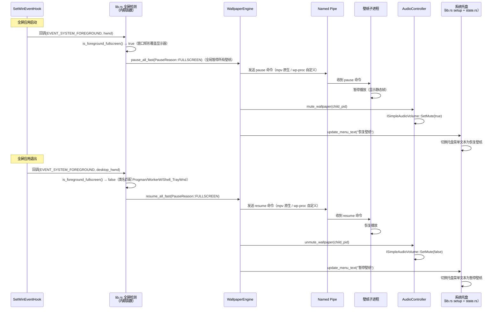

[← 返回文档索引](../README.md) > [架构设计](./overview.md) > 暂停/恢复机制

# MirrorStar Wallpaper（镜星壁纸）架构设计 — 暂停/恢复机制详细设计

## 9. 暂停/恢复机制详细设计

### 9.1 事件驱动方案详解

#### 9.1.1 SetWinEventHook 注册

实际实现**不使用** `ProcessMonitor` 结构体，而是通过全局 `OnceLock` / `AtomicBool` 共享状态 + 独立的 `extern "system"` 回调函数实现。共享状态定义在 `src-tauri/src/state.rs:109-114`：

- `SHARED_ENGINE`：`OnceLock<Arc<tokio::sync::Mutex<WallpaperEngine>>>`，全屏检测/电源监控共享的引擎引用
- `SHARED_CONFIG`：`OnceLock<Arc<ConfigManager>>`，全屏检测/电源监控共享的配置管理器引用
- `FULLSCREEN_WAS`：`AtomicBool`（非 OnceLock），跟踪全屏状态（true=当前有全屏窗口）

```rust
// 全局共享状态（src-tauri/src/state.rs:109-114）
pub(crate) static SHARED_ENGINE: OnceLock<Arc<tokio::sync::Mutex<WallpaperEngine>>> = OnceLock::new();
pub(crate) static SHARED_CONFIG: OnceLock<Arc<ConfigManager>> = OnceLock::new();
pub(crate) static FULLSCREEN_WAS: AtomicBool = AtomicBool::new(false);

/// 启动全屏应用检测线程（事件驱动，使用 SetWinEventHook）
/// src-tauri/src/platform/fullscreen.rs:139
/// 在 lib.rs 启动时调用
pub(crate) fn start_fullscreen_monitor(
    engine: Arc<tokio::sync::Mutex<WallpaperEngine>>,
    config_manager: Arc<ConfigManager>,
) {
    // 初始化全局 OnceLock 状态（OnceLock 二次 set 失败不影响正确性，Arc 引用同一资源）
    let _ = SHARED_ENGINE.set(engine);
    let _ = SHARED_CONFIG.set(config_manager);

    std::thread::Builder::new()
        .name("mirrorstar-fullscreen-monitor".to_string())
        .spawn(move || {
            // 设置事件钩子：监听前台窗口切换事件
            let hook = unsafe {
                SetWinEventHook(
                    EVENT_SYSTEM_FOREGROUND,        // 事件最小值
                    EVENT_SYSTEM_FOREGROUND,        // 事件最大值
                    None,                           // 模块句柄（自有模块）
                    Some(foreground_event_callback), // 回调函数（extern "system" 独立函数，非方法）
                    0,                              // 所有进程
                    0,                              // 所有线程
                    WINEVENT_OUTOFCONTEXT,          // 回调在调用线程的消息循环中执行
                )
            };
            // 消息循环：GetMessageW / TranslateMessage / DispatchMessageW
            // ...
        })
        .ok();
}

/// WinEvent 回调函数（独立的 extern "system" 函数，非 ProcessMonitor 方法）
/// src-tauri/src/platform/fullscreen.rs:15
unsafe extern "system" fn foreground_event_callback(
    _hook: HWINEVENTHOOK,
    _event: u32,
    _hwnd: HWND,                     // 注意：实际通过 GetForegroundWindow() 重新获取前台窗口
    _id_object: i32,
    _id_child: i32,
    _id_event_thread: u32,
    _dwms_event_time: u32,
) {
    // 通过全局 OnceLock 获取共享状态（克隆 Arc，避免持有全局锁）
    let engine = match SHARED_ENGINE.get() {
        Some(e) => e.clone(),
        None => return,
    };
    let config = match SHARED_CONFIG.get() {
        Some(c) => c.clone(),
        None => return,
    };

    // 检查配置开关：若 pause_on_fullscreen 被禁用，仅恢复并返回
    let pause_enabled = config.get_config().pause.pause_on_fullscreen;
    if !pause_enabled {
        // 若 FULLSCREEN_WAS 为 true 则调用 engine.resume_all_fast(PauseReason::FULLSCREEN)
        // 并将 FULLSCREEN_WAS 置 false（C-008：仅当返回失败列表为空时才更新）
        return;
    }

    // 判断前台窗口是否全屏（is_foreground_fullscreen 内部已排除自身/桌面/任务栏窗口）
    let is_fullscreen = is_foreground_fullscreen();
    let was_fullscreen = FULLSCREEN_WAS.load(Ordering::Acquire);

    if is_fullscreen && !was_fullscreen {
        // 进入全屏 → 暂停所有壁纸（实例方法，返回失败 display_id 列表）
        let failed = {
            let engine = match engine.try_lock() {
                Ok(e) => e,
                Err(_) => return, // engine 锁忙，跳过本次事件（WM 会重复触发，可容忍偶发跳过）
            };
            engine.pause_all_fast(PauseReason::FULLSCREEN).unwrap_or_default()
        };
        if failed.is_empty() {
            FULLSCREEN_WAS.store(true, Ordering::Release);
        }
    } else if !is_fullscreen && was_fullscreen {
        // 退出全屏 → 恢复壁纸（实例方法）
        let failed = {
            let engine = match engine.try_lock() {
                Ok(e) => e,
                Err(_) => return,
            };
            engine.resume_all_fast(PauseReason::FULLSCREEN).unwrap_or_default()
        };
        if failed.is_empty() {
            FULLSCREEN_WAS.store(false, Ordering::Release);
        }
    }

    // Bug #4 修复：通过 SHARED_APP_HANDLE 发射 wallpaper-state-changed 事件，通知前端刷新按钮状态
}
```

#### 9.1.2 前台窗口切换处理

实际实现中，前台窗口切换处理逻辑已内联在 `foreground_event_callback`（见 9.1.1）中，**不使用** `ProcessMonitor::on_foreground_changed` 方法。全屏判断与特殊窗口排除合并到单一辅助函数 `is_foreground_fullscreen`（直接调用 `GetForegroundWindow()` 获取前台窗口，不依赖回调传入的 `hwnd` 参数），暂停/恢复通过 `WallpaperEngine` 的实例方法实现：

```rust
/// 检测前台窗口是否全屏 — 独立函数，非 ProcessMonitor 方法
/// src-tauri/src/platform/fullscreen.rs:250
fn is_foreground_fullscreen() -> bool {
    unsafe {
        let foreground = GetForegroundWindow();
        if foreground.is_invalid() {
            return false;
        }

        // 跳过我们自己的窗口（同时匹配中文标题"镜星壁纸"和英文标题"MirrorStar"）
        let mut title = [0u16; 256];
        let title_len = GetWindowTextW(foreground, &mut title);
        if title_len > 0 {
            let title_str = String::from_utf16_lossy(&title[..title_len as usize]);
            if title_str.contains("MirrorStar") || title_str.contains("镜星壁纸") {
                return false;
            }
        }

        // 排除桌面/壁纸层/任务栏窗口（Bug #2 修复）：
        // SetForegroundWindow(progman) 会使 Progman 成为前台窗口，其矩形覆盖全屏，
        // 通过类名排除 Progman / WorkerW / Shell_TrayWnd 等系统桌面组件。
        let mut class_name = [0u16; 256];
        let class_len = GetClassNameW(foreground, &mut class_name);
        if class_len > 0 {
            let class_str = String::from_utf16_lossy(&class_name[..class_len as usize]);
            if class_str == "Progman" || class_str == "WorkerW" || class_str == "Shell_TrayWnd" {
                return false;
            }
        }

        // 获取窗口矩形和显示器矩形
        let mut window_rect = RECT::default();
        if GetWindowRect(foreground, &mut window_rect).is_err() {
            return false;
        }
        let monitor = MonitorFromWindow(foreground, MONITOR_DEFAULTTONEAREST);
        let mut monitor_info = MONITORINFO { cbSize: std::mem::size_of::<MONITORINFO>() as u32, ..Default::default() };
        if GetMonitorInfoW(monitor, &mut monitor_info).as_bool() {
            let monitor_rect = monitor_info.rcMonitor;

            // 判定：窗口矩形完全覆盖显示器矩形（left/top ≤ monitor，right/bottom ≥ monitor）
            // 不使用 IsZoomed + 95% 面积判定，避免遗漏游戏窗口化全屏（无最大化标志）
            // 或误判接近全屏的普通窗口
            return window_rect.left <= monitor_rect.left
                && window_rect.top <= monitor_rect.top
                && window_rect.right >= monitor_rect.right
                && window_rect.bottom >= monitor_rect.bottom;
        }
        false
    }
}

// WallpaperEngine 上的实例方法（fast_path.rs）：
// - pause_all_fast(reason: PauseReason) -> Result<Vec<String>, MirrorStarError>
//     全局暂停所有壁纸，通过 PauseSender 快速通道绕过引擎 Mutex 内部锁；
//     reason 协调：若已有其他 reason 暂停过，仅 set bit 不重复发 Pause 命令。
// - resume_all_fast(reason: PauseReason) -> Result<Vec<String>, MirrorStarError>
//     全局恢复所有壁纸，仅 clear 指定 reason 的 bit；若其他 reason 仍活跃则不发 Resume。
```

### 9.2 暂停状态跟踪

MirrorStar **不使用** PauseReason bitflags 组合状态机。暂停状态通过两个独立标志跟踪：

- **全屏暂停**：使用 `AtomicBool`（`FULLSCREEN_WAS`）跟踪全屏状态。SetWinEventHook 回调检测到全屏窗口时置为 `true`，检测到非全屏时置为 `false`。无组合状态机。
- **电池暂停**：使用 `AtomicBool`（`POWER_WAS_ON_BATTERY`，`src-tauri/src/state.rs:123`）跟踪电池供电暂停状态。

#### 9.2.1 电池供电监测

电池供电监测采用 **`WM_POWERBROADCAST` 事件驱动**方式（`handle_power_status_change` 函数，由 `PBT_APMPOWERSTATUSCHANGE` 触发），而非 5 秒轮询 `GetSystemPowerStatus`：

```rust
/// 处理电源状态变化（由 WM_POWERBROADCAST / PBT_APMPOWERSTATUSCHANGE 触发）
/// src-tauri/src/platform/power.rs:12
pub(crate) fn handle_power_status_change() {
    // 检查配置是否启用电池供电暂停
    let config = match SHARED_CONFIG.get() {
        Some(c) => c,
        None => return,
    };
    if !config.get_config().pause.pause_on_battery {
        // 若此前因电池暂停过，恢复壁纸并重置 POWER_WAS_ON_BATTERY
        return;
    }

    // 获取系统电源状态
    let mut status = SYSTEM_POWER_STATUS::default();
    if unsafe { GetSystemPowerStatus(&mut status) }.is_err() {
        return;
    }

    // ACLineStatus: 0 = 电池供电, 1 = 交流供电, 255 = 未知（保持当前策略，跳过本次处理）
    let on_battery = match status.ACLineStatus {
        0 => true,
        1 => false,
        _ => return, // 未知状态，不触发暂停/恢复
    };
    let was_on_battery = POWER_WAS_ON_BATTERY.load(Ordering::SeqCst);

    if on_battery && !was_on_battery {
        // 交流 → 电池：暂停（实例方法 + BATTERY reason，try_lock 避免阻塞 explorer 消息循环）
        let failed = /* engine.try_lock()?.pause_all_fast(PauseReason::BATTERY) */;
        if failed.is_empty() {
            POWER_WAS_ON_BATTERY.store(true, Ordering::SeqCst);
        }
    } else if !on_battery && was_on_battery {
        // 电池 → 交流：恢复
        let failed = /* engine.try_lock()?.resume_all_fast(PauseReason::BATTERY) */;
        if failed.is_empty() {
            POWER_WAS_ON_BATTERY.store(false, Ordering::SeqCst);
        }
    }
}
```

> **注意**：使用 `WM_POWERBROADCAST` / `PBT_APMPOWERSTATUSCHANGE` 事件驱动，仅电源状态变化时触发检测，CPU 开销接近零。回调内通过 `SHARED_ENGINE` + `try_lock()` 获取 engine 锁（运行于 `explorer_monitor_wndproc` 窗口过程上下文，不可长时间阻塞，否则会延迟 `TaskbarCreated` 等 Explorer 事件处理），锁忙时跳过本次事件（`WM_POWERBROADCAST` 会重复触发，可容忍偶发跳过）。`ACLineStatus=255`（未知）显式保持当前策略，避免在状态不确定时误切换壁纸。

### 9.3 PauseSender 快速通道

暂停/恢复/音量/静音操作绕过引擎 `Mutex<WallpaperEngine>`，通过 `tokio::sync::mpsc::UnboundedSender<PauseCommand>` 直接发送到渲染器线程，消除锁竞争导致的响应延迟。

#### 9.3.1 PauseCommand 枚举

```rust
/// 暂停命令枚举
#[derive(Debug, Clone)]
pub enum PauseCommand {
    /// 暂停渲染
    Pause,
    /// 恢复渲染
    Resume,
    /// 设置音量 (0.0~1.0)
    SetVolume(f32),
    /// 切换静音
    ToggleMute,
}
```

#### 9.3.2 PauseSender 注册与使用

```rust
/// 暂停发送器注册表（存储在 WallpaperEngine 中）
pause_senders: Arc<std::sync::RwLock<HashMap<String, PauseSender>>>
```

**通信路径对比：**

| 操作 | 旧路径（经 Mutex） | 新路径（PauseSender） |
|------|-------------------|---------------------|
| 暂停/恢复 | `Mutex<WallpaperEngine>` → 渲染器 | `UnboundedSender` → 渲染器线程 |
| 音量/静音 | `Mutex<WallpaperEngine>` → 渲染器 | `UnboundedSender` → 渲染器线程 |
| 设置壁纸 | `Mutex<WallpaperEngine>` | 仍经 Mutex |
| 关闭壁纸 | `Mutex<WallpaperEngine>` | 仍经 Mutex |

**响应时间改善：**

| 场景 | 旧方案（Mutex） | 新方案（PauseSender） |
|------|----------------|---------------------|
| 无锁竞争 | ~1ms | ~0.01ms |
| 有锁竞争（如正在设置壁纸） | 10~100ms | ~0.01ms（不受 Mutex 阻塞） |

### 9.4 GIF 暂停内存优化

GIF 渲染器暂停时释放所有帧数据（仅保留当前帧），恢复时从文件重新解码。内存预算从 200MB 降至 40MB。

```rust
/// GIF 渲染数据
pub struct GifRenderData {
    /// 壁纸文件路径（恢复时重新解码用）
    pub image_path: String,
    /// 解码后的帧数据
    pub frames: Vec<GifFrame>,
    /// 帧是否已加载
    pub frames_loaded: bool,
    /// 暂停时保存的帧索引（恢复时从该帧继续）
    pub saved_frame_index: usize,
    /// 最大内存预算（MB）
    pub max_memory_mb: usize,  // 默认 40
}

impl GifRenderer {
    /// 暂停：释放所有帧（保留当前帧）
    fn pause(&mut self) -> Result<()> {
        if self.data.frames.len() > 1 {
            let current_frame = self.data.frames[self.current_index].clone();
            self.data.frames.clear();
            self.data.frames.push(current_frame);
            self.data.frames_loaded = false;
            self.data.saved_frame_index = self.current_index;
        }
        Ok(())
    }

    /// 恢复：从文件重新解码
    fn resume(&mut self) -> Result<()> {
        if !self.data.frames_loaded {
            self.data.frames = decode_gif_from_file(&self.data.image_path)?;
            self.data.frames_loaded = true;
            self.current_index = self.data.saved_frame_index;
        }
        Ok(())
    }
}
```

**内存影响：**

| 状态 | 旧方案（200MB 预算） | 新方案（40MB 预算） |
|------|---------------------|---------------------|
| 播放中 | 最高 200MB | 最高 40MB |
| 暂停中 | 保留所有帧，仍占 200MB | 仅保留当前帧，~1-5MB |

### 9.5 图片暂停像素释放

静态图片渲染器（WorkerW 模式）暂停时释放像素数据，恢复时从文件重新加载。

```rust
/// 图片渲染器
pub struct ImageRenderer {
    /// 壁纸文件路径（恢复时重新加载用）
    pub image_path: String,
    /// 像素数据
    pub pixels: Vec<u8>,
    /// 是否暂停
    pub paused: bool,
    // ... 其他字段
}

impl ImageRenderer {
    /// 暂停：释放像素数据
    fn pause(&mut self) -> Result<()> {
        self.pixels = Vec::new();  // 释放像素内存
        self.paused = true;
        Ok(())
    }

    /// 恢复：从文件重新加载
    fn resume(&mut self) -> Result<()> {
        if self.paused {
            self.pixels = load_and_downsample_image(&self.image_path)?;
            self.paused = false;
        }
        Ok(())
    }
}
```

> **注意**：原生壁纸模式（JPG/JPEG/PNG/BMP/TIF/TIFF/DIB）的暂停/恢复为空操作（no-op），因为壁纸由系统直接渲染，无需额外控制。

### 9.6 暂停机制（逻辑暂停，非线程挂起）

MirrorStar 使用**逻辑暂停**（PauseSender 快速通道），**不使用** `SuspendThread`/`ResumeThread`。

`SuspendThread` 是 Lively Wallpaper 的方案——通过挂起外部进程的所有线程实现暂停。这是一种不安全的操作，可能导致死锁（如果线程持有锁时被挂起）。MirrorStar 不采用此方案。

MirrorStar 的暂停通过以下方式实现：

| 壁纸类型 | 暂停方式 | 说明 |
|----------|----------|------|
| 视频（mpv.exe） | MpvIpcClient 发送 pause 命令 | mpv 原生 JSON IPC，mpv 自行暂停解码 |
| 网页（wp-proc.exe） | WpProcIpcClient 发送 pause 命令 | wp-proc 自定义协议，子进程暂停渲染 |
| GIF | PauseSender → 渲染线程停止 WM_TIMER | 主进程内线程，释放帧数据 |
| 图片（WorkerW） | PauseSender → 渲染线程停止 | 主进程内线程，释放像素数据 |
| 图片（Native） | 空操作（no-op） | 系统直接渲染，无需控制 |

> **关键区别**：Lively 使用 `SuspendThread`/`ResumeThread` 挂起进程线程（可能导致死锁），MirrorStar 使用逻辑暂停（PauseSender 快速通道绕过引擎互斥锁，直接发送暂停/恢复命令），更安全且响应更快。

### 9.7 暂停/恢复完整流程



***

**相关文档：**

- [模块设计](./module-design.md)
- [进程架构](./process-architecture.md)
- [桌面集成详细设计](./desktop-integration.md)
- [错误处理策略](./error-handling.md)
