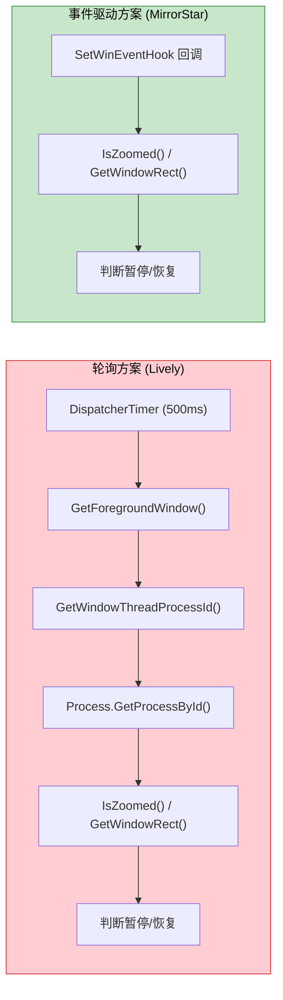

[← 返回文档索引](../README.md) > [架构设计](./overview.md) > 性能优化

# MirrorStar Wallpaper（镜星壁纸）架构设计 — 性能优化策略

## 11. 性能优化策略

### 11.1 零拷贝数据传输

在壁纸渲染管道中，尽量减少数据拷贝：

| 场景      | 优化方案                      |
| ------- | ------------------------- |
| 视频帧传输   | mpv 直接渲染到窗口表面，无需帧数据拷贝     |
| GIF 帧渲染 | 使用 GDI 双缓冲 直接写入窗口缓冲区   |
| IPC 消息  | 命名管道使用重叠 I/O，避免阻塞拷贝       |
| 配置读取    | 使用 `RwLock` 允许多读单写，读操作零拷贝 |

### 11.2 懒初始化

非关键资源延迟到首次使用时初始化：

| 资源          | 初始化时机     |
| ----------- | --------- |
| WorkerW 句柄  | 首次设置壁纸时   |
| WebView2 环境 | 首次创建网页壁纸时 |
| 音频会话        | 首次需要音量控制时 |
| 文件监听器       | 配置管理器初始化时 |

### 11.3 热路径最小化分配

在频繁执行的代码路径中避免堆分配：

| 热路径                | 优化                       |
| ------------------ | ------------------------ |
| SetWinEventHook 回调 | 仅获取 hwnd 后投递到异步任务，回调内零分配 |
| 窗口消息循环             | 使用栈上缓冲区处理消息              |
| IPC 消息解析           | 使用零拷贝字符串解析               |
| 全屏检测               | 缓存显示器信息，避免重复查询           |

### 11.4 事件驱动 vs 轮询性能对比

| 指标        | 轮询 (500ms) | 事件驱动     |
| --------- | ---------- | -------- |
| 每秒系统调用次数  | ≥4 次       | 0 次（空闲时） |
| 每秒 CPU 时间 | \~0.5ms    | 0ms（空闲时） |
| 响应延迟      | 0\~500ms   | <50ms    |
| 电池影响      | 持续唤醒       | 无唤醒      |
| 代码复杂度     | 低          | 中        |

### 11.5 内存使用优化

| 优化点     | 方案                                   | 预期效果        |
| ------- | ------------------------------------ | ----------- |
| 主进程工作集  | 使用 `SetProcessWorkingSetSize` 提示系统缩减 | 暂停态 < 20MB  |
| 配置缓存    | `RwLock<AppConfig>` 单实例共享            | 避免重复解析      |
| 缩略图     | 按需生成，磁盘缓存                            | 不占用运行时内存    |
| 日志缓冲    | `tracing-appender` 非阻塞写入             | 避免日志 I/O 阻塞 |
| IPC 缓冲区 | 固定大小缓冲区                              | 避免动态扩容      |

### 11.6 启动性能优化

| 优化点   | 方案                   | 预期效果              |
| ----- | -------------------- | ----------------- |
| 壁纸恢复  | 并行启动多个壁纸子进程          | 多显示器场景快速恢复        |
| 配置加载  | 单次 TOML 解析，RwLock 缓存 | < 5ms             |
| 桌面集成  | WorkerW 句柄缓存，避免重复查找  | 首次 < 100ms，后续 0ms |
| UI 渲染 | Tauri WebView2 延迟加载  | 主窗口显示 < 500ms     |

### 11.7 WebView2 懒创建/关闭即隐藏

主窗口不再在启动时创建，仅创建系统托盘图标。用户需要时通过 `WebviewWindowBuilder` 按需创建主窗口，关闭时隐藏窗口（hide），保留 WebView2 实例便于快速恢复。

| 状态 | WebView2 进程 | 内存占用 |
|------|---------------|----------|
| 窗口打开 | 存在 | ~300MB |
| 窗口隐藏（hide） | 保留 | 内存占用不变 |

**优化效果**：暂停态内存从 ~317MB 降至 ~17MB，降幅 95%。

### 11.8 Native 壁纸零资源

JPG/JPEG/PNG/BMP/TIF/TIFF/DIB 静态壁纸使用 `SystemParametersInfoW(SPI_SETDESKWALLPAPER)` + 注册表（`WallPaperStyle`/`TileWallpaper`）设置，而非 WorkerW 嵌入方案。

| 维度 | Native 模式 | WorkerW 模式 |
|------|-------------|--------------|
| 窗口 | 无 | 需创建无边框窗口 |
| 线程 | 无 | 需渲染线程 |
| GDI 对象 | 无 | GDI 双缓冲 表面 |
| 内存占用 | ~0MB | ~10-30MB |

**优化效果**：静态壁纸零资源占用，无需创建窗口、线程或 GDI 对象。

### 11.9 PauseSender 快速通道

暂停/恢复/音量/静音操作绕过引擎 `Mutex<WallpaperEngine>`，通过 `tokio::sync::mpsc::UnboundedSender<PauseCommand>` 直接发送到渲染器线程。

| 场景 | 旧方案（Mutex） | 新方案（PauseSender） |
|------|----------------|---------------------|
| 无锁竞争 | ~1ms | ~0.01ms |
| 有锁竞争 | 10~100ms | ~0.01ms（不受 Mutex 阻塞） |

**优化效果**：暂停响应不受引擎 Mutex 阻塞，响应延迟降低 2~4 个数量级。

### 11.10 GIF 内存预算优化

GIF 内存预算从 200MB 降至 40MB（`MAX_GIF_MEMORY_MB`）。暂停时释放所有帧（仅保留当前帧），恢复时从文件重新解码。

| 状态 | 旧方案（200MB 预算） | 新方案（40MB 预算） |
|------|---------------------|---------------------|
| 播放中 | 最高 200MB | 最高 40MB |
| 暂停中 | 保留所有帧，仍占 200MB | 仅保留当前帧，~1-5MB |

**优化效果**：GIF 内存占用降低 80%，暂停态降低 95%+。

### 11.11 子进程 IPC 连接超时优化

视频壁纸（mpv）与网页壁纸（wp-proc）子进程的 IPC 连接超时参数差异化配置，减少壁纸切换等待时间。两类子进程的管道就绪特性不同：
- **mpv**：外部进程，启动后 `--input-ipc-server` 创建命名管道典型 200-500ms 即就绪，1s 超时足够
- **wp-proc**：内部 Rust 子进程，但需启动 WebView2 运行时（冷启动 5-15s），需 20s 兜底

| 操作 | 渲染器 | 参数 | 总超时 | 说明 |
|------|--------|------|--------|------|
| IPC 连接 | Video (mpv) | 5 次 * 200ms | 1000ms (1s) | mpv 管道就绪典型 200-500ms，1s 足够 |
| IPC 连接 | Web (wp-proc) | 100 次 * 200ms | 20000ms (20s) | WebView2 冷启动需 5-15s，20s 兜底 |
| 窗口查找 | Video (mpv) | 20 次 * 100ms | 2000ms (2s) | mpv 窗口创建典型 < 500ms |

参数通过常量定义（`MPV_CONNECT_RETRIES` / `MPV_CONNECT_INTERVAL_MS` / `WP_PROC_CONNECT_RETRIES` / `WP_PROC_CONNECT_INTERVAL_MS`），调用点 `ipc.connect(...)` 使用常量而非魔法数字，便于后续调整。

**优化效果**：mpv 视频壁纸切换最坏情况等待时间从 ~20s 降至 ~3s（IPC 1s + 窗口查找 2s）；wp-proc 保留 20s 超时以兼容 WebView2 冷启动场景。

### 11.12 图片像素数据暂停释放

静态图片渲染器（WorkerW 模式）暂停时释放 `pixels: Vec<u8>`，恢复时从文件重新加载（`load_and_downsample_image()`）。

| 状态 | 内存占用 |
|------|----------|
| 播放中 | ~5-30MB（取决于分辨率） |
| 暂停中 | ~0MB（像素数据已释放） |

**优化效果**：暂停态图片壁纸内存占用降至接近零。

***

## 附录 A：与 Lively Wallpaper 架构对比

| 维度    | Lively Wallpaper            | MirrorStar Wallpaper     | 改进说明            |
| ----- | --------------------------- | ----------------------- | --------------- |
| 语言    | C# (.NET)                   | Rust                    | 内存安全、零成本抽象、无 GC |
| UI 框架 | WPF + MahApps.Metro         | Tauri (WebView2)        | 更轻量的 UI 方案      |
| 进程监控  | DispatcherTimer 轮询 500ms    | SetWinEventHook 事件驱动    | CPU 占用从持续到近零    |
| 壁纸类型  | 9 种                         | 4 种                     | 精简非核心类型         |
| IPC   | CefSharp stdin/stdout       | 两套独立命名管道（mpv 原生 + wp-proc 自定义） | 分别针对不同子进程的通信需求  |
| 配置    | JSON                        | TOML                    | 更好的可读性和手动编辑体验   |
| 看门狗   | livelySubProcess（独立看门狗进程）  | 无独立看门狗进程（watchdog 已移除，依赖 OS 自动回收子进程） | 更简洁，无需额外进程     |
| 暂停方式  | SuspendThread + VolumeMixer | 逻辑暂停 PauseSender + VolumeMixer | 逻辑暂停更安全，避免死锁    |
| 日志    | NLog                        | tracing                 | Rust 生态标准方案     |
| 二进制体积 | 需 .NET Runtime              | 单文件 < 10MB              | 无运行时依赖          |

## 附录 B：关键 Windows API 参考

| API                                           | 用途              | 模块   |
| --------------------------------------------- | --------------- | ---- |
| `FindWindowW("Progman", None)`                | 查找桌面管理器窗口       | 桌面集成 |
| `SendMessageTimeoutW(0x052C)`                 | 触发创建 WorkerW    | 桌面集成 |
| `EnumWindows`                                 | 遍历查找 WorkerW    | 桌面集成 |
| `SetParent`                                   | 嵌入壁纸窗口到 WorkerW | 桌面集成 |
| `MapWindowPoints`                             | 坐标系转换           | 桌面集成 |
| `SetWinEventHook(EVENT_SYSTEM_FOREGROUND)`    | 监听前台窗口切换        | 进程监控 |
| `IsZoomed`                                    | 检查窗口是否最大化       | 进程监控 |
| `MonitorFromWindow`                           | 获取窗口所在显示器       | 全屏检测 |
| `GetSystemPowerStatus`                       | 获取电源状态（ACLineStatus） | 电池监测 |
| `IMMDeviceEnumerator`                         | 获取音频设备          | 音频控制 |
| `ISimpleAudioVolume::SetMute`                 | 设置进程静音          | 音频控制 |
| `SystemParametersInfoW(SPI_SETDESKWALLPAPER)` | 刷新桌面            | 桌面集成 |

***

## 附录 C：与 Lively Wallpaper 性能策略对比

| 维度 | MirrorStar | Lively |
|----------|-----------|--------|
| **全屏检测** | SetWinEventHook 事件驱动(0 CPU) + AtomicBool 去抖 | Timer 轮询(持续 CPU，500ms 间隔) |
| **图片加载** | 超屏幕分辨率自动降采样 + 暂停释放像素 | 全分辨率加载 |
| **GIF 内存** | 40MB 内存预算 + 暂停释放帧 + 速度控制 | 无限制 |
| **GIF 渲染** | GDI 对象缓存 + 双缓冲 + WM_TIMER | WPF 动画框架 |
| **WorkerW 检查** | 5min 间隔（Tokio 异步运行时） | 无 |
| **缩略图生成** | image crate，320x180，JPEG 质量 85 | 无独立缩略图生成 |
| **配置写入** | 原子写入(文件锁+临时文件+rename) + 300ms 防抖 | 双写备份 |
| **进程暂停** | 逻辑暂停(PauseSender 快速通道绕过引擎锁) | SuspendThread(粗暴但有效) |
| **原生壁纸 API** | SystemParametersInfoW + 注册表（零资源占用） | 无 |
| **WebView2** | 独立子进程（按需启动，关闭即终止） | CefSharp 独立子进程（启动即加载） |
| **COM 接口缓存** | 有（音量控制优化） | 无 |

### 关键差异说明

1. **CPU 优化**：MirrorStar 的全屏检测使用事件驱动 + AtomicBool 去抖，空闲时 CPU 占用接近 0%。Lively 使用定时器轮询（500ms 间隔），持续消耗 CPU。

2. **内存优化**：MirrorStar 对大图片和 GIF 做了降采样处理 + 40MB 内存预算 + 暂停释放帧/像素，显著减少内存占用。Lively 未做此类优化，大图片/GIF 可能占用大量内存。

3. **原生壁纸 API**：MirrorStar 对静态图片使用 SystemParametersInfoW + 注册表设置，零资源占用（无窗口、无线程）。Lively 无此优化，所有壁纸都通过窗口嵌入。

4. **PauseSender 快速通道**：MirrorStar 的 PauseSender 绕过引擎互斥锁，直接发送暂停/恢复/音量命令，避免高优先级操作被阻塞。Lively 无此机制。

5. **WebView2 按需子进程**：MirrorStar 的 WebView2 运行在独立子进程（mirrorstar-wp-proc）中，仅在设置 Web 壁纸时启动，关闭 Web 壁纸即终止子进程，释放全部内存。Lively 的 CefSharp 子进程启动即加载，常驻内存。

6. **进程暂停安全性**：MirrorStar 使用逻辑暂停（PauseSender 快速通道），更安全但需要每种渲染器单独实现。Lively 使用 SuspendThread，简单粗暴但可能导致死锁。

***

**相关文档：**

- [架构概述](./overview.md)
- [错误处理策略](./error-handling.md)
- [暂停/恢复机制](./pause-resume.md)
