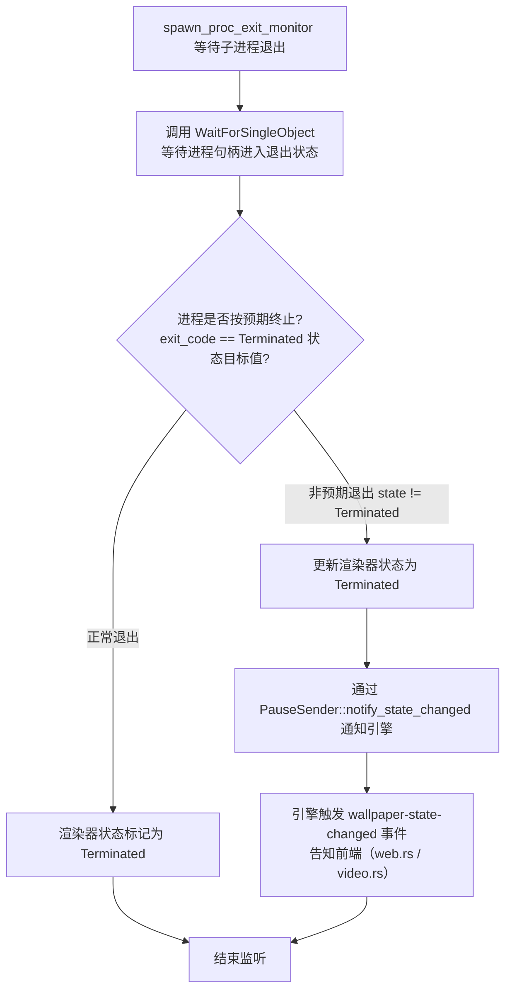

[← 返回文档索引](../../README.md) > [架构设计](./架构概述-Architecture-Overview.md) > 错误处理

# MirrorStar Wallpaper（镜星壁纸）架构设计 — 错误处理策略

> 文档版本：v2.0 ｜ 更新日期：2026-08-29 ｜ 状态：已实现（基于最新代码审计）

## 10. 错误处理策略

### 10.1 Rust Result-based 错误传播

MirrorStar 使用 Rust 的 `Result<T, E>` 类型系统进行错误处理，避免异常和 panic。

#### 10.1.1 错误类型层次

```rust
/// MirrorStar 全局错误类型
#[derive(Debug, thiserror::Error)]
pub enum MirrorStarError {
    // 桌面集成错误
    #[error("桌面集成失败: {0}")]
    DesktopIntegration(String),

    #[error("未找到 WorkerW 窗口")]
    WorkerWNotFound,

    #[error("高对比度模式已启用，无法嵌入壁纸")]
    HighContrastMode,

    // 进程管理错误
    #[error("子进程启动失败: {0}")]
    ProcessSpawnFailed(String),

    #[error("子进程异常退出: pid={pid}, code={code}")]
    ProcessExited { pid: u32, code: Option<i32> },

    #[error("IPC 通信失败: {0}")]
    IpcError(String),

    // 音频控制错误
    #[error("音频控制失败: {0}")]
    AudioControl(String),

    // 配置错误
    #[error("配置文件解析失败: {0}")]
    ConfigParse(String),

    #[error("配置文件写入失败: {0}")]
    ConfigWrite(String),

    // Windows API 错误
    #[error("Win32 错误: {0}")]
    Win32(#[from] windows::core::Error),

    // IO 错误
    #[error("IO 错误: {0}")]
    Io(#[from] std::io::Error),
}

pub type Result<T> = std::result::Result<T, MirrorStarError>;
```

#### 10.1.2 错误处理原则

| 原则          | 说明                 | 示例                               |
| ----------- | ------------------ | -------------------------------- |
| **不 panic** | 所有可恢复错误使用 `Result` | 文件不存在返回 `Err`，不 `unwrap`         |
| **尽早返回**    | 使用 `?` 运算符传播错误     | `let hwnd = find_window()?;`     |
| **上下文丰富**   | 错误消息包含足够诊断信息       | `"子进程异常退出: pid=1234, code=1"`    |
| **降级处理**    | 非关键错误不阻断主流程        | 配置热重载失败保留旧配置                     |
| **日志记录**    | 错误发生时记录完整上下文       | `tracing::error!(pid, "子进程崩溃");` |

### 10.2 进程崩溃恢复

#### 10.2.1 子进程退出监听

MirrorStar **不实现**子进程/渲染线程的自动重启（respawn）。当前只有单一的退出监听器：

- 实现位置：`crates/mirrorstar-core/src/wallpaper/mod.rs` 中的 `spawn_proc_exit_monitor`（L155-186）。
- 工作方式：通过 `WaitForSingleObject` 等待子进程句柄进入退出状态，获取退出码。

#### 10.2.2 退出处理流程



上图的判断要点：

- `spawn_proc_exit_monitor`（wallpaper/mod.rs L155-186）是**唯一**的退出监听器，无 watchdogs、无重试循环。
- 当子进程**异常退出**（即以非 `Terminated` 状态退出）时，将渲染器状态更新为 `Terminated`，并通过 `PauseSender::notify_state_changed` 通知引擎。
- 引擎据此触发 `wallpaper-state-changed` 事件，通知前端（web.rs / video.rs）刷新状态。

#### 10.2.3 恢复策略现状

> **重要说明**：自动重启（respawn）**未实现**，处于观察中。不存在"重新 spawn 子进程 3 次""重启 GIF 渲染线程 3 次""连续崩溃(3 次/分钟)放弃恢复并切换静态壁纸"等自动重启/重试流程。

| 场景        | 现状                          | 后续方向      |
| ---------- | --------------------------- | --------- |
| 子进程异常退出  | 仅监听并更新状态为 Terminated，通知前端    | 自动重启（respawn）待评估，处于观察中 |
| 主进程崩溃    | 操作系统自动回收子进程（父子进程关系），不需要独立看门狗进程；Web 子进程崩溃可通过 IPC 管道断开检测 | -         |

### 10.3 优雅降级

| 故障场景               | 降级方案                              |
| ------------------ | --------------------------------- |
| WorkerW 未找到        | Native 模式下不影响静态图片壁纸；WorkerW 模式下回退到 SetWindowPos 底层窗口模式（高对比度模式未处理） |
| WebView2 不可用       | 网页壁纸功能不可用，提示用户安装 WebView2 Runtime |
| mpv.exe 缺失/启动失败   | 视频壁纸不可用，提示用户检查 mpv.exe（随程序分发或 PATH 查找）         |
| 配置文件损坏             | 使用默认配置启动，记录警告日志                   |
| 音频控制失败             | 壁纸正常播放，仅音频控制不可用                   |
| SetWinEventHook 失败 | 仅记录错误并退出全屏监控线程（**无 2 秒轮询回退**） |
| Native 壁纸 API 失败  | 回退到 WorkerW 嵌入模式，记录警告日志           |

> **SetWinEventHook 降级说明**：全屏检测为纯事件驱动（`SetWinEventHook(EVENT_SYSTEM_FOREGROUND)`）。当钩子设置失败（返回 `nullptr`）时，实现仅在 fullscreen.rs 中记录错误并退出全屏监控线程，**不存在**"回退到低频轮询（2 秒间隔）"的兜底逻辑。

***

**相关文档：**

- [架构概述](./架构概述-Architecture-Overview.md)
- [系统架构](./系统架构-System-Architecture.md)
- [模块设计](./模块设计-Module-Design.md)
- [进程架构](./进程架构-Process-Architecture.md)
- [依赖与数据流](./依赖与数据流-Dependency-and-Data-Flow.md)
- [桌面集成](./桌面集成-Desktop-Integration.md)
- [暂停恢复机制](./暂停恢复机制-Pause-Resume.md)
- [性能优化](./性能优化-Performance.md)