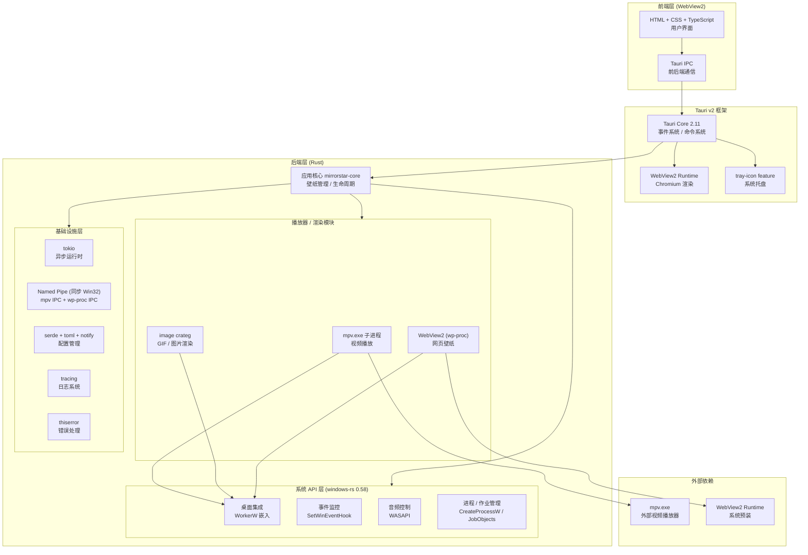

[← 返回文档索引](../index.md) > [技术栈](./01-技术栈总览-Tech-Stack-Overview.md) > 风险评估

# MirrorStar Wallpaper（镜星壁纸）技术栈 — 风险评估

| 项目   | 内容                        |
| ---- | ------------------------- |
| 项目名称 | MirrorStar Wallpaper（镜星壁纸） |
| 文档版本 | v2.0                      |
| 更新日期 | 2026-08-29                |
| 文档状态 | 已实现（基于最新代码审计）        |

***

## 1. 技术栈全景图

> 说明：早期文档中出错的基础设施"错误处理（thiserror + anyhow）"已更正为仅 `thiserror`；`anyhow` / `bitflags` / `softbuffer` / `raw-window-handle` 均为虚构依赖，未引入。

***

## 2. 技术方案概览

MirrorStar 的技术选型围绕「零运行时依赖、事件驱动、轻量渲染、双向 IPC」展开，各模块实现如下：

| 维度 | 实现 |
|------|------|
| **语言** | Rust (stable, 1.80) |
| **UI 框架** | Tauri v2 + WebView2 |
| **视频播放** | mpv.exe 子进程 |
| **GIF 播放** | image crate + GDI 双缓冲 |
| **网页渲染** | WebView2 (Chromium, wp-proc 子进程) |
| **配置格式** | TOML (serde + toml) |
| **日志** | tracing |
| **进程监控** | SetWinEventHook 事件驱动 |
| **IPC** | Windows 命名管道（两套协议） |
| **音频控制** | WASAPI (windows-rs Core Audio) |
| **系统托盘** | Tauri 2 tray-icon feature |
| **运行时依赖** | 无（静态链接） |
| **GC 暂停** | 无 |

> **进程清理说明**：MirrorStar 不引入常驻监控进程，主进程崩溃时依赖作业对象（Job Objects）与操作系统自动清理子进程（mpv.exe / mirrorstar-wp-proc.exe），在保证健壮性的同时避免额外常驻开销。

### 关键优势总结

1. **零运行时依赖**：无需 .NET Framework，无需安装任何运行时
2. **低内存占用**：Rust 无 GC，壁纸播放更流畅；静态图片走 Native 路径零资源
3. **事件驱动**：`SetWinEventHook` 事件驱动通知，全屏检测更及时
4. **双向 IPC**：命名管道提供可靠的双向通信
5. **轻量网页渲染**：WebView2 取自系统预装，无需捆绑 ~200MB CEF

***

## 3. 依赖风险与缓解

### mpv.exe 外部依赖

| 风险 | 说明 | 缓解措施 |
|------|------|----------|
| **可执行文件缺失** | mpv.exe 需捆绑或位于 PATH | `find_mpv()` 优先查找捆绑资源，回退 PATH；未找到返回错误 |
| **许可证** | mpv 使用 GPL-2.0 | 项目自身已采用 GPLv2+（GPL-2.0-or-later），与 mpv 的 GPL-2.0+ 完全兼容，许可证风险消除 |
| **版本兼容** | mpv IPC 协议可能变更 | 锁定兼容版本随应用更新；使用 mpv 稳定属性接口 |

### WebView2 Runtime

| 风险 | 说明 | 缓解措施 |
|------|------|----------|
| **运行时缺失** | 极少数旧版系统未安装 | Windows 10 (2004+) / Windows 11 已预装；缺失时引导安装 |
| **进程隔离** | 独立进程，崩溃不影响主应用 | 已是优势，无需额外处理 |

### windows-rs

| 风险 | 说明 | 缓解措施 |
|------|------|----------|
| **API 覆盖** | 部分 API 可能未覆盖 | workspace 锁定 0.58，按需启用 feature |
| **API 稳定性** | windows-rs 仍可能变更 API | 锁定版本，关注 changelog；跨 minor 升级需评估（如 webview2-com 0.38 依赖 windows 0.61 的不兼容已评估为 Low 风险不升） |
| **COM 交互** | 部分 COM 接口较复杂 | 封装为 Rust 风格安全 API |

### image crate

| 风险 | 说明 | 缓解措施 |
|------|------|----------|
| **格式支持** | 高动态范围 / 少用格式 | `default-features=false` 仅启用实际格式（png/jpeg/gif/bmp/webp/tiff），减体积与编译时间 |

### 依赖更新策略

- **锁定策略**：workspace 依赖采用 minor 精确版本（如 tokio 1.52、tauri 2.11），避免 dependabot 在 minor 内引入 breaking change
- **可复现构建**：`Cargo.lock` 纳入版本控制
- **最小依赖**：仅引入必要依赖；已移除 `protocol-asset` 等无用 feature 与虚构依赖

***

> **文档维护说明**：本技术栈文档随项目演进持续更新。任何技术选型变更需经评审并同步更新本文档。

**相关章节：** [← 总览](./01-技术栈总览-Tech-Stack-Overview.md) | [UI 框架](./02-UI框架-UI-Framework.md) | [Windows 系统 API](./03-Windows系统API-Windows-System-API.md) | [壁纸渲染](./04-壁纸渲染-Wallpaper-Rendering.md) | [基础设施](./05-基础设施-Infrastructure.md)