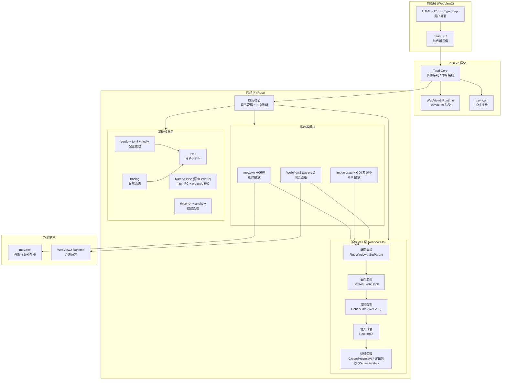

# MirrorStar Wallpaper（镜星壁纸）技术栈 — 风险评估

[← 返回文档索引](../README.md) > [技术栈](./overview.md) > 风险评估

## 15. 技术栈全景图

---

## 16. 与 Lively Wallpaper 技术栈对比

| 维度 | Lively Wallpaper | MirrorStar Wallpaper |
|------|-----------------|-------------------|
| **语言** | C# (.NET Framework 4.7.2) | Rust (stable) |
| **UI 框架** | WPF + MahApps.Metro | Tauri v2 + WebView2 |
| **视频播放** | MediaFoundation / DirectShow / mpv | mpv.exe 子进程 |
| **GIF 播放** | XamlAnimatedGif / DirectShow | image crate + GDI 双缓冲 |
| **网页渲染** | CefSharp (Chromium) | WebView2 (Chromium) |
| **配置格式** | JSON (Newtonsoft.Json) | TOML (serde + toml) |
| **日志** | NLog | tracing |
| **进程监控** | DispatcherTimer 轮询 | SetWinEventHook 事件驱动 |
| **IPC** | stdin/stdout 管道 | Named Pipes |
| **音频控制** | Core Audio COM | windows-rs Core Audio |
| **系统托盘** | NotifyIcon (WinForms) | tray-icon |
| **运行时依赖** | .NET Framework 4.7.2 | 无（静态链接） |
| **二进制大小** | ~50MB+ (含依赖) | <10MB |
| **内存占用** | ~80-150MB | <20MB (暂停时) |
| **GC 暂停** | 有 | 无 |
| **启动速度** | 较慢 (CLR 初始化) | 极快 (原生) |
| **分发方式** | 安装程序 + .NET 检测 | 单文件 / 便携版 |

> **看门狗进程说明**：Lively Wallpaper 使用看门狗进程（`livelySubProcess`）监控壁纸子进程。**MirrorStar 无看门狗进程**（phase 2 已移除），主进程崩溃时依赖操作系统自动清理子进程（mpv.exe / mirrorstar-wp-proc.exe），不引入额外的监控进程。

### 关键优势总结

1. **零运行时依赖**：无需 .NET Framework，用户无需安装任何运行时
2. **极小体积**：<10MB vs ~50MB+，下载和安装更快
3. **低内存占用**：<20MB vs ~80-150MB，系统资源占用更少
4. **无 GC 暂停**：Rust 无垃圾回收，壁纸播放更流畅
5. **事件驱动**：SetWinEventHook 替代轮询，响应更快、CPU 占用更低
6. **双向 IPC**：Named Pipes 替代 stdin/stdout，通信更可靠
7. **轻量网页渲染**：WebView2 替代 CefSharp，无需捆绑 ~200MB CEF 二进制

---

## 17. 依赖风险与缓解

### mpv.exe 外部依赖

| 风险 | 说明 | 缓解措施 |
|------|------|----------|
| **可执行文件缺失** | mpv.exe 需在 PATH 中或捆绑于 `<exe_dir>/mpv/` 目录 | `find_mpv()` 支持两种查找方式：优先捆绑路径 `<exe_dir>/mpv/mpv.exe`，回退到 PATH；未找到时提示用户安装 |
| **许可证** | mpv 使用 GPL-2.0 许可证 | mpv.exe 作为独立外部进程调用（非链接），不影响主应用许可证；需在关于页面声明 |
| **版本兼容** | mpv IPC 协议可能变更 | 锁定兼容的 mpv 版本，随应用一起更新；IPC 命令使用 mpv 稳定属性接口 |

### WebView2 Runtime

| 风险 | 说明 | 缓解措施 |
|------|------|----------|
| **运行时缺失** | 极少数旧版 Windows 10 未安装 WebView2 | Windows 10 (2004+) 和 Windows 11 已预装；缺失时自动引导安装 WebView2 Bootstrapper（~2MB 引导器） |
| **版本差异** | 不同 WebView2 版本行为可能不同 | Tauri 内置版本检测，最低版本要求明确声明 |
| **进程隔离** | WebView2 运行在独立进程，崩溃不影响主应用 | 已是优势，无需额外处理 |

### windows-rs

| 风险 | 说明 | 缓解措施 |
|------|------|----------|
| **API 覆盖** | 部分 Windows API 可能尚未覆盖 | 使用 `windows::core::PCSTR` 等原始绑定；必要时通过 `extern "system"` 直接 FFI 调用 |
| **API 稳定性** | windows-rs 仍可能变更 API | 锁定版本，关注 changelog |
| **COM 交互** | 部分 COM 接口使用较复杂 | 参考官方示例和社区代码，封装为 Rust 风格的安全 API |

### Rust 工具链

| 风险 | 说明 | 缓解措施 |
|------|------|----------|
| **编译时间** | Rust 编译较慢 | 使用 `cargo check` 开发；sccache 缓存；Release 构建在 CI 中完成 |
| **学习曲线** | Rust 所有权/生命周期概念较难 | 团队培训；代码审查；充分利用 clippy |

### 依赖更新策略

- **锁定策略**：`Cargo.lock` 纳入版本控制，确保构建可复现
- **更新频率**：每月检查依赖更新，安全漏洞即时更新
- **CI 验证**：依赖更新后自动运行测试套件
- **最小依赖**：仅引入必要依赖，避免依赖膨胀

---

> **文档维护说明**：本技术栈文档随项目演进持续更新。任何技术选型变更需经团队评审，并同步更新本文档。

**相关章节：** [← 总览](./overview.md) | [UI 框架](./ui-framework.md) | [Windows API 绑定](./windows-api.md) | [壁纸渲染](./wallpaper-rendering.md) | [基础设施](./infrastructure.md)
