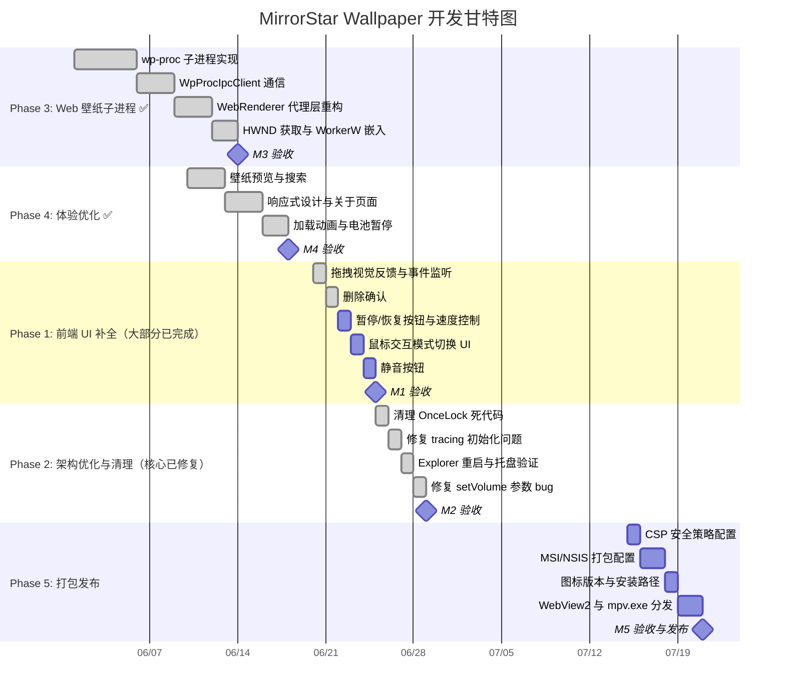

# MirrorStar Wallpaper（镜星壁纸）实施规划 — 甘特图

[← 返回文档索引](../README.md) > [实施规划](./overview.md) > [甘特图](./gantt.md)

## 3. 甘特图

> **更新说明（2026-07-15）**：Phase 3（Web 壁纸子进程）和 Phase 4（体验优化）已完成。Phase 1（前端 UI 补全）大部分已完成（壁纸预览/搜索/响应式/电池暂停/事件监听/拖拽反馈/删除确认均已落地，完成度 95%），仅剩少量 UI（手动暂停/恢复按钮、播放速度、鼠标交互模式、删除源文件、静音按钮）。Phase 2（架构优化与清理）任务 2.1/2.2/2.5 已修复，2.3/2.4 已实现，整体基本完成。Phase 5（打包发布）尚未开始。

### 时间线总览

| 阶段 | 里程碑 | 状态 | 预计工时 | 备注 |
|------|--------|------|----------|------|
| Phase 3 | M3: Web 壁纸子进程 | ✅ 已完成 | ~13 天 | 实际完成于 2026-06 月 |
| Phase 4 | M4: 体验优化 | ✅ 已完成 | ~8 天 | 实际完成于 2026-06 月 |
| Phase 1 | M1: 前端 UI 补全 | 🔧 进行中（95%） | ~4 天 | 多数任务已完成，剩余少量 UI |
| Phase 2 | M2: 架构优化与清理 | 🔧 基本完成 | ~4 天 | 2.1/2.2/2.5 已修复，2.3/2.4 已实现 |
| Phase 5 | M5: 打包发布 | ⬜ 待开始 | ~6 天 | 预计 2026-07-15 后启动 |

> **进度更新（2026-07-15）**：原计划 Phase 5 于 2026-07-01 开始，因前端 UI 补全与架构优化收尾工作尚未完全结束，Phase 5 启动时间顺延。当前优先完成 Phase 1 剩余 UI 与 Phase 2 收尾，再进入 Phase 5 打包发布。

各阶段的详细任务划分参见 [开发阶段划分](./phases.md)。
