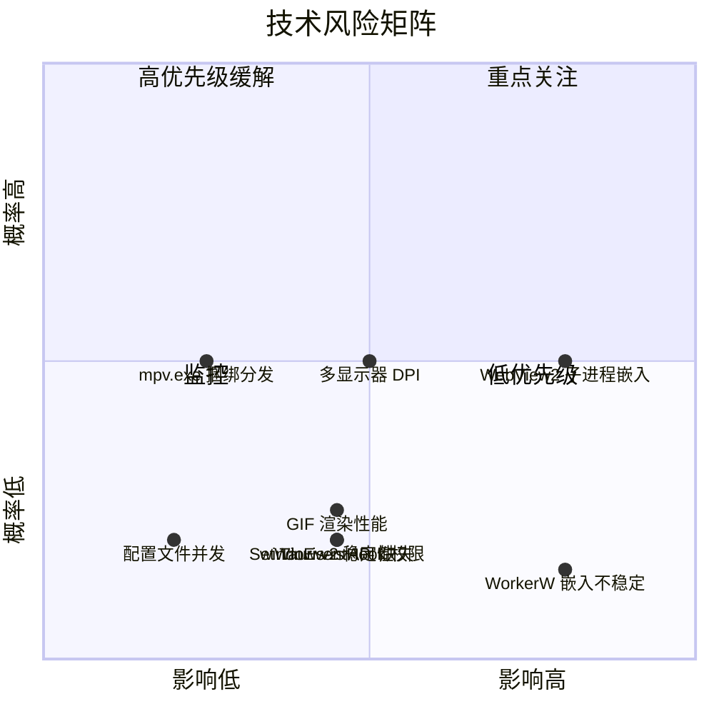

# MirrorStar Wallpaper（镜星壁纸）实施规划 — 质量保障

[← 返回文档索引](../README.md) > [实施规划](./overview.md) > [质量保障](./quality.md)

## 5. 各阶段交付物与验收标准

### Phase 1 交付物与验收标准

| 编号 | 交付物 | 验收标准 | 对应需求 |
|------|--------|----------|----------|
| D1.1 | Cargo workspace 项目结构 | workspace 包含 3 个成员（`src-tauri`、`crates/mirrorstar-core`、`crates/mirrorstar-wp-proc`），`cargo build` 通过 | - |
| D1.2 | WorkerW 桌面嵌入模块 | 壁纸窗口正确嵌入 WorkerW 层，桌面图标在上 | FR-008, FR-009, FR-010, FR-035, FR-039 |
| D1.3 | 静态图片壁纸功能 | JPG/JPEG/PNG/BMP/TIF/TIFF/DIB 通过 `SystemParametersInfoW` 原生 API 设置壁纸（零窗口/线程/GDI 资源）；WebP 通过 WorkerW 嵌入方式渲染；缩放模式通过注册表 `WallPaperStyle`/`TileWallpaper` 设置 | FR-004 |
| D1.4 | 系统托盘基础功能 | 托盘图标可见，右键菜单含"打开主窗口"、"暂停壁纸/恢复壁纸"（动态切换）和"退出"三项 | FR-019, FR-020 |
| D1.5 | 配置管理基础 | 配置文件正确保存/加载当前壁纸路径，损坏时回退默认值 | FR-023, FR-027 |
| D1.6 | CI/CD 流水线 | GitHub Actions 自动编译、测试、lint 通过 | NFR-016 |
| D1.7 | 单实例运行 | 重复启动时提示并退出 | FR-040 |
| D1.8 | 前端基础框架 | 主窗口基础布局正常显示，Tauri IPC 调用可通信 | FR-037 |
| D1.9 | WebView2 懒创建 | 启动时不创建 WebView2 主窗口，仅显示托盘图标；用户点击托盘图标时按需创建窗口；关闭窗口时隐藏窗口（hide）保留 WebView2 实例 | NFR-001, NFR-003 |

### Phase 2 交付物与验收标准

| 编号 | 交付物 | 验收标准 | 对应需求 |
|------|--------|----------|----------|
| D2.1 | 视频壁纸播放器 | MP4/WebM 视频流畅播放，硬件解码，CPU < 5% | FR-001 |
| D2.2 | GIF 壁纸播放器 | GIF 动图流畅播放，帧率正确，循环播放 | FR-002 |
| D2.3 | 壁纸子进程架构 | 壁纸以子进程运行，崩溃后通过 IPC 管道断开检测 | NFR-013, NFR-014 |
| D2.4 | IPC 通信机制 | Named Pipe 双向通信正常，消息协议完整 | - |
| D2.5 | 播放控制功能 | 暂停/恢复、音量调节、静音切换正常 | FR-016, FR-025 |
| D2.6 | 壁纸切换功能 | 壁纸切换平滑无闪烁，切换时间 < 1 秒 | FR-005, NFR-007 |

### Phase 3 交付物与验收标准

| 编号 | 交付物 | 验收标准 | 对应需求 |
|------|--------|----------|----------|
| D3.1 | 全屏应用检测 | 检测全屏应用启动/退出，响应时间 < 500ms | FR-015 |
| D3.2 | 智能暂停/恢复 | 全屏应用时自动暂停，退出时自动恢复；PauseSender 快速通道实现，暂停/恢复操作绕过引擎 Mutex；GIF 暂停时释放帧数据（仅保留当前帧），恢复时从文件重新解码；图片暂停时释放像素缓冲区，恢复时从文件重新加载 | FR-015, FR-016 |
| D3.3 | 暂停时静态帧 | 暂停时显示当前帧静态画面，非黑屏 | FR-017 |
| D3.4 | 音频同步控制 | 暂停时静音，恢复时还原音量 | FR-018 |
| D3.5 | 性能指标达标 | 暂停态主进程 Working Set < 20MB（⚠️ Debug 构建实测 22.03/22.17MB 略超，Release 待复测），CPU < 0.1%；暂停态 WebView2 主窗口已隐藏（hide），实例保留；GIF 内存预算 ≤ 40MB；活跃态内存 < 50MB，CPU < 5% | NFR-001~NFR-004 |

### Phase 4 交付物与验收标准

| 编号 | 交付物 | 验收标准 | 对应需求 |
|------|--------|----------|----------|
| D4.1 | 网页壁纸功能 | 本地 HTML 和远程 URL 正常加载渲染 | FR-003, FR-038 |
| D4.2 | 网页壁纸音频控制 | 网页壁纸音频可控制 | FR-003, FR-038 |
| D4.3 | 多显示器支持 | 每个显示器可独立设置不同壁纸 | FR-011, FR-012 |
| D4.4 | 显示器热插拔 | 显示器热插拔后壁纸自动适配 | FR-013 |
| D4.5 | DPI 缩放处理 | 不同 DPI 显示器壁纸显示正确 | FR-039 |
| D4.6 | 鼠标输入转发 | 网页壁纸可接收鼠标交互 | FR-031, FR-033 |

### Phase 5 交付物与验收标准

| 编号 | 交付物 | 验收标准 | 对应需求 |
|------|--------|----------|----------|
| D5.1 | 壁纸库 UI | 壁纸库网格视图，可浏览、添加、删除壁纸 | FR-006, FR-024, FR-030 |
| D5.2 | 设置面板 | 音量、暂停策略、开机自启等设置可配置 | FR-022, FR-025, FR-026 |
| D5.3 | 拖放设置壁纸 | 拖放文件到窗口可添加并设置壁纸 | FR-028 |
| D5.4 | 文件选择添加 | 通过文件选择对话框添加壁纸 | FR-029 |
| D5.5 | 安装包 | MSI 和 NSIS 安装包正常工作 | - |
| D5.6 | 性能全面达标 | 所有性能指标（NFR-001~NFR-020）达标 | NFR-001~NFR-020 |
| D5.7 | 资源需求验证 | 二进制体积 < 10MB，无额外运行时依赖 | NFR-008~011 |
| D5.8 | 响应时间验证 | 暂停响应 < 500ms，托盘菜单响应 < 200ms | NFR-019, NFR-020 |
| D5.9 | 稳定性验证 | 24 小时连续运行无内存泄漏 | NFR-012 |
| D5.10 | 兼容性验证 | Windows 10 (1809+) 和 Windows 11 正常运行 | CON-001 |

---

## 6. 技术风险与缓解措施

| 风险 | 影响 | 概率 | 缓解措施 |
|------|------|------|---------|
| WebView2 子进程嵌入复杂 | 高 | 中 | **备选方案**：在主进程内创建 WebView2 实例而非子进程，牺牲部分隔离性换取实现简洁性；参考 Lively Wallpaper 的 CefSharp 嵌入方案，适配 WebView2 API |
| SetWinEventHook 权限问题 | 中 | 低 | **回退方案**：使用 `EnumWindows` + `GetWindowRect` 轮询方案检测全屏窗口，轮询间隔设为 2 秒以平衡性能和响应速度；或使用 `SetWinEventHook` 的 `WINEVENT_OUTOFCONTEXT` 标志避免 DLL 注入 |
| windows-rs API 缺失 | 中 | 低 | **应对方案**：使用 `windows` crate 的 raw bindings（`Windows::Win32::Foundation` 等）直接调用；必要时通过 `extern "system"` 自定义 FFI 声明缺失的 API |
| Tauri v2 稳定性 | 中 | 低 | **应对方案**：锁定 Tauri v2 稳定版本（`Cargo.lock`），不追最新版；关注 Tauri 发布说明，评估是否需要升级；必要时回退到 Tauri v1 |
| 多显示器 DPI 问题 | 中 | 中 | **应对方案**：参考 Lively Wallpaper 的 `DpiHelper.cs` 实现方案；使用 `GetDpiForMonitor` API 获取每个显示器的 DPI；在 WM_DPICHANGED 消息处理中动态调整窗口尺寸 |
| mpv.exe 捆绑分发 | 低 | 中 | **应对方案**：使用外部 mpv.exe，find_mpv() 支持捆绑路径（`<exe_dir>/mpv/mpv.exe`）优先查找 + PATH 回退，打包时捆绑 mpv.exe |
| WorkerW 嵌入不稳定 | 高 | 低 | **应对方案**：参考 Lively Wallpaper 的 `SetupDesktop.cs` 实现，处理各种边界情况（Explorer 重启、桌面刷新）；实现 WorkerW 重新嵌入的自动恢复机制 |
| GIF 渲染性能 | 中 | 低 | **应对方案**：使用 `GDI 双缓冲` 直接写入帧缓冲区，避免中间拷贝；大尺寸 GIF 使用降采样渲染；考虑使用 GPU 加速的 GIF 解码方案 |
| 配置文件并发读写 | 低 | 低 | **应对方案**：使用文件锁（`fs2` crate）保护配置文件读写；配置变更采用原子写入（写入临时文件后 rename） |
| Rust COM API 交互复杂性 | 中 | 中 | **应对方案**：Core Audio API 和 WebView2 均依赖 COM 接口，Rust 通过 windows-rs 调用 COM 需要正确处理引用计数、接口查询、线程模型等；封装为 Rust 风格的安全 API 层，隐藏 COM 细节；参考 windows-rs 官方 COM 示例 |

### 风险矩阵

---

## 7. 质量保障策略

### 7.1 单元测试

| 模块 | 测试重点 | 覆盖率目标 |
|------|----------|-----------|
| `config/settings` | 配置序列化/反序列化、默认值、损坏回退 | > 90% |
| `ipc/protocol` | IPC 消息编解码、边界情况 | > 90% |
| `wallpaper/manager` | 壁纸生命周期状态机、切换逻辑 | > 80% |
| `src-tauri/src/platform/fullscreen.rs` | 全屏检测逻辑（SetWinEventHook 事件驱动） | > 80% |
| `audio/volume` | 音量控制逻辑 | > 80% |

### 7.2 集成测试

| 测试场景 | 描述 | 阶段 |
|----------|------|------|
| WorkerW 嵌入验证 | 验证壁纸窗口正确嵌入 WorkerW 层 | M1 |
| 视频播放集成 | 验证 mpv 子进程启动、播放、停止全流程 | M2 |
| GIF 播放集成 | 验证 GIF 渲染线程启动、播放、停止全流程 | M2 |
| IPC 通信集成 | 验证主进程与子进程的 IPC 通信 | M2 |
| 暂停恢复集成 | 验证全屏检测 → 暂停 → 恢复全流程 | M3 |
| 多显示器集成 | 验证多显示器壁纸独立管理 | M4 |
| 网页壁纸集成 | 验证 WebView2 壁纸加载和渲染 | M4 |

### 7.3 CI/CD 流水线

| 阶段 | 触发条件 | 执行内容 |
|------|----------|----------|
| 编译检查 | 每次 push/PR | `cargo build` — 确保代码可编译 |
| 单元测试 | 每次 push/PR | `cargo test` — 运行所有单元测试 |
| Clippy Lint | 每次 push/PR | `cargo clippy -- -D warnings` — 零警告策略 |
| 格式检查 | 每次 push/PR | `cargo fmt -- --check` — 统一代码风格 |
| 集成测试 | 合并到 main | 运行集成测试套件 |
| 构建 Release | 打 tag | `cargo build --release` + 打包安装包 |

### 7.4 代码审查清单

每次代码审查时检查以下项目：

- [ ] **正确性**：逻辑是否正确，边界情况是否处理
- [ ] **安全性**：是否有 `unsafe` 代码，是否正确使用 Windows API
- [ ] **性能**：是否引入不必要的内存分配或 CPU 开销
- [ ] **错误处理**：是否使用 `Result` 正确传播错误，是否有 `unwrap()` 在生产路径上
- [ ] **资源管理**：Windows 句柄（HWND、HANDLE）是否正确释放
- [ ] **线程安全**：共享状态是否使用 `Mutex`/`RwLock` 保护，是否有死锁风险
- [ ] **API 设计**：公共 API 是否简洁、一致、文档完整
- [ ] **测试覆盖**：新增代码是否有对应的单元测试
- [ ] **日志记录**：关键操作和错误是否有 `tracing` 日志
- [ ] **代码风格**：是否符合 `rustfmt` 和 `clippy` 规范

### 7.5 里程碑评审流程

每个里程碑结束时执行以下评审：

1. **功能验收**：逐项检查验收标准是否达标
2. **性能验收**：运行性能基准测试，确认指标达标
3. **代码质量**：检查 clippy 警告、测试覆盖率、代码复杂度
4. **文档更新**：确认相关文档（API 文档、配置说明）已更新
5. **风险回顾**：回顾本阶段遇到的技术风险，更新风险矩阵
6. **下一阶段准备**：确认下一阶段的前置条件已满足

各阶段的详细任务划分参见 [开发阶段划分](./phases.md)，时间线安排参见 [甘特图](./gantt.md)。
