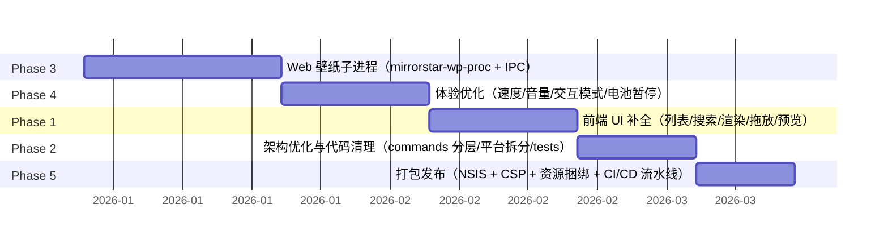

[← 返回文档索引](../index.md) > 实施规划 > 甘特图

# MirrorStar Wallpaper（镜星壁纸）实施规划 — 甘特图

| 项目   | 内容                        |
| ---- | ------------------------- |
| 项目名称 | MirrorStar Wallpaper（镜星壁纸） |
| 文档版本 | v2.0                      |
| 更新日期 | 2026-08-29                |
| 文档状态 | 已实现（基于最新代码审计）        |

***

## 1. 说明

本文档是实施规划的**时间维度视图**，与 [开发阶段划分](开发阶段划分-Development-Phases.md) 一一对应。以下甘特图基于当前代码审计（2026-08-29）反映**各阶段的相对完成情况与当前状态**，不虚构。

- ✅ = 已完成
- 🔧 = 已配置（打包与发布流水线就绪，待正式发布）

> **历史说明**：原始周期排期为规划阶段的预估值，实际开发过程中各阶段的具体周期随迭代演进，本文档不追溯精确到天的历史开工/完工日期，仅保留相对顺序与当前状态，以保证与真实仓库一致。

## 2. 甘特图（相对执行顺序）

## 3. 各阶段状态明细

| 阶段 | 内容 | 状态 | 备注 |
|------|------|------|------|
| Phase 1 | 前端 UI 补全 | ✅ 已完成 | 列表/搜索/渲染/拖放/预览均落地 |
| Phase 2 | 架构优化与代码清理 | ✅ 已完成 | commands 分层 / 平台拆分 / tests 健全 |
| Phase 3 | Web 壁纸子进程 | ✅ 已完成 | mirrorstar-wp-proc + IPC 稳定 |
| Phase 4 | 体验优化 | ✅ 已完成 | 速度/音量/交互模式/电池暂停 |
| Phase 5 | 打包发布 | 🔧 已配置 | NSIS + CSP + 资源捆绑 + CI/CD 就绪，等待正式发布 tag |

> 阶段先后顺序见第 2 节 phase 依赖关系；各阶段当前实现以 [开发阶段划分](开发阶段划分-Development-Phases.md) 为准。

## 4. 里程碑

| 里程碑 | 对应阶段 | 状态 |
|--------|----------|------|
| M1 前端交互完整可用 | Phase 1 | ✅ 达成 |
| M2 架构整洁、可维护 | Phase 2 | ✅ 达成 |
| M3 Web 壁纸子进程稳定运行 | Phase 3 | ✅ 达成 |
| M4 用户体验完善 | Phase 4 | ✅ 达成 |
| M5 可分发安装包 | Phase 5 | 🔧 等待正式发布 |

## 5. 相关章节

- [实施规划总览](实施规划总览-Implementation-Overview.md)
- [开发阶段划分](开发阶段划分-Development-Phases.md)
- [开发环境搭建](开发环境搭建-Development-Environment.md)
- [质量保障](质量保障-Quality-Assurance.md)