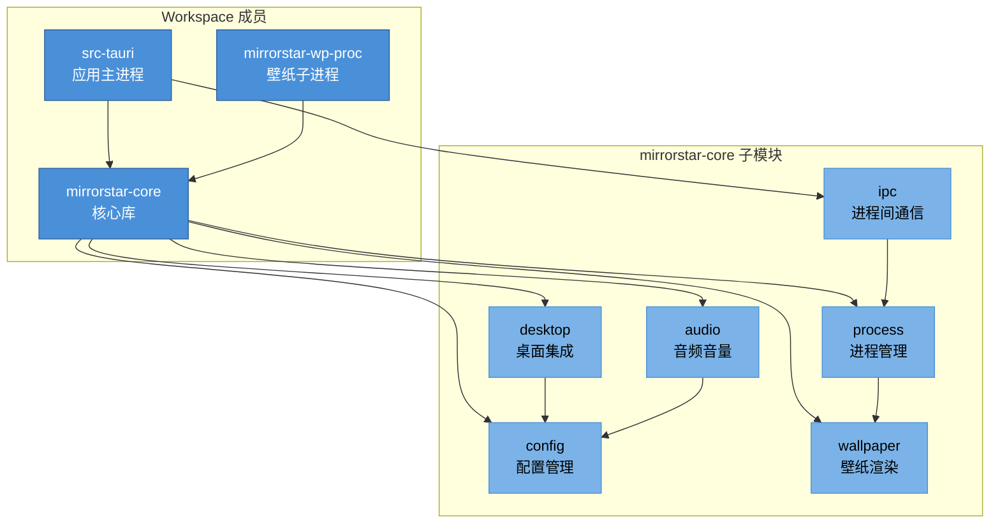

# 项目架构总览

> [← 返回索引](./README.md)

## 架构哲学与设计原则

MirrorStar Wallpaper 的设计遵循 **"Less is more"** 哲学：在保证功能完整性的前提下，尽可能减少运行时开销与代码复杂度。这一哲学贯穿于技术选型、模块划分与运行时行为之中。

### 四大设计原则

1. **轻量（暂停态 <20MB）**：壁纸应用作为常驻后台进程，其资源占用必须被严格控制。暂停态（所有壁纸进程挂起）下内存预算控制在 20MB 以内，避免对用户日常使用造成可感知的影响。
2. **高性能（暂停态 CPU 0%）**：暂停态下主进程不应有任何 CPU 活动。通过事件驱动架构（而非轮询）实现，确保壁纸暂停后系统零负担。
3. **内存安全（纯 Rust 无 GC）**：核心库与后端全部使用 Rust 实现，借助所有权系统在编译期消除数据竞争与悬垂指针，无需垃圾回收器，避免 GC 停顿对壁纸渲染流畅度的影响。
4. **模块化**：通过 Cargo workspace 将功能切分为独立 crate，每个子模块职责单一、边界清晰，便于独立测试与演进。

### 与 Lively Wallpaper 的对比要点

| 维度 | MirrorStar Wallpaper | Lively Wallpaper |
|------|---|---|
| 壁纸类型 | 4 种（GIF/视频/网页/图片） | 9 种（含 Unity/Godot/流媒体等） |
| 事件模型 | 事件驱动（SetWinEventHook + TaskbarCreated + WM_POWERBROADCAST） | 轮询为主（500ms 间隔） |
| IPC 协议 | 双协议（mpv JSON + wp-proc 自定义 JSON） | CefSharp stdin/stdout |
| 实现语言 | Rust（核心）+ TypeScript（前端） | C#（.NET WPF） |
| 暂停态资源 | 内存 17.14MB、CPU 0% | 常驻 .NET 运行时，开销较高 |
| 内存安全 | 编译期保证 | 依赖 GC，存在停顿风险 |
| 进程模型 | 混合（主进程 + 按需子进程，无 watchdog） | 独立 watchdog 进程 |

## 模块依赖关系图

项目由 3 个 workspace 成员构成：`src-tauri`（应用主进程）、`mirrorstar-core`（核心库）、`mirrorstar-wp-proc`（壁纸渲染子进程）。其中 `mirrorstar-core` 内部进一步划分为 8 个核心子模块。

### wallpaper 子模块文件清单

wallpaper 子模块由 13 个文件构成（项目最大模块，实测约 16,162 行，以实测为准）：

| 文件 | 职责 |
|------|------|
| mod.rs | 模块入口、WallpaperEngine、WallpaperRenderer trait |
| manager.rs | WallpaperManager、determine_wallpaper_mode 集中决策 |
| gdi_cache.rs | GdiCache 共享 GDI 双缓冲缓存 |
| fast_path.rs | pause/resume 快速路径 |
| mode_dispatch.rs | set_wallpaper 模式分发 |
| subprocess_base.rs | 子进程渲染器基类 |
| gdi_base.rs | GDI 渲染器基类 |
| image.rs | ImageRenderer 图片渲染器 |
| gif.rs | GifRenderer GIF 渲染器（4 种内存管理策略） |
| gif_decode.rs | GIF 解码 |
| video.rs | VideoRenderer 视频渲染器（mpv 子进程） |
| web.rs | WebRenderer 网页渲染器（wp-proc 代理） |
| gif_memory.rs | GIF 帧数据与内存管理状态（GifRenderData，4 种内存策略） |

### 数据流方向

- **配置流**：前端（TypeScript）通过 Tauri 命令 → `src-tauri` → `config` 模块持久化（TOML 文件）；`config` 通过 `notify` 热重载反向通知变更。
- **壁纸控制流**：前端 → `src-tauri` → `ipc` → `process`（spawn 子进程）→ `mirrorstar-wp-proc` → `wallpaper`（渲染）→ `desktop`（嵌入 WorkerW）。
- **输入流**：交互模式由 `wallpaper/manager.rs` 直接处理 → `desktop`（判断是否点击壁纸区域）→ 前端事件。
- **音频流**：`audio`（系统音量查询）→ `config`（持久化）→ 前端展示。

## 当前性能指标达成情况

| 指标 | 目标值 | 实测值 | 状态 |
|------|---|---|---|
| 暂停态内存 | <20MB | 17.14MB | 已达成 |
| 暂停态 CPU | 0% | 0% | 已达成 |
| 冷启动时间 | <2s | <1s | 已达成 |
| GIF 内存预算 | 40MB | 40MB | 已达成 |
| 暂停响应延迟 | <1ms | ~0.01ms | 已达成 |
| 壁纸切换时间 | <1s | ~3s（历史） | 需复测验证 |

**说明**：
- 暂停态指标已全面达成目标，得益于事件驱动架构与子进程暂停机制。
- 壁纸切换时间历史文档记载为 ~3s（超出 1s 目标，主要瓶颈在子进程启动与窗口嵌入开销）；v4.0 审计中 P-002/P-003 进一步指出 `ProcessManager::Drop`/`start()` 最坏阻塞 8s，是切换延迟的主因。**需复测验证**：`docs/06-测试报告/01-壁纸性能与资源占用测试报告-20260625.md` 记录 NFR-007 实测达标（静态 `<1s` / 视频 `~0.5s`，以 mpv 日志时间戳佐证：启动→IPC 连接→窗口找到→开始播放→嵌入完成约 0.5s），但该测试先于后续多轮优化（v4.1/v5/v6）执行，当前真实切换耗时需重新实测确认，以实测为准。

## 优化路线回顾与当前状态

v4.0 复审的 125 项 findings（High 18 / Medium 46 / Low 61）已全部修复完成（各模块文档均已核验并标记 ✅）。其后持续推进的多轮优化也已陆续实施并归档：v4.1（正确性 268 项）、v5.0（性能 29 项实施）、v6.0（技术债 201/201 清理完成 100%）、v8-v14（内存优化三轮闭环）、v15（并发/回归/降级/Win32 四维审查）、v16（跨模块契约审查）。当前代码状态：cargo check 通过 / clippy 零警告 / 测试全绿。

### 优化版本历程

| 优化轮次 | 范围 | 状态 |
|---------|------|------|
| v4.0 正确性 | 125 项 findings | 已全部完成 |
| v4.1 正确性 | 268 项 | 已完成 |
| v5.0 性能工程 | 29 项实施 | 已完成 |
| v6.0 技术债 | 201 项清理，100% | 已完成 |
| v8-v14 内存优化 | 三轮闭环 | 已完成 |
| v15 四维深度审查 | 并发/回归/降级/Win32 | 已完成 |
| v16 跨模块契约审查 | 跨模块契约与 API 一致性 | 已完成 |

**单一路线图以《[10-实施路线图.md](./10-实施路线图.md)》为准**，各模块的具体 findings 详见 02~09 模块文档。

> **待处理 / 待验证**：10-实施路线图 v15/v16 章节仍列有少量 Medium 待办，以及需真机手动验证的项——含 GIF 窗口销毁 / 4K 超大帧播放崩溃与自动恢复验证（v15-B-001/B-005）、无音频设备启动降级、WorkerW 异常检测、Web 壁纸冷启动降级路径、`wpfile.localhost` 跨域 403 防护等，概况参见 10-实施路线图各章"待手动验证项"要点。
