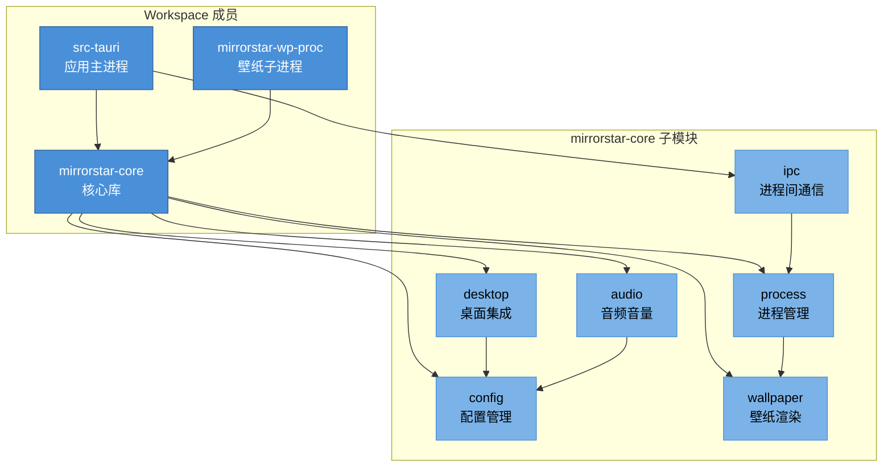

# 项目架构总览

> [← 返回索引](./README.md)

## 架构哲学与设计原则

MirrorStar Wallpaper 的设计遵循 **"Less is more"** 哲学：在保证功能完整性的前提下，尽可能减少运行时开销与代码复杂度。这一哲学贯穿于技术选型、模块划分与运行时行为之中。

### 四大设计原则

1. **轻量（暂停态 <20MB）**：壁纸应用作为常驻后台进程，其资源占用必须被严格控制。暂停态（所有壁纸进程挂起）下内存预算控制在 20MB 以内，避免对用户日常使用造成可感知的影响。
2. **高性能（暂停态 CPU 0%）**：暂停态下主进程不应有任何 CPU 活动。通过事件驱动架构（而非轮询）实现，确保壁纸暂停后系统零负担。
3. **内存安全（纯 Rust 无 GC）**：核心库与后端全部使用 Rust 实现，借助所有权系统在编译期消除数据竞争与悬垂指针，无需垃圾回收器，避免 GC 停顿对壁纸渲染流畅度的影响。
4. **模块化**：通过 Cargo workspace 将功能切分为独立 crate，每个子模块职责单一、边界清晰，便于独立测试与演进。

### 与 Lively Wallpaper 的对比要点

| 维度 | MirrorStar Wallpaper | Lively Wallpaper |
|------|---|---|
| 壁纸类型 | 4 种（GIF/视频/网页/图片） | 9 种（含 Unity/Godot/流媒体等） |
| 事件模型 | 事件驱动（SetWinEventHook + TaskbarCreated + WM_POWERBROADCAST） | 轮询为主（500ms 间隔） |
| IPC 协议 | 双协议（mpv JSON + wp-proc 自定义 JSON） | CefSharp stdin/stdout |
| 实现语言 | Rust（核心）+ TypeScript（前端） | C#（.NET WPF） |
| 暂停态资源 | 内存 17.14MB、CPU 0% | 常驻 .NET 运行时，开销较高 |
| 内存安全 | 编译期保证 | 依赖 GC，存在停顿风险 |
| 进程模型 | 混合（主进程 + 按需子进程，无 watchdog） | 独立 watchdog 进程 |

## 模块依赖关系图

项目由 3 个 workspace 成员构成：`src-tauri`（应用主进程）、`mirrorstar-core`（核心库）、`mirrorstar-wp-proc`（壁纸渲染子进程）。其中 `mirrorstar-core` 内部进一步划分为 8 个核心子模块。

### wallpaper 子模块文件清单

wallpaper 子模块由 13 个文件构成（项目最大模块，约 7,900 行）：

| 文件 | 职责 |
|------|------|
| mod.rs | 模块入口、WallpaperEngine、WallpaperRenderer trait |
| manager.rs | WallpaperManager、determine_wallpaper_mode 集中决策 |
| gdi_cache.rs | GdiCache 共享 GDI 双缓冲缓存 |
| fast_path.rs | pause/resume 快速路径 |
| mode_dispatch.rs | set_wallpaper 模式分发 |
| subprocess_base.rs | 子进程渲染器基类 |
| gdi_base.rs | GDI 渲染器基类 |
| image.rs | ImageRenderer 图片渲染器 |
| gif.rs | GifRenderer GIF 渲染器（4 种内存管理策略） |
| gif_decode.rs | GIF 解码 |
| video.rs | VideoRenderer 视频渲染器（mpv 子进程） |
| web.rs | WebRenderer 网页渲染器（wp-proc 代理） |
| trampoline.rs | 壁纸线程跳板 |

### 数据流方向

- **配置流**：前端（TypeScript）通过 Tauri 命令 → `src-tauri` → `config` 模块持久化（TOML 文件）；`config` 通过 `notify` 热重载反向通知变更。
- **壁纸控制流**：前端 → `src-tauri` → `ipc` → `process`（spawn 子进程）→ `mirrorstar-wp-proc` → `wallpaper`（渲染）→ `desktop`（嵌入 WorkerW）。
- **输入流**：交互模式由 `wallpaper/manager.rs` 直接处理 → `desktop`（判断是否点击壁纸区域）→ 前端事件。
- **音频流**：`audio`（系统音量查询）→ `config`（持久化）→ 前端展示。

## 当前性能指标达成情况

| 指标 | 目标值 | 实测值 | 状态 |
|------|---|---|---|
| 暂停态内存 | <20MB | 17.14MB | 已达成 |
| 暂停态 CPU | 0% | 0% | 已达成 |
| 冷启动时间 | <2s | <1s | 已达成 |
| GIF 内存预算 | 40MB | 40MB | 已达成 |
| 暂停响应延迟 | <1ms | ~0.01ms | 已达成 |
| 壁纸切换时间 | <1s | ~3s | 待优化 |

**说明**：
- 暂停态指标已全面达成目标，得益于事件驱动架构与子进程暂停机制。
- 壁纸切换时间（~3s）超出 1s 目标，主要瓶颈在子进程启动与窗口嵌入开销，需在后续优化中重点解决。v4.0 审计中 P-002/P-003 进一步指出 `ProcessManager::Drop`/`start()` 最坏阻塞 8s，是切换延迟的主因。

## 优化优先级矩阵（v4.0）

v3.0→v3.5 共 5 轮审计的 100 项 findings（C01-C11 / D01-D12 / W01-W13 / A01-A03 / I01-I05 / P01-P05 / T01-T16 / WP01-WP14 / F01-F12 / B01-B09）已全部修复完成。v4.0 复审新增 125 项 findings，按优先级分类如下：

### High 级（18 项，需优先修复）

| 模块 | Finding | 描述 |
|------|---------|------|
| config | C-001 | `maybe_save_config` dirty 标志竞态导致配置丢失（N-005 修复引入） |
| config | C-002 | `thumbnail.rs` 解压炸弹防护在解码之后，OOM 防护无效（C06 修复不完整） |
| config | C-003 | `notify_config_error` 回调未用 `catch_unwind` 包裹 |
| desktop | D-001 | 4 个测试在默认 cargo test 时真实修改系统壁纸，未标 `#[ignore]` |
| desktop | D-002 | PerMonitor 坐标偏移 bug（负坐标显示器壁纸位置错误） |
| wallpaper | W-001 | `duplicate_process_handle()` 后 spawn 失败导致 HANDLE 泄漏 |
| wallpaper | W-002 | video.rs 缺少子进程崩溃检测（W07 修复未同步到 video.rs） |
| wallpaper | W-003 | resume 状态不一致（image/gif resume 失败不回滚状态） |
| wallpaper | W-004 | pause_all 部分失败处理不完整（成功发送 Pause 的渲染器卡住） |
| audio | A-001 | 音频设备切换无感知（`refresh_session_manager` 未被调用，`IMMNotificationClient` 未实现） |
| ipc | I-001 | `read_line_with_limit` 内部 `BufReader::fill_buf()` 可无限阻塞（超时机制盲区） |
| process | P-001 | `start()` 重启时旧进程自行退出导致句柄泄漏（HANDLE 无 Drop） |
| src-tauri | ST-001 | `add_wallpaper` 用 `String::starts_with` 判断受控目录，兄弟目录误判 |
| src-tauri | ST-002 | `open_file_dialog` 超时后 spawn_blocking 不可取消，线程泄漏 |
| wp-proc | WP-001 | Pause/Resume 命令处理大量代码重复（~70 行） |
| wp-proc | WP-002 | create_webview 失败路径未显式 `controller.Close()` |
| wp-proc | WP-003 | SetPosition 失败仅 warn 返回 Ok，与 SetWindowPos 不一致 |
| build-infra | B-001 | tauri.dev.conf.json dev asset scope `$HOME/**/*` 过度宽松 |

### Medium 级（46 项）与 Low 级（61 项）

详见各模块文档。整体分布特征：
- **资源管理**（14 项）：HANDLE/COM/线程/句柄泄漏相关
- **可维护性**（28 项）：代码重复、魔法数、文档矛盾等
- **错误处理**（16 项）：静默吞错、错误传播链不完整
- **并发安全**（12 项）：锁粒度、TOCTOU、await 持锁

## 实施路线图

基于 v4.0 审计 findings，建议按以下优先级推进优化：

1. **Phase 1（High 优先修复，18 项）**：资源泄漏（W-001/P-001/WP-002）、配置一致性（C-001/C-002）、测试副作用（D-001）、状态一致性（W-002/W-003/W-004）、安全（ST-001/B-001）
2. **Phase 2（Medium 系统性修复，46 项）**：跨模块一致性（速度校验、崩溃检测、错误处理）、并发安全加固、资源管理完善
3. **Phase 3（Low 渐进优化，61 项）**：可维护性提升（命名常量、文档修正）、性能优化、测试覆盖补全

### 度量指标（v4.0 目标）

| 指标 | 当前值 | v4.0 目标 |
|------|--------|-----------|
| Critical / High findings | 0 / 18 | 0 / 0 |
| 单元测试数 | 551（Rust 400 + 前端 151） | 维持或增长 |
| Clippy warnings | 0 | 0 |
| 壁纸切换时间 | ~3s | <1.5s（修复 P-002/P-003） |
| 句柄泄漏 | 存在（W-001/P-001） | 零泄漏 |
| 修复一致性 | 部分不一致 | 跨模块统一 |
