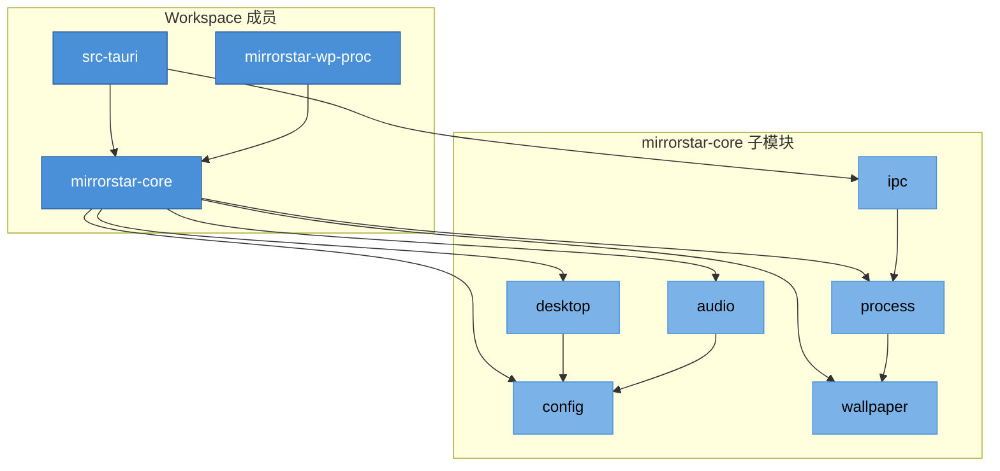
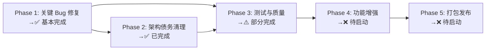

# MirrorStar Wallpaper 项目优化计划（已归档）

> ⚠️ **本文档已归档（2026-07-15）**
>
> 本文档已重构为按模块组织的结构化文档集。请前往 **[README.md 索引页](./README.md)** 查阅最新内容。
>
> **重构说明**：原文档（485KB / 5000+ 行）已拆分为 9 个独立模块文件 + 2 个附录文件，并整合了 v4.0 审查的 125 项新发现（0 Critical / 18 High / 46 Medium / 61 Low）。各模块文档在 v3.x 已修复问题表格中以 ⚠️ 标注 v4.0 发现的回退/不完整修复。
>
> **新文档结构**：
> - [README.md](./README.md) — 索引页
> - [01-架构总览.md](./01-架构总览.md) — 架构总览
> - [02-config模块.md](./02-config模块.md) — config 模块
> - [03-desktop模块.md](./03-desktop模块.md) — desktop 模块
> - [04-wallpaper模块.md](./04-wallpaper模块.md) — wallpaper 模块
> - [05-audio-ipc-process模块.md](./05-audio-ipc-process模块.md) — audio/ipc/process 三模块
> - [06-src-tauri应用层.md](./06-src-tauri应用层.md) — src-tauri 应用层
> - [07-wp-proc子进程.md](./07-wp-proc子进程.md) — wp-proc 子进程
> - [08-前端.md](./08-前端.md) — 前端 UI
> - [09-构建基础设施.md](./09-构建基础设施.md) — 构建基础设施
> - [附录A-已修复问题汇总.md](./附录A-已修复问题汇总.md) — v1.0→v3.5 已修复问题汇总
> - [附录B-版本历史.md](./附录B-版本历史.md) — v1.0→v3.5.3 版本变更日志
>
> 以下为原文档内容，保留作为历史记录，不再更新。

---

> [← 返回文档首页](../index.md)

> 本文档基于对项目全部源码的深度审计，按模块组织优化计划、实施方案和 vibecoding 提示词。
→
→ 审计范围：`crates/mirrorstar-core/` 8 个子模块（含新增 `settings.rs`、`gdi_cache.rs`、`client.rs`）、`crates/mirrorstar-wp-proc/`、`src-tauri/src/`、`src/` 前端、构建配置。v3.4 新增审计点：`thumbnail.rs` 新函数（generate_video_thumbnail/is_ffmpeg_available/generate_thumbnail_from_image_file）、`commands/wallpaper.rs` 新命令（regenerate_thumbnails）与新结构体（ThumbnailFailedPayload/RegenerateResult）、`wallpaper-list.ts` 4 分支渲染逻辑与 fallbackToEmoji helper、启动清理钩子。

→ 文档版本：3.5 | 审计日期：2026-07-12 | v3.1 修复完成：2026-07-04 | v3.2 修复完成：2026-07-04 | v3.3 修复完成：2026-07-05 | v3.4 修复完成：2026-07-07 | v3.5 深度审计完成：2026-07-12
→
→ **v3.0 勘误**：基于 2026-07-03 全项目代码复审（findings/01-06），修正以下数据偏差：#[ignore] 36→18、lib.rs(src-tauri) 196→310 行、wp-proc 1645→1665 行、wallpaper 3764→6211 行、main.ts 775→403 行、main.css 555→581 行、C-112/C-113 状态更正为未修复、C-107 更正为部分修复、assetProtocol.scope 更正为未实际收紧、input 模块引用全部标注已删除。新增 WP-001 安全发现。

→ **v3.1 修复完成**（2026-07-04）：基于 fix-v3-review-findings-2026-07-04 spec，修复全部审查发现问题：WP-001 协议白名单大小写绕过、C-112/C-113/C-107 v2.1 遗留、N-001~N-010 代码质量、WP-002~WP-010 代码质量、assetProtocol.scope 收紧、dead deps 清理、LICENSE 添加、release.yml 改进、测试缺口填补（manager.rs +39T、main.rs +10T）。新增单元测试 +115 个（mirrorstar-core 211→272、wp-proc 41→86），全量验证通过（374 passed / 0 failed / 47 ignored）。

→ **v3.2 修复完成**（2026-07-04）：基于 deep-review-src-tauri-frontend-2026-07-04 spec，深度审查 src-tauri 与前端（findings/03、04），修复全部 33 个发现问题（ST-001~ST-018 + FE-001~FE-015），Bug #3 前端 displayId 修复，新增单元测试 +91 个（Rust 374→400、前端 86→151），全量验证通过。

→ **v3.3 修复完成**（2026-07-05）：基于 cleanup-remaining-todos-2026-07-04 spec，清理 v3.2 遗留的全部 6 个 TODO 项（ST-014/015/016/017 + WP-008 + W-006），项目达到"零已知 TODO"状态。WP-008 命名管道安全属性完整实现（SDDL + DACL 限制当前用户/Administrators/SYSTEM）；ST-016 CSP 移除 'unsafe-inline'；ST-014/015 添加超时机制；ST-017 测试重构为纯函数直接调用；W-006 WebView2 创建 30s 超时。windows-rs 0.58 API 适配（LocalFree → HeapFree）。全量验证通过（0 警告 0 错误）。

→ **v3.4 修复完成**（2026-07-07）：基于 fix-wallpaper-preview-blank + fix-static-wallpaper-card-blank 两个 spec，修复壁纸卡片预览空白的 5 个复合根因。前端：wallpaper-list.ts 重构为 4 分支渲染（有缩略图/Video 首帧/Image|Gif 直载/emoji 占位）+ fallbackToEmoji helper + onerror 容错；main.css 新增 .wallpaper-thumb-error 样式；设置面板新增"重新生成缩略图"按钮；main.ts 监听 wallpaper-thumbnail-failed 事件；ipc.ts 新增 regenerateThumbnails 包装。后端：thumbnail.rs 新增 generate_video_thumbnail（ffmpeg 抽帧）+ is_ffmpeg_available + 重构 generate_thumbnail_from_image_file 私有 helper；manager.rs 新增 cleanup_corrupted_thumbnails 方法；commands/wallpaper.rs 新增 regenerate_thumbnails 命令 + ThumbnailFailedPayload + RegenerateResult 结构体，add_wallpaper 扩展支持 Video 类型缩略图生成与失败事件通知；lib.rs setup 钩子启动时清理损坏缩略图。全量验证通过。

→ **v3.5 深度审计完成**（2026-07-12）：完成 10 个模块的 8 维度深度审计（config/desktop/wallpaper/audio/ipc/process/src-tauri/wp-proc/前端/构建），与 v3.4 已识别 16 项 + 历史 fix-review spec 已修复项去重后，新增 100 项 findings（Critical 0 / High 7 / Medium 36 / Low 57），详见附录 A.14 与各章节 v3.5 findings 表格

***

## 目录

- [第一章：项目架构总览](#第一章项目架构总览)
- [第二章：核心库 - 配置模块（config）](#第二章核心库--配置模块config)
- [第三章：核心库 - 桌面集成模块（desktop）](#第三章核心库--桌面集成模块desktop)
- [第四章：核心库 - 壁纸引擎模块（wallpaper）](#第四章核心库--壁纸引擎模块wallpaper)
- [第五章：核心库 - 音频>输入>IPC>进程模块](#第五章核心库--音频输入ipc进程模块)
- [第六章：Tauri 应用层（src-tauri）](#第六章tauri-应用层src-tauri)
- [第七章：Web 壁纸子进程（mirrorstar-wp-proc）](#第七章web-壁纸子进程mirrorstar-wp-proc)
- [第八章：前端 UI（src）](#第八章前端-ui-src)
- [第九章：构建与基础设施](#第九章构建与基础设施)
- [第十章：实施路线图](#第十章实施路线图)
- [附录 A：已修复问题汇总](#附录-a已修复问题汇总)
- [附录 B：本次审计变更日志](#附录-b本次审计变更日志)

***

## 第一章：项目架构总览

### 1.1 架构哲学与设计原则

MirrorStar Wallpaper 的设计遵循 **"Less is more"** 哲学：在保证功能完整性的前提下，尽可能减少运行时开销与代码复杂度。这一哲学贯穿于技术选型、模块划分与运行时行为之中。

#### 四大设计原则

1. **轻量（暂停态 <20MB）**：壁纸应用作为常驻后台进程，其资源占用必须被严格控制。暂停态（所有壁纸进程挂起）下内存预算控制在 20MB 以内，避免对用户日常使用造成可感知的影响。
2. **高性能（暂停态 CPU 0%）**：暂停态下主进程不应有任何 CPU 活动。通过事件驱动架构（而非轮询）实现，确保壁纸暂停后系统零负担。
3. **内存安全（纯 Rust 无 GC）**：核心库与后端全部使用 Rust 实现，借助所有权系统在编译期消除数据竞争与悬垂指针，无需垃圾回收器，避免 GC 停顿对壁纸渲染流畅度的影响。
4. **模块化**：通过 Cargo workspace 将功能切分为独立 crate，每个子模块职责单一、边界清晰，便于独立测试与演进。

#### 与 Lively Wallpaper 的对比要点

| 维度     | MirrorStar Wallpaper                             | Lively Wallpaper        |
| --- | ------------------------ | ------------ |
| 壁纸类型   | 4 种（GIF/视频/网页/图片）                               | 9 种（含 Unity/Godot/流媒体等） |
| 事件模型   | 事件驱动（SetWinEventHook + TaskbarCreated + WM_POWERBROADCAST） | 轮询为主（500ms 间隔）          |
| IPC 协议 | 双协议（mpv JSON + wp-proc 自定义 JSON）                | CefSharp stdin/stdout   |
| 实现语言   | Rust（核心）+ TypeScript（前端）                        | C#（.NET WPF）            |
| 暂停态资源  | 内存 17.14MB、CPU 0%                               | 常驻 .NET 运行时，开销较高        |
| 内存安全   | 编译期保证                                           | 依赖 GC，存在停顿风险            |
| 进程模型   | 混合（主进程 + 按需子进程，无 watchdog）                      | 独立 watchdog 进程          |

### 1.2 模块依赖关系图

项目由 3 个 workspace 成员构成：`src-tauri`（应用主进程）、`mirrorstar-core`（核心库）、`mirrorstar-wp-proc`（壁纸渲染子进程）。其中 `mirrorstar-core` 内部进一步划分为 8 个核心子模块。



#### wallpaper 子模块文件清单

wallpaper 子模块由 7 个文件构成（**注**：原 v1.0 文档提及的 `renderer.rs` 实际不存在，v2.0 修正为以下清单；新增 `gdi_cache.rs` 共享 GDI 双缓冲缓存组件）：

| 文件             | 行数   | 职责                                  |
| ------- | -- | ------------------ |
| mod.rs         | 505  | 模块入口、WallpaperEngine、WallpaperRenderer trait |
| manager.rs     | 562  | WallpaperManager、determine_wallpaper_mode 集中决策 |
| gdi_cache.rs   | 108  | GdiCache 共享 GDI 双缓冲缓存（新增）           |
| image.rs       | 699  | ImageRenderer 图片渲染器                 |
| gif.rs         | 1073 | GifRenderer GIF 渲染器（4 种内存管理策略）       |
| video.rs       | 515  | VideoRenderer 视频渲染器（mpv 子进程）        |
| web.rs         | 302  | WebRenderer 网页渲染器（wp-proc 代理）       |

#### 数据流方向

- **配置流**：前端（TypeScript）通过 Tauri 命令 → `src-tauri` → `config` 模块持久化（TOML 文件）；`config` 通过 `notify` 热重载反向通知变更。
- **壁纸控制流**：前端 → `src-tauri` → `ipc` → `process`（spawn 子进程）→ `mirrorstar-wp-proc` → `wallpaper`（渲染）→ `desktop`（嵌入 WorkerW）。
- **输入流**：~~`input`（鼠标监听）~~（已删除，交互模式由 `wallpaper/manager.rs` 直接处理）→ `desktop`（判断是否点击壁纸区域）→ 前端事件。
- **音频流**：`audio`（系统音量查询）→ `config`（持久化）→ 前端展示。

#### v3.4 新增能力（2026-07-07）

- **前端卡片渲染 4 分支**：`wallpaper-list.ts` 根据壁纸类型与缩略图状态选择最佳预览方式（有缩略图→`` 加载；Video 无缩略图→`<video>` 首帧；Image/Gif 无缩略图→`` 直载源图；其他→emoji 占位），任何分支均保证可见内容，配合 `fallbackToEmoji` helper 实现 onerror 容错回退。
- **后端 Video 缩略图生成**：`thumbnail.rs` 新增 `generate_video_thumbnail`（通过 ffmpeg CLI 抽取首帧后复用 image crate resize 逻辑）与 `is_ffmpeg_available` 探测函数；ffmpeg 不可用时降级跳过。
- **批量重生成命令**：`commands/wallpaper.rs` 新增 `regenerate_thumbnails` 命令，遍历 `thumbnail=""` 条目批量补生成，返回 `{total, success, failed}` 计数。
- **启动清理钩子**：`lib.rs` setup 阶段调用 `cleanup_corrupted_thumbnails` 删除 0 字节损坏文件。
- **失败事件通知**：缩略图生成失败时 emit `wallpaper-thumbnail-failed` 事件，前端展示 toast 提示。

### 1.3 当前性能指标达成情况

| 指标       | 目标值   | 实测值      | 状态  |
| ---- | --- | ---- | -- |
| 暂停态内存    | <20MB | 17.14MB  | 已达成 |
| 暂停态 CPU  | 0%    | 0%       | 已达成 |
| 冷启动时间    | <2s   | <1s      | 已达成 |
| GIF 内存预算 | 40MB  | 40MB     | 已达成 |
| 暂停响应延迟   | <1ms  | \~0.01ms | 已达成 |
| 壁纸切换时间   | <1s   | \~3s     | 待优化 |

**说明**：

- 暂停态指标已全面达成目标，得益于事件驱动架构与子进程暂停机制。
- 壁纸切换时间（\~3s）超出 1s 目标，主要瓶颈在子进程启动与窗口嵌入开销，需在后续优化中重点解决。

### 1.4 优化优先级矩阵

v2.1 审计（2026-06-22）标记的 10 个问题当时声明全部修复，v1.0 文档的 58 个问题声明修复率 100%。**v3.0 勘误**：经 2026-07-03 复审，C-112/C-113 实际未修复、C-107 部分修复、assetProtocol.scope 未实际收紧（仍为 ``["**"]``），实际完全修复率低于 100%，详见 [附录 A](#附录-a已修复问题汇总) 与 v3.0 勘误。**v3.1 状态更新**（2026-07-04）：上述全部问题已修复——C-112/C-113/C-107 已修复、assetProtocol.scope 已收紧为白名单、WP-001 协议白名单大小写绕过已修复、N-001~N-010 与 WP-002~WP-010 代码质量问题已修复，详见 [附录 A.10](#a10-v31-新增修复项2026-07-04) 与 v3.1 修复完成勘误。**v3.2 状态更新**（2026-07-04）：基于深度审查 src-tauri 与前端（findings/03、04），修复全部 33 个新发现问题（ST-001~ST-018 + FE-001~FE-015），Bug #3 前端 displayId 空字符串问题已修复，详见 [附录 A.11](#a11-v32-新增修复项2026-07-04) 与 v3.2 修复完成勘误。

| 级别     | 模块      | 问题                       | 代码位置                       | 状态     | 修复说明                                                          |
| --- | ---- | ------------ | ------------- | --- | ------------------------------ |
| Medium | desktop | unsafe Send/Sync 契约脆弱    | desktop/mod.rs L46-47      | ✅ 已修复 | 移除冗余 `unsafe impl Sync for DesktopIntegrator`，跨线程访问通过 `Arc<Mutex<DesktopIntegrator→→` 保护 |
| Medium | Tauri   | 10 个全局可变静态量              | lib.rs L421-444            | ✅ 已修复 | 合并为 SHARED_PAUSE_SENDERS + SHARED_CONFIG，TRAY_PAUSED/TRAY_PAUSE_RESUME_ITEM 移入 AppState，10→7 个 |
| Medium | Tauri   | 窗口关闭 50ms 魔数竞态           | lib.rs L983                | ✅ 已修复 | 添加 MAIN_WINDOW_CLOSING AtomicBool 标志位，create_or_show_main_window 等待 destroy 完成 |
| Medium | Tauri   | COM 初始化错误处理脆弱            | lib.rs L795                | ✅ 已修复 | 使用 `RPC_E_CHANGED_MODE` 常量替代硬编码值，改用 match 表达式 + tracing 日志 |
| Medium | 前端      | 全局可变状态未封装                | main.ts L163-167           | ✅ 已修复 | selectedDisplayId、allWallpapers、currentPreviewId、statusTimer 封装为 appState 对象 |
| Medium | wp-proc | ipc_thread 无重试           | main.rs L450-539           | ✅ 已修复 | JSON 反序列化失败改为 tracing::error + continue，不再 PostQuitMessage 终止进程 |
| Low    | wp-proc | build_url 反斜杠替换脆弱        | main.rs L380-391           | ✅ 已修复 | 重写 build_url，剥离 `\\?\` 前缀、正确处理 UNC 路径、添加 percent_encode_path 辅助函数 |
| Low    | 前端      | 未使用的 JS 依赖              | package.json              | ✅ 已修复 | 移除 @tauri-apps/plugin-autostart 和 @tauri-apps/plugin-dialog |
| Low    | 构建      | capabilities 未显式配置 asset 权限 | capabilities/default.json  | ✅ 已修复（v3.1） | assetProtocol.scope 从 `["**"]` 收紧为 `["$APPDATA/mirrorstar/**/*", "$HOME/**/*"]`（静态白名单方案，Plan A） |
| Low    | wp-proc | 无单元测试                    | main.rs                   | ✅ 已修复 | 添加 9 个单元测试（parse_rect 5 + build_url 3 + percent_encode_path 1） |
| Medium | config  | ffmpeg 路径检测每次调用都执行          | thumbnail.rs `is_ffmpeg_available` L134 | ⚠️ v3.4 新识别 | 每次添加 Video 壁纸都执行 `ffmpeg -version` 探测，应缓存结果到 `OnceLock<bool>` 或 `AtomicBool` |
| Medium | src-tauri | `regenerate_thumbnails` 串行处理     | commands/wallpaper.rs `regenerate_thumbnails` L605 | ⚠️ v3.4 新识别 | 多个条目串行 spawn_blocking，应并行化（如 `tokio::task::JoinSet`）或限制并发度 |
| Medium | 前端    | 卡片 4 分支渲染逻辑重复              | wallpaper-list.ts L102-145        | ⚠️ v3.4 新识别 | 4 分支包含重复的 onload/onerror 模式，应重构为策略模式或共享 helper |
| Low    | config  | 损坏文件清理仅在启动时执行            | manager.rs `cleanup_corrupted_thumbnails` | ⚠️ v3.4 新识别 | 应增加周期性触发或按需触发（如重生成前后） |
| Low    | src-tauri | `ThumbnailFailedPayload.error` 暴露内部细节 | commands/wallpaper.rs L11-15 | ⚠️ v3.4 新识别 | error 字段直接 `e.to_string()`，可能含路径/IO 细节，应脱敏为分类错误码 |
| Low    | 前端    | `regenerateThumbnails` 无进度反馈     | main.ts + ipc.ts                  | ⚠️ v3.4 新识别 | 仅显示完成 toast，应增加进度条或逐条 emit 进度事件 |
| Low    | 前端    | onerror 容错逻辑在 wallpaper-list 与 preview-modal 重复 | wallpaper-list.ts L55-58 + preview-modal.ts L78-102 | ⚠️ v3.4 新识别 | 应提取为共享 helper（如 `ui/media-error.ts`） |
| **High** | config  | `load_config`/`load_library` TOML 解析失败静默回退默认配置 | manager.rs `load_config` L498-504 / `load_library` L538-544 | ⚠️ v3.5 新识别 | 解析失败时通过回调通知前端展示告警，同时保留回退到默认配置；修正 2.2 节文档与实现不一致 |
| **High** | desktop | `set_native_wallpaper` 注册表写入无事务回滚 | native_wallpaper.rs `set_native_wallpaper`:34-40 | ⚠️ v3.5 新识别（D01） | 调整为先 `set_wallpaper_image` 后 `set_wallpaper_style`；或失败时回滚注册表旧值 |
| **High** | ipc     | `read_line_with_timeout` MAX_LINE_BYTES 检查在 read_line 返回后，OOM 防护失效 | client.rs `read_line_with_timeout`:302 | ⚠️ v3.5 新识别（I02） | 改用 `read_until` 手动读取并在每次填充后检查字节上限；或 `PeekNamedPipe` 返回 `total_avail > MAX_LINE_BYTES` 时直接拒绝 |
| **High** | src-tauri | `fullscreen.rs` GetMessageW -1 误判（batch3g 遗漏） | platform/fullscreen.rs `start_fullscreen_monitor`:199 | ⚠️ v3.5 新识别（T02） | 改为 `loop { match ret.0 { 0\|-1 => break, _ => {} } }`，与 `explorer.rs` L224-239 一致 |
| **High** | wp-proc | `OpenProcessToken` 句柄泄漏 | ipc_server.rs `build_pipe_security_attributes`:56-57 | ⚠️ v3.5 新识别（WP01） | 在函数所有返回路径前 `CloseHandle(token_handle)`；或引入 RAII 包装（`OwnedHandle`） |
| **High** | wp-proc | `read_line` 无字节上限，OOM 风险 | ipc_server.rs `ipc_thread`:317 / `process_line`:275 | ⚠️ v3.5 新识别（WP02） | 改用 `BufRead::take(MAX_LINE_BYTES).read_to_string` 限制读取字节数；或实现 `read_line_with_limit` |
| **High** | wp-proc | WebView2 创建失败仍继续运行无错误反馈 | main.rs `main`:78-84 | ⚠️ v3.5 新识别（WP03） | WebView2 创建失败时返回 `Err` 退出子进程（退出码 1），让父进程检测到并重试或上报错误 |


> **测试报告对账**（2026-06-25 GUI 测试，详见 [测试报告 — Bug 列表](../测试报告/壁纸性能与资源占用测试报告.md#7-bug-列表)）：发现 6 个未修复 Bug——#1 asset protocol 拒绝访问壁纸文件/缩略图、#2 全屏检测误触发、#3 静音切换无法取消、#4 暂停按钮灰色（#2 直接后果）、#5 关闭主窗口导致应用退出、#6 mpv 孤立进程（#5 直接后果）。根因 Bug 为 #1/#2/#3/#5（P0/P1：#5/#6/#2/#4；P2：#1/#3），应纳入下一轮优化优先修复。**v3.2 状态更新**（2026-07-04）：Bug #3 已修复（FE-001 前端 displayId 空字符串 + 后端 Option<String> 协同修复），详见 [附录 A.11.3](#a113-bug-3-修复fe-001) 与测试报告 Bug #3 备注。

***

## 第二章：核心库 - 配置模块（config）

### 2.1 现状分析

- **模块路径**：`crates/mirrorstar-core/src/config/`（含 `mod.rs`、`settings.rs`、`manager.rs`、`thumbnail.rs`、`detect.rs`、`hot_reload.rs`）
- **代码规模**：**约 2700 行**（mod.rs 17 行 + settings.rs 362 行 + manager.rs 1144 行 + thumbnail.rs 394 行 + detect.rs 576 行 + hot_reload.rs 216 行）
- **单元测试**：**约 59 个**（manager.rs 19 个 + settings.rs 4 个 + thumbnail.rs 6 个 + detect.rs 30 个）
- **核心结构**：
  - `WallpaperEntry`：壁纸条目，包含路径、类型、布局等元数据
  - `WallpaperMetadata`：壁纸元数据（时长、分辨率等）
  - `WallpaperLibrary`：壁纸库，管理所有壁纸条目
  - `DisplayInfo`：显示器信息
  - `ConfigManager`：配置管理器，统一管理配置读写与热重载，**新增 `dirty: Arc<AtomicBool→` 字段用于周期性保存**
- **设计模式**：
  - `Arc<RwLock→` 共享读写：多读单写，支持并发访问
  - `atomic_write` 原子写入：fs2 文件锁 + 临时文件 + rename，保证写入原子性
  - `maybe_save_config` 300ms 防抖保存：避免高频写入磁盘
  - `start_watching` notify 热重载：500ms 防抖，监听外部配置变更（**watcher 已正确移入线程闭包**）
  - **新增 `start_periodic_save`**：30 秒周期性后台保存，检查 dirty 标志强制保存
- **新增功能**：
  - **magic byte 内容嗅探类型检测**（`detect_wallpaper_type_by_content`）：读取文件前 12 字节判断真实类型
  - **扩展名 + 内容双重校验**：先按扩展名初判，再用 magic byte 复核
  - **v3.4 Video 缩略图生成**（`generate_video_thumbnail`，thumbnail.rs L164）：通过 ffmpeg CLI 抽取首帧到临时文件 `_tmp_frame_{hash}.jpg`，再复用 `generate_thumbnail_from_image_file` 的 resize+JPEG 编码逻辑；临时文件无论成功失败都删除
  - **v3.4 ffmpeg 可用性检测**（`is_ffmpeg_available`，thumbnail.rs L134）：执行 `ffmpeg -version` 探测，进程启动且退出码 0 即视为可用
  - **v3.4 私有 helper 重构**（`generate_thumbnail_from_image_file`，thumbnail.rs L64）：提取图片读取+SEC-003 解压炸弹防护+resize+JPEG 编码逻辑为私有函数，被 `generate_thumbnail`（图片/Gif）与 `generate_video_thumbnail`（视频首帧）共用
  - **v3.4 损坏文件清理**（`manager.rs` `cleanup_corrupted_thumbnails`）：扫描 `thumbnails/` 目录删除 0 字节文件，返回清理的文件数
- **依赖**：`serde`（序列化）+ `toml`（配置格式）+ `notify`（文件监听）+ `fs2`（文件锁）+ `image`（缩略图生成）
- **v3.5 深度审计**（2026-07-11）：完成 8 维度深度审计，与 v3.4 已识别 3 项优化项去重后新增 11 项 findings（High 1 / Medium 5 / Low 5），详见 2.2 节 v3.5 findings 表格

### 2.2 问题清单

v1.0 审计发现的 6 个问题**全部已修复**。

| 问题                   | 状态     | 修复说明                                                                                                  |
| ---------- | --- | --------------------------------------------------- |
| 热重载完全失效              | ✅ 已修复  | L384 `let _watcher = watcher;` 将 watcher 移入线程闭包，生命周期与线程一致                                             |
| 防抖保存可能丢数据            | ✅ 已修复  | L436-453 新增 `start_periodic_save`，30 秒检查 dirty 标志强制保存                                                 |
| 类型检测仅按扩展名            | ✅ 已修复  | L123-177 实现 `detect_wallpaper_type_by_content`，12 字节 magic byte 嗅探                                    |
| 解析失败静默回退             | ✅ 已修复  | `load_config`>`load_library` 返回 `Result`，错误通过 `MirrorStarError::ConfigParse` 传播                       |
| 不必要的 DynamicImage 分配 | ✅ 已修复  | L497 使用 `into_rgb8()` 消费 DynamicImage                                                                  |
| ID 长度文档不一致           | ✅ 已修复  | L23 注释改为"6位随机十六进制字符串"                                                                                  |
| **v3.4** ffmpeg 路径检测无缓存 | ⚠️ 待优化 | `is_ffmpeg_available`（thumbnail.rs L134）每次调用都 spawn 子进程执行 `ffmpeg -version`，应在首次调用后缓存结果到 `OnceLock<bool>` |
| **v3.4** 损坏文件清理仅启动时执行 | ⚠️ 待优化 | `cleanup_corrupted_thumbnails`（manager.rs）仅在 `lib.rs` setup 钩子调用一次，应增加周期性触发或按需触发（如 `regenerate_thumbnails` 前后） |
| **v3.4** 旧版残留文件名未清理 | ⚠️ 待优化 | 旧版生成的 `{name}_{hash}.jpg` 命名格式与当前 `thumb_{hash}.jpg` 不匹配，`cleanup_corrupted_thumbnails` 仅清理 0 字节文件，未清理命名不匹配的残留，应增加文件名规范化迁移 |

**v3.5 深度审计 findings**（2026-07-11，8 维度审计，与 v3.4 已识别 3 项去重后新增 11 项）：

| 问题 | 严重级别 | 代码位置 | 状态 | 修复建议 |
| --- | --- | --- | --- | --- |
| `load_config`/`load_library` TOML 解析失败时静默回退默认配置，与 2.2 节"解析失败时通知前端"描述不符，用户配置损坏时无感知丢失全部自定义配置 | High | manager.rs `load_config` L498-504 / `load_library` L538-544 | 待优化 | TOML 解析失败时通过 `on_config_changed` 回调或新增 `on_config_error` 回调通知前端展示告警，同时保留回退到默认配置以保证应用可启动；并修正 2.2 节文档与实现的不一致描述 |
| `AudioConfig.volume`（0.0~1.0）/`VideoConfig.speed`（应>0）/`GifConfig.balanced_keep_frames`（应≥1）缺少范围校验，用户手动编辑 config.toml 写入越界值会被静默接受 | Medium | settings.rs `AudioConfig` L53 / `VideoConfig` L120 / `GifConfig` L152 | 待优化 | 在反序列化后增加范围校验（如 `serde` 自定义 deserialize 或 `AppConfig::validate()` 方法），越界值 clamp 到合法范围或返回错误 |
| `cleanup_corrupted_thumbnails` 使用 `Self::data_dir()` 而非实例 `config_path` 推导 thumbnails 目录，`new_in_dir` 创建的实例（测试/自定义目录）会清理用户真实数据目录 | Medium | manager.rs `cleanup_corrupted_thumbnails` L339 | 待优化 | 改为 `self.config_path.parent().unwrap().join("thumbnails")`，与实例数据目录一致 |
| `generate_video_thumbnail` 将 `file_path` 直接作为 ffmpeg `-i` 参数，文件名以 `-` 开头时会被 ffmpeg 解释为选项（参数注入） | Medium | thumbnail.rs `generate_video_thumbnail` L177-188 | 待优化 | 在 `file_path` 前加 `./` 前缀（相对路径）或使用 ffmpeg 的 `-i` 后显式 `--` 分隔，避免以 `-` 开头的路径被误解析 |
| `is_ffmpeg_available` 为同步阻塞调用，在异步上下文中调用会阻塞 tokio 线程（与 v3.4 缓存问题相关但不同维度） | Medium | thumbnail.rs `is_ffmpeg_available` L134-142 | 待优化 | 调用方应通过 `tokio::task::spawn_blocking` 包裹，或将函数标注为不可在 async 上下文直接调用；配合 v3.4 缓存修复减少调用频率 |
| `generate_thumbnail_from_image_file` 解压炸弹防护不完整：100MB 文件大小限制基于压缩后大小，TIFF/BMP 等未压缩格式解压后可能占用数 GB 内存导致 OOM | Medium | thumbnail.rs `generate_thumbnail_from_image_file` L69-88 | 待优化 | 对未压缩格式（BMP/TIFF）收紧文件大小上限（如 50MB），或在 `image::open` 后额外校验解码后的像素缓冲区大小 |
| `atomic_write` 在 `write` 成功但 `rename` 失败时临时文件 `temp_path` 残留，未在失败分支清理 | Low | manager.rs `atomic_write` L610-614 | 待优化 | 在 `rename` 失败的 err 分支增加 `let _ = std::fs::remove_file(&temp_path);` 清理临时文件 |
| `load_config`/`load_library` 文件大小检查（metadata）与实际读取（read_to_string）之间存在 TOCTOU 窗口，攻击者可在此窗口内放大文件 | Low | manager.rs `load_config` L479-507 / `load_library` L517-547 | 待优化 | 改用 `std::fs::File::open` + `read_to_end` 时通过 `take(MAX_SIZE)` 限制读取字节数，消除 TOCTOU |
| `update_thumbnail` 按 `file_path` 字符串精确匹配，Windows 路径大小写/分隔符差异（`\` vs `/`）会导致匹配失败，缩略图更新静默 no-op | Low | manager.rs `update_thumbnail` L314 | 待优化 | 路径比较前统一规范化（如 `std::fs::canonicalize` 或 lowercase + 替换分隔符），或改为按 `id` 匹配 |
| `start_periodic_save` 线程启动失败时 `periodic_save_running` 已被设为 true 但实际无线程运行，状态不一致 | Low | hot_reload.rs `start_periodic_save` L149-185 | 待优化 | 在 `spawn` 失败的 err 分支重置 `periodic_save_running.store(false)` 并清理已存入的 `shutdown_tx` |
| `start_watching` 中 config 与 library 分两次 reload，library reload 失败时 config 已更新，导致内存状态不一致 | Low | hot_reload.rs `start_watching` L79-116 | 待优化 | 先读取两者到临时变量，均成功后再依次替换内存状态；或 library 失败时回滚 config |

### 2.3 优化目标

1. ✅ 已达成 - 修复热重载功能，使配置文件变更能自动生效
2. ✅ 已达成 - 增加周期性后台保存，防止崩溃丢数据
3. ✅ 已达成 - 增强类型检测，支持 magic byte 嗅探
4. ✅ 已达成 - 改进错误传播，解析失败时通知前端
5. ✅ 已达成 - 优化缩略图生成路径，减少不必要分配
6. ✅ 已达成 - 修正文档与实现的不一致
7. ⚠️ 待优化 - 缓存 ffmpeg 可用性检测结果，避免每次添加 Video 壁纸都 spawn 子进程
8. ⚠️ 待优化 - 增强损坏文件清理策略，支持周期性触发与文件名规范化迁移

### 2.4 分步实施方案

#### 步骤 1：修复热重载（Critical） - ✅ 已完成

- **文件**：`crates/mirrorstar-core/src/config/mod.rs`
- **修改**：将 `watcher` 移入 spawned 线程的闭包中。L384 `let _watcher = watcher;` 确保 watcher 生命周期与线程一致。
- **验证**：`cargo test -p mirrorstar-core config` 确认 23 个测试通过；手动修改 config.toml 验证热重载生效。

#### 步骤 2：增加周期性保存（High） - ✅ 已完成

- **文件**：`crates/mirrorstar-core/src/config/mod.rs`
- **修改**：在 `ConfigManager` 中增加 `dirty: Arc<AtomicBool→` 字段，L436-453 新增 `start_periodic_save` 后台 tokio task，每 30s 检查 dirty 标志并强制保存。
- **验证**：`cargo check -p mirrorstar-core`

#### 步骤 3：增强类型检测（Medium） - ✅ 已完成

- **文件**：`crates/mirrorstar-core/src/config/mod.rs`
- **修改**：L123-177 实现 `detect_wallpaper_type_by_content`，读取文件前 12 字节 magic byte 判断真实类型，与扩展名检测组合为双重校验。
- **验证**：`cargo test -p mirrorstar-core config::tests`

#### 步骤 4：改进错误传播（Medium） - ✅ 已完成

- **文件**：`crates/mirrorstar-core/src/config/mod.rs`
- **修改**：`load_config`>`load_library` 解析失败时返回 `Result` 而非静默回退，错误通过 `MirrorStarError::ConfigParse` 传播。
- **验证**：`cargo check -p mirrorstar-core`

#### 步骤 5：优化缩略图分配（Low） - ✅ 已完成

- **文件**：`crates/mirrorstar-core/src/config/mod.rs` L497
- **修改**：将 `DynamicImage::ImageRgba8(thumb).to_rgb8()` 替换为 `into_rgb8()` 直接消费 DynamicImage。
- **验证**：`cargo test -p mirrorstar-core config::tests`

#### 步骤 6：修正 ID 文档（Low） - ✅ 已完成

- **文件**：`crates/mirrorstar-core/src/config/mod.rs` L23
- **修改**：注释改为"6位随机十六进制字符串"，与实际 `format!("{:06x}", ...)[..6]` 一致。
- **验证**：`cargo check -p mirrorstar-core`

#### 步骤 7：缓存 ffmpeg 可用性检测（Medium） - ⚠️ 待实施

- **文件**：`crates/mirrorstar-core/src/config/thumbnail.rs`
- **修改**：将 `is_ffmpeg_available` 改为缓存结果到 `static FFMPEG_AVAILABLE: OnceLock<bool> = OnceLock::new();`，首次调用计算后缓存，后续直接返回缓存值。考虑 ffmpeg 可能在运行时被安装/卸载的场景，提供 `reset_ffmpeg_cache()` 函数供用户手动刷新。
- **验证**：`cargo test -p mirrorstar-core config::thumbnail::tests`；手动验证首次添加 Video 壁纸后再次添加时不再 spawn ffmpeg 进程。

#### 步骤 8：增强损坏文件清理策略（Low） - ⚠️ 待实施

- **文件**：`crates/mirrorstar-core/src/config/manager.rs`
- **修改**：`cleanup_corrupted_thumbnails` 扩展为 `cleanup_thumbnails(filter: ThumbCleanupFilter)`，支持三种模式：`ZeroByteOnly`（当前行为）、`StaleOnly`（清理命名不匹配的旧版残留）、`All`。在 `regenerate_thumbnails` 命令开始前调用 `cleanup_thumbnails(All)`。
- **验证**：`cargo test -p mirrorstar-core config::manager::tests`；手动构造旧版命名文件验证清理。

#### 步骤 9：缩略图文件名规范化迁移（Low） - ⚠️ 待实施

- **文件**：`crates/mirrorstar-core/src/config/manager.rs`
- **修改**：新增 `migrate_legacy_thumbnail_names() -> Result<usize, MirrorStarError>`，扫描 `thumbnails/` 目录，将 `{name}_{hash}.jpg` 格式的旧文件重命名为 `thumb_{hash}.jpg`（若 `thumb_{hash}.jpg` 已存在则删除旧文件），并更新对应 `WallpaperEntry.thumbnail` 路径。在 `lib.rs` setup 钩子中调用一次。
- **验证**：`cargo test -p mirrorstar-core config::manager::tests`；手动构造旧命名文件验证迁移。

#### 步骤 10：配置解析失败通知前端（High，v3.5） - ⚠️ 待实施

- **文件**：`crates/mirrorstar-core/src/config/manager.rs` L498-504 / L538-544
- **修改**：`load_config`/`load_library` 在 TOML 解析失败时，除了回退默认配置外，通过新增 `on_config_error: Arc<RwLock<Option<ConfigErrorCallback>>>` 字段通知前端展示告警（如 toast 提示"配置文件损坏，已恢复默认配置"）。同时修正 2.2 节文档描述与实现一致。
- **验证**：`cargo test -p mirrorstar-core config::manager::tests`；手动写入非法 TOML 到 config.toml，验证前端收到告警且应用可正常启动。

#### 步骤 11：配置字段范围校验（Medium，v3.5） - ⚠️ 待实施

- **文件**：`crates/mirrorstar-core/src/config/settings.rs` L53 / L120 / L152
- **修改**：新增 `impl AppConfig { pub fn validate(&self) -> Result<(), String> }`，校验 `volume` ∈ [0.0, 1.0]、`speed` > 0.0、`balanced_keep_frames` ≥ 1，越界时 clamp 到合法范围并 warn 日志。在 `load_config` 反序列化后调用 `validate()`。
- **验证**：`cargo test -p mirrorstar-core config::settings::tests`；新增越界值测试用例验证 clamp 行为。

#### 步骤 12：修复 cleanup_corrupted_thumbnails 路径推导（Medium，v3.5） - ⚠️ 待实施

- **文件**：`crates/mirrorstar-core/src/config/manager.rs` L339
- **修改**：`cleanup_corrupted_thumbnails` 中 `Self::data_dir()?.join("thumbnails")` 改为 `self.config_path.parent().unwrap_or_else(|| Path::new(".")).join("thumbnails")`，确保与实例数据目录一致。
- **验证**：`cargo test -p mirrorstar-core config::manager::tests`；新增测试用 `new_in_dir` 创建实例，验证清理操作针对临时目录而非用户数据目录。

#### 步骤 13：ffmpeg 参数注入防护（Medium，v3.5） - ⚠️ 待实施

- **文件**：`crates/mirrorstar-core/src/config/thumbnail.rs` L177-188
- **修改**：`generate_video_thumbnail` 中构造 ffmpeg 命令时，对 `file_path` 做安全处理：若路径以 `-` 开头，加 `./` 前缀（如 `format!("./{}", file_path)`），或在 `-i` 与 `file_path` 之间插入 `--` 分隔符（ffmpeg 支持 `--` 终止选项解析）。
- **验证**：`cargo test -p mirrorstar-core config::thumbnail::tests`；新增测试验证以 `-` 开头的文件名不被误解析为选项。

#### 步骤 14：is_ffmpeg_available 异步安全（Medium，v3.5） - ⚠️ 待实施

- **文件**：`crates/mirrorstar-core/src/config/thumbnail.rs` L134-142 + 调用方
- **修改**：在 `is_ffmpeg_available` 文档注释中标注"同步阻塞函数，禁止在 async 上下文直接调用"；调用方（如 `commands/wallpaper.rs`）用 `tokio::task::spawn_blocking` 包裹。配合 v3.4 缓存修复（步骤 7）减少调用频率。
- **验证**：`cargo check -p mirrorstar-core`；`cargo test -p mirrorstar-core config::thumbnail::tests`；审查调用方确保无 async 直接调用。

#### 步骤 15：解压炸弹防护增强（Medium，v3.5） - ⚠️ 待实施

- **文件**：`crates/mirrorstar-core/src/config/thumbnail.rs` L69-88
- **修改**：`generate_thumbnail_from_image_file` 中，对未压缩格式（通过 `guess_image_format` 判断 BMP/TIFF）收紧文件大小上限至 50MB；或在 `image::open` 后校验 `img.dimensions()` 计算的像素缓冲区大小（width × height × 3）不超过阈值（如 200MB）。
- **验证**：`cargo test -p mirrorstar-core config::thumbnail::tests`；新增大尺寸 BMP 测试验证防护生效。

#### 步骤 16：atomic_write 临时文件清理（Low，v3.5） - ⚠️ 待实施

- **文件**：`crates/mirrorstar-core/src/config/manager.rs` L610-614
- **修改**：`atomic_write` 闭包中 `rename` 失败时，在返回 err 前增加 `let _ = std::fs::remove_file(&temp_path);` 清理临时文件。
- **验证**：`cargo test -p mirrorstar-core config::manager::tests::atomic_write`；手动模拟 rename 失败（如目标目录只读）验证临时文件被清理。

#### 步骤 17：消除 load_config TOCTOU（Low，v3.5） - ⚠️ 待实施

- **文件**：`crates/mirrorstar-core/src/config/manager.rs` L479-507 / L517-547
- **修改**：`load_config`/`load_library` 改用 `std::fs::File::open(path)` + `BufReader` + `take(MAX_CONFIG_SIZE).read_to_end()`，单次打开文件并限制读取字节数，消除 metadata 与 read 之间的 TOCTOU 窗口。
- **验证**：`cargo test -p mirrorstar-core config::manager::tests`；现有 `load_corrupt_*` 测试应继续通过。

#### 步骤 18：update_thumbnail 路径规范化匹配（Low，v3.5） - ⚠️ 待实施

- **文件**：`crates/mirrorstar-core/src/config/manager.rs` L314
- **修改**：`update_thumbnail` 中路径比较前，对 `file_path` 与 `entry.file_path` 统一规范化（如转小写 + 替换 `\` 为 `/`），或优先尝试 `std::fs::canonicalize` 规范化绝对路径后比较。
- **验证**：`cargo test -p mirrorstar-core config::manager::tests`；新增测试验证 `\` 与 `/` 混用路径能正确匹配。

#### 步骤 19：start_periodic_save 线程启动失败状态修复（Low，v3.5） - ⚠️ 待实施

- **文件**：`crates/mirrorstar-core/src/config/hot_reload.rs` L149-185
- **修改**：`start_periodic_save` 中 `std::thread::Builder::spawn` 失败的 `if let Err(e)` 分支，增加 `periodic_save_running.store(false, Ordering::SeqCst)` 重置运行标志，并 `*self.periodic_save_shutdown_tx.lock()... = None` 清理已存入的 sender。
- **验证**：`cargo check -p mirrorstar-core`；手动模拟线程创建失败（如 ulimit 耗尽）验证状态一致性。

#### 步骤 20：热重载原子性保证（Low，v3.5） - ⚠️ 待实施

- **文件**：`crates/mirrorstar-core/src/config/hot_reload.rs` L79-116
- **修改**：`start_watching` 热重载逻辑改为：先 `load_config` 和 `load_library` 读取到临时变量，两者均成功后再依次替换内存状态；若 library 失败则不更新 config（回滚），保证 config 与 library 状态一致。
- **验证**：`cargo test -p mirrorstar-core config`；手动构造 library 文件损坏场景，验证 config 不被单独更新。

### 2.5 vibecoding 提示词

#### 提示词 1：缓存 ffmpeg 可用性检测

```
上下文：`crates/mirrorstar-core/src/config/thumbnail.rs` 的 `is_ffmpeg_available` 函数（L134）每次调用都通过 `std::process::Command::new("ffmpeg").arg("-version").output()` spawn 子进程探测 ffmpeg 是否可用。这在用户批量添加 Video 壁纸时会产生显著开销（每次都启动一个新进程）。

目标：将 ffmpeg 可用性检测结果缓存到进程级别，首次调用后不再重复探测。

约束：
- 使用 `std::sync::OnceLock<bool>` 作为缓存容器（线程安全、初始化一次）
- 保留函数签名 `pub fn is_ffmpeg_available() -> bool` 不变（向后兼容）
- 新增 `pub fn reset_ffmpeg_cache()` 函数，允许调用方在用户手动安装 ffmpeg 后刷新缓存
- 在 `add_wallpaper` 命令的成功路径上不重置缓存（避免误判）；仅在用户主动触发"重新检测 ffmpeg"按钮时调用 reset

验收点：
- 首次调用后，后续调用不 spawn ffmpeg 子进程
- `cargo test -p mirrorstar-core config::thumbnail::tests` 全部通过
- `cargo clippy -p mirrorstar-core` 无警告
```

#### 提示词 2：增强损坏文件清理策略

```
上下文：`crates/mirrorstar-core/src/config/manager.rs` 的 `cleanup_corrupted_thumbnails` 方法当前仅清理 0 字节文件，且仅在 `src-tauri/src/lib.rs` setup 钩子中调用一次。用户在运行期间可能产生新的损坏文件（如磁盘满、进程异常中断），无法被自动清理。

目标：扩展清理策略，支持多种清理模式，并增加按需触发点。

约束：
- 新增 `pub enum ThumbCleanupFilter { ZeroByteOnly, StaleOnly, All }`
- 重构为 `pub fn cleanup_thumbnails(&self, filter: ThumbCleanupFilter) -> Result<usize, MirrorStarError>`
- 保留 `cleanup_corrupted_thumbnails` 作为 `cleanup_thumbnails(ZeroByteOnly)` 的包装（向后兼容）
- `StaleOnly` 模式清理命名不匹配 `thumb_{hash}.jpg` 格式的旧版残留文件
- 在 `regenerate_thumbnails` 命令开始前调用 `cleanup_thumbnails(All)`

验收点：
- 三种模式均能正确清理对应类别的文件
- 现有 `cleanup_corrupted_thumbnails` 调用点行为不变
- `cargo test -p mirrorstar-core config::manager::tests` 全部通过
```

#### 提示词 3：缩略图文件名规范化迁移

```
上下文：`crates/mirrorstar-core/src/config/manager.rs` 当前生成的缩略图文件名格式为 `thumb_{hash}.jpg`，但旧版本可能产生 `{name}_{hash}.jpg` 格式的文件（如 `【哲风壁纸】少年毛泽东-山水_efa12a.jpg`），这些文件不会被当前代码识别，但仍占用磁盘空间且对应 `WallpaperEntry.thumbnail` 路径已失效。

目标：在应用启动时一次性迁移旧版命名文件到新格式，并更新对应配置条目。

约束：
- 新增 `pub fn migrate_legacy_thumbnail_names(&self) -> Result<usize, MirrorStarError>`
- 扫描 `thumbnails/` 目录，对每个文件名做正则匹配 `^(.+)_([0-9a-f]+)\.jpg$`
- 若 `thumb_{hash}.jpg` 已存在，删除旧文件；否则重命名
- 同步更新 `wallpapers.toml` 中匹配条目的 `thumbnail` 字段
- 在 `lib.rs` setup 钩子中调用一次（在 `cleanup_corrupted_thumbnails` 之后）

验收点：
- 旧命名文件被正确迁移或删除
- 配置条目的 thumbnail 路径同步更新
- `cargo test -p mirrorstar-core config::manager::tests` 全部通过
```

#### 提示词 4：配置解析失败通知前端（v3.5）

```
上下文：`crates/mirrorstar-core/src/config/manager.rs` 的 `load_config`（L498-504）和 `load_library`（L538-544）在 TOML 解析失败时仅 tracing::warn 并返回 Ok(default)，用户配置损坏时无感知丢失全部自定义配置。2.2 节文档声称"解析失败时返回 Result 并通过 ConfigParse 传播"，但实际代码是静默回退，文档与实现不一致。

目标：配置解析失败时通过回调通知前端展示告警（如 toast），同时保留回退到默认配置以保证应用可启动，并修正文档与实现的不一致。

约束：
- 新增 `on_config_error: Arc<RwLock<Option<ConfigErrorCallback>>>` 字段，类型为 `Arc<dyn Fn(MirrorStarError) + Send + Sync>`
- `load_config`/`load_library` 解析失败时调用该回调（若已设置）
- 保留返回 `Ok(default)` 的回退行为（避免应用无法启动）
- 不破坏现有 `config_manager_load_corrupt_config_returns_default` 等测试
- 修正 2.2 节文档描述与实现一致

验收点：
- 手动写入非法 TOML 到 config.toml，前端收到"配置文件损坏"告警
- 应用仍可正常启动并使用默认配置
- `cargo test -p mirrorstar-core config::manager::tests` 全部通过
```

#### 提示词 5：配置字段范围校验（v3.5）

```
上下文：`crates/mirrorstar-core/src/config/settings.rs` 的 `AudioConfig.volume`（L53，注释 0.0~1.0）、`VideoConfig.speed`（L120，应>0）、`GifConfig.balanced_keep_frames`（L152，应≥1）缺少范围校验。用户手动编辑 config.toml 写入越界值（如 volume=5.0、speed=-1、balanced_keep_frames=0）会被静默接受，可能导致音频播放异常、视频倒放、GIF 帧管理崩溃。

目标：在反序列化后校验配置字段范围，越界值 clamp 到合法范围并记录 warn 日志。

约束：
- 新增 `impl AppConfig { pub fn validate_and_clamp(&mut self) }` 方法
- volume 越界 clamp 到 [0.0, 1.0]
- speed ≤ 0.0 时重置为 1.0
- balanced_keep_frames < 1 时重置为 DEFAULT_BALANCED_KEEP_FRAMES
- 在 `load_config` 反序列化后调用 `validate_and_clamp`
- 不破坏现有 `app_config_default_values` 等测试

验收点：
- config.toml 写入 volume=5.0 后，实际加载的 volume 为 1.0 并有 warn 日志
- `cargo test -p mirrorstar-core config::settings::tests` 全部通过
- 新增越界值测试用例验证 clamp 行为
```

#### 提示词 6：修复 cleanup_corrupted_thumbnails 路径推导（v3.5）

```
上下文：`crates/mirrorstar-core/src/config/manager.rs` 的 `cleanup_corrupted_thumbnails`（L339）使用 `Self::data_dir()?.join("thumbnails")` 推导 thumbnails 目录，而非使用实例的 `config_path` 父目录。当 ConfigManager 通过 `new_in_dir` 创建（如测试或自定义数据目录场景），该方法仍会清理用户真实数据目录（%APPDATA%/mirrorstar/thumbnails/）下的文件，导致测试污染用户数据。

目标：cleanup_corrupted_thumbnails 操作的 thumbnails 目录与实例数据目录一致。

约束：
- 改为 `self.config_path.parent().unwrap_or_else(|| Path::new(".")).join("thumbnails")`
- 保留 thumbnails 目录不存在时返回 Ok(0) 的行为
- 不破坏现有 `cleanup_corrupted_thumbnails` 调用点（lib.rs setup 钩子）

验收点：
- 用 `new_in_dir` 创建实例后调用 cleanup，仅清理临时目录而非用户数据目录
- `cargo test -p mirrorstar-core config::manager::tests` 全部通过
- 新增测试验证路径推导正确性
```

#### 提示词 7：ffmpeg 参数注入防护（v3.5）

```
上下文：`crates/mirrorstar-core/src/config/thumbnail.rs` 的 `generate_video_thumbnail`（L177-188）将 `file_path` 直接作为 ffmpeg `-i` 参数。虽然 std::process::Command 不经过 shell，但 ffmpeg 自身的参数解析器会把以 `-` 开头的参数解释为选项。若用户选择文件名为 `-ss 0.1` 或 `-v error` 的视频，ffmpeg 会误解析导致抽帧失败或非预期行为。

目标：防止以 `-` 开头的文件路径被 ffmpeg 误解析为选项。

约束：
- 在 `file_path` 以 `-` 开头时加 `./` 前缀（相对路径解析）
- 或在 `-i` 与 `file_path` 之间插入 `--`（ffmpeg 支持 `--` 终止选项解析）
- 不影响正常文件路径的处理
- 保留现有 ffmpeg 命令的其他参数（-ss 0.1、-frames:v 1、-vf scale、-y）

验收点：
- 文件名以 `-` 开头的视频能正确抽帧生成缩略图
- `cargo test -p mirrorstar-core config::thumbnail::tests` 全部通过
- 新增测试验证以 `-` 开头的路径被正确处理
```

#### 提示词 8：is_ffmpeg_available 异步安全（v3.5）

```
上下文：`crates/mirrorstar-core/src/config/thumbnail.rs` 的 `is_ffmpeg_available`（L134-142）是同步阻塞函数，内部通过 `std::process::Command::output()` 等待 ffmpeg 进程退出。若在 tokio 异步上下文中直接调用（如 Tauri 命令的 async fn），会阻塞 tokio 工作线程，影响其他异步任务的调度。这与 v3.4 识别的"缓存缺失"是不同维度的问题（缓存减少调用频率，但仍需保证单次调用不阻塞 async）。

目标：确保 is_ffmpeg_available 不在异步上下文中直接阻塞调用。

约束：
- 在 `is_ffmpeg_available` 文档注释中标注"# Panics / 阻塞"警告："本函数为同步阻塞调用，禁止在 async 上下文直接调用，应通过 tokio::task::spawn_blocking 包裹"
- 审查所有调用方（如 src-tauri/src/commands/wallpaper.rs），用 spawn_blocking 包裹
- 保留函数签名 `pub fn is_ffmpeg_available() -> bool` 不变
- 配合 v3.4 缓存修复（步骤 7）减少实际调用次数

验收点：
- 调用方代码审查确认无 async 直接调用
- `cargo check -p mirrorstar-core` 编译通过
- `cargo test -p mirrorstar-core config::thumbnail::tests` 全部通过
```

#### 提示词 9：解压炸弹防护增强（v3.5）

```
上下文：`crates/mirrorstar-core/src/config/thumbnail.rs` 的 `generate_thumbnail_from_image_file`（L69-88）现有防护基于文件大小（100MB）和像素尺寸（20000×20000），但 100MB 限制是基于压缩后文件大小。对于未压缩格式（BMP/TIFF），100MB 文件解码后的 RGB 像素缓冲区可能达数百 MB；对于某些压缩格式（如 crafted PNG），解压后也可能远超 100MB。image::open 会将完整解码图像加载到内存，可能导致 OOM。

目标：增强解压炸弹防护，限制解码后的内存占用。

约束：
- 方案 A：对未压缩格式（通过 guess_image_format 判断 BMP/TIFF）收紧文件大小上限至 50MB
- 方案 B（更优）：在 image::open 后校验 width × height × 3（RGB 缓冲区大小）不超过阈值（如 200MB），超限返回 ImageDecode 错误
- 保留现有 100MB 文件大小上限和 20000×20000 像素尺寸上限
- 不破坏现有 `generate_thumbnail_for_real_image` 等测试

验收点：
- 构造超大尺寸 BMP 文件验证防护生效（返回错误而非 OOM）
- `cargo test -p mirrorstar-core config::thumbnail::tests` 全部通过
- 正常图片缩略图生成不受影响
```

#### 提示词 10：atomic_write 临时文件清理（v3.5）

```
上下文：`crates/mirrorstar-core/src/config/manager.rs` 的 `atomic_write`（L610-614）在 write 成功但 rename 失败时，临时文件 temp_path 会残留在磁盘上。虽然下次写入会覆盖，但如果路径权限问题持续存在（如目录只读），临时文件会累积。

目标：rename 失败时清理临时文件，避免残留。

约束：
- 在闭包的 rename 失败分支，返回 err 前增加 `let _ = std::fs::remove_file(&temp_path);`
- 不影响 write 成功 + rename 成功的正常路径
- 不影响 write 失败的路径（此时 temp_path 可能未创建，remove_file 失败无影响）
- 保留现有 lock_exclusive/unlock 逻辑

验收点：
- 模拟 rename 失败场景（如目标路径只读）验证 temp_path 被清理
- `cargo test -p mirrorstar-core config::manager::tests` 全部通过
- 正常写入流程不受影响
```

#### 提示词 11：消除 load_config TOCTOU（v3.5）

```
上下文：`crates/mirrorstar-core/src/config/manager.rs` 的 `load_config`（L479-507）和 `load_library`（L517-547）先通过 std::fs::metadata 检查文件大小（1MB 上限），再通过 std::fs::read_to_string 读取。两次调用之间存在 TOCTOU（time-of-check to time-of-use）窗口，攻击者可在此窗口内替换为超大文件，导致 read_to_string 读取超过 1MB 的数据到内存。

目标：消除文件大小检查与读取之间的 TOCTOU 窗口。

约束：
- 改用 `std::fs::File::open(path)?` 单次打开文件
- 用 `BufReader::new(file).take(MAX_CONFIG_SIZE).read_to_end(&mut buf)?` 限制读取字节数
- 超过 MAX_CONFIG_SIZE 时返回 ConfigParse 错误
- 保留文件不存在时返回 Ok(default) 的行为
- 保留 TOML 解析失败时返回 Ok(default) 的行为（配合 H1 修复后通知前端）

验收点：
- 现有 `config_manager_load_missing_config_returns_default` 等测试继续通过
- `cargo test -p mirrorstar-core config::manager::tests` 全部通过
- 构造超大文件验证 take(MAX_CONFIG_SIZE) 生效
```

#### 提示词 12：update_thumbnail 路径规范化匹配（v3.5）

```
上下文：`crates/mirrorstar-core/src/config/manager.rs` 的 `update_thumbnail`（L314）通过 `lib.wallpapers.iter_mut().find(|w| w.file_path == file_path)` 按字符串精确匹配。Windows 路径不区分大小写，且路径分隔符可能混用 `\` 和 `/`（如 add_wallpaper 时用 `C:\path`，update_thumbnail 时传入 `C:/path`），字符串精确比较会匹配失败，导致缩略图更新静默 no-op。

目标：路径匹配前统一规范化，避免大小写/分隔符差异导致匹配失败。

约束：
- 新增私有 helper `fn normalize_path(p: &str) -> String`，转小写 + 替换 `\` 为 `/`
- `update_thumbnail` 中比较前对双方路径都调用 normalize_path
- 不改变 `WallpaperEntry.file_path` 的存储格式（仅比较时规范化）
- 不破坏现有 `config_manager_update_thumbnail` 测试

验收点：
- 新增测试验证 `C:\path\file.mp4` 与 `C:/path/file.mp4` 能正确匹配
- `cargo test -p mirrorstar-core config::manager::tests` 全部通过
- 现有 update_thumbnail 行为（按 file_path 匹配）不变
```

#### 提示词 13：start_periodic_save 线程启动失败状态修复（v3.5）

```
上下文：`crates/mirrorstar-core/src/config/hot_reload.rs` 的 `start_periodic_save`（L149-185）在调用 `std::thread::Builder::spawn` 前已将 `periodic_save_running.store(true)` 并存入 `shutdown_tx`。若 spawn 失败（如系统资源耗尽），periodic_save_running 保持 true 但实际无线程运行，shutdown_tx 也已存入但无接收端，状态不一致。

目标：spawn 失败时重置状态，保持一致性。

约束：
- 在 `if let Err(e) = std::thread::Builder::new()...spawn(...)` 的 err 分支：
  - `periodic_save_running.store(false, Ordering::SeqCst)`
  - `*self.periodic_save_shutdown_tx.lock().unwrap_or_else(|e| e.into_inner()) = None`
- 保留 spawn 成功时的现有行为
- 保留 tracing::error! 日志

验收点：
- `cargo check -p mirrorstar-core` 编译通过
- 代码审查确认 err 分支状态重置逻辑正确
- 正常启动场景行为不变
```

#### 提示词 14：热重载原子性保证（v3.5）

```
上下文：`crates/mirrorstar-core/src/config/hot_reload.rs` 的 `start_watching`（L79-116）中，config 和 library 分两步 reload：先 load_config 成功后立即替换内存 config 并调用 callback，再 load_library。若 library reload 失败，config 已被更新但 library 仍是旧的，导致内存状态不一致（config 引用的壁纸可能与 library 中的不匹配）。

目标：保证 config 与 library 热重载的原子性，要么两者都更新，要么都不更新。

约束：
- 改为先 `load_config` 和 `load_library` 读取到临时变量（new_config, new_library）
- 两者均成功后，再依次替换内存状态（先 config 再 library）并调用 callback
- 若 library 失败，不更新 config（回滚），记录 error 日志
- 保留现有 500ms 防抖和 2s 内部保存跳过逻辑
- 不破坏现有热重载行为

验收点：
- 手动构造 library 文件损坏场景，验证 config 不被单独更新
- 正常热重载场景（config 和 library 均有效）行为不变
- `cargo test -p mirrorstar-core config` 全部通过
```

### 2.6 验收标准

- [x] 修改 config.toml 后应用自动重新加载（热重载生效）
- [x] `cargo test -p mirrorstar-core` 全部 23 个测试通过
- [x] `cargo check -workspace` 编译通过
- [x] 类型检测支持 magic byte 嗅探
- [x] 解析失败时错误能传播到调用方
- [ ] ffmpeg 可用性检测结果被缓存，后续调用不 spawn 子进程（v3.4 待实施）
- [ ] 损坏文件清理支持多种模式（ZeroByteOnly/StaleOnly/All）（v3.4 待实施）
- [ ] 旧版命名缩略图文件被迁移到新格式（v3.4 待实施）

**v3.5 深度审计验收标准**（2026-07-11）：

- [ ] 配置解析失败时前端收到告警通知，且应用仍可正常启动（v3.5 步骤 10）
- [ ] `AppConfig::validate_and_clamp` 校验 volume/speed/balanced_keep_frames 范围，越界值被 clamp（v3.5 步骤 11）
- [ ] `cleanup_corrupted_thumbnails` 使用实例 `config_path` 推导目录，`new_in_dir` 场景不污染用户数据（v3.5 步骤 12）
- [ ] 以 `-` 开头的视频文件名能正确生成缩略图，不被 ffmpeg 误解析为选项（v3.5 步骤 13）
- [ ] `is_ffmpeg_available` 调用方通过 `spawn_blocking` 包裹，不在 async 上下文直接阻塞（v3.5 步骤 14）
- [ ] 超大尺寸 BMP/TIFF 文件触发解压炸弹防护，返回错误而非 OOM（v3.5 步骤 15）
- [ ] `atomic_write` rename 失败时临时文件 `temp_path` 被清理（v3.5 步骤 16）
- [ ] `load_config`/`load_library` 使用 `take(MAX_CONFIG_SIZE)` 单次读取，消除 TOCTOU（v3.5 步骤 17）
- [ ] `update_thumbnail` 路径匹配前规范化，`\` 与 `/` 混用路径能正确匹配（v3.5 步骤 18）
- [ ] `start_periodic_save` 线程启动失败时 `periodic_save_running` 重置为 false（v3.5 步骤 19）
- [ ] 热重载时 config 与 library 原子更新，library 失败时 config 回滚（v3.5 步骤 20）
- [ ] `cargo test -p mirrorstar-core config` 全部测试通过（含新增 v3.5 测试用例）
- [ ] `cargo clippy -p mirrorstar-core` 无警告

***

## 第三章：核心库 - 桌面集成模块（desktop）

### 3.1 现状分析

- **模块路径**：`crates/mirrorstar-core/src/desktop/`
- **代码规模**：**1095 行**，4 个文件（mod.rs 470、native_wallpaper.rs 97、window.rs 71、worker_w.rs 457）
- **单元测试**：**24 个**（mod.rs 17 个：extract_utf16_string/build_display_info/DesktopIntegrator/enumerate_displays；worker_w.rs 7 个：compute_retry_wait_ms/系统壁纸 API 烟雾测试；native_wallpaper.rs 0 个；window.rs 0 个）
- **文件清单**：

| 文件 | 行数 | 职责 |
| --- | --- | --- |
| mod.rs | 470 | DesktopIntegrator、enumerate_displays、monitor_enum_callback、DPI 获取 |
| native_wallpaper.rs | 97 | Windows 原生壁纸 API（注册表缩放模式 + SystemParametersInfoW） |
| window.rs | 71 | 窗口样式工具（make_borderless、remove_from_taskbar、set_mouse_passthrough） |
| worker_w.rs | 457 | WorkerW 发现（find_workerw_no_retry）、embed_wallpaper、系统壁纸读写 |

- **核心结构**：`DesktopIntegrator`（progman_hwnd、workerw_hwnd、active_wallpapers HashMap、original_wallpaper、initialized）
- **核心功能**：
  - WorkerW 发现：`find_workerw_no_retry` 通过 `FindWindowW(Progman)` + `EnumWindows` + `SendMessageTimeoutW(0x052C)` 三步策略查找（含 sleep 的 `find_workerw` 为死代码，见 v3.5 M-D06）
  - 窗口嵌入：`SetParent` 将壁纸窗口挂到 WorkerW 下
  - 原生壁纸 API：`SystemParametersInfoW` + 注册表读写
  - 多显示器枚举：`EnumDisplayMonitors` 回调收集所有显示器
  - Explorer 重启检测：`TaskbarCreated` 消息 + 5 分钟兜底轮询
  - DPI 感知：`PerMonitorV2`，支持高 DPI 显示器
- **v3.5 深度审计**（2026-07-11）：完成 8 维度深度审计，与 `optimize-desktop-module`（5 项已修复）、`batch3f-gdi-resource-robustness`（SetWindowLongPtrW 推迟项）、`cycle2b`/`batch3e`（均作用于 src-tauri 而非 desktop crate）去重后新增 12 项 findings（High 1 / Medium 6 / Low 5），详见 3.2 节 v3.5 findings 表格

### 3.2 问题清单

| 问题                    | 状态       | 修复说明                                                                                              |
| ----------- | ---- | ------------------------------------------------- |
| 硬编码布局忽略用户配置           | ✅ 已修复    | `check_and_reinitialize` L161 从 HashMap 取出实际 arrangement                                          |
| remove_wallpaper 空操作  | ✅ 已修复    | L105-121 现在 `IsWindow` 检查 + `SetParent(hwnd, None)` 分离窗口                                          |
| unsafe Send/Sync 契约脆弱 | ✅ 已修复  | 移除冗余 `unsafe impl Sync for DesktopIntegrator`，跨线程访问通过 `Arc<Mutex<DesktopIntegrator>>` 保护，`Mutex<T>: Sync` 只要求 `T: Send` |
| DPI 获取失败静默默认          | ✅ 已修复    | L267 添加 `tracing::warn!` 日志                                                                       |
| DisplayInfo 字段冗余      | ✅ 已修复    | L241-251 `id` 为 device_name，`name` 为 "显示器 N"                                                       |

**v3.4 深度审计**（2026-07-07）：未发现新优化项。desktop 模块在 v3.1-v3.3 已完成全部修复（unsafe Send/Sync 契约、WorkerW 重新发现健壮性、多显示器 DPI 处理等），当前实现稳定。

**v3.5 深度审计 findings**（2026-07-11，8 维度审计，与 `optimize-desktop-module` 5 项已修复项去重后新增 12 项；编号 D01-D12）：

| 编号 | 严重级别 | 问题描述 | 代码位置 | 修复建议 |
| --- | --- | --- | --- | --- |
| D01 | High | `set_native_wallpaper` 先写注册表缩放模式（`set_wallpaper_style`）再设壁纸（`set_wallpaper_image`），若 `set_wallpaper_image` 失败，注册表残留新 `WallPaperStyle`/`TileWallpaper` 但壁纸未更新，系统状态不一致，影响后续壁纸操作与重启后样式 | native_wallpaper.rs `set_native_wallpaper`:34-40 / `set_wallpaper_style`:65-91 / `set_wallpaper_image`:94-115 | 调整顺序为先 `set_wallpaper_image` 后 `set_wallpaper_style`；或失败时回滚注册表（先读旧值，失败时恢复）；或迁移到 IDesktopWallpaper COM 接口 |
| D02 | Medium | `get_system_wallpaper` 固定 260（MAX_PATH）缓冲区，长路径/UNC 路径(>260)被截断，`original_wallpaper` 存储截断路径，退出时 `restore_system_wallpaper` 因文件不存在失败，用户原始壁纸无法恢复；且 `unwrap_or(0)` 应为 `unwrap_or(buffer.len())`（与 mod.rs:289 `extract_utf16_string` 不一致） | worker_w.rs `get_system_wallpaper`:386,394 **已修复于 fix-v35-medium-findings-2026-07-13**|缓冲区扩大至 32767（UNICODE_STRING_MAX_CHARS）；`unwrap_or(0)` 改为 `unwrap_or(buffer.len())` 与 `extract_utf16_string` 保持一致 |
| D03 | Medium | `set_mouse_passthrough` 修改 `GWL_EXSTYLE` 后未调用 `SetWindowPos(SWP_FRAMECHANGED)` 刷新，与同文件 `remove_from_taskbar`（L46-58 有 SWP_FRAMECHANGED）不一致，鼠标穿透样式变更可能不立即生效 | window.rs `set_mouse_passthrough`:63-76 **已修复于 fix-v35-medium-findings-2026-07-13**|在 `SetWindowLongPtrW` 成功后追加 `SetWindowPos(hwnd, ..., SWP_NOMOVE\|SWP_NOSIZE\|SWP_NOZORDER\|SWP_FRAMECHANGED)` 刷新 |
| D04 | Medium | `embed_wallpaper` PerMonitor 模式下 `display_id` 未匹配到显示器时静默回退到 WorkerW 全尺寸（无 warning 日志），壁纸会错位显示在整个虚拟屏幕 | worker_w.rs `embed_wallpaper`:331-343 **已修复于 fix-v35-medium-findings-2026-07-13**|回退分支增加 `tracing::warn!(display_id, "未找到显示器，回退到 WorkerW 全尺寸")`；或返回错误让调用方决策 |
| D05 | Medium | `ensure_workerw_ready` 重新嵌入（Explorer 重启场景）某显示器失败时仅 `tracing::error!` 后继续，`active_wallpapers` 条目残留但实际未嵌入，状态与实际不一致，后续 `remove_wallpaper` 对未嵌入窗口操作 | mod.rs `ensure_workerw_ready`:120-128 **已修复于 fix-v35-medium-findings-2026-07-13**|重新嵌入失败的条目从 `active_wallpapers` 移除，或标记为需重试；下次 `check_and_reinitialize` 重新尝试 |
| D06 | Medium | `find_workerw()`（含 10 次 sleep 重试，共约 4.25s）经 grep 验证为死代码（C-090，先前审查已识别未修复），所有调用方改用 `find_workerw_no_retry`；但 `pub` 易被误用于 async 上下文阻塞 tokio 线程 | worker_w.rs `find_workerw`:88-127 **已修复于 fix-v35-medium-findings-2026-07-13**|删除 `find_workerw` 函数（无调用方）；或标注 `#[deprecated]` 并在文档注释警告"含阻塞 sleep，禁止在 async 上下文直接调用" |
| D07 | Medium | `SetWindowLongPtrW` 返回值 0 歧义（既可能是失败也可能是前值为 0 的成功），window.rs 4 处样式变更无法可靠检测失败，可能静默失败导致边框/任务栏/穿透异常（batch3f 明确推迟未修复） | window.rs `make_borderless`:13,27 / `remove_from_taskbar`:41 / `set_mouse_passthrough`:73 **已修复于 fix-v35-medium-findings-2026-07-13**|调用前 `SetLastError(0)`，调用后 `GetLastError` 区分失败（非 0 错误码）与前值为 0 的成功；或对关键样式失败升级为返回 Err |
| D08 | Low | `EnumDisplayMonitors`（mod.rs:231）失败时 `displays` 保持空 Vec 无日志；`GetMonitorInfoW`（mod.rs:263）失败时静默跳过该显示器无日志，多显示器环境下可能漏掉显示器 | mod.rs `enumerate_displays`:231-240 / `monitor_enum_callback`:263 | 失败分支增加 `tracing::warn!` 记录错误，便于诊断"显示器枚举不全" **已修复于 fix-v35-low-findings-2026-07-13**|
| D09 | Low | `SendMessageTimeoutW` 的 `result` 变量写入后从未读取（dead store），0x052C 消息返回值被丢弃 | worker_w.rs `find_workerw_no_retry`:39 | 若不关心返回值，移除 `result` 变量改传 `None`；若关心，读取并 debug 日志记录 **已修复于 fix-v35-low-findings-2026-07-13**|
| D10 | Low | 魔法数字未定义为命名常量：`260`（MAX_PATH）、`0x052C`（Progman 触发消息）、递归深度 `3`、重试次数 `10` | worker_w.rs:386,42,144,105 | 提取为 `const MAX_PATH: usize = 260;` / `const WM_SPAWN_WORKER: u32 = 0x052C;` / `const MAX_CHILD_DEPTH: u32 = 3;` / `const MAX_RETRIES: u32 = 10;` 并注释来源 **已修复于 fix-v35-low-findings-2026-07-13**|
| D11 | Low | `enum_windows_callback` 仅在 `next_sibling` 无效时检查 `prev_sibling`（L156-173），`next_sibling` 有效但非 WorkerW 时不检查 `prev`；`fallback_enum_callback`（L218-250）无条件检查两者，逻辑不一致（靠 fallback 兜底） | worker_w.rs `enum_windows_callback`:176-191 / `fallback_enum_callback`:218-250 | 统一两个 callback 的兄弟检查逻辑：均无条件检查 next 与 prev；或抽取公共 helper 消除重复 **已修复于 fix-v35-low-findings-2026-07-13**|
| D12 | Low | `restore_original_wallpaper` 与 `restore_system_wallpaper` 均返回 `()`，`SystemParametersInfoW` 失败仅 `tracing::warn!`，调用方无法感知壁纸恢复失败，退出时用户壁纸可能未恢复却无错误上报 | mod.rs `restore_original_wallpaper`:212-220 / worker_w.rs `restore_system_wallpaper`:407-419 | 改为返回 `Result<(), MirrorStarError>`，调用方（shutdown 路径）记录失败但允许继续退出 **已修复于 fix-v35-low-findings-2026-07-13**|

### 3.3 优化目标

1. ✅ 已达成 - 修复 Explorer 重启后壁纸布局恢复，使用用户实际配置
2. ✅ 已达成 - 完善 remove_wallpaper 语义，正确清理嵌入窗口
3. ✅ 已达成 - 移除冗余 unsafe impl Sync，跨线程访问通过 Arc<Mutex<DesktopIntegrator>> 保护
4. ✅ 已达成 - 增加 DPI 获取失败的日志
5. ✅ 已达成 - 清理冗余字段

### 3.4 分步实施方案

#### 步骤 1：修复硬编码布局（High） - ✅ 已完成

- **文件**：`crates/mirrorstar-core/src/desktop/mod.rs` L161
- **修改**：`check_and_reinitialize()` 从 `active_wallpapers` HashMap 中取出实际的 arrangement，而非硬编码 `"per_monitor"`。
- **验证**：`cargo check -p mirrorstar-core`

#### 步骤 2：完善 remove_wallpaper（Medium） - ✅ 已完成

- **文件**：`crates/mirrorstar-core/src/desktop/mod.rs` L105-121
- **修改**：在删除 HashMap 条目前，先 `IsWindow` 检查窗口有效性，再 `SetParent(hwnd, None)` 将窗口从 WorkerW 分离。
- **验证**：`cargo check -p mirrorstar-core`

#### 步骤 3：增加 DPI 失败日志（Low） - ✅ 已完成

- **文件**：`crates/mirrorstar-core/src/desktop/mod.rs` L267
- **修改**：`get_dpi_formonitor` 失败时添加 `tracing::warn!` 日志。
- **验证**：`cargo check -p mirrorstar-core`

#### 步骤 4：改进 unsafe Send/Sync（Medium） - ✅ 已完成

- **文件**：`crates/mirrorstar-core/src/desktop/mod.rs` L46-47
- **修改**：移除冗余的 `unsafe impl Sync for DesktopIntegrator`，所有跨线程访问都通过 `Arc<Mutex<DesktopIntegrator>>` 保护，`Mutex<T>: Sync` 只要求 `T: Send`，类型系统自动保证线程安全。
- **验证**：`cargo check --workspace`

#### 步骤 5：native_wallpaper 注册表写入事务回滚（High，v3.5） - ⚠️ 待实施

- **文件**：`crates/mirrorstar-core/src/desktop/native_wallpaper.rs` L34-40 / L65-91 / L94-115
- **修改**：`set_native_wallpaper` 调整为"先 `set_wallpaper_image` 设置壁纸，成功后再 `set_wallpaper_style` 写注册表"，使壁纸设置失败时不污染注册表；或保留原顺序但在 `set_wallpaper_image` 失败时回滚注册表（`set_wallpaper_style` 前先读取旧 `WallPaperStyle`/`TileWallpaper` 值，失败时恢复）。
- **验证**：`cargo test -p mirrorstar-core desktop`；手动传入无效图片路径验证注册表未被修改（或已回滚到旧值）。

#### 步骤 6：get_system_wallpaper 长路径缓冲与 unwrap_or 修复（Medium，v3.5） - ⚠️ 待实施

- **文件**：`crates/mirrorstar-core/src/desktop/worker_w.rs` L386 / L394
- **修改**：缓冲区 `[0u16; 260]` 扩大为 `[0u16; 32767]`（UNICODE_STRING_MAX_CHARS，覆盖长路径/UNC 路径）；`buffer.iter().position(|&c| c == 0).unwrap_or(0)` 改为 `unwrap_or(buffer.len())`，与 `mod.rs:289` `extract_utf16_string` 的 null 截断逻辑一致。
- **验证**：`cargo test -p mirrorstar-core desktop::worker_w::tests`；新增测试验证 `unwrap_or` 分支与 `extract_utf16_string` 行为一致（构造无 null 缓冲区）。

#### 步骤 7：set_mouse_passthrough 追加 SWP_FRAMECHANGED 刷新（Medium，v3.5） - ⚠️ 待实施

- **文件**：`crates/mirrorstar-core/src/desktop/window.rs` L63-76
- **修改**：`set_mouse_passthrough` 在 `SetWindowLongPtrW` 成功后追加 `SetWindowPos(hwnd, HWND::default(), 0, 0, 0, 0, SWP_NOMOVE | SWP_NOSIZE | SWP_NOZORDER | SWP_FRAMECHANGED)`，与 `remove_from_taskbar`（L46-58）的刷新模式一致，确保 `GWL_EXSTYLE` 变更立即生效。
- **验证**：`cargo check -p mirrorstar-core`；手动切换鼠标穿透模式，验证窗口立即响应（无需手动刷新）。

#### 步骤 8：embed_wallpaper display_id 未匹配回退增加 warning（Medium，v3.5） - ⚠️ 待实施

- **文件**：`crates/mirrorstar-core/src/desktop/worker_w.rs` L331-343
- **修改**：`embed_wallpaper` PerMonitor 分支的 `else` 回退前增加 `tracing::warn!(display_id, "未找到对应显示器，回退到 WorkerW 全尺寸定位")`，便于诊断"壁纸错位显示在整个虚拟屏幕"问题。
- **验证**：`cargo check -p mirrorstar-core`；手动传入不存在的 display_id，验证日志输出 warning。

#### 步骤 9：ensure_workerw_ready 重新嵌入失败移除残留条目（Medium，v3.5） - ⚠️ 待实施

- **文件**：`crates/mirrorstar-core/src/desktop/mod.rs` L120-128
- **修改**：`ensure_workerw_ready` 重新嵌入循环中，`embed_wallpaper` 失败的 `display_id` 从 `active_wallpapers` 移除（`self.active_wallpapers.remove(&display_id)`），避免"条目存在但实际未嵌入"的状态不一致；下次 `check_and_reinitialize` 会因条目不存在而跳过，调用方需重新 `embed_wallpaper`。
- **验证**：`cargo test -p mirrorstar-core desktop`；手动模拟 Explorer 重启 + 某显示器嵌入失败，验证该 display_id 条目被移除。

#### 步骤 10：删除 find_workerw 死代码（Medium，v3.5） - ⚠️ 待实施

- **文件**：`crates/mirrorstar-core/src/desktop/worker_w.rs` L88-127
- **修改**：删除 `find_workerw` 函数（经 grep 验证无调用方，所有调用方使用 `find_workerw_no_retry` + 调用方自行重试）；若保留则标注 `#[deprecated(note = "含阻塞 sleep，请使用 find_workerw_no_retry + compute_retry_wait_ms 自行组装重试，禁止在 async 上下文直接调用")]` 并在文档注释强调阻塞风险。
- **验证**：`cargo check --workspace`；`grep -r "find_workerw()" crates/ src-tauri/` 确认无调用方。

#### 步骤 11：SetWindowLongPtrW 失败可靠检测（Medium，v3.5） - ⚠️ 待实施

- **文件**：`crates/mirrorstar-core/src/desktop/window.rs` L13 / L27 / L41 / L73
- **修改**：4 处 `SetWindowLongPtrW` 调用前 `unsafe { SetLastError(0) }`，调用后通过 `GetLastError` 区分失败（非 0 错误码）与前值为 0 的成功；关键样式失败（`make_borderless`）升级为返回 `Err(MirrorStarError::DesktopIntegration(...))`，非关键（`set_mouse_passthrough`）保留 warn 但用可靠判定。封装为私有 helper `set_window_long_ptr_checked(hwnd, index, value) -> Result<isize>`。
- **验证**：`cargo test -p mirrorstar-core desktop`；新增测试验证前值为 0 时成功不被误判为失败。

#### 步骤 12：EnumDisplayMonitors/GetMonitorInfoW 失败日志（Low，v3.5） - ⚠️ 待实施

- **文件**：`crates/mirrorstar-core/src/desktop/mod.rs` L231-240 / L263
- **修改**：`enumerate_displays` 中 `EnumDisplayMonitors` 返回 false 时 `tracing::warn!("EnumDisplayMonitors 失败，显示器列表可能为空")`；`monitor_enum_callback` 中 `GetMonitorInfoW` 失败时 `tracing::warn!(hmonitor = ?, "GetMonitorInfoW 失败，跳过该显示器")`。
- **验证**：`cargo check -p mirrorstar-core`；审查日志格式与现有 warn 一致。

#### 步骤 13：SendMessageTimeoutW result dead store 清理（Low，v3.5） - ⚠️ 待实施

- **文件**：`crates/mirrorstar-core/src/desktop/worker_w.rs` L39-48
- **修改**：`find_workerw_no_retry` 中 `let mut result = 0usize;` 写入后从未读取，移除该变量，`SendMessageTimeoutW` 的 `result` 参数改传 `None`（windows-rs 签名支持）；或保留并 `tracing::debug!(result, "0x052C 消息返回值")` 记录。
- **验证**：`cargo check -p mirrorstar-core`；`cargo clippy -p mirrorstar-core` 无 dead store 警告。

#### 步骤 14：魔法数字提取为命名常量（Low，v3.5） - ⚠️ 待实施

- **文件**：`crates/mirrorstar-core/src/desktop/worker_w.rs` L386 / L42 / L144 / L105
- **修改**：提取 `const MAX_PATH_CHARS: usize = 260;`（注释"Win32 MAX_PATH"）、`const WM_SPAWN_WORKER: u32 = 0x052C;`（注释"未文档化的 Progman 消息，触发 WorkerW 创建"）、`const MAX_CHILD_SEARCH_DEPTH: u32 = 3;`（注释"递归查找 SHELLDLL_DefView 的最大深度"）、`const MAX_FIND_RETRIES: u32 = 10;`，替换对应魔法数字。
- **验证**：`cargo check -p mirrorstar-core`；`cargo test -p mirrorstar-core desktop::worker_w::tests`（`compute_retry_wait_ms` 测试仍通过）。

#### 步骤 15：统一 EnumWindows callback 兄弟窗口检查逻辑（Low，v3.5） - ⚠️ 待实施

- **文件**：`crates/mirrorstar-core/src/desktop/worker_w.rs` L176-191 / L218-250
- **修改**：抽取公共 helper `fn check_sibling_workerw(hwnd: HWND, lparam: LPARAM) -> bool`，无条件检查 `GW_HWNDNEXT` 与 `GW_HWNDPREV` 两个兄弟是否为 WorkerW，命中则写入 lparam 并返回 true；`enum_windows_callback` 与 `fallback_enum_callback` 均调用该 helper，消除"前者仅 next 无效时查 prev"的不一致。
- **验证**：`cargo check -p mirrorstar-core`；手动在多 WorkerW 环境验证主 callback 能直接命中（不依赖 fallback）。

#### 步骤 16：restore 系列函数返回 Result（Low，v3.5） - ⚠️ 待实施

- **文件**：`crates/mirrorstar-core/src/desktop/mod.rs` L212-220 / `crates/mirrorstar-core/src/desktop/worker_w.rs` L407-419
- **修改**：`restore_system_wallpaper` 返回类型由 `()` 改为 `Result<(), MirrorStarError>`，`SystemParametersInfoW` 失败时返回 `Err`；`restore_original_wallpaper` 同步改为返回 `Result`，`Some(path)` 分支传播 `restore_system_wallpaper` 的结果，`None` 分支（`refresh_desktop`）保持 best-effort。调用方（shutdown 路径）记录失败但允许继续退出。
- **验证**：`cargo check --workspace`；`cargo test -p mirrorstar-core desktop`；调整调用方适配新签名。

### 3.5 vibecoding 提示词

v1.0-v3.4 的问题均已修复，原有提示词已移除。以下为 v3.5 深度审计新增的 12 个提示词（D01-D12）。

#### 提示词 1：native_wallpaper 注册表写入事务回滚（v3.5）

```
上下文：`crates/mirrorstar-core/src/desktop/native_wallpaper.rs` 的 `set_native_wallpaper`（L34-40）先调用 `set_wallpaper_style`（L65-91，写 HKCU\Control Panel\Desktop 的 WallPaperStyle/TileWallpaper 注册表值）再调用 `set_wallpaper_image`（L94-115，SystemParametersInfoW 设置壁纸）。若 `set_wallpaper_image` 失败（图片路径无效/格式不支持/权限策略），注册表已残留新缩放模式但壁纸未更新，系统状态不一致，影响后续所有壁纸操作与系统重启后的样式。

目标：保证注册表缩放模式与实际壁纸设置的事务一致性，壁纸设置失败时不污染注册表。

约束：
- 方案 A：调整顺序为"先 set_wallpaper_image 后 set_wallpaper_style"，使壁纸设置失败时不写注册表
- 方案 B：保留原顺序但在 set_wallpaper_style 前读取旧 WallPaperStyle/TileWallpaper 值，set_wallpaper_image 失败时恢复旧值
- 保留 C-022 修复（monitor_id 为 Some 时返回 Err）
- 不破坏现有 `restore_system_wallpaper_empty_path_no_panic` 等烟雾测试
- 错误仍通过 `MirrorStarError::DesktopIntegration(String)` 传播

验收点：
- 传入无效图片路径调用 set_native_wallpaper，注册表 WallPaperStyle 未被修改（或已回滚到旧值）
- 传入有效路径正常设置壁纸且注册表正确写入
- `cargo test -p mirrorstar-core desktop` 全部通过
```

#### 提示词 2：get_system_wallpaper 长路径缓冲与 unwrap_or 修复（v3.5）

```
上下文：`crates/mirrorstar-core/src/desktop/worker_w.rs` 的 `get_system_wallpaper`（L384-404）使用固定 `[0u16; 260]`（MAX_PATH）缓冲区调用 SystemParametersInfoW(SPI_GETDESKWALLPAPER)。长路径/UNC 路径(>260 字符)被截断，`original_wallpaper` 存储截断路径，退出时 `restore_system_wallpaper` 因文件不存在失败，用户原始壁纸无法恢复。且 L394 `buffer.iter().position(|&c| c == 0).unwrap_or(0)` 应为 `unwrap_or(buffer.len())`（缓冲区无 null 时返回空串而非整个缓冲区），与同模块 mod.rs:289 `extract_utf16_string` 的正确实现不一致。

目标：正确处理长壁纸路径，确保 original_wallpaper 完整存储，退出时能恢复用户原始壁纸。

约束：
- 缓冲区扩大为 `[0u16; 32767]`（UNICODE_STRING_MAX_CHARS，覆盖 Win32 长路径与 UNC 路径上限）
- `unwrap_or(0)` 改为 `unwrap_or(buffer.len())`，与 `extract_utf16_string` 保持一致
- 保留 result.is_ok() 判断与 None 返回语义
- 不破坏现有 `get_system_wallpaper_no_panic` 测试

验收点：
- 用户壁纸路径 >260 字符时，original_wallpaper 存储完整路径（非截断）
- 退出时 restore_system_wallpaper 用完整路径成功恢复壁纸
- `cargo test -p mirrorstar-core desktop::worker_w::tests` 全部通过
- 新增测试验证 unwrap_or 分支与 extract_utf16_string 行为一致
```

#### 提示词 3：set_mouse_passthrough 追加 SWP_FRAMECHANGED 刷新（v3.5）

```
上下文：`crates/mirrorstar-core/src/desktop/window.rs` 的 `set_mouse_passthrough`（L63-76）修改 GWL_EXSTYLE（OR 上 WS_EX_LAYERED|WS_EX_TRANSPARENT 或移除 WS_EX_TRANSPARENT）后未调用 SetWindowPos(SWP_FRAMECHANGED) 刷新。同文件 `remove_from_taskbar`（L46-58）修改 ex_style 后正确调用了 SetWindowPos(SWP_NOMOVE|SWP_NOSIZE|SWP_NOZORDER|SWP_FRAMECHANGED)。set_mouse_passthrough 缺失刷新导致鼠标穿透样式变更可能不立即生效（需等下次重绘）。该函数被 image.rs:216 与 video.rs:277 调用，影响图片/视频壁纸的交互模式切换。

目标：set_mouse_passthrough 修改 ex_style 后立即刷新窗口框架，样式变更即时生效。

约束：
- 在 SetWindowLongPtrW 成功后追加 SetWindowPos(hwnd, HWND::default(), 0, 0, 0, 0, SWP_NOMOVE|SWP_NOSIZE|SWP_NOZORDER|SWP_FRAMECHANGED)
- 与 remove_from_taskbar 的刷新模式一致
- SetWindowPos 失败仅 tracing::warn!（best-effort，不改变函数返回类型 ()）
- 不破坏现有 image/video 渲染器的 set_mouse_passthrough 调用

验收点：
- 切换交互模式（穿透开/关）后窗口立即响应鼠标事件变化，无需手动刷新
- `cargo check -p mirrorstar-core` 编译通过
- image/video 壁纸交互模式切换功能正常
```

#### 提示词 4：embed_wallpaper display_id 未匹配回退增加 warning（v3.5）

```
上下文：`crates/mirrorstar-core/src/desktop/worker_w.rs` 的 `embed_wallpaper`（L294-381）PerMonitor 分支（L321-344）通过 `enumerate_displays().iter().find(|d| d.id == display_id)` 查找目标显示器，未匹配时静默回退到 WorkerW 全尺寸（L331-343，无任何日志）。壁纸会错位显示在整个虚拟屏幕而非目标显示器，用户难以诊断"壁纸错位"根因。

目标：display_id 未匹配时记录 warning 日志，便于诊断壁纸错位问题。

约束：
- 在 else 回退分支 GetWindowRect 前增加 `tracing::warn!(display_id, "未找到对应显示器，回退到 WorkerW 全尺寸定位")`
- 保留现有回退行为（不改为返回 Err，避免破坏现有调用流）
- 日志字段与现有 embed_wallpaper 日志风格一致

验收点：
- 传入不存在的 display_id 调用 embed_wallpaper，日志输出 warning 含 display_id
- 正常 display_id 仍正常定位（无 warning）
- `cargo check -p mirrorstar-core` 编译通过
```

#### 提示词 5：ensure_workerw_ready 重新嵌入失败移除残留条目（v3.5）

```
上下文：`crates/mirrorstar-core/src/desktop/mod.rs` 的 `ensure_workerw_ready`（L93-141）在 Explorer 重启重新初始化场景（was_initialized=true）遍历 active_wallpapers 重新嵌入（L115-131）。某 display_id 的 `embed_wallpaper` 失败时仅 tracing::error! 后继续（L127），active_wallpapers 条目残留但实际窗口未嵌入新 WorkerW，状态与实际不一致。后续 remove_wallpaper 会对该未嵌入窗口调用 SetParent（窗口可能已失效）。

目标：重新嵌入失败的条目从 active_wallpapers 移除，保持状态与实际一致。

约束：
- embed_wallpaper 失败的 err 分支增加 `self.active_wallpapers.remove(&display_id)`
- 保留 tracing::error! 日志
- 不影响首次初始化（was_initialized=false）路径
- 不破坏现有 Explorer 重启恢复流程

验收点：
- 模拟 Explorer 重启 + 某显示器嵌入失败，该 display_id 从 active_wallpapers 移除
- 其他成功嵌入的显示器正常保留
- `cargo test -p mirrorstar-core desktop` 全部通过
```

#### 提示词 6：删除 find_workerw 死代码（v3.5）

```
上下文：`crates/mirrorstar-core/src/desktop/worker_w.rs` 的 `find_workerw`（L88-127）是含 10 次 sleep 重试（共约 4.25s）的 WorkerW 查找函数。经 grep 验证为死代码（C-090，2026-06-29 审查已识别未修复）：所有 .rs 调用方（mod.rs、manager.rs）改用 `find_workerw_no_retry` + 调用方自行在释放 desktop 锁后重试。该函数 pub 且含 std::thread::sleep，若被误用于 tokio async 上下文会阻塞 executor 4.25s。

目标：消除死代码，避免未来误用导致 async 阻塞。

约束：
- 方案 A（推荐）：直接删除 find_workerw 函数（无调用方）
- 方案 B：保留但标注 `#[deprecated(note = "含阻塞 sleep，请使用 find_workerw_no_retry + compute_retry_wait_ms 自行组装重试，禁止在 async 上下文直接调用")]`，文档注释强调阻塞风险
- 保留 `compute_retry_wait_ms` 纯函数（有测试覆盖，调用方复用）
- 不影响 find_workerw_no_retry

验收点：
- `grep -r "find_workerw()" crates/ src-tauri/` 无调用方（删除后）或有 deprecated 警告（保留时）
- `cargo check --workspace` 编译通过
- `cargo test -p mirrorstar-core desktop::worker_w::tests` 全部通过
```

#### 提示词 7：SetWindowLongPtrW 失败可靠检测（v3.5）

```
上下文：`crates/mirrorstar-core/src/desktop/window.rs` 4 处 `SetWindowLongPtrW` 调用（make_borderless L13/L27、remove_from_taskbar L41、set_mouse_passthrough L73）通过 `== 0` 判断失败。SetWindowLongPtrW 返回 0 既可能是失败也可能是前值为 0 的成功（首次设置 GWLP_USERDATA 等场景），无法可靠区分。batch3f（2026-07-02）明确将该问题推迟未修复。当前实现可能静默失败导致边框/任务栏/穿透样式异常。

目标：可靠检测 SetWindowLongPtrW 失败，避免静默失败。

约束：
- 调用前 `unsafe { windows::Win32::Foundation::SetLastError(0) }`
- 调用后通过 `windows::Win32::Foundation::GetLastError()` 区分：非 0 错误码=失败，0=成功（前值为 0 的成功也被正确识别）
- 封装私有 helper `fn set_window_long_ptr_checked(hwnd: HWND, index: WINDOW_LONG_PTR_INDEX, value: isize) -> Result<isize, MirrorStarError>`
- 关键样式失败（make_borderless）升级为返回 Err，非关键（set_mouse_passthrough/remove_from_taskbar）保留 warn 但用可靠判定
- 不破坏现有 make_borderless 返回 Result 的签名

验收点：
- 前值为 0 时成功不被误判为失败（无虚假 warn）
- 真实失败被检测并记录/返回错误
- `cargo test -p mirrorstar-core desktop` 全部通过
- 新增测试验证 SetLastError/GetLastError 判定逻辑
```

#### 提示词 8：EnumDisplayMonitors/GetMonitorInfoW 失败日志（v3.5）

```
上下文：`crates/mirrorstar-core/src/desktop/mod.rs` 的 `enumerate_displays`（L224-244）中 EnumDisplayMonitors 返回 false 时 displays 保持空 Vec 无日志；`monitor_enum_callback`（L247-282）中 GetMonitorInfoW 失败时静默跳过该显示器无日志。多显示器环境下可能漏掉显示器或返回空列表，用户难以诊断"壁纸未显示在某显示器"根因。

目标：显示器枚举失败时记录 warning 日志，便于诊断。

约束：
- enumerate_displays：EnumDisplayMonitors 返回 false 时 `tracing::warn!("EnumDisplayMonitors 失败，显示器列表可能为空")`
- monitor_enum_callback：GetMonitorInfoW 失败时 `tracing::warn!(hmonitor = hmonitor.0 as isize, "GetMonitorInfoW 失败，跳过该显示器")`
- 保留现有回调返回 BOOL(1) 继续枚举的行为
- 不破坏现有 enumerate_displays_no_panic 测试

验收点：
- EnumDisplayMonitors/GetMonitorInfoW 失败时日志输出 warning
- 正常枚举不受影响（无 warning）
- `cargo test -p mirrorstar-core desktop` 全部通过
```

#### 提示词 9：SendMessageTimeoutW result dead store 清理（v3.5）

```
上下文：`crates/mirrorstar-core/src/desktop/worker_w.rs` 的 `find_workerw_no_retry`（L39-48）中 `let mut result = 0usize;` 作为 SendMessageTimeoutW 的输出参数写入，但写入后从未读取（dead store）。0x052C 消息返回值被丢弃，clippy 可能告警。

目标：消除 dead store，明确表达对 0x052C 返回值的不关心。

约束：
- 方案 A：移除 `result` 变量，SendMessageTimeoutW 的 pdwResult 参数改传 None（windows-rs 签名支持 Option<&mut usize>）
- 方案 B：保留 result 并 `tracing::debug!(result, "0x052C 消息返回值")` 记录
- 不改变 SendMessageTimeoutW 的 SMTO_NORMAL + 200ms 超时行为
- 保留 `let _ = SendMessageTimeoutW(...)` 忽略整体返回值的语义（消息幂等）

验收点：
- `cargo clippy -p mirrorstar-core` 无 dead store 警告
- `cargo check -p mirrorstar-core` 编译通过
- find_workerw_no_retry 行为不变（仍能找到 WorkerW）
```

#### 提示词 10：魔法数字提取为命名常量（v3.5）

```
上下文：`crates/mirrorstar-core/src/desktop/worker_w.rs` 多处魔法数字未定义为命名常量：L386 `260`（MAX_PATH 缓冲区大小）、L42 `0x052C`（未文档化的 Progman 消息，触发 WorkerW 创建）、L144 `3`（find_child_by_class 递归深度上限）、L105 `10`（find_workerw 重试次数）。降低可读性且与 Win32 头文件定义脱钩。

目标：提取魔法数字为命名常量并注释来源，提升可读性与可维护性。

约束：
- `const MAX_PATH_CHARS: usize = 260;`（注释"Win32 MAX_PATH"）
- `const WM_SPAWN_WORKER: u32 = 0x052C;`（注释"未文档化的 Progman 消息，触发 WorkerW 创建，参考 Lively SetupDesktop.cs"）
- `const MAX_CHILD_SEARCH_DEPTH: u32 = 3;`（注释"递归查找 SHELLDLL_DefView 的最大深度"）
- `const MAX_FIND_RETRIES: u32 = 10;`（注释"find_workerw 重试次数"）
- 替换所有对应魔法数字引用
- 不破坏 compute_retry_wait_ms 测试（其内部 0..10 改为 0..MAX_FIND_RETRIES）

验收点：
- `cargo check -p mirrorstar-core` 编译通过
- `cargo test -p mirrorstar-core desktop::worker_w::tests` 全部通过
- grep 确认魔法数字已被常量替换
```

#### 提示词 11：统一 EnumWindows callback 兄弟窗口检查逻辑（v3.5）

```
上下文：`crates/mirrorstar-core/src/desktop/worker_w.rs` 的 `enum_windows_callback`（L130-192）仅在 `next_sibling` 无效时检查 `prev_sibling`（L156-173），当 next_sibling 有效但非 WorkerW 时不检查 prev，可能漏掉目标 WorkerW（靠后续 fallback_enum_callback 兜底）。`fallback_enum_callback`（L196-254）无条件检查 next 与 prev 两者。两个 callback 逻辑不一致，前者冗余依赖后者。

目标：统一两个 callback 的兄弟窗口检查逻辑，消除不一致与冗余。

约束：
- 抽取公共 helper `unsafe fn check_sibling_workerw(hwnd: HWND, lparam: LPARAM) -> bool`，无条件检查 GW_HWNDNEXT 与 GW_HWNDPREV 两个兄弟是否为 WorkerW，命中则写入 lparam 指向的 Option<HWND> 并返回 true
- enum_windows_callback 与 fallback_enum_callback 均调用该 helper
- 保留回调返回 BOOL(0)/BOOL(1) 的停止/继续语义
- 不破坏现有 find_workerw_no_retry 三步查找流程

验收点：
- enum_windows_callback 在 next 有效但非 WorkerW 时也能通过 prev 命中（不依赖 fallback）
- `cargo check -p mirrorstar-core` 编译通过
- 手动在多 WorkerW 环境验证主 callback 直接命中
```

#### 提示词 12：restore 系列函数返回 Result（v3.5）

```
上下文：`crates/mirrorstar-core/src/desktop/mod.rs` 的 `restore_original_wallpaper`（L212-220）与 `crates/mirrorstar-core/src/desktop/worker_w.rs` 的 `restore_system_wallpaper`（L407-419）均返回 `()`，SystemParametersInfoW 失败时仅 tracing::warn!。调用方（shutdown 路径）无法感知壁纸恢复失败，退出时用户壁纸可能未恢复却无错误上报，违反"退出时恢复用户原始壁纸"的核心承诺。

目标：restore 系列函数返回 Result，调用方可感知恢复失败并记录。

约束：
- `restore_system_wallpaper(path: &str)` 返回类型由 `()` 改为 `Result<(), MirrorStarError>`，SystemParametersInfoW 失败时返回 Err
- `restore_original_wallpaper` 同步改为返回 `Result<(), MirrorStarError>`，Some(path) 分支传播 restore_system_wallpaper 的结果，None 分支（refresh_desktop）保持 best-effort 返回 Ok
- 调用方（shutdown/exit 路径）适配新签名：记录失败但允许继续退出（不阻塞退出）
- 不破坏现有 `restore_system_wallpaper_empty_path_no_panic` 测试（调整为验证返回 Result）

验收点：
- 壁纸恢复失败时调用方收到 Err 并记录日志
- 正常恢复返回 Ok
- `cargo check --workspace` 编译通过（含调用方适配）
- `cargo test -p mirrorstar-core desktop` 全部通过
```

### 3.6 验收标准

- [x] Explorer 重启后壁纸使用用户配置的布局恢复
- [x] remove_wallpaper 正确清理嵌入窗口
- [x] DPI 获取失败有日志记录
- [ ] unsafe Send>Sync 实质修复（仅文档改进）
- [x] `cargo check -workspace` 编译通过

**v3.5 深度审计验收标准**（2026-07-11）：

单项验收（每个 finding 对应一项）：
- [ ] `set_native_wallpaper` 壁纸设置失败时注册表不被污染（或已回滚到旧值）（v3.5 步骤 5 / D01）
- [ ] `get_system_wallpaper` 缓冲区扩大至 32767，长路径(>260)完整存储，`unwrap_or` 与 `extract_utf16_string` 一致（v3.5 步骤 6 / D02）
- [ ] `set_mouse_passthrough` 修改 ex_style 后追加 `SetWindowPos(SWP_FRAMECHANGED)`，穿透切换立即生效（v3.5 步骤 7 / D03）
- [ ] `embed_wallpaper` display_id 未匹配时输出 warning 日志（v3.5 步骤 8 / D04）
- [ ] `ensure_workerw_ready` 重新嵌入失败的条目从 `active_wallpapers` 移除，状态一致（v3.5 步骤 9 / D05）
- [ ] `find_workerw` 死代码已删除（或标注 `#[deprecated]`），`grep` 确认无调用方（v3.5 步骤 10 / D06）
- [ ] `SetWindowLongPtrW` 通过 `SetLastError(0)` + `GetLastError` 可靠检测失败，前值为 0 不误判（v3.5 步骤 11 / D07）
- [ ] `EnumDisplayMonitors`/`GetMonitorInfoW` 失败时输出 warning 日志（v3.5 步骤 12 / D08）
- [ ] `SendMessageTimeoutW` 的 `result` dead store 已清理，`cargo clippy` 无告警（v3.5 步骤 13 / D09）
- [ ] 魔法数字 `260`/`0x052C`/`3`/`10` 提取为命名常量并注释来源（v3.5 步骤 14 / D10）
- [ ] `enum_windows_callback` 与 `fallback_enum_callback` 兄弟窗口检查逻辑统一（公共 helper）（v3.5 步骤 15 / D11）
- [ ] `restore_original_wallpaper`/`restore_system_wallpaper` 返回 `Result`，调用方可感知恢复失败（v3.5 步骤 16 / D12）

整体验收：
- [ ] v3.5 新增 12 项 findings（D01-D12）全部实施完成
- [ ] `cargo test -p mirrorstar-core desktop` 全部通过（含新增 v3.5 测试用例）
- [ ] `cargo check --workspace` 编译通过
- [ ] `cargo clippy -p mirrorstar-core` 无新增警告
- [ ] 手动验证：长路径壁纸退出时正确恢复；鼠标穿透切换即时生效；Explorer 重启后状态一致

***

## 第四章：核心库 - 壁纸引擎模块（wallpaper）

### 4.1 现状分析

- **模块路径**：`crates/mirrorstar-core/src/wallpaper/`
- **代码规模**：**6592 行**，13 个文件（v3.5 实测）
- **文件清单**（v3.5 修正：补全全部 13 个文件，修正行数）：

| 文件 | 行数 | 职责 |
| --- | --- | --- |
| mod.rs | 624 | 模块入口、WallpaperState/ScalingMode/GifMemoryStrategy/PauseCommand/PauseSender/WallpaperRenderer trait、calculate_scaling、create_pause_channel、PauseReason 位图 |
| manager.rs | 1416 | WallpaperEngine、prepare_for_wallpaper、embed_and_register_renderer、close_wallpaper、update_positions、cleanup_internal、create_and_play_renderer（自由函数）、ensure_desktop_ready（自由函数） |
| gdi_cache.rs | 152 | GdiCache 共享 GDI 双缓冲缓存（mem_dc/mem_bitmap/old_bitmap，new/resize/destroy/release_bitmap） |
| image.rs | 605 | ImageRenderer 图片渲染器（GdiRendererBase + 专用线程消息循环 + WM_WALLPAPER_COMMAND） |
| gif.rs | 786 | GifRenderer GIF 渲染器（WM_TIMER 驱动帧推进 + 后台解码线程 + 4 种内存管理策略） |
| video.rs | 473 | VideoRenderer 视频渲染器（mpv 子进程 + MpvIpcClient + WASAPI 音量控制 + pause 线程 COM MTA） |
| web.rs | 247 | WebRenderer 网页渲染器（wp-proc 子进程 + WpProcIpcClient） |
| fast_path.rs | 475 | WallpaperEngine 快速通道扩展（pause_all_fast/resume_all_fast/set_volume_fast/toggle_mute_fast/any_playing/paused_displays，PauseReason 位图协调） |
| gdi_base.rs | 488 | GdiRendererBase 共享基类（paint_with_double_buffer、spawn_pause_forwarder、register_window_class_once、create_wallpaper_window） |
| gif_decode.rs | 239 | decode_gif 全帧解码（40MB 内存预算 + 降采样）、decode_gif_first_frame 首帧快速解码、process_gif_frame |
| gif_memory.rs | 381 | GifRenderData（frames/current_frame/memory_strategy，handle_pause/handle_resume 4 策略，get_available_memory_bytes） |
| mode_dispatch.rs | 463 | determine_wallpaper_mode 集中决策、WallpaperEngine::set_wallpaper 同步路径（Image/Video/Gif/Web 分支） |
| subprocess_base.rs | 243 | SubprocessRendererBase（ProcessManager/state/hwnd/pipe_name/pause_sender，find_window_by_title/find_window_by_class） |

- **单元测试**：**140 个**（mod.rs 33、manager.rs 39、image.rs 3、gif.rs 10、video.rs 7、fast_path.rs 12、gdi_base.rs 5、gif_decode.rs 8、gif_memory.rs 8、mode_dispatch.rs 11、subprocess_base.rs 4；gdi_cache.rs 0、web.rs 0）
- **核心结构**：
  - `WallpaperEngine`：管理所有壁纸实例，提供 `set_wallpaper`>`pause_all_fast`>`resume_all_fast`>`shutdown` 等方法
  - `WallpaperRenderer` trait：统一渲染器接口（`play`>`pause`>`resume`>`set_volume`>`set_position`>`set_scaling_mode`>`set_speed`>`state`）
  - 4 种渲染器：
    - `ImageRenderer`（原生 GDI + 双缓冲，使用 GdiCache）
    - `GifRenderer`（image crate + GDI 双缓冲 + 40MB 内存预算，使用 GdiCache）
    - `VideoRenderer`（外部 mpv.exe 子进程 + 命名管道 IPC）
    - `WebRenderer`（wp-proc 子进程代理层）
  - `PauseSender`：`tokio::sync::mpsc::UnboundedSender`，快速通道绕过 engine Mutex（**4 种渲染器均实现**）
  - `WallpaperMode`：Native（`SystemParametersInfoW`）vs WorkerW（窗口嵌入）双路径
  - `ScalingMode`：Fill > Fit > Stretch > Center > Original
- **新增功能**：
  - **GdiCache 共享 GDI 双缓冲缓存组件**（`gdi_cache.rs`）：消除 ImageRenderer 和 GifRenderer 的代码重复
  - **`determine_wallpaper_mode()` 集中决策函数**（`manager.rs` L29-40）：所有 WallpaperMode 选择逻辑集中于此
  - **PauseSender 快速通道**：4 种渲染器均实现，暂停/恢复>音量命令绕过 engine Mutex
  - **GIF 4 种内存管理策略**：Aggressive > Balanced > Performance > Adaptive
- **设计模式**：
  - 专用线程消息循环（`WallpaperCommand` 枚举 + channel + `PostMessageW` 唤醒）
  - GDI 对象缓存（通过 GdiCache 统一管理，仅在 resize 时重建）
  - 暂停时像素释放（Image/GIF 暂停时通过 `GdiCache.release_bitmap()` 释放，恢复时重新解码）
- **v3.5 深度审计**（2026-07-11）：完成 8 维度深度审计，覆盖全部 13 个文件（6592 行/140 测试），与 v3.4 已识别 4 项优化项去重，并与 `cycle2b`（C-006/C-007/C-013 已修复）、`batch3f`（C-106/C-107 已修复）、`batch3g`（N-001/N-002/N-003 已修复）、`batch3h`（T-007/N-005/C-107 已修复）、`batch3i`（T-008/C-108/W-007 已修复）、`cycle3a`（C-030/C-031 已修复）、`batch3b`（T-003/T-004 命令层已修复）、`optimize-wallpaper-module`（GdiCache/determine_wallpaper_mode/测试已修复）共 8 个历史 spec 去重后新增 13 项 findings（Medium 6 / Low 7），详见 4.2 节 v3.5 findings 表格

### 4.2 问题清单

v1.0 审计发现的 4 个问题**全部已修复**。

| 问题                   | 状态     | 修复说明                                            |
| ---------- | --- | ------------------------ |
| 0 单元测试               | ✅ 已修复  | 现有 39 个测试（mod.rs 27 + manager.rs 5 + video.rs 7） |
| 渲染器 GDI 缓存重复         | ✅ 已修复  | 提取为 `gdi_cache.rs` 共享组件                         |
| WallpaperMode 选择逻辑分散 | ✅ 已修复  | `manager.rs` L29-40 集中为 `determine_wallpaper_mode()` |
| 暂停时像素释放策略不统一         | ✅ 已修复  | ImageRenderer 和 GifRenderer 均使用 `GdiCache.release_bitmap()` |

**v3.4 深度审计**（2026-07-07）新增识别的优化项：

| 问题                   | 状态     | 优化方向                                                                                                  |
| ---------- | --- | --------------------------------------------------- |
| mpv 子进程异常退出后无自动恢复 | ⚠️ 待优化 | VideoRenderer 应监听 mpv 子进程退出事件，异常退出时自动重启或通知前端 |
| GIF 内存管理策略运行时不可调 | ⚠️ 待优化 | 当前 `set_gif_memory_strategy` 仅在启动时从配置读取，运行时修改配置不生效，应支持热重载 |
| 暂停态/恢复态状态转换缺乏可观测性指标 | ⚠️ 待优化 | 缺乏 metrics/log 记录状态转换次数、耗时、失败率，难以诊断用户问题 |
| WallpaperEngine 全局状态广播通道无背压处理 | ⚠️ 待优化 | `global_state_changed` broadcast 通道在订阅者消费慢时会丢弃消息，应增加背压策略或慢消费者警告 |

**v3.5 深度审计 findings**（2026-07-11，8 维度审计，与 v3.4 已识别 4 项 + 8 个历史 spec 已修复项去重后新增 13 项；编号 W01-W13）：

| 编号 | 严重级别 | 问题描述 | 代码位置 | 修复建议 |
| --- | --- | --- | --- | --- |
| W01 | Medium | `update_positions` Span 模式下将 `SM_XVIRTUALSCREEN`/`SM_YVIRTUALSCREEN` 的负值 clamp 到 0。多显示器环境中主显示器左/上方的副显示器返回负坐标，clamp 后壁纸偏移到 (0,0) 导致跨屏定位错误，Span 壁纸不覆盖完整虚拟屏幕 | manager.rs `update_positions`:543-547 **已修复于 fix-v35-medium-findings-2026-07-13**|移除 `if virtual_x > 0 { virtual_x } else { 0 }` clamp，直接传 `virtual_x`/`virtual_y`（负值是合法的虚拟屏幕坐标原点）；仅对 `virtual_w`/`virtual_h` 保留 `> 0` 守卫 |
| W02 | Medium | `ImageRenderer` trait `pause()`/`resume()` 仅调用 `set_state` 设置状态，不发送 `WallpaperCommand::Pause`/`Resume` 到壁纸线程。与 `GifRenderer`（发送 `GifCommand::Pause`/`Resume`）不一致。若通过 trait 直接调用（非 fast_path），壁纸线程不会清空像素/释放 GDI 位图/重置暂停标志，状态标记为 Paused 但渲染线程无感知，像素数据未释放 | image.rs `pause`:168-171 / `resume`:173-176 **已修复于 fix-v35-medium-findings-2026-07-13**|trait `pause()` 改为 `if self.base.state() == Playing { self.send_command(WallpaperCommand::Pause)?; self.base.set_state(Paused); }`，`resume()` 同理发送 `WallpaperCommand::Resume`，与 GifRenderer 保持一致 |
| W03 | Low | `decode_gif` 的 `max_frames` 计算使用 `screen_w * screen_h * 4` 作为 `frame_size_bytes`，而非实际 GIF 帧尺寸。小帧 GIF（如 200x200）的每帧实际内存远小于屏幕分辨率计算值，导致 `max_frames` 被过度限制（200x200 帧在 1920x1080 屏幕上计算值比实际大约 50 倍），可保留帧数远低于 40MB 预算允许的上限 | gif_decode.rs `decode_gif`:42-47 | 先解码首帧获取实际 `frame.width * frame.height * 4` 作为 `frame_size_bytes`，或使用 GIF 逻辑屏幕尺寸（decoder 的 `width()`/`height()`）替代屏幕分辨率 **已修复于 fix-v35-low-findings-2026-07-13**|
| W04 | Medium | `set_wallpaper` 同步路径持 `&mut self`（engine 锁）期间调用 `renderer.play()`（L101/L138/L171/L203），`play()` 涉及子进程启动（mpv/wp-proc）、IPC 连接重试（最长达 20s for wp-proc）、窗口查找等耗时操作，阻塞所有其他 engine 操作（pause/resume/close/update_positions） | mode_dispatch.rs `set_wallpaper`:58-215（play 调用位于 L101/L138/L171/L203） **已修复于 fix-v35-medium-findings-2026-07-13**|将 `play()` 移出 engine 锁范围：在锁内仅创建 renderer 并注册到 engine，`play()` + `embed_and_register_renderer` 在锁外执行（参考 `create_and_play_renderer` 自由函数已有的锁外创建模式）；或使用 `tokio::task::spawn_blocking` |
| W05 | Low | `ensure_desktop_ready_with_retry`（方法，L352-394）与 `ensure_desktop_ready`（自由函数，L706-744）逻辑近乎完全相同（~40 行重复），仅差异在 `self.desktop.lock()` vs `desktop.lock()` 参数来源。维护时易漏改一处 | manager.rs L352-394（方法）/ L706-744（自由函数） | 提取公共逻辑为 `fn ensure_desktop_ready_impl(desktop: &Arc<Mutex<DesktopIntegrator>>) -> Result<(), MirrorStarError>`，方法版本和自由函数版本均委托调用 **已修复于 fix-v35-low-findings-2026-07-13**|
| W06 | Medium | `pause_all_fast` 在 `drop(reasons)`（L92）释放锁后发送 Pause 命令（L94-100），再重新获取锁设置 bit（L102-106）。此 TOCTOU 窗口内并发 `resume_all_fast` 检查 `reasons.contains(reason)` 返回 false（bit 尚未设置），resume 直接返回不发送 Resume 命令。pause 完成后设置 bit，壁纸处于 Paused 但用户的 resume 意图被丢失 | fast_path.rs `pause_all_fast`:82-109 **已修复于 fix-v35-medium-findings-2026-07-13**|在 `drop(reasons)` 前设置 bit（`*reasons |= reason`），发送 Pause 命令失败时回滚 bit（`*reasons &= !reason`）；或全程持有锁发送命令（PauseSender send 是非阻塞的，持锁时间极短） |
| W07 | Medium | `WebRenderer::play` 启动 wp-proc 子进程后不监听其退出事件。wp-proc 因崩溃/OOM/外部 kill 退出时，前端 UI 仍显示"运行中"，`WallpaperState` 仍为 `Playing`，状态不一致。与 v3.4 已识别的 mpv 子进程退出恢复问题（video.rs）同模式但尚未识别 | web.rs `play`:77-111 **已修复于 fix-v35-medium-findings-2026-07-13**|在 `play()` 成功后 spawn 监听任务（`tokio::task::spawn` 等待 `Child::wait`），异常退出时通过 `PauseSender::notify_state_changed` 通知 engine 更新状态；与 video.rs 的 mpv 退出恢复机制统一实现 |
| W08 | Low | `register_window_class_once` 使用 `let _ = RegisterClassW(&wc)` 丢弃返回值。若注册失败（atom 返回 0），后续 `CreateWindowExW` 会以 ERROR_CANNOT_FIND_CLASS 失败，错误信息不指向根因（类注册失败）。注释"忽略已注册的错误"掩盖了真实的注册失败场景 | gdi_base.rs `register_window_class_once`:175 | 区分"已注册"（RegisterClassW 返回 0 且 GetLastError == ERROR_CLASS_ALREADY_EXISTS，属正常）与真实失败（其他错误码）：`let atom = RegisterClassW(&wc); if atom == 0 { let err = GetLastError(); if err != ERROR_CLASS_ALREADY_EXISTS { tracing::error!(error = ?, "RegisterClassW 失败"); } }` **已修复于 fix-v35-low-findings-2026-07-13**|
| W09 | Low | `gif_wallpaper_thread` 的后台解码线程（L388-427）无取消机制。窗口在解码期间销毁时，`decode_gif` 仍继续解码全部帧（最多 40MB / 1000 帧），解码完成后 `frames_tx.send` 失败（接收端 drop）才终止。浪费 CPU 和内存（大 GIF 解码可达数秒） | gif.rs `gif_wallpaper_thread`:388-427 | 在 `decode_gif` 解码循环中增加取消检查点（通过共享 `AtomicBool` 标志，窗口销毁时设置 `cancelled = true`，解码循环每次迭代检查）；或使用 `tokio::select!` + `CancellationToken` **已修复于 fix-v35-low-findings-2026-07-13**|
| W10 | Low | `GifRenderer::set_speed` 不校验 `speed > 0`。speed=0/negative/NaN 时 `frame.delay_ms / speed` 产生 infinity/NaN，`as u32` 截断为 0，`.max(10)` 兜底为 10ms（极快播放）。行为错误：speed=0 应停止播放而非极快播放。命令层（batch3b T-004）已校验，但渲染器层缺少防御性校验 | gif.rs `set_speed`:234-241（delay 计算位于 L511/L523/L600/L657） | `set_speed` 入口增加 `if !speed.is_finite() **已修复于 fix-v35-low-findings-2026-07-13**|| speed <= 0.0 { tracing::warn!(speed, "无效速度值，忽略"); return; }`；speed=0 特殊处理为暂停定时器（`KillTimer`）而非极快播放 |
| W11 | Low | `VideoRenderer` pause 线程 `CoInitializeEx` 失败（RPC_E_CHANGED_MODE）时仅 warn 日志后继续运行。后续所有 WASAPI 音量操作（set_volume/set_mute）在该线程上会静默失败，用户无法通过快速通道控制视频音量。无降级标记，每次音量操作都尝试并失败 | video.rs `create_pause_sender`:314-318 | COM 初始化失败时设置 `com_initialized: Arc<AtomicBool>` 标志为 false，音量操作前检查标志，跳过 WASAPI 调用并 `tracing::debug!` 记录"COM 未初始化，跳过音量控制"；或更彻底地在 COM 失败时降级为通过 mpv IPC 的 `set` 命令控制音量 **已修复于 fix-v35-low-findings-2026-07-13**|
| W12 | Low | `decode_gif` 使用 `std::fs::read(path)?` 将整个 GIF 文件读入内存。大 GIF 文件（如 50MB+ 的动画）在解码前就有 50MB 内存占用，叠加解码后的帧像素数据（最多 40MB），峰值内存可达 90MB+。`decode_gif_first_frame` 同样使用 `std::fs::read` | gif_decode.rs `decode_gif`:23 / `decode_gif_first_frame`:88-113 | 使用 `std::fs::File` + `BufReader` 包装 `Cursor`，避免全文件读入；或使用 `image::codecs::gif::GifDecoder::new(File)` 直接从文件流式读取（image crate 支持任意 `Read` trait） **已修复于 fix-v35-low-findings-2026-07-13**|
| W13 | Medium | `close_wallpaper_by_path` 使用 `p == path` 精确字符串比较匹配壁纸路径。Windows 文件系统大小写不敏感且支持 `\` 和 `/` 两种分隔符，用户通过不同途径传入的路径（如 `C:\Users\...` vs `c:/users/...`）无法匹配，导致删除壁纸时运行实例未被关闭，文件占用导致删除失败 | manager.rs `close_wallpaper_by_path`:510-515 **已修复于 fix-v35-medium-findings-2026-07-13**|路径规范化后比较：`std::fs::canonicalize(p)` 或 `p.to_lowercase().replace('/', "\\")` 统一格式后再比较；或使用 `std::path::Path::eq` 配合 `canonicalize` |

### 4.3 优化目标

1. ✅ 已达成 - 为 wallpaper 模块增加单元测试，目标覆盖率 →60%
2. ✅ 已达成 - 提取共享的 GDI 缓存为通用组件
3. ✅ 已达成 - 集中 `WallpaperMode` 选择逻辑
4. ✅ 已达成 - 统一渲染器的暂停/恢复像素释放接口
5. ⚠️ 待优化 - 增加 mpv 子进程异常退出恢复机制
6. ⚠️ 待优化 - 支持 GIF 内存管理策略运行时热重载
7. ⚠️ 待优化 - 增加暂停态/恢复态状态转换可观测性指标
8. ⚠️ 待优化 - 为全局状态广播通道增加背压处理

### 4.4 分步实施方案

#### 步骤 1：增加单元测试（High） - ✅ 已完成

- **文件**：`crates/mirrorstar-core/src/wallpaper/mod.rs`、`manager.rs`、`video.rs`
- **修改**：为 `WallpaperType` 枚举、`ScalingMode` 枚举、`WallpaperMode` 选择逻辑、`WallpaperState` 序列化>反序列化、video 坐标计算等增加单元测试。
- **验证**：`cargo test -p mirrorstar-core wallpaper` 确认 39 个测试通过

#### 步骤 2：提取 GDI 缓存组件（Medium） - ✅ 已完成

- **文件**：新建 `crates/mirrorstar-core/src/wallpaper/gdi_cache.rs`（108 行）
- **修改**：将 `ImageRenderer` 和 `GifRenderer` 中重复的 GDI 缓存逻辑提取为 `GdiCache` 结构体，提供 `new(hwnd)`、`resize(width, height)`、`render(|dc| { ... })`、`release_bitmap()`、`drop()` 方法。
- **验证**：`cargo check -p mirrorstar-core`

#### 步骤 3：集中 WallpaperMode 选择（Medium） - ✅ 已完成

- **文件**：`crates/mirrorstar-core/src/wallpaper/manager.rs` L29-40
- **修改**：创建 `fn determine_wallpaper_mode(source: &WallpaperSource) --> WallpaperMode` 集中决策，所有调用点引用此函数。
- **验证**：`cargo check -p mirrorstar-core`

#### 步骤 4：统一暂停像素释放（Low） - ✅ 已完成

- **文件**：`crates/mirrorstar-core/src/wallpaper/image.rs`、`gif.rs`
- **修改**：ImageRenderer 和 GifRenderer 暂停时均调用 `GdiCache.release_bitmap()` 释放像素数据，恢复时重新解码。
- **验证**：`cargo check -p mirrorstar-core`

#### 步骤 5：mpv 子进程异常退出恢复（High） - ⚠️ 待实施

- **文件**：`crates/mirrorstar-core/src/wallpaper/video.rs`
- **修改**：在 VideoRenderer 中增加 mpv 子进程退出监听任务（`tokio::task::spawn` 等待 `Child::wait`），异常退出时记录 warn 日志，emit `wallpaper-state-changed` 事件通知前端，可选尝试重启 mpv（限制最大重试次数）。
- **验证**：`cargo test -p mirrorstar-core wallpaper::video::tests`；手动 kill mpv 进程验证恢复行为。

#### 步骤 6：GIF 内存策略热重载（Medium） - ⚠️ 待实施

- **文件**：`crates/mirrorstar-core/src/wallpaper/mod.rs`、`crates/mirrorstar-core/src/config/manager.rs`
- **修改**：`ConfigManager::set_on_config_changed` 回调中检测 `gif.memory_strategy` 变更，调用 `WallpaperEngine::set_gif_memory_strategy` 热重载，对所有活跃 GifRenderer 应用新策略。
- **验证**：`cargo test -p mirrorstar-core wallpaper::tests`；手动修改配置验证热重载生效。

#### 步骤 7：状态转换可观测性（Medium） - ⚠️ 待实施

- **文件**：`crates/mirrorstar-core/src/wallpaper/mod.rs`、`fast_path.rs`
- **修改**：在 `WallpaperEngine::pause_wallpaper_fast`/`resume_wallpaper_fast` 等方法中增加 `tracing::info!` 日志（含 display_id、耗时、结果），可选增加 `metrics` counter 记录状态转换次数。
- **验证**：`cargo test -p mirrorstar-core wallpaper::tests`；运行时验证日志输出。

#### 步骤 8：广播通道背压处理（Low） - ⚠️ 待实施

- **文件**：`crates/mirrorstar-core/src/wallpaper/mod.rs`
- **修改**：`subscribe_state_changes` 返回的 `Receiver::recv` 在 `Err(RecvError::Lagged(n))` 时记录 warn 日志并 continue，而非退出订阅任务。
- **验证**：`cargo test -p mirrorstar-core wallpaper::tests`；构造慢消费者场景验证不退出。

#### 步骤 9：update_positions Span 模式负坐标修复（Medium，v3.5） - ⚠️ 待实施

- **文件**：`crates/mirrorstar-core/src/wallpaper/manager.rs` L543-547
- **修改**：`update_positions` Span 分支中移除 `if virtual_x > 0 { virtual_x } else { 0 }` 和 `if virtual_y > 0 { virtual_y } else { 0 }` 的 clamp，直接传 `virtual_x`/`virtual_y` 到 `renderer.set_position()`。负值是合法的虚拟屏幕坐标原点（主显示器左/上方的副显示器）。仅对 `virtual_w`/`virtual_h` 保留 `> 0` 守卫（GetSystemMetrics 失败返回 0 时回退到默认值）。
- **验证**：`cargo test -p mirrorstar-core wallpaper::manager::tests`；多显示器环境（主显示器左/上方有副显示器）手动验证 Span 壁纸覆盖完整虚拟屏幕。

#### 步骤 10：ImageRenderer trait pause/resume 一致性修复（Medium，v3.5） - ⚠️ 待实施

- **文件**：`crates/mirrorstar-core/src/wallpaper/image.rs` L168-176
- **修改**：trait `pause()` 改为 `if self.base.state() == WallpaperState::Playing { self.send_command(WallpaperCommand::Pause)?; self.base.set_state(WallpaperState::Paused); }`，trait `resume()` 改为 `if self.base.state() == WallpaperState::Paused { self.send_command(WallpaperCommand::Resume)?; self.base.set_state(WallpaperState::Playing); }`，与 GifRenderer 的 pause/resume 实现保持一致，确保壁纸线程收到命令并清空/恢复像素数据。
- **验证**：`cargo test -p mirrorstar-core wallpaper::image::tests`；新增测试验证 pause 后 `WallpaperCommand::Pause` 被发送到通道。

#### 步骤 11：decode_gif max_frames 帧尺寸计算修正（Low，v3.5） - ⚠️ 待实施

- **文件**：`crates/mirrorstar-core/src/wallpaper/gif_decode.rs` L42-47
- **修改**：`frame_size_bytes` 使用 GIF 逻辑屏幕尺寸（`decoder.width()` * `decoder.height()` * 4）或首帧实际尺寸，而非屏幕分辨率 `screen_w * screen_h * 4`。小帧 GIF 可保留更多帧数，更充分地利用 40MB 内存预算。
- **验证**：`cargo test -p mirrorstar-core wallpaper::gif_decode::tests`；新增测试验证小帧 GIF 的 max_frames 计算值大于使用屏幕分辨率的计算值。

#### 步骤 12：set_wallpaper 移出 engine 锁（Medium，v3.5） - ⚠️ 待实施

- **文件**：`crates/mirrorstar-core/src/wallpaper/mode_dispatch.rs` L58-215
- **修改**：将 `renderer.play()` 和 `embed_and_register_renderer` 移出 `&mut self` 锁范围。参考已有的 `create_and_play_renderer` 自由函数（manager.rs L629-703）的锁外创建模式：在锁内仅创建 renderer 实例，锁外执行 `play()` + 嵌入注册。或重构 `set_wallpaper` 委托 `create_and_play_renderer` + 锁内注册。
- **验证**：`cargo test -p mirrorstar-core wallpaper::mode_dispatch::tests`；手动验证 set_wallpaper 期间 pause/resume 命令不被阻塞。

#### 步骤 13：ensure_desktop_ready 代码去重（Low，v3.5） - ⚠️ 待实施

- **文件**：`crates/mirrorstar-core/src/wallpaper/manager.rs` L352-394 / L706-744
- **修改**：提取公共逻辑为 `fn ensure_desktop_ready_impl(desktop: &Arc<Mutex<DesktopIntegrator>>) -> Result<(), MirrorStarError>`，方法版本 `ensure_desktop_ready_with_retry` 和自由函数 `ensure_desktop_ready` 均委托调用该函数。
- **验证**：`cargo check -p mirrorstar-core`；`cargo test -p mirrorstar-core wallpaper::manager::tests` 全部通过。

#### 步骤 14：pause_all_fast TOCTOU 修复（Medium，v3.5） - ⚠️ 待实施

- **文件**：`crates/mirrorstar-core/src/wallpaper/fast_path.rs` L82-109
- **修改**：在 `drop(reasons)` 前设置 bit（`*reasons |= reason`），发送 Pause 命令失败时回滚 bit（`*reasons &= !reason`）。这样 `resume_all_fast` 在 TOCTOU 窗口内检查 `reasons.contains(reason)` 能正确返回 true。或方案 B：全程持有锁发送 Pause 命令（PauseSender send 是非阻塞的 `try_send` 等价操作，持锁时间极短）。
- **验证**：`cargo test -p mirrorstar-core wallpaper::fast_path::tests`；新增并发测试验证 pause + resume 竞态下 resume 不丢失。

#### 步骤 15：WebRenderer wp-proc 退出监听（Medium，v3.5） - ⚠️ 待实施

- **文件**：`crates/mirrorstar-core/src/wallpaper/web.rs` L77-111
- **修改**：`play()` 成功后 spawn 监听任务（`tokio::task::spawn` 等待 `Child::wait`），wp-proc 异常退出时通过 `PauseSender::notify_state_changed` 通知 engine 更新状态为 Stopped/Error，emit `wallpaper-state-changed` 事件通知前端。与 video.rs 的 mpv 退出恢复机制（v3.4 步骤 5）统一设计，可提取共享的子进程退出监听 helper。
- **验证**：`cargo test -p mirrorstar-core wallpaper::web`；手动 kill wp-proc 进程验证前端 UI 在 1s 内更新。

#### 步骤 16：register_window_class_once RegisterClassW 失败检测（Low，v3.5） - ⚠️ 待实施

- **文件**：`crates/mirrorstar-core/src/wallpaper/gdi_base.rs` L175
- **修改**：`let _ = RegisterClassW(&wc)` 改为检查返回值：`let atom = RegisterClassW(&wc); if atom == 0 { let err = unsafe { GetLastError() }; if err != ERROR_CLASS_ALREADY_EXISTS { tracing::error!(error = ?err, class_name = ?, "RegisterClassW 失败"); } }`。区分"类已注册"（正常，atom=0 + ERROR_CLASS_ALREADY_EXISTS）与真实失败（其他错误码）。
- **验证**：`cargo check -p mirrorstar-core`；`cargo test -p mirrorstar-core wallpaper::gdi_base::tests` 全部通过。

#### 步骤 17：GIF 后台解码取消机制（Low，v3.5） - ⚠️ 待实施

- **文件**：`crates/mirrorstar-core/src/wallpaper/gif.rs` L388-427 / `crates/mirrorstar-core/src/wallpaper/gif_decode.rs` L22-81
- **修改**：在 `GifWindowData` 中增加 `cancel_flag: Arc<AtomicBool>` 字段，窗口销毁（WM_DESTROY）时设置 `cancel_flag.store(true, Relaxed)`。`decode_gif` 解码循环每次迭代检查 `cancel_flag`，为 true 时提前返回 `Err(Cancelled)`。后台线程 spawn 时 clone `cancel_flag` 传入。
- **验证**：`cargo test -p mirrorstar-core wallpaper::gif_decode::tests`；新增测试验证取消标志设置后 decode_gif 提前退出。

#### 步骤 18：GifRenderer set_speed 渲染器层校验（Low，v3.5） - ⚠️ 待实施

- **文件**：`crates/mirrorstar-core/src/wallpaper/gif.rs` L234-241
- **修改**：`set_speed` 入口增加防御性校验 `if !speed.is_finite() || speed <= 0.0 { tracing::warn!(speed, "无效 GIF 速度值，忽略"); return; }`。speed=0 特殊处理为 `KillTimer(hwnd, GIF_TIMER_ID)` 暂停帧推进（而非极快播放）。与命令层（batch3b T-004）形成双重防御。
- **验证**：`cargo test -p mirrorstar-core wallpaper::gif::tests`；新增测试验证 speed=0/negative/NaN 不导致极快播放。

#### 步骤 19：VideoRenderer pause 线程 COM 失败降级（Low，v3.5） - ⚠️ 待实施

- **文件**：`crates/mirrorstar-core/src/wallpaper/video.rs` L314-318
- **修改**：`CoInitializeEx` 失败时设置共享 `com_initialized: Arc<AtomicBool>` 标志为 false。pause 线程的音量操作（set_volume/set_mute）前检查 `com_initialized`，为 false 时跳过 WASAPI 调用并 `tracing::debug!("COM 未初始化，跳过音量控制")`。或降级为通过 mpv IPC 的 `set` 命令控制音量（`af volume` 滤镜）。
- **验证**：`cargo test -p mirrorstar-core wallpaper::video::tests`；手动在 COM 已初始化的线程上模拟 RPC_E_CHANGED_MODE 验证降级行为。

#### 步骤 20：decode_gif 流式读取避免全文件入内存（Low，v3.5） - ⚠️ 待实施

- **文件**：`crates/mirrorstar-core/src/wallpaper/gif_decode.rs` L23 / L88-113
- **修改**：`std::fs::read(path)?` + `Cursor::new(&data)` 改为 `std::fs::File::open(path)?` + `BufReader::new(file)`，`GifDecoder::new` 直接接受 `BufReader`（image crate 支持任意 `Read` trait）。消除解码前的全文件内存拷贝，大 GIF 峰值内存降低约文件大小（50MB+）。
- **验证**：`cargo test -p mirrorstar-core wallpaper::gif_decode::tests` 全部通过；验证大 GIF（50MB+）解码峰值内存降低。

#### 步骤 21：close_wallpaper_by_path 路径规范化比较（Medium，v3.5） - ⚠️ 待实施

- **文件**：`crates/mirrorstar-core/src/wallpaper/manager.rs` L510-515
- **修改**：`p == path` 精确比较改为路径规范化后比较。方案 A：`std::fs::canonicalize(p)` 与 `std::fs::canonicalize(path)` 比较（处理大小写/分隔符/相对路径，但文件必须存在）。方案 B：`p.to_lowercase().replace('/', "\\").trim_end_matches('\\')` 与 `path.to_lowercase().replace('/', "\\").trim_end_matches('\\')` 比较（不要求文件存在，轻量级规范化）。
- **验证**：`cargo test -p mirrorstar-core wallpaper::manager::tests`；新增测试验证不同分隔符/大小写路径能正确匹配。

### 4.5 vibecoding 提示词

#### 提示词 1：mpv 子进程异常退出恢复

```
上下文：`crates/mirrorstar-core/src/wallpaper/video.rs` 的 VideoRenderer 通过 `tokio::process::Command` spawn mpv 子进程，但未监听其退出事件。当 mpv 因崩溃、OOM 或外部 kill 退出时，前端 UI 仍显示"运行中"，状态不一致。

目标：监听 mpv 子进程退出，异常退出时通知前端并可选重启。

约束：
- 在 `VideoRenderer::play` 中 spawn 监听任务，`child.wait().await` 等待退出
- 退出码 0 视为正常退出（用户主动停止），不通知
- 退出码非 0 视为异常退出，记录 `tracing::warn!` 含退出码，通过 `PauseSender::notify_state_changed` 通知 engine
- 可选：限制最大重启次数（如 3 次），超过后不再尝试
- 监听任务需在 `VideoRenderer::drop` 时被取消（通过 `JoinHandle::abort` 或 `CancellationToken`）

验收点：
- kill mpv 进程后前端 UI 在 1s 内更新为"已停止"
- 重启次数不超过上限
- `cargo test -p mirrorstar-core wallpaper::video::tests` 全部通过
```

#### 提示词 2：GIF 内存策略热重载

```
上下文：`crates/mirrorstar-core/src/wallpaper/mod.rs` 的 `WallpaperEngine::set_gif_memory_strategy` 仅在 `src-tauri/src/lib.rs` 启动时调用一次，运行时修改 `wallpapers.toml` 中的 `gif.memory_strategy` 不会生效，需重启应用。

目标：配置热重载时同步应用新的 GIF 内存策略到所有活跃 GifRenderer。

约束：
- 在 `ConfigManager::set_on_config_changed` 回调中读取新 `gif.memory_strategy` 与 `gif.balanced_keep_frames`
- 调用 `WallpaperEngine::set_gif_memory_strategy` 更新引擎配置
- 遍历所有活跃 GifRenderer，调用其 `apply_memory_strategy(strategy)` 方法（需新增）
- 应用策略时记录 `tracing::info!` 日志含 display_id 与新策略

验收点：
- 修改配置后无需重启即可生效
- 活跃 GIF 壁纸的内存占用按新策略调整
- `cargo test -p mirrorstar-core wallpaper::tests` 全部通过
```

#### 提示词 3：状态转换可观测性

```
上下文：`crates/mirrorstar-core/src/wallpaper/fast_path.rs` 的 `pause_wallpaper_fast`/`resume_wallpaper_fast` 等方法无任何日志或 metrics，难以诊断用户报告的"壁纸无法暂停"等问题。

目标：在状态转换关键路径增加结构化日志与可选 metrics。

约束：
- 在 `pause_wallpaper_fast`/`resume_wallpaper_fast` 入口记录 `tracing::debug!` 含 display_id
- 在方法返回前记录 `tracing::info!` 含 display_id、耗时（`std::time::Instant::now().elapsed()`）、结果
- 失败路径记录 `tracing::warn!` 含错误详情
- 不引入 metrics 依赖（避免增加二进制大小），仅用 tracing

验收点：
- 暂停/恢复操作在日志中有完整记录
- 日志不包含敏感信息（如文件路径）
- `cargo test -p mirrorstar-core wallpaper::tests` 全部通过
```

#### 提示词 4：广播通道背压处理

```
上下文：`crates/mirrorstar-core/src/wallpaper/mod.rs` 的 `subscribe_state_changes` 返回 `broadcast::Receiver<String>`，订阅任务在 `recv().await` 返回 `Err(RecvError::Lagged(n))` 时直接退出，导致前端 UI 不再刷新。

目标：慢消费者场景下不退出订阅，仅记录警告。

约束：
- 在 `src-tauri/src/lib.rs` 的订阅任务中，`recv().await` 匹配 `Err(RecvError::Lagged(n))` 时记录 `tracing::warn!` 含丢弃的消息数，continue
- 仅在 `Err(RecvError::Closed)` 时退出（sender drop）
- 考虑增加 broadcast 通道容量（当前默认 16，可调整为 64）

验收点：
- 慢消费者场景下订阅任务不退出
- 丢弃消息数被记录到日志
- `cargo test -p mirrorstar-core wallpaper::tests` 全部通过
```

#### 提示词 5：update_positions Span 模式负坐标修复（v3.5）

```
上下文：`crates/mirrorstar-core/src/wallpaper/manager.rs` 的 `update_positions`（L526-569）Span 模式分支（L533-549）通过 `GetSystemMetrics(SM_XVIRTUALSCREEN/SM_YVIRTUALSCREEN)` 获取虚拟屏幕原点坐标。当主显示器左/上方有副显示器时，这些值返回负数（如 -1920, -1080）。代码使用 `if virtual_x > 0 { virtual_x } else { 0 }` 将负值 clamp 到 0，导致壁纸窗口定位偏移到 (0,0) 而非虚拟屏幕真实原点，Span 壁纸无法覆盖完整虚拟屏幕（左/上方副显示器区域空白）。

目标：移除对 virtual_x/virtual_y 的 clamp，使 Span 壁纸正确定位到虚拟屏幕真实原点。

约束：
- 移除 `if virtual_x > 0 { virtual_x } else { 0 }`，直接传 `virtual_x`
- 移除 `if virtual_y > 0 { virtual_y } else { 0 }`，直接传 `virtual_y`
- 保留 `if virtual_w > 0 { virtual_w } else { 1920 }` 和 `if virtual_h > 0 { virtual_h } else { 1080 }` 守卫（GetSystemMetrics 失败返回 0 时回退默认值）
- 不影响 PerMonitor 分支（else 分支使用 display.x/y 直接传值，不 clamp）

验收点：
- 多显示器环境（主显示器左/上方有副显示器）下 Span 壁纸覆盖完整虚拟屏幕
- `cargo test -p mirrorstar-core wallpaper::manager::tests` 全部通过
- 单显示器环境行为不变（virtual_x/virtual_y 为 0，无影响）
```

#### 提示词 6：ImageRenderer trait pause/resume 一致性修复（v3.5）

```
上下文：`crates/mirrorstar-core/src/wallpaper/image.rs` 的 `ImageRenderer` trait `pause()`（L168-171）和 `resume()`（L173-176）仅调用 `self.base.set_state()` 设置状态，不发送 `WallpaperCommand::Pause`/`Resume` 到壁纸线程。而 `GifRenderer` 的 trait `pause()`（gif.rs L191-197）和 `resume()`（L199-205）在设置状态前先发送 `GifCommand::Pause`/`Resume`。ImageRenderer 的壁纸线程（L465-477, L478+）虽已实现 Pause/Resume 命令处理（清空像素、释放 GDI 位图、恢复时重新加载图片），但 trait 方法未触发这些逻辑。通过 fast_path 调用（pause_forwarder）不受影响，但通过 trait 直接调用时 pause/resume 仅改状态不执行实际暂停/恢复操作。

目标：ImageRenderer trait pause/resume 与 GifRenderer 保持一致，发送命令到壁纸线程。

约束：
- trait `pause()`：`if self.base.state() == WallpaperState::Playing { self.send_command(WallpaperCommand::Pause)?; self.base.set_state(WallpaperState::Paused); }`
- trait `resume()`：`if self.base.state() == WallpaperState::Paused { self.send_command(WallpaperCommand::Resume)?; self.base.set_state(WallpaperState::Playing); }`
- 与 GifRenderer 的 pause/resume 实现模式一致（先 send_command 后 set_state）
- 不影响 fast_path 路径（pause_forwarder 独立于 trait 方法）
- 不破坏现有 ImageRenderer 测试

验收点：
- 通过 trait 调用 `renderer.pause()` 后，WallpaperCommand::Pause 被发送到 cmd_tx 通道
- 通过 trait 调用 `renderer.resume()` 后，WallpaperCommand::Resume 被发送到 cmd_tx 通道
- `cargo test -p mirrorstar-core wallpaper::image::tests` 全部通过
```

#### 提示词 7：decode_gif max_frames 帧尺寸计算修正（v3.5）

```
上下文：`crates/mirrorstar-core/src/wallpaper/gif_decode.rs` 的 `decode_gif`（L22-81）在 L42 使用 `screen_w * screen_h * 4` 计算 `frame_size_bytes`（每帧预估内存），其中 screen_w/screen_h 为屏幕分辨率（如 1920x1080）。然后用 `MAX_GIF_MEMORY_MB * 1024 * 1024 / frame_size_bytes` 计算 `max_frames`。但 GIF 实际帧尺寸可能远小于屏幕分辨率（如 200x200 的小 GIF），每帧实际内存仅 200*200*4=160KB 而非 1920*1080*4=8.3MB，导致 max_frames 被过度限制（计算值约为实际需要的 50 倍），小帧 GIF 的帧数被不必要截断。

目标：使用 GIF 实际帧尺寸计算 max_frames，充分利用内存预算。

约束：
- 方案 A：使用 GIF decoder 的逻辑屏幕尺寸 `decoder.width()` / `decoder.height()`（GIF 文件头中的逻辑屏幕描述符）
- 方案 B：解码首帧后使用实际帧尺寸 `frame.width() * frame.height() * 4`
- 保留 `max_frames.min(1000)` 上限守卫
- 保留 `MAX_GIF_MEMORY_MB = 40` 内存预算
- 不破坏现有 `decode_gif` 测试

验收点：
- 200x200 小帧 GIF 的 max_frames 计算值显著大于修正前（约 2600 → 修正后约 50 倍提升，受 1000 上限约束为 1000）
- 1920x1080 大帧 GIF 的 max_frames 计算值不变
- `cargo test -p mirrorstar-core wallpaper::gif_decode::tests` 全部通过
```

#### 提示词 8：set_wallpaper 移出 engine 锁（v3.5）

```
上下文：`crates/mirrorstar-core/src/wallpaper/mode_dispatch.rs` 的 `set_wallpaper`（L58-215）持 `&mut self`（engine 可变借用）期间调用 `renderer.play()`（L101/L138/L171/L203）。play() 涉及：mpv 子进程启动（video）、wp-proc 子进程启动 + IPC 连接重试最长 20s（web）、GIF 后台解码线程启动（gif）、图片加载降采样（image）。这些操作期间 engine 锁被持有，所有其他 engine 操作（pause_all_fast/resume_all_fast/close_wallpaper/update_positions/shutdown）被阻塞。最坏情况：wp-proc 冷启动 20s 期间无法暂停任何壁纸。

目标：将 renderer.play() 移出 engine 锁范围，避免耗时操作阻塞 engine。

约束：
- 参考 manager.rs 已有的 `create_and_play_renderer` 自由函数（L629-703）的锁外创建模式
- 方案 A：set_wallpaper 在锁内创建 renderer + 注册到 engine（注册但标记为 Initializing），锁外执行 play() + embed_and_register_renderer，play 成功后标记为 Playing
- 方案 B：set_wallpaper 完全委托 create_and_play_renderer（锁外创建+play），锁内仅注册
- 保留 close_wallpaper 在 set_wallpaper 开头的调用（L68-71，锁内关闭旧壁纸）
- 保留 determine_wallpaper_mode 集中决策
- 不破坏现有 set_wallpaper 测试

验收点：
- set_wallpaper 执行 play() 期间，pause_all_fast/resume_all_fast 可正常执行（不阻塞）
- `cargo test -p mirrorstar-core wallpaper::mode_dispatch::tests` 全部通过
- play() 失败时壁纸未注册到 engine（回滚）
```

#### 提示词 9：ensure_desktop_ready 代码去重（v3.5）

```
上下文：`crates/mirrorstar-core/src/wallpaper/manager.rs` 存在两份近乎完全相同的 WorkerW 重试逻辑：`ensure_desktop_ready_with_retry` 方法（L352-394，使用 `self.desktop.lock()`）和 `ensure_desktop_ready` 自由函数（L706-744，使用参数 `desktop.lock()`）。两者约 40 行代码完全重复（首次尝试 → 释放锁 sleep 重试 10 次 → compute_retry_wait_ms 节奏），仅 desktop 引用来源不同。维护时易漏改一处（如调整重试次数/节奏时只改方法版本）。

目标：提取公共逻辑消除重复，两处调用共享同一实现。

约束：
- 提取 `fn ensure_desktop_ready_impl(desktop: &Arc<Mutex<DesktopIntegrator>>) -> Result<(), MirrorStarError>` 包含完整的首次尝试 + 重试逻辑
- 方法版本 `ensure_desktop_ready_with_retry(&self)` 委托：`ensure_desktop_ready_impl(&self.desktop)`
- 自由函数 `ensure_desktop_ready(desktop)` 委托：`ensure_desktop_ready_impl(desktop)`
- 保留 compute_retry_wait_ms 重试节奏不变（200ms 起步，每次 +50ms，10 次）
- 保留所有 tracing 日志

验收点：
- `cargo check -p mirrorstar-core` 编译通过
- `cargo test -p mirrorstar-core wallpaper::manager::tests` 全部通过
- 两处调用行为不变（重试次数、节奏、日志一致）
```

#### 提示词 10：pause_all_fast TOCTOU 修复（v3.5）

```
上下文：`crates/mirrorstar-core/src/wallpaper/fast_path.rs` 的 `pause_all_fast`（L82-109）流程：①获取 `pause_reasons` 锁 → ②检查 `was_paused = !reasons.is_empty()` → ③若 false 则 `drop(reasons)` 释放锁 → ④发送 Pause 命令到所有 sender（L94-100）→ ⑤重新获取锁设置 `*reasons |= reason`（L102-106）。在 ③→⑤ 的 TOCTOU 窗口内，并发 `resume_all_fast` 检查 `reasons.contains(reason)` 返回 false（bit 尚未设置），resume 直接返回不发送 Resume 命令。pause 完成后设置 bit，壁纸处于 Paused 但用户的 resume 意图被丢失。

目标：消除 TOCTOU 窗口，确保 resume 在 pause 期间能正确识别 reason bit。

约束：
- 方案 A（推荐）：在 drop(reasons) 前设置 bit（`*reasons |= reason`），发送 Pause 命令失败时回滚 bit（`*reasons &= !reason`）。这样 resume 在窗口内检查 `reasons.contains(reason)` 返回 true，正确处理 resume
- 方案 B：全程持有锁发送 Pause 命令（PauseSender send 是非阻塞的 channel send，持锁时间极短，不会显著阻塞）
- 保留 `was_paused` 检查（已暂停时仅 set bit 不重发 Pause）
- 保留 failed 列表返回语义
- 不破坏现有 fast_path 测试

验收点：
- 并发 pause + resume（相同 reason）竞态下，resume 不丢失（要么 resume 在 pause 完成后执行，要么 resume 看到 bit 已设置并正确处理）
- `cargo test -p mirrorstar-core wallpaper::fast_path::tests` 全部通过
- 新增并发测试验证 TOCTOU 场景
```

#### 提示词 11：WebRenderer wp-proc 退出监听（v3.5）

```
上下文：`crates/mirrorstar-core/src/wallpaper/web.rs` 的 `WebRenderer::play`（L77-111）启动 wp-proc 子进程后不监听其退出事件。wp-proc 因崩溃/OOM/外部 kill 退出时，`WallpaperState` 仍为 `Playing`，前端 UI 仍显示"运行中"，状态不一致。v3.4 已为 VideoRenderer（video.rs）识别了同模式问题（mpv 子进程退出恢复，步骤 5），但 WebRenderer 的 wp-proc 退出监听尚未识别。

目标：监听 wp-proc 子进程退出，异常退出时通知 engine 更新状态。

约束：
- 在 `play()` 成功后 spawn 监听任务：`tokio::task::spawn` 等待 `child.wait().await`
- 退出码 0 视为正常退出（用户主动 terminate），不通知
- 退出码非 0 视为异常退出，通过 `PauseSender::notify_state_changed` 通知 engine 更新状态
- 监听任务需在 WebRenderer terminate/drop 时被取消（通过 JoinHandle::abort 或 CancellationToken）
- 与 video.rs 的 mpv 退出恢复机制（v3.4 步骤 5）统一设计，可提取共享的子进程退出监听 helper 到 subprocess_base.rs
- 不破坏现有 WebRenderer play/terminate 流程

验收点：
- kill wp-proc 进程后前端 UI 在 1s 内更新为"已停止"
- 正常 terminate（IPC terminate → stop_process）不触发异常退出通知
- `cargo test -p mirrorstar-core wallpaper::web` 全部通过
```

#### 提示词 12：register_window_class_once RegisterClassW 失败检测（v3.5）

```
上下文：`crates/mirrorstar-core/src/wallpaper/gdi_base.rs` 的 `register_window_class_once`（L162-178）在 L175 使用 `let _ = RegisterClassW(&wc)` 丢弃返回值，注释为"忽略已注册的错误"。RegisterClassW 返回 0 既可能是"类已注册"（ERROR_CLASS_ALREADY_EXISTS，正常情况，OnceLock 保证只调用一次但跨进程/模块可能重复注册）也可能是真实失败（wnd_proc 无效等）。真实失败时后续 `CreateWindowExW` 会以 ERROR_CANNOT_FIND_CLASS 失败，错误信息不指向根因（类注册失败）。

目标：区分"类已注册"（正常）与真实注册失败，真实失败时记录 error 日志。

约束：
- `let atom = RegisterClassW(&wc);`
- `if atom == 0 { let err = unsafe { GetLastError() }; if err != ERROR_CLASS_ALREADY_EXISTS { tracing::error!(error = ?err, "RegisterClassW 失败"); } }`
- 保留 OnceLock 语义（get_or_init 只执行一次）
- 保留注释说明"类已注册属正常"
- 不改变函数返回值（仍返回 class_name）

验收点：
- 类已注册场景（atom=0 + ERROR_CLASS_ALREADY_EXISTS）无 error 日志
- 真实失败场景（atom=0 + 其他错误码）输出 error 日志
- `cargo check -p mirrorstar-core` 编译通过
- `cargo test -p mirrorstar-core wallpaper::gdi_base::tests` 全部通过
```

#### 提示词 13：GIF 后台解码取消机制（v3.5）

```
上下文：`crates/mirrorstar-core/src/wallpaper/gif.rs` 的 `gif_wallpaper_thread`（L347-519）在 L388-427 spawn 后台解码线程调用 `decode_gif`。decode_gif（gif_decode.rs L22-81）同步解码全部帧（最多 40MB / 1000 帧），大 GIF 可达数秒。若窗口在此期间销毁（用户切换壁纸/关闭壁纸），decode_gif 仍继续解码全部帧，解码完成后 `frames_tx.send` 失败（接收端 drop）才终止，浪费 CPU 和内存。

目标：窗口销毁时取消后台解码，避免浪费 CPU/内存。

约束：
- 在 `GifWindowData` 中增加 `cancel_flag: Arc<AtomicBool>` 字段
- 窗口 WM_DESTROY 处理中设置 `cancel_flag.store(true, Ordering::Relaxed)`
- `decode_gif` 函数签名增加 `cancel_flag: Option<&AtomicBool>` 参数，解码循环每次迭代检查 `cancel_flag.load(Relaxed)`，为 true 时提前返回 `Err(MirrorStarError::Cancelled("GIF 解码已取消"))`
- 后台线程 spawn 时 clone `cancel_flag` 传入 decode_gif
- `decode_gif_first_frame` 同理增加取消检查
- 不破坏现有 decode_gif / decode_gif_first_frame 测试（cancel_flag 传 None 时行为不变）

验收点：
- 窗口销毁后后台解码线程在下一帧迭代时退出（不超过 1 帧解码时间）
- 正常完成解码时 cancel_flag 不影响结果
- `cargo test -p mirrorstar-core wallpaper::gif_decode::tests` 全部通过
- 新增测试验证取消标志设置后 decode_gif 提前退出
```

#### 提示词 14：GifRenderer set_speed 渲染器层校验（v3.5）

```
上下文：`crates/mirrorstar-core/src/wallpaper/gif.rs` 的 `GifRenderer::set_speed`（L234-241）直接存储 `self.speed = speed` 并发送 `GifCommand::SetSpeed(speed)` 到壁纸线程。壁纸线程的 SetSpeed 处理（L515-527）和 WM_TIMER 帧推进（L652-658）使用 `frame.delay_ms / render.speed` 计算定时器延迟。speed=0 时除法产生 infinity，`as u32` 截断为 0，`.max(10)` 兜底为 10ms（极快播放）。speed 为负/NaN 时同理。行为错误：speed=0 应停止播放而非极快播放。命令层（batch3b T-004）已校验 `speed > 0 && speed <= 10.0`，但渲染器层缺少防御性校验。

目标：渲染器层增加防御性校验，speed=0 时停止帧推进。

约束：
- `set_speed` 入口增加 `if !speed.is_finite() || speed <= 0.0 { tracing::warn!(speed, "无效 GIF 速度值，忽略"); return; }`
- 可选：speed=0 特殊处理为发送 `GifCommand::Pause`（暂停定时器），而非忽略
- 保留命令层校验作为第一道防线，渲染器层作为第二道防线（defense-in-depth）
- 不破坏现有 set_speed 测试

验收点：
- speed=0/negative/NaN 时不导致极快播放（10ms 定时器）
- 合法 speed（0.5/1.0/2.0）正常工作
- `cargo test -p mirrorstar-core wallpaper::gif::tests` 全部通过
- 新增测试验证无效 speed 被拒绝
```

#### 提示词 15：VideoRenderer pause 线程 COM 失败降级（v3.5）

```
上下文：`crates/mirrorstar-core/src/wallpaper/video.rs` 的 `create_pause_sender`（L285-405）在 pause 线程（L309-318）调用 `CoInitializeEx(None, COINIT_MULTITHREADED)` 初始化 COM。若返回 RPC_E_CHANGED_MODE（线程已以其他模式初始化），仅记录 warn 日志后继续运行。后续所有 WASAPI 音量操作（set_volume/set_mute）在该线程上会静默失败，用户无法通过快速通道控制视频音量。无降级标记，每次音量操作都尝试并失败，产生大量错误日志。

目标：COM 初始化失败时标记降级，音量操作前检查标志跳过 WASAPI 调用。

约束：
- 增加 `com_initialized: Arc<AtomicBool>` 共享标志
- CoInitializeEx 成功时 `com_initialized.store(true, Relaxed)`，失败时 `store(false, Relaxed)`
- pause 线程的音量操作（set_volume/set_mute/toggle_mute）前检查 `com_initialized.load(Relaxed)`，为 false 时跳过 WASAPI 调用并 `tracing::debug!("COM 未初始化，跳过音量控制")`
- 或方案 B：COM 失败时降级为通过 mpv IPC 的 `set` 命令控制音量（`af volume` 滤镜或 `volume` 属性）
- 保留 pause/resume 命令处理（IPC pause/resume 不依赖 COM）

验收点：
- COM 初始化失败时音量操作静默跳过（无重复错误日志）
- COM 初始化成功时音量操作正常
- pause/resume 命令不受 COM 状态影响
- `cargo test -p mirrorstar-core wallpaper::video::tests` 全部通过
```

#### 提示词 16：decode_gif 流式读取避免全文件入内存（v3.5）

```
上下文：`crates/mirrorstar-core/src/wallpaper/gif_decode.rs` 的 `decode_gif`（L23）使用 `std::fs::read(path)?` 将整个 GIF 文件读入 `Vec<u8>`，再用 `Cursor::new(&data)` 包装传给 `GifDecoder::new`。大 GIF 文件（如 50MB+ 的动画）在解码前就有 50MB 内存占用，叠加解码后的帧像素数据（最多 40MB），峰值内存可达 90MB+。`decode_gif_first_frame`（L88-113）同样使用 `std::fs::read`。

目标：使用流式读取避免全文件入内存，降低峰值内存。

约束：
- `std::fs::read(path)?` + `Cursor::new(&data)` 改为 `std::fs::File::open(path)?` + `BufReader::new(file)`
- `GifDecoder::new` 直接接受 `BufReader<File>`（image crate 的 GifDecoder 实现接受任意 `Read + Seek`）
- `decode_gif_first_frame` 同理改为流式读取
- 保留错误处理语义（File::open 失败返回 ImageDecode 错误）
- 不破坏现有 decode_gif / decode_gif_first_frame 测试

验收点：
- 大 GIF（50MB+）解码峰值内存降低约文件大小（50MB+）
- 解码结果与修正前一致（帧数、帧数据、延迟）
- `cargo test -p mirrorstar-core wallpaper::gif_decode::tests` 全部通过
```

#### 提示词 17：close_wallpaper_by_path 路径规范化比较（v3.5）

```
上下文：`crates/mirrorstar-core/src/wallpaper/manager.rs` 的 `close_wallpaper_by_path`（L504-523）在 L511 使用 `p == path` 精确字符串比较匹配壁纸路径。Windows 文件系统大小写不敏感（NTFS 默认 preserve-case but case-insensitive lookup）且支持 `\` 和 `/` 两种分隔符。用户通过前端 UI 添加壁纸时路径可能使用 `\`，而删除时前端传入的路径可能使用 `/`（如 Tauri resolvePath 返回 `/` 分隔符），或大小写不同（如 `C:\` vs `c:\`），导致匹配失败。匹配失败时运行实例未被关闭，文件被占用导致删除壁纸操作失败。

目标：路径规范化后比较，兼容 Windows 路径格式差异。

约束：
- 方案 A（推荐）：`p.to_lowercase().replace('/', "\\").trim_end_matches('\\')` 与 `path.to_lowercase().replace('/', "\\").trim_end_matches('\\')` 比较（轻量级规范化，不要求文件存在）
- 方案 B：`std::fs::canonicalize(p)` 与 `std::fs::canonicalize(path)` 比较（处理大小写/分隔符/相对路径/符号链接，但文件必须存在，删除场景中文件尚未删除可用）
- 保留 WallpaperSource::File 模式匹配（Url 模式不适用路径比较）
- 不影响 close_wallpaper（按 display_id 关闭）路径

验收点：
- `C:\Users\test\img.jpg` 与 `c:/users/test/img.jpg` 能正确匹配
- `C:\Users\Test\IMG.jpg` 与 `c:\users\test\img.jpg` 能正确匹配（大小写不敏感）
- `cargo test -p mirrorstar-core wallpaper::manager::tests` 全部通过
- 新增测试验证不同分隔符/大小写路径匹配
```

### 4.6 验收标准

- [x] wallpaper 模块至少有 10 个单元测试（实际 140 个，v3.5 实测）
- [x] GDI 缓存逻辑提取为共享组件（gdi_cache.rs）
- [x] WallpaperMode 选择逻辑集中（determine_wallpaper_mode）
- [x] `cargo test -p mirrorstar-core` 全部通过
- [ ] mpv 子进程异常退出后前端 UI 在 1s 内更新（v3.4 待实施）
- [ ] GIF 内存策略运行时修改后无需重启即可生效（v3.4 待实施）
- [ ] 暂停/恢复操作在日志中有完整记录（v3.4 待实施）
- [ ] 慢消费者场景下广播订阅不退出（v3.4 待实施）

**v3.5 深度审计验收标准**（2026-07-11）：

单项验收（每个 finding 对应一项）：
- [ ] `update_positions` Span 模式下 virtual_x/virtual_y 负值不再被 clamp 到 0，多显示器 Span 壁纸覆盖完整虚拟屏幕（v3.5 步骤 9 / W01）
- [ ] `ImageRenderer` trait `pause()`/`resume()` 发送 `WallpaperCommand::Pause`/`Resume` 到壁纸线程，与 GifRenderer 一致（v3.5 步骤 10 / W02）
- [ ] `decode_gif` 的 `max_frames` 使用 GIF 实际帧尺寸而非屏幕分辨率计算，小帧 GIF 帧数不再被过度限制（v3.5 步骤 11 / W03）
- [ ] `set_wallpaper` 的 `renderer.play()` 移出 engine 锁范围，play 期间 pause/resume 不被阻塞（v3.5 步骤 12 / W04）
- [ ] `ensure_desktop_ready` 方法与自由函数的重复逻辑提取为公共 `ensure_desktop_ready_impl`（v3.5 步骤 13 / W05）
- [ ] `pause_all_fast` TOCTOU 修复，并发 pause+resume 竞态下 resume 不丢失（v3.5 步骤 14 / W06）
- [ ] `WebRenderer::play` 监听 wp-proc 子进程退出，异常退出时通知 engine 更新状态（v3.5 步骤 15 / W07）
- [ ] `register_window_class_once` 区分"类已注册"与真实 `RegisterClassW` 失败，真实失败记录 error 日志（v3.5 步骤 16 / W08）
- [ ] GIF 后台解码线程支持窗口销毁时取消，不再浪费 CPU/内存（v3.5 步骤 17 / W09）
- [ ] `GifRenderer::set_speed` 渲染器层校验 speed > 0，speed=0 不导致极快播放（v3.5 步骤 18 / W10）
- [ ] `VideoRenderer` pause 线程 COM 初始化失败时音量操作降级跳过，不再重复失败（v3.5 步骤 19 / W11）
- [ ] `decode_gif` 使用流式读取（BufReader）替代 `std::fs::read`，大 GIF 峰值内存降低（v3.5 步骤 20 / W12）
- [ ] `close_wallpaper_by_path` 路径规范化后比较，不同分隔符/大小写路径能正确匹配（v3.5 步骤 21 / W13）

整体验收：
- [ ] v3.5 新增 13 项 findings（W01-W13）全部实施完成
- [ ] `cargo test -p mirrorstar-core wallpaper` 全部通过（含新增 v3.5 测试用例）
- [ ] `cargo check --workspace` 编译通过
- [ ] `cargo clippy -p mirrorstar-core` 无新增警告
- [ ] 手动验证：多显示器 Span 定位正确；trait pause/resume 释放像素；wp-proc 退出 UI 更新；GIF 解码取消生效

***

## 第五章：核心库 - 音频>输入>IPC>进程模块

### 5.1 现状分析

- **模块路径**：`crates/mirrorstar-core/src/{audio,ipc,process}/`
- **代码规模**（v3.5 实测）：
  - audio：**296 行**（mod.rs 1 + volume.rs 295），**6 个单元测试**
  - ipc：**1149 行**（mod.rs 5 + client.rs 445 + mpv_protocol.rs 294 + wp_proc.rs 405），**38 个单元测试**（client.rs 12 + mpv_protocol.rs 9 + wp_proc.rs 17）
  - process：**544 行**（mod.rs 1 + manager.rs 543），**16 个单元测试**
- **文件清单**（v3.5 修正：补全全部 8 个文件，修正行数与测试数）：

| 模块 | 文件 | 行数 | 测试 | 职责 |
| --- | --- | --- | --- | --- |
| audio | mod.rs | 1 | 0 | 模块导出 |
| audio | volume.rs | 295 | 6 | VolumeControl（WASAPI 进程音量控制，PID 缓存，降级模式，C-103 回归防护） |
| ipc | mod.rs | 5 | 0 | 模块导出 |
| ipc | client.rs | 445 | 12 | NamedPipeClient 泛型基类 + connect_named_pipe + read_line_with_timeout + Backoff 指数退避（C-113） |
| ipc | mpv_protocol.rs | 294 | 9 | MpvIpcClient（mpv JSON 协议，send_command_with_timeout / send_command_no_wait） |
| ipc | wp_proc.rs | 405 | 17 | WpProcIpcClient + WpProcCommand 枚举 + WpProcResponse（ResponseStatus 枚举） |
| process | mod.rs | 1 | 0 | 模块导出 |
| process | manager.rs | 543 | 16 | ProcessManager（CreateProcessW + Job Object C-006 + escape_windows_arg N-009） |
- **核心结构**：
  - `VolumeControl`：通过 WASAPI（`IMMDeviceEnumerator` + `IAudioSessionManager2`）控制进程音量，缓存 COM 接口，**新增 `session_cache: RefCell<HashMap<u32, IAudioSessionControl2→→` PID 缓存**，**仅 `Send` 不再 `Sync`**
  - `MpvIpcClient`：mpv.exe 命名管道 IPC 客户端（JSON + 换行协议，request_id 匹配），实现 `NamedPipeIpcClient` trait
  - `WpProcIpcClient`：wp-proc 子进程命名管道 IPC 客户端（JSON + 换行协议，request_id 匹配），实现 `NamedPipeIpcClient` trait
  - `ProcessManager`：外部子进程管理（`CreateProcessW` + `WaitForSingleObject` + `TerminateProcess`），**含 `CREATE_NO_WINDOW` 标志**，**实现 `escape_windows_arg` 遵循 MSVCRT argv 规则**，**含 Job Object（C-006）保证主进程崩溃时子进程自动终止**
- **v3.5 深度审计**（2026-07-12）：完成 8 维度深度审计，覆盖全部 8 个文件（audio 296 行/6 测试 + ipc 1149 行/38 测试 + process 544 行/16 测试），与 `optimize-audio-input-ipc-process-module`（8 项已修复：Sync/Send、PID 缓存、read 超时、NamedPipeIpcClient trait、ResponseStatus 枚举、escape_windows_arg、CREATE_NO_WINDOW、args 字段移除）、`cycle2b`（C-006 Job Object 已修复）、`fix-runtime-test-2026-07-bugs`（Bug #7 fire-and-forget 已修复、O-7 connect 超时参数化已修复）、`batch3g`（N-004 GetProcessId 标注为"不在本批范围"未修复 → 计入 A01）共 4 个历史 spec 去重后新增 13 项 findings（High 1 / Medium 4 / Low 8），详见 5.2 节 v3.5 findings 表格

### 5.2 问题清单

v1.0 审计发现的 8 个问题**全部已修复**。

| 模块      | 问题                          | 状态     | 修复说明                                                                       |
| ---- | -------------- | --- | ------------------------------------- |
| audio   | VolumeControl unsafe impl Sync | ✅ 已修复  | L31 仅保留 `Send`，移除 `Sync`，变为 `!Sync`                                         |
| audio   | 音频会话线性扫描                    | ✅ 已修复  | L20 新增 `session_cache: RefCell<HashMap<u32, IAudioSessionControl2→→` PID 缓存 |
| ipc     | IPC read_line 阻塞无超时         | ✅ 已修复  | `client.rs` L67-118 `read_line_with_timeout` 使用 `PeekNamedPipe`，5 秒超时      |
| process | 命令行参数转义不完整                  | ✅ 已修复  | L193-246 实现 `escape_windows_arg` 遵循 MSVCRT argv 规则                         |
| ipc     | IPC 客户端重复代码                  | ✅ 已修复  | `client.rs` 提取 `NamedPipeIpcClient` trait                                   |
| ipc     | WpProcResponse.status 是 String | ✅ 已修复  | `wp_proc.rs` L43-48 改为 `ResponseStatus` 枚举（Ok/Error）                        |
| process | 缺少 CREATE_NO_WINDOW         | ✅ 已修复  | L75 创建进程标志包含 `CREATE_NO_WINDOW`                                            |
| process | args 字段存储后不读取               | ✅ 已修复  | 结构体已无 args 字段                                                              |

**v3.4 深度审计**（2026-07-07）：未发现新优化项。audio/ipc/process 模块在 v3.1-v3.3 已完成全部修复，当前实现稳定。

**v3.5 深度审计 findings**（2026-07-12，8 维度审计，与 `optimize-audio-input-ipc-process-module` 8 项已修复 + `cycle2b` C-006 已修复 + `fix-runtime-test-2026-07` Bug #7/O-7 已修复 + `batch3g` N-004 未修复（计入 A01）共 4 个历史 spec 去重后新增 13 项；编号 A01-A03 / I01-I05 / P01-P05）：

**audio 模块 findings**（A01-A03）：

| 编号 | 严重级别 | 问题描述 | 代码位置 | 修复建议 |
| --- | --- | --- | --- | --- |
| A01 | Medium | `with_session` 枚举音频会话时 `GetProcessId()?` 对任一会话失败即中止整个枚举。系统音效会话（System Sounds）或已失效会话的 `GetProcessId` 可能返回错误，导致目标 PID 的会话即使存在于后续索引也无法被找到（`batch3g` N-004 已标注"不在本批范围"，未修复） | volume.rs `with_session`:144 **已修复于 fix-v35-medium-findings-2026-07-13**|将 `let session_pid = control.GetProcessId()?;` 改为 `let session_pid = match control.GetProcessId() { Ok(pid) => pid, Err(_) => continue, };`，跳过无法获取 PID 的会话而非中止枚举 |
| A02 | Low | `set_process_volume` 不校验 volume 参数范围（0.0~1.0）。调用方传入越界值（如 1.5 或 -0.1）时 `SetMasterVolume` 可能返回 `E_INVALIDARG`，错误信息不直观 | volume.rs `set_process_volume`:170 | 在方法入口增加 `let volume = volume.clamp(0.0, 1.0);`，或校验 `if !(0.0..=1.0).contains(&volume) { return Err(...); }` **已修复于 fix-v35-low-findings-2026-07-13**|
| A03 | Low | `session_cache` 无主动过期机制。进程退出后若其 PID 不再被查询，缓存的 `IAudioSessionControl2` 指针永久驻留（COM 对象泄漏）。仅在 PID 校验失败（查询时）或 `refresh_session_manager`（设备变更时）才清理。长时间运行且频繁启停子进程时缓存单调增长 | volume.rs `session_cache`:20 | 在 `with_session` 枚举路径中顺带清理已失效的缓存项（`GetProcessId` 失败的条目）；或定期（如每 N 次调用）遍历缓存清理失效项 **已修复于 fix-v35-low-findings-2026-07-13**|

**ipc 模块 findings**（I01-I05）：

| 编号 | 严重级别 | 问题描述 | 代码位置 | 修复建议 |
| --- | --- | --- | --- | --- |
| I01 | Medium | `read_response_line_with_timeout` 内部 `loop` 跳过空行时无总体截止时间。每次 `read_line_with_timeout` 调用独立计算超时，循环每轮重置 deadline。若远端周期性发送空行（如 keepalive），调用方阻塞时间无上限，超过指定的 `timeout` 参数 | client.rs `read_response_line_with_timeout`:135 **已修复于 fix-v35-medium-findings-2026-07-13**|在循环外记录 `deadline = Instant::now() + timeout`，每次迭代检查 `if Instant::now() >= deadline { return Err(IpcTimeout); }`，将剩余时间传给 `read_line_with_timeout` |
| I02 | High | `read_line_with_timeout` 的 `MAX_LINE_BYTES`（1MB）检查在 `read_line` 返回**之后**执行。恶意端可发送无换行符的超大数据（如 100MB），`BufReader::read_line` 会先分配全部内存再被检查拒绝，OOM 防护形同虚设 | client.rs `read_line_with_timeout`:302 | 改用 `read_until(b'\n', &mut buf)` 手动读取并在每次填充后检查 `buf.len() > MAX_LINE_BYTES`；或在 `PeekNamedPipe` 返回 `total_avail > MAX_LINE_BYTES` 时直接拒绝 |
| I03 | Medium | `send_command_with_timeout` 的响应匹配 `loop` 无总体截止时间。每轮 `read_response_line_with_timeout` 独立计算超时，循环每轮重置 deadline。mpv 持续发送事件（property-change）时，匹配 `request_id` 的响应可能被延迟到达，总等待时间超过指定 `timeout` | mpv_protocol.rs `send_command_with_timeout`:80 **已修复于 fix-v35-medium-findings-2026-07-13**|在循环外记录 `deadline = Instant::now() + timeout`，每轮迭代计算剩余时间传给 `read_response_line_with_timeout`，剩余时间为 0 时返回 `IpcTimeout` |
| I04 | Low | `WpProcIpcClient::send_command`（用于 `play`）使用 `read_response_line()` 默认 5s 超时。WebView2 初始化+导航可能超过 5s（尤其在慢速系统或首次启动时），导致 `play()` 超时失败，而 connect 阶段已用 20s 兜底，响应阶段 5s 不一致 | wp_proc.rs `send_command`:102 | `play()` 路径改用 `read_response_line_with_timeout(Duration::from_secs(15))` 或将 `send_command` 增加超时参数，与 connect 的 20s 兜底匹配 **已修复于 fix-v35-low-findings-2026-07-13**|
| I05 | Low | `connect_named_pipe` 的重试等待使用 `std::thread::sleep` 阻塞当前线程。若在 tokio async 上下文直接调用（未包裹 `spawn_blocking`），阻塞 executor 线程，可能拖慢整个异步运行时 | client.rs `connect_named_pipe`:204 | 方法文档标注"blocking, use `spawn_blocking` in async context"；或提供 async 变体使用 `tokio::time::sleep` **已修复于 fix-v35-low-findings-2026-07-13**|

**process 模块 findings**（P01-P05）：

| 编号 | 严重级别 | 问题描述 | 代码位置 | 修复建议 |
| --- | --- | --- | --- | --- |
| P01 | Medium | `is_running` 使用 `exit_code == STILL_ACTIVE (259)` 判断进程存活。若子进程恰好以退出码 259 退出，`is_running` 错误报告为"仍在运行"，导致 `stop()` 等待已退出进程、`Drop` 不触发清理 | manager.rs `is_running`:286 **已修复于 fix-v35-medium-findings-2026-07-13**|改用 `WaitForSingleObject(handle, 0)`：返回 `WAIT_TIMEOUT` 表示仍在运行，`WAIT_OBJECT_0` 表示已退出，`WAIT_FAILED` 表示错误 |
| P02 | Low | `stop()` 与 `stop_handle()` 中 `WaitForSingleObject` 返回 `WAIT_FAILED`（句柄错误）时不记录日志也不终止进程，直接跳到 `CloseHandle`。虽然 Job Object 关闭会兜底 kill，但 `WAIT_FAILED` 被静默吞错，不利于诊断 | manager.rs `stop`:205 / `stop_handle`:247 | 增加 `if wait_result == WAIT_FAILED { tracing::warn!(pid = ?self.pid, "WaitForSingleObject 返回 WAIT_FAILED"); }` 并在 `WAIT_FAILED` 分支也调用 `TerminateProcess` 兜底 **已修复于 fix-v35-low-findings-2026-07-13**|
| P03 | Low | `pid()` getter 在进程自行退出后仍返回旧 PID。`self.pid` 仅在 `stop()` 中置 None，进程异常退出（未调用 stop）时 PID 遗留，调用方可能用此 PID 通过 `OpenProcess` 操作到错误进程（PID 复用风险） | manager.rs `pid`:290 | `pid()` 改为 `if self.is_running() { self.pid } else { None }`；或在文档中标注"返回值仅供日志，不可用于 OpenProcess" **已修复于 fix-v35-low-findings-2026-07-13**|
| P04 | Low | `start()`/`stop()` 使用阻塞 Win32 API（`CreateProcessW`/`WaitForSingleObject` 3s+5s），未标注阻塞语义。若在 tokio async 上下文直接调用（未 `spawn_blocking`），最坏阻塞 executor 8 秒 | manager.rs `start`:78 / `stop`:198 | 方法文档标注"blocking"；或在 `stop` 中提供 `stop_async` 变体使用 `tokio::task::spawn_blocking` 包裹 `WaitForSingleObject` **已修复于 fix-v35-low-findings-2026-07-13**|
| P05 | Low | `stop()`（L198-240）与 `stop_handle()`（L244-270）的等待→超时→强杀→关闭句柄逻辑近乎完全相同（~25 行重复），仅差异在 `self.pid`/`self.job_handle` 清理。维护时易漏改一处 | manager.rs `stop`:198 / `stop_handle`:244 | 提取 `fn wait_and_terminate(handle: HANDLE, timeout_ms: u32) -> Result<(), MirrorStarError>` 共享等待+强杀+关闭逻辑，`stop()` 和 `stop_handle()` 均委托调用 **已修复于 fix-v35-low-findings-2026-07-13**|

### 5.3 优化目标

1. ✅ 已达成 - 修复 `VolumeControl` 的 soundness 漏洞，改为 `!Sync`
2. ✅ 已达成 - 为 IPC 客户端增加读取超时
3. ✅ 已达成 - 修复命令行参数转义，使用安全的转义函数
4. ✅ 已达成 - 提取 IPC 客户端共享 trait，消除重复代码
5. ✅ 已达成 - 将 `WpProcResponse.status` 改为类型安全枚举
6. ✅ 已达成 - 增加音频会话 PID 缓存

**v3.5 深度审计优化目标**（2026-07-12）：

7. ⚠️ 待实施 - 修复 `with_session` 枚举中止问题（A01，GetProcessId 失败时跳过而非中止）
8. ⚠️ 待实施 - 修复 IPC `read_line_with_timeout` OOM 防护失效（I02，MAX_LINE_BYTES 检查前移）
9. ⚠️ 待实施 - 为 IPC 读取/响应匹配循环增加总体截止时间（I01/I03）
10. ⚠️ 待实施 - 修复 `is_running` STILL_ACTIVE 误判（P01，改用 WaitForSingleObject）
11. ⚠️ 待实施 - 补齐 audio/ipc/process 其余 Low 级 findings（A02/A03/I04/I05/P02-P05）

### 5.4 分步实施方案

#### 步骤 1：修复 VolumeControl soundness（Critical） - ✅ 已完成

- **文件**：`crates/mirrorstar-core/src/audio/volume.rs` L31
- **修改**：移除 `unsafe impl Sync`，仅保留 `unsafe impl Send`，VolumeControl 变为 `!Sync`，编译器强制调用方使用 `Arc<Mutex<VolumeControl→→`。
- **验证**：`cargo check -workspace`

#### 步骤 2：增加 IPC 读取超时（High） - ✅ 已完成

- **文件**：`crates/mirrorstar-core/src/ipc/client.rs` L67-118
- **修改**：实现 `read_line_with_timeout`，使用 `PeekNamedPipe` 轮询管道数据，5 秒超时返回错误。
- **验证**：`cargo test -p mirrorstar-core ipc`

#### 步骤 3：修复命令行转义（High） - ✅ 已完成

- **文件**：`crates/mirrorstar-core/src/process/manager.rs` L193-246
- **修改**：实现 `escape_windows_arg` 函数，遵循 MSVCRT argv 转义规则：含空格或特殊字符的参数用双引号包裹，参数中的双引号用 `\"` 转义，双引号前的反斜杠加倍。增加 6 个单元测试覆盖各种特殊字符场景。
- **验证**：`cargo test -p mirrorstar-core process`

#### 步骤 4：提取 IPC 共享 trait（Medium） - ✅ 已完成

- **文件**：新建 `crates/mirrorstar-core/src/ipc/client.rs`（118 行）
- **修改**：创建 `trait NamedPipeIpcClient`，定义 connect/send_command/disconnect/pipe_path 方法签名。提取 `connect_named_pipe` 和 `read_line_with_timeout` 通用函数。`MpvIpcClient` 和 `WpProcIpcClient` 实现此 trait。
- **验证**：`cargo test -p mirrorstar-core ipc`

#### 步骤 5：WpProcResponse.status 改为枚举（Medium） - ✅ 已完成

- **文件**：`crates/mirrorstar-core/src/ipc/wp_proc.rs` L43-48
- **修改**：将 `status: String` 改为 `status: ResponseStatus` 枚举（`Ok`>`Error`），实现 serde 序列化>反序列化。
- **验证**：`cargo test -p mirrorstar-core ipc`

#### 步骤 6：增加音频会话 PID 缓存（Medium） - ✅ 已完成

- **文件**：`crates/mirrorstar-core/src/audio/volume.rs` L20
- **修改**：新增 `session_cache: RefCell<HashMap<u32, IAudioSessionControl2→→` 字段，缓存 PID 到会话的映射，避免每次调用线性扫描。
- **验证**：`cargo test -p mirrorstar-core audio`

#### 步骤 7：修复 with_session 枚举中止问题（Medium，v3.5） - ⚠️ 待实施

- **文件**：`crates/mirrorstar-core/src/audio/volume.rs` L144
- **修改**：将 `let session_pid = control.GetProcessId()?;` 改为 `let session_pid = match control.GetProcessId() { Ok(pid) => pid, Err(e) => { tracing::trace!(error = ?e, i, "会话 GetProcessId 失败，跳过"); continue; } };`。系统音效会话或已失效会话的 GetProcessId 可能返回错误，跳过后继续枚举后续索引，确保目标 PID 的会话能被找到。此为 `batch3g` N-004 标注"不在本批范围"的遗留项。
- **验证**：`cargo test -p mirrorstar-core audio`；新增测试验证含失效会话时枚举不中止（需 mock 或真机 COM 环境）。

#### 步骤 8：修复 IPC read_line_with_timeout OOM 防护失效（High，v3.5） - ⚠️ 待实施

- **文件**：`crates/mirrorstar-core/src/ipc/client.rs` L296-315
- **修改**：将 `reader.read_line(&mut line)` + 事后 `MAX_LINE_BYTES` 检查改为增量读取：使用 `reader.read_until(b'\n', &mut buf)` 在循环中分块读取，每次填充后检查 `buf.len() > MAX_LINE_BYTES`，超限时立即返回 `Err(IpcError)`。或在 `PeekNamedPipe` 返回 `total_avail > MAX_LINE_BYTES` 时先检查再读取（但 total_avail 包含多行数据，需配合增量读取）。确保恶意端发送超大无换行数据时不会先分配全部内存再被拒绝。
- **验证**：`cargo test -p mirrorstar-core ipc`；新增测试验证发送 >1MB 无换行数据时返回错误且内存不超限。

#### 步骤 9：修复 IPC read_response_line_with_timeout 循环无总体截止时间（Medium，v3.5） - ⚠️ 待实施

- **文件**：`crates/mirrorstar-core/src/ipc/client.rs` L135-148
- **修改**：在 `loop` 外记录 `let deadline = std::time::Instant::now() + timeout;`，每次迭代计算剩余时间 `let remaining = deadline.saturating_duration_since(Instant::now());`，若 `remaining.is_zero()` 则返回 `Err(IpcTimeout)`，否则将 `remaining` 传给 `read_line_with_timeout`。确保空行跳过循环的总等待时间不超过指定的 `timeout`。
- **验证**：`cargo test -p mirrorstar-core ipc`；新增测试验证连续空行场景下总超时不超过指定值。

#### 步骤 10：修复 send_command_with_timeout 响应匹配循环无总体截止时间（Medium，v3.5） - ⚠️ 待实施

- **文件**：`crates/mirrorstar-core/src/ipc/mpv_protocol.rs` L80-97
- **修改**：在 `loop` 外记录 `let deadline = std::time::Instant::now() + timeout;`，每次迭代计算剩余时间传给 `read_response_line_with_timeout`，剩余时间为 0 时返回 `Err(IpcTimeout)`。确保 mpv 持续发送事件时，匹配 `request_id` 的总等待时间不超过指定 `timeout`。与步骤 9 同模式。
- **验证**：`cargo test -p mirrorstar-core ipc`；新增测试验证事件刷屏场景下总超时不超过指定值。

#### 步骤 11：修复 is_running STILL_ACTIVE 误判（Medium，v3.5） - ⚠️ 待实施

- **文件**：`crates/mirrorstar-core/src/process/manager.rs` L273-287
- **修改**：将 `GetExitCodeProcess` + `exit_code == STILL_ACTIVE` 改为 `WaitForSingleObject(handle, 0)`：返回 `WAIT_OBJECT_0` 表示已退出（返回 false），`WAIT_TIMEOUT` 表示仍在运行（返回 true），`WAIT_FAILED` 表示错误（返回 false 并 `tracing::warn!`）。消除退出码恰好为 259 时的误判。
- **验证**：`cargo test -p mirrorstar-core process`；新增测试验证退出码 259 场景下 `is_running` 返回 false（需 mock 或真机环境）。

#### 步骤 12：set_process_volume 音量范围校验（Low，v3.5） - ⚠️ 待实施

- **文件**：`crates/mirrorstar-core/src/audio/volume.rs` L162-174
- **修改**：在 `set_process_volume` 方法入口（降级检查之后）增加 `let volume = volume.clamp(0.0, 1.0);`，确保传入越界值时自动钳位而非依赖 WASAPI 返回 `E_INVALIDARG`。可选：`set_volume` 调用方（video.rs）也校验。
- **验证**：`cargo test -p mirrorstar-core audio`；新增测试验证 volume=1.5 时被 clamp 为 1.0。

#### 步骤 13：session_cache 失效项清理（Low，v3.5） - ⚠️ 待实施

- **文件**：`crates/mirrorstar-core/src/audio/volume.rs` L133-155
- **修改**：在 `with_session` 枚举路径中，遍历会话时若 `GetProcessId` 失败（步骤 7 的 `continue` 分支），顺带从 `session_cache` 中移除对应失效缓存项。或增加 `clean_stale_cache_entries` 方法，在每次 `with_session` 调用结束时遍历缓存清理 `GetProcessId` 失败的条目（频率可限制为每 N 次调用一次）。
- **验证**：`cargo test -p mirrorstar-core audio`；新增测试验证进程退出后缓存项被清理。

#### 步骤 14：WpProcIpcClient play 超时延长（Low，v3.5） - ⚠️ 待实施

- **文件**：`crates/mirrorstar-core/src/ipc/wp_proc.rs` L89-121
- **修改**：`send_command` 方法增加 `timeout: Duration` 参数，`play()` 调用时传入 `Duration::from_secs(15)`（与 connect 的 20s 兜底匹配），其他同步调用方使用默认 5s。或将 `send_command` 内部对 `Play` 命令特殊处理使用更长超时。
- **验证**：`cargo test -p mirrorstar-core ipc`；手动验证慢速系统 WebView2 初始化 >5s 时 play 不超时。

#### 步骤 15：connect_named_pipe 阻塞语义文档标注（Low，v3.5） - ⚠️ 待实施

- **文件**：`crates/mirrorstar-core/src/ipc/client.rs` L177-208
- **修改**：在 `connect_named_pipe` 和 `NamedPipeClient::connect` 的文档注释中增加"**Blocking**: 此方法使用 `std::thread::sleep` 阻塞当前线程，在 tokio async 上下文中必须通过 `spawn_blocking` 调用"。可选：提供 `connect_async` 变体使用 `tokio::time::sleep`。
- **验证**：`cargo doc -p mirrorstar-core`；`cargo check -workspace`。

#### 步骤 16：stop/stop_handle WAIT_FAILED 日志与兜底终止（Low，v3.5） - ⚠️ 待实施

- **文件**：`crates/mirrorstar-core/src/process/manager.rs` L205-221 / L247-262
- **修改**：在 `if wait_result == WAIT_TIMEOUT` 之后增加 `else if wait_result == WAIT_FAILED { tracing::warn!(pid = ?self.pid, "WaitForSingleObject 返回 WAIT_FAILED，尝试强制终止"); unsafe { let _ = TerminateProcess(handle, 1); } }`。确保 WAIT_FAILED 不被静默吞错。
- **验证**：`cargo test -p mirrorstar-core process`；`cargo check -workspace`。

#### 步骤 17：pid 返回值安全性（Low，v3.5） - ⚠️ 待实施

- **文件**：`crates/mirrorstar-core/src/process/manager.rs` L290-292
- **修改**：`pid()` 方法改为 `pub fn pid(&self) -> Option<u32> { if self.is_running() { self.pid } else { None } }`，确保进程退出后不返回旧 PID。或在文档注释中标注"返回值仅供日志/诊断，不可用于 `OpenProcess` 等操作（PID 复用风险）"。
- **验证**：`cargo test -p mirrorstar-core process`；新增测试验证进程退出后 `pid()` 返回 None。

#### 步骤 18：start/stop 阻塞语义文档标注（Low，v3.5） - ⚠️ 待实施

- **文件**：`crates/mirrorstar-core/src/process/manager.rs` L78 / L198
- **修改**：在 `start` 和 `stop` 的文档注释中增加"**Blocking**: 此方法使用 `CreateProcessW`/`WaitForSingleObject` 阻塞当前线程（`stop` 最坏 3s+5s=8s），在 tokio async 上下文中必须通过 `spawn_blocking` 调用"。
- **验证**：`cargo doc -p mirrorstar-core`；`cargo check -workspace`。

#### 步骤 19：stop/stop_handle 代码去重（Low，v3.5） - ⚠️ 待实施

- **文件**：`crates/mirrorstar-core/src/process/manager.rs` L198-240 / L244-270
- **修改**：提取 `fn wait_and_terminate(handle: HANDLE, wait_timeout_ms: u32, terminate_timeout_ms: u32) -> Result<(), MirrorStarError>` 共享"等待→超时强杀→等待退出→关闭句柄"逻辑。`stop()` 调用 `wait_and_terminate` 后额外清理 `job_handle` 和 `pid`；`stop_handle` 直接调用 `wait_and_terminate`。
- **验证**：`cargo test -p mirrorstar-core process`；`cargo check -workspace`。

### 5.5 vibecoding 提示词

#### 提示词 1：修复 with_session 枚举中止问题（v3.5 A01）

```
上下文：`crates/mirrorstar-core/src/audio/volume.rs` 的 `with_session` 方法在 L144 使用 `control.GetProcessId()?` 枚举音频会话。系统音效会话（System Sounds）或已失效会话的 GetProcessId 可能返回错误，`?` 操作符会中止整个枚举，导致目标 PID 的会话即使存在于后续索引也无法被找到。

目标：GetProcessId 失败时跳过当前会话继续枚举，而非中止整个搜索。

约束：
- 将 `let session_pid = control.GetProcessId()?;` 改为 `let session_pid = match control.GetProcessId() { Ok(pid) => pid, Err(e) => { tracing::trace!(error = ?e, i, "会话 GetProcessId 失败，跳过"); continue; } };`
- 不影响缓存命中路径（L114-127）的 GetProcessId 校验逻辑（那里失败是移除缓存项后走枚举）
- 保留 `batch3g` N-004 的标注引用

验收点：
- 含 System Sounds 会话的系统上，目标 PID 的音量控制正常工作
- `cargo test -p mirrorstar-core audio` 全部通过
```

#### 提示词 2：修复 IPC read_line_with_timeout OOM 防护（v3.5 I02）

```
上下文：`crates/mirrorstar-core/src/ipc/client.rs` 的 `read_line_with_timeout`（L296-315）使用 `reader.read_line(&mut line)` 读取整行，然后在 L308 检查 `line.len() > MAX_LINE_BYTES`（1MB）。但 read_line 会先分配全部内存再返回，恶意端发送 100MB 无换行数据时 OOM 防护形同虚设。

目标：在读取过程中增量检查大小，超限时立即拒绝，不分配超过 MAX_LINE_BYTES 的内存。

约束：
- 使用 `reader.read_until(b'\n', &mut buf)` 手动分块读取，每次填充后检查 `buf.len() > MAX_LINE_BYTES`
- 超限时返回 `Err(MirrorStarError::IpcError("IPC 单行超过 1MB 上限"))`
- 保留 PeekNamedPipe 轮询 + 指数退避逻辑不变
- 保留 EOF（空行）返回空字符串的语义

验收点：
- 发送 >1MB 无换行数据时返回 IpcError 且内存不超过 ~1MB
- 正常 JSON 响应（<1MB）读取不受影响
- `cargo test -p mirrorstar-core ipc` 全部通过
```

#### 提示词 3：IPC 读取循环增加总体截止时间（v3.5 I01/I03）

```
上下文：`crates/mirrorstar-core/src/ipc/client.rs` 的 `read_response_line_with_timeout`（L135）和 `mpv_protocol.rs` 的 `send_command_with_timeout`（L80）都有循环跳过空行/非匹配响应，但每轮 `read_line_with_timeout` 独立计算超时，循环每轮重置 deadline，总等待时间可能超过指定的 timeout。

目标：循环外记录总体 deadline，每轮迭代使用剩余时间，总等待时间不超过指定 timeout。

约束：
- 在循环外记录 `let deadline = std::time::Instant::now() + timeout;`
- 每轮迭代计算 `let remaining = deadline.saturating_duration_since(Instant::now());`
- 若 `remaining.is_zero()` 返回 `Err(MirrorStarError::IpcTimeout("IPC 读取超时"))`
- 将 `remaining` 传给 `read_line_with_timeout`（client.rs）或 `read_response_line_with_timeout`（mpv_protocol.rs）
- 两处同模式修改（I01 对应 client.rs L135，I03 对应 mpv_protocol.rs L80）

验收点：
- 连续空行或事件刷屏场景下总超时不超过指定值
- 正常单行响应读取不受影响
- `cargo test -p mirrorstar-core ipc` 全部通过
```

#### 提示词 4：修复 is_running STILL_ACTIVE 误判（v3.5 P01）

```
上下文：`crates/mirrorstar-core/src/process/manager.rs` 的 `is_running`（L273-287）使用 `GetExitCodeProcess` + `exit_code == STILL_ACTIVE (259)` 判断进程存活。若子进程恰好以退出码 259 退出，is_running 错误报告为"仍在运行"。

目标：改用 WaitForSingleObject(handle, 0) 判断进程存活，消除退出码 259 的歧义。

约束：
- `WaitForSingleObject(handle, 0)` 返回 `WAIT_OBJECT_0` → 已退出（false）
- 返回 `WAIT_TIMEOUT` → 仍在运行（true）
- 返回 `WAIT_FAILED` → 错误（false + `tracing::warn!`）
- process_handle 为 None 时仍返回 false（保持现有行为）

验收点：
- 退出码 259 的进程 is_running 返回 false
- 正在运行的进程 is_running 返回 true
- `cargo test -p mirrorstar-core process` 全部通过
```

#### 提示词 5：set_process_volume 音量范围校验（v3.5 A02）

```
上下文：`crates/mirrorstar-core/src/audio/volume.rs` 的 `set_process_volume`（L162-174）不校验 volume 参数范围（0.0~1.0），越界值可能导致 WASAPI 返回 E_INVALIDARG。

目标：在方法入口钳位 volume 到 [0.0, 1.0]。

约束：
- 在降级检查之后、with_session 之前增加 `let volume = volume.clamp(0.0, 1.0);`
- 不改变方法签名（仍接收 f32）
- 可选：增加 `tracing::trace!` 记录钳位操作

验收点：
- volume=1.5 时实际设置 1.0
- volume=-0.1 时实际设置 0.0
- `cargo test -p mirrorstar-core audio` 全部通过
```

#### 提示词 6：session_cache 失效项清理（v3.5 A03）

```
上下文：`crates/mirrorstar-core/src/audio/volume.rs` 的 `session_cache`（L20）无主动过期机制。进程退出后若 PID 不再被查询，缓存的 IAudioSessionControl2 指针永久驻留。

目标：在 with_session 枚举路径中顺带清理已失效的缓存项。

约束：
- 在 with_session 枚举循环中，GetProcessId 失败的会话（步骤 7 的 continue 分支）顺带从 session_cache 移除对应条目
- 或增加 clean_stale_cache_entries 方法，每 N 次调用遍历缓存清理失效项
- 不影响缓存命中路径的 PID 校验逻辑

验收点：
- 进程退出后其缓存项在下次枚举时被清理
- `cargo test -p mirrorstar-core audio` 全部通过
```

#### 提示词 7：WpProcIpcClient play 超时延长（v3.5 I04）

```
上下文：`crates/mirrorstar-core/src/ipc/wp_proc.rs` 的 `send_command`（L89-121）使用 `read_response_line()` 默认 5s 超时。WebView2 初始化+导航可能超过 5s，而 connect 阶段已用 20s 兜底，响应阶段 5s 不一致。

目标：play() 路径使用更长超时（15s），与 connect 的 20s 兜底匹配。

约束：
- `send_command` 方法增加 `timeout: Duration` 参数
- `play()` 调用时传入 `Duration::from_secs(15)`
- 其他同步调用方使用默认 5s
- 或在 `send_command` 内部对 `WpProcCommand::Play` 特殊处理使用更长超时

验收点：
- 慢速系统 WebView2 初始化 >5s 时 play 不超时
- 其他命令仍使用 5s 超时
- `cargo test -p mirrorstar-core ipc` 全部通过
```

#### 提示词 8：connect_named_pipe 阻塞语义文档标注（v3.5 I05）

```
上下文：`crates/mirrorstar-core/src/ipc/client.rs` 的 `connect_named_pipe`（L177-208）使用 `std::thread::sleep` 阻塞当前线程，未在文档中标注阻塞语义。

目标：在文档注释中明确标注阻塞行为，指导调用方在 async 上下文中使用 spawn_blocking。

约束：
- 在 `connect_named_pipe` 和 `NamedPipeClient::connect` 的文档注释中增加 "**Blocking**" 段落
- 标注"此方法使用 `std::thread::sleep` 阻塞当前线程，在 tokio async 上下文中必须通过 `spawn_blocking` 调用"
- 可选：提供 `connect_async` 变体

验收点：
- `cargo doc -p mirrorstar-core` 生成文档包含阻塞标注
- `cargo check -workspace` 编译通过
```

#### 提示词 9：stop/stop_handle WAIT_FAILED 处理（v3.5 P02）

```
上下文：`crates/mirrorstar-core/src/process/manager.rs` 的 `stop`（L205）和 `stop_handle`（L247）中 `WaitForSingleObject` 返回 `WAIT_FAILED` 时不记录日志也不终止进程，直接跳到 CloseHandle。

目标：WAIT_FAILED 时记录 warn 日志并兜底调用 TerminateProcess。

约束：
- 在 `if wait_result == WAIT_TIMEOUT` 之后增加 `else if wait_result == WAIT_FAILED` 分支
- 分支内 `tracing::warn!` 记录 pid 和 WAIT_FAILED
- 分支内调用 `TerminateProcess(handle, 1)` 兜底
- stop 和 stop_handle 两处同模式修改

验收点：
- WAIT_FAILED 时有 warn 日志
- WAIT_FAILED 时进程被 TerminateProcess 兜底终止
- `cargo test -p mirrorstar-core process` 全部通过
```

#### 提示词 10：pid 返回值安全性（v3.5 P03）

```
上下文：`crates/mirrorstar-core/src/process/manager.rs` 的 `pid()`（L290-292）在进程自行退出后仍返回旧 PID，存在 PID 复用风险。

目标：进程退出后 pid() 返回 None，或在文档中标注返回值仅供日志。

约束：
- 方案 A：`pid()` 改为 `if self.is_running() { self.pid } else { None }`
- 方案 B：在文档注释中标注"返回值仅供日志/诊断，不可用于 OpenProcess 等操作（PID 复用风险）"
- 不改变方法签名

验收点：
- 进程退出后 pid() 返回 None（方案 A）
- 或文档中明确标注 PID 复用风险（方案 B）
- `cargo test -p mirrorstar-core process` 全部通过
```

#### 提示词 11：start/stop 阻塞语义文档标注（v3.5 P04）

```
上下文：`crates/mirrorstar-core/src/process/manager.rs` 的 `start`（L78）和 `stop`（L198）使用阻塞 Win32 API（CreateProcessW/WaitForSingleObject 3s+5s），未标注阻塞语义。

目标：在文档注释中明确标注阻塞行为。

约束：
- 在 `start` 和 `stop` 的文档注释中增加 "**Blocking**" 段落
- 标注"此方法使用 `CreateProcessW`/`WaitForSingleObject` 阻塞当前线程（stop 最坏 3s+5s=8s），在 tokio async 上下文中必须通过 `spawn_blocking` 调用"

验收点：
- `cargo doc -p mirrorstar-core` 生成文档包含阻塞标注
- `cargo check -workspace` 编译通过
```

#### 提示词 12：stop/stop_handle 代码去重（v3.5 P05）

```
上下文：`crates/mirrorstar-core/src/process/manager.rs` 的 `stop`（L198-240）和 `stop_handle`（L244-270）的等待→超时→强杀→关闭句柄逻辑近乎完全相同（~25 行重复）。

目标：提取共享函数消除重复。

约束：
- 提取 `fn wait_and_terminate(handle: HANDLE, wait_timeout_ms: u32, terminate_timeout_ms: u32) -> Result<(), MirrorStarError>`
- 共享"等待→超时强杀→等待退出→关闭句柄"逻辑
- `stop()` 调用 `wait_and_terminate` 后额外清理 `job_handle` 和 `pid`
- `stop_handle` 直接调用 `wait_and_terminate`

验收点：
- 代码重复消除，两处共享同一函数
- `cargo test -p mirrorstar-core process` 全部通过
- `cargo check -workspace` 编译通过
```

### 5.6 验收标准

- [x] VolumeControl 不再 `unsafe impl Sync`（变为 `!Sync`）
- [x] IPC 客户端有读取超时机制（5 秒）
- [x] 命令行参数正确转义，有 6 个单元测试覆盖
- [x] IPC 客户端共享 trait 提取完成（client.rs）
- [x] `WpProcResponse.status` 为类型安全枚举（ResponseStatus）
- [x] 音频会话有 PID 缓存
- [x] `cargo test -p mirrorstar-core` 全部通过

**v3.5 深度审计验收标准**（2026-07-12）：

audio 模块：
- [ ] `with_session` 枚举时 `GetProcessId` 失败的会话被跳过而非中止枚举（v3.5 步骤 7 / A01）
- [ ] `set_process_volume` 入口钳位 volume 到 [0.0, 1.0]（v3.5 步骤 12 / A02）
- [ ] `session_cache` 在枚举路径中顺带清理失效缓存项（v3.5 步骤 13 / A03）

ipc 模块：
- [ ] `read_line_with_timeout` 使用增量读取检查 `MAX_LINE_BYTES`，发送 >1MB 无换行数据时不分配超限内存（v3.5 步骤 8 / I02）
- [ ] `read_response_line_with_timeout` 循环有总体截止时间，连续空行总超时不超过指定值（v3.5 步骤 9 / I01）
- [ ] `send_command_with_timeout` 循环有总体截止时间，事件刷屏总超时不超过指定值（v3.5 步骤 10 / I03）
- [ ] `WpProcIpcClient::play` 使用 15s 超时，慢速系统 WebView2 初始化 >5s 时不超时（v3.5 步骤 14 / I04）
- [ ] `connect_named_pipe` 文档标注阻塞语义（v3.5 步骤 15 / I05）

process 模块：
- [ ] `is_running` 改用 `WaitForSingleObject(handle, 0)`，退出码 259 不再误判为运行中（v3.5 步骤 11 / P01）
- [ ] `stop`/`stop_handle` 中 `WAIT_FAILED` 分支记录 warn 日志并兜底 `TerminateProcess`（v3.5 步骤 16 / P02）
- [ ] `pid()` 进程退出后返回 None 或文档标注 PID 复用风险（v3.5 步骤 17 / P03）
- [ ] `start`/`stop` 文档标注阻塞语义（v3.5 步骤 18 / P04）
- [ ] `stop`/`stop_handle` 代码去重，共享 `wait_and_terminate` 函数（v3.5 步骤 19 / P05）

整体验收：
- [ ] v3.5 新增 13 项 findings（A01-A03 / I01-I05 / P01-P05）全部实施完成
- [ ] `cargo test -p mirrorstar-core` 全部通过（含新增 v3.5 测试用例）
- [ ] `cargo check --workspace` 编译通过
- [ ] `cargo clippy -p mirrorstar-core` 无新增警告
- [ ] 手动验证：含 System Sounds 会话系统音量控制正常；IPC 超大行拒绝不 OOM；退出码 259 不误判；WAIT_FAILED 有日志

***

## 第六章：Tauri 应用层（src-tauri）

### 6.1 现状分析

- **模块路径**：`src-tauri/src/`（v3.5 实测：12 源文件 / 3109 行 + 3 测试文件 / 1515 行）
- **代码规模**：v3.1 文档描述 lib.rs 单文件 310 行已过时；v3.2 实测为 12 文件模块化结构；v3.5 实测源文件增至 3109 行（含 ST-001~ST-018 修复与 v3.4 缩略图功能扩展）
- **v3.5 文件清单**（实测）：

| # | 文件 | 行数 | 测试 | ignored | 职责 |
|---|------|------|------|---------|------|
| 1 | `src/main.rs` | 61 | 0 | 0 | 二进制入口，单实例互斥体（含 ST-006/ST-011 注释） |
| 2 | `src/lib.rs` | 375 | 0 | 0 | 应用入口，setup/tray/事件监听/shutdown（含 Bug #4~#7 修复） |
| 3 | `src/state.rs` | 625 | 4 | 2 | AppState + 19 个全局静态量 + shutdown + 窗口辅助 |
| 4 | `src/commands/mod.rs` | 6 | 0 | 0 | 命令模块导出 |
| 5 | `src/commands/wallpaper.rs` | 882 | 11 | 0 | 壁纸相关 Tauri 命令（13 个命令 + ST-007 纯函数测试） |
| 6 | `src/commands/system.rs` | 124 | 0 | 0 | 系统相关命令（7 个命令 + ST-015 文件对话框超时） |
| 7 | `src/commands/config.rs` | 73 | 0 | 0 | 配置相关命令（3 个命令 + SEC-002 字段校验） |
| 8 | `src/platform/mod.rs` | 8 | 0 | 0 | 平台模块导出 |
| 9 | `src/platform/fullscreen.rs` | 473 | 11 | 0 | 全屏检测（SetWinEventHook + ST-012 精确匹配 + 矩形覆盖测试） |
| 10 | `src/platform/power.rs` | 163 | 4 | 0 | 电源管理（WM_POWERBROADCAST + T-015 ACLineStatus 测试） |
| 11 | `src/platform/explorer.rs` | 266 | 0 | 0 | Explorer 重启检测（TaskbarCreated + T-002/T-006/ST-018 修复） |
| 12 | `src/platform/workerw_check.rs` | 53 | 0 | 0 | WorkerW 有效性兜底检查（5 分钟轮询 + ST-003 Notify 唤醒） |
| | **源文件合计** | **3109** | **30** | **2** | |
| | `tests/common/mod.rs` | 251 | 0 | 0 | MockRenderer + 测试辅助函数 |
| | `tests/config_flow.rs` | 230 | 6 | 0 | 配置/壁纸库管理集成测试 |
| | `tests/wallpaper_flow.rs` | 1034 | 34 | 27 | 壁纸生命周期集成测试 |
| | **测试文件合计** | **1515** | **40** | **27** | |

- **核心结构**（v3.5 修正：VolumeControl 已封装在 WallpaperEngine 内部，AppState 无独立字段；PauseSender 已移入 WallpaperEngine）：
  - `AppState`：`Arc<ConfigManager>` + `Arc<tokio::sync::Mutex<WallpaperEngine>>` + `Arc<Mutex<DesktopIntegrator>>` + `tray_paused: AtomicBool` + `tray_pause_resume_item: OnceLock<MenuItem>`
  - 24 个 Tauri 命令（v3.5 新增 `regenerate_thumbnails`）：`get_wallpapers`/`add_wallpaper`/`generate_thumbnail`/`regenerate_thumbnails`/`remove_wallpaper`/`set_wallpaper`/`pause_wallpaper`/`resume_wallpaper`/`get_config`/`update_config`/`set_volume`/`toggle_mute`/`set_interaction_mode`/`toggle_interaction`/`get_displays`/`get_wallpaper_state`/`open_file_dialog`/`toggle_auto_start`/`get_auto_start_status`/`set_scaling_mode`/`set_speed`/`update_positions`/`check_desktop_status`/`quit_app`
  - **19 个全局可变静态量**（v3.5 实测，state.rs L115-228）：`SHARED_ENGINE`/`SHARED_CONFIG`/`FULLSCREEN_WAS`/`EXPLORER_DESKTOP`/`TASKBAR_CREATED_MSG`/`POWER_WAS_ON_BATTERY`/`WIN_EVENT_HOOK`/`FULLSCREEN_MONITOR_RUNNING`/`FULLSCREEN_MONITOR_THREAD_ID`/`FULLSCREEN_MONITOR_THREAD`/`EXPLORER_MONITOR_RUNNING`/`EXPLORER_MONITOR_THREAD_ID`/`EXPLORER_MONITOR_THREAD`/`WORKERW_CHECK_RUNNING`/`WORKERW_CHECK_TASK`/`WORKERW_CHECK_NOTIFY`/`WORKERW_INIT_THREAD`/`THUMBNAIL_TASK`/`SHUTDOWN_DONE`（原 v3.2 文档误标为 16 个，实际 v3.2 即已 19 个；`SHARED_APP_HANDLE` 已在 Bug #7 修复时移除）
  - 3 个系统监控线程：
    - `fullscreen_monitor`（`SetWinEventHook` 事件驱动）
    - `power_monitor`（**已改为事件驱动**，`WM_POWERBROADCAST`，由 explorer.rs 转发）
    - `explorer_restart_monitor`（`TaskbarCreated` 消息事件驱动）
  - **WorkerW 兜底**：5 分钟间隔（workerw_check.rs，v3.2 改用 `tokio::select!` + `Notify` 支持即时唤醒）
  - 托盘：3 项菜单（打开/暂停-恢复/退出），动态菜单文本更新
  - 窗口生命周期：tray-only 启动，主窗口懒创建/隐藏（prevent_close + hide，Bug #5 修复）
  - 快速通道：`pause_senders` HashMap 绕过 engine Mutex，暂停/恢复/音量命令直接通过 `PauseSender`
  - 事件发射：`wallpaper-added`/`wallpaper-updated`/`wallpaper-removed`/`wallpaper-state-changed`
- **v3.2 测试覆盖**：**70 个测试**（4 单元 + 40 集成 + 26 新增非 ignored 单元测试），含 29 个 `#[ignore]`（需 Windows 真机环境）
- **v3.4 新增命令**：
  - `regenerate_thumbnails`（`commands/wallpaper.rs` L605）：批量重新生成缺失缩略图，返回 `RegenerateResult { total, success, failed }`
  - 在 `lib.rs` `invoke_handler` 中注册
- **v3.4 新增结构体**：
  - `ThumbnailFailedPayload<'a>`（`commands/wallpaper.rs` L11-15）：`#[derive(serde::Serialize, Clone)]`，含 `file_path: &'a str` 与 `error: String`；派生 Clone 是因为 Tauri v2 `Emitter::emit` 要求 `S: Serialize + Clone`
  - `RegenerateResult`（`commands/wallpaper.rs` L589-594）：`#[derive(serde::Serialize)]`，含 `total/success/failed: usize`
- **v3.4 启动清理钩子**：`lib.rs` setup 阶段调用 `config_manager.cleanup_corrupted_thumbnails()`，删除 0 字节损坏缩略图文件
- **v3.4 add_wallpaper 扩展**：Video 类型进入缩略图生成分支（ffmpeg 不可用时降级跳过）；Err 分支 emit `wallpaper-thumbnail-failed` 事件通知前端

**v3.5 审计说明**（2026-07-12）：
- 对 12 个文件执行 8 维度深度审计，与 v3.4 已识别 4 项优化项 + 10 个历史 spec（`cycle2b`/`batch3e`/`batch3g`/`batch3h`/`batch3i`/`batch3l`/`fix-runtime-test-2026-07`/`fix-wallpaper-preview-blank`/`fix-static-wallpaper-card-blank`/`optimize-tauri-app-layer`）已修复项去重后新增 16 项 findings（High 1 / Medium 3 / Low 12）
- **关键发现**：`fullscreen.rs` 消息循环遗漏 N-002 修复（`as_bool()` 误判 -1 为消息到达，`batch3g` 只修了 `explorer.rs`）；`set_speed` 命令 await 持有 engine 锁；`pause_wallpaper`/`resume_wallpaper` 未使用 `resolve_display_id` 回退（与其他 5 个命令 API 行为不一致）；`perform_shutdown_blocking` 的 `engine.blocking_lock()` 无超时
- **去重情况**：v3.4 已识别 4 项（regenerate 串行/ThumbnailFailedPayload 脱敏/cleanup 降级/Video 异步化）全部排除；历史 spec 中 `cycle2b` C-006~C-015、`batch3e` T-002/T-006、`batch3g` N-001/N-003、`batch3h` T-007/N-005/C-107、`batch3i` T-008/N-006/C-108/W-007、`batch3l` SEC-001~SEC-004、`fix-runtime-test-2026-07` Bug #1/#7/O-7、`fix-wallpaper-preview-blank`/`fix-static-wallpaper-card-blank`、`optimize-tauri-app-layer` 全部已修复项排除；`batch3g` N-002 仅修复 `explorer.rs`，`fullscreen.rs` 同模式 bug 未修复（计入 T02）

### 6.2 问题清单

#### 6.2.1 v1.0~v2.1 遗留问题（已修复）

| 问题              | 状态       | 修复说明                                                                                              |
| -------- | ---- | ------------------------------------------------- |
| 冗余 WorkerW 监控   | ✅ 已修复    | 30s 轮询改为 5 分钟兜底（workerw_check.rs）                                                                          |
| 10 个全局可变静态量     | ✅ 已修复    | 合并 FULLSCREEN_PAUSE_SENDERS + POWER_PAUSE_SENDERS 为 SHARED_PAUSE_SENDERS，合并 FULLSCREEN_CONFIG + POWER_CONFIG 为 SHARED_CONFIG，TRAY_PAUSED 和 TRAY_PAUSE_RESUME_ITEM 移入 AppState，10→7 个（v3.2 实测进一步演化为 16 个，含线程跟踪与退出守卫等，详见 state.rs L60-105 注释分类） |
| 电源监控使用轮询        | ✅ 已修复    | 改为 `WM_POWERBROADCAST` 事件驱动（explorer.rs 转发）                                                              |
| COM 初始化错误处理脆弱   | ✅ 已修复    | 使用 `windows::Win32::Foundation::RPC_E_CHANGED_MODE` 常量替代硬编码值，改用 match 表达式 + tracing 日志 |
| 窗口关闭 50ms 魔数竞态  | ✅ 已修复    | 添加 MAIN_WINDOW_CLOSING AtomicBool 标志位，create_or_show_main_window 在检测到 closing 标志时等待 destroy 完成 |
| UUID 截断碰撞风险     | ✅ 已修复    | L78 使用完整 UUID（36 字符）                                                                               |
| async 函数中同步 IO  | ✅ 已修复    | L92 使用 `tokio::fs::metadata`                                                                       |
| shutdown 错误被忽略  | ✅ 已修复    | `shutdown()` 返回 `()` 而非 `Result`，API 设计变更                                                          |
| unwrap 可能 panic | ✅ 已修复（v3.2） | VolumeControl::new 失败时改用 new_disabled() 优雅降级（lib.rs L86-89），不再 expect/panic |

#### 6.2.2 v3.2 新增问题清单（ST-001~ST-018，详见 [附录 A.11.1](#a111-src-tauri-审查修复st-001st-018)）

基于 findings/03 深度审查发现 18 个新问题（0 P2 / 10 P3 / 8 P4），全部已处理（14 修复 + 4 TODO）：

| ID | 严重性 | 简述 | 状态 |
|----|--------|------|------|
| ST-001 | P3 | power.rs SHARED_ENGINE 未设置时仍更新电源状态 | ✅ 已修复 |
| ST-002 | P3 | lib.rs WorkerW 预初始化线程未保存 JoinHandle（T-014 遗留） | ✅ 已修复 |
| ST-003 | P3 | workerw_check.rs 未保存 JoinHandle | ✅ 已修复 |
| ST-004 | P3 | fullscreen.rs + power.rs pause/resume 逻辑 DRY 违规（6 处重复） | ✅ 已修复 |
| ST-005 | P3 | state.rs perform_shutdown_blocking 中 PostThreadMessageW/join 逻辑重复 | ✅ 已修复 |
| ST-006 | P3 | main.rs ensure_single_instance CreateMutexW 失败时仍返回 true | ✅ 已修复 |
| ST-007 | P3 | wallpaper_flow.rs 27 个 #[ignore] 测试在 CI 中不执行 | ✅ 已修复 |
| ST-008 | P3 | state.rs 测试辅助 create_test_config_manager 使用 ConfigManager::new()（T-017 遗留） | ✅ 已修复 |
| ST-009 | P3 | validate_wallpaper_file_path 错误类型不一致 | ✅ 已修复 |
| ST-010 | P3 | tauri.conf.json assetProtocol.scope 包含 $HOME/**/* | ✅ 已修复 |
| ST-011 | P4 | main.rs Box::leak 不必要 | ✅ 已修复 |
| ST-012 | P4 | fullscreen.rs is_foreground_fullscreen 窗口标题匹配不精确 | ✅ 已修复 |
| ST-013 | P4 | explorer.rs GetModuleHandleW unwrap_or_default 静默吞错 | ✅ 已修复 |
| ST-014 | P4 | add_wallpaper 缩略图生成 fire-and-forget | ⚠️ TODO |
| ST-015 | P4 | open_file_dialog blocking_pick_file 可能永久阻塞 | ⚠️ TODO |
| ST-016 | P4 | tauri.conf.json CSP 允许 'unsafe-inline' for style-src | ⚠️ TODO |
| ST-017 | P4 | wallpaper_flow.rs 部分测试仅模拟命令层逻辑无实际断言价值 | ⚠️ TODO（ST-007 部分缓解） |
| ST-018 | P4 | explorer.rs WM_DESTROY PostQuitMessage 注释缺失 | ✅ 已修复 |

**v3.4 深度审计**（2026-07-07）新增识别的优化项：

| 问题                   | 状态     | 优化方向                                                                                                  |
| ---------- | --- | --------------------------------------------------- |
| `regenerate_thumbnails` 串行处理 | ⚠️ 待优化 | 多个条目串行 spawn_blocking，应并行化（如 `tokio::task::JoinSet` 限制并发度 4） |
| `ThumbnailFailedPayload.error` 暴露内部细节 | ⚠️ 待优化 | error 字段直接 `e.to_string()`，可能含路径/IO 细节，应脱敏为分类错误码（如 `enum ThumbnailError { FfmpegNotFound, DecodeFailed, IoError }`） |
| 启动时 `cleanup_corrupted_thumbnails` 失败仅 warn | ⚠️ 待优化 | 失败时仅记录 warn 日志，应增加降级策略（如标记 thumbnail 目录只读）或重试机制 |
| `add_wallpaper` 的 Video 缩略图生成阻塞主线程 | ⚠️ 待优化 | spawn_blocking 内的 ffmpeg 调用是同步阻塞，大量并发添加 Video 时会耗尽 blocking 线程池，应改为完全异步（`tokio::process::Command`） |

**v3.5 深度审计 findings**（2026-07-12，8 维度审计，与 v3.4 已识别 4 项 + 10 个历史 spec 已修复项去重后新增 16 项；编号 T01-T16）：

| 编号 | 严重级别 | 问题描述 | 代码位置 | 修复建议 |
| --- | --- | --- | --- | --- |
| T01 | Medium | `set_speed` 命令在持有 engine tokio Mutex 锁期间 `.await`（`engine.set_speed(&display, speed).await`）。set_speed 内部通过 PauseSender 发送命令到 pause 线程并 await 响应，期间其他快速路径命令（pause/resume/set_volume/toggle_mute）无法获取 engine 锁，造成命令串行化延迟 | `commands/wallpaper.rs` `set_speed`:523-526 **已修复于 fix-v35-medium-findings-2026-07-13**|在 engine 内部将 set_speed 改为 fire-and-forget（与 pause/resume 统一），命令层不再 await；或先 clone 必要状态释放锁后再 await |
| T02 | High | `fullscreen.rs` 消息循环仍使用 `while GetMessageW(...).as_bool()`，未修复 N-002 bug。windows-rs 0.58 中 `BOOL(-1).as_bool() == true`，GetMessageW 返回 -1（错误）时被误判为消息到达，处理无效 MSG。`batch3g` N-002 仅修复 `explorer.rs` 同模式，遗漏了 `fullscreen.rs` | `platform/fullscreen.rs` `start_fullscreen_monitor`:199 | 改为 `loop { let ret = GetMessageW(...); match ret.0 { 0 \| -1 => break, _ => {} } TranslateMessage(&msg); DispatchMessageW(&msg); }`，与 `explorer.rs` L224-239 一致 |
| T03 | Medium | `pause_wallpaper`/`resume_wallpaper` 使用 `display_id.unwrap_or_default()`，display_id 为 None 时传入空字符串。其他 5 个命令（set_volume/toggle_mute/get_wallpaper_state/set_scaling_mode/set_speed）使用 `resolve_display_id` 回退到 `first_active_display_id`。API 行为不一致，前端传 None 时 pause/resume 静默无效 | `commands/wallpaper.rs` `pause_wallpaper`:406 / `resume_wallpaper`:435 **已修复于 fix-v35-medium-findings-2026-07-13**|改为 `let display = { let engine = state.wallpaper_engine.lock().await; let d = resolve_display_id(display_id, &engine); engine.pause_wallpaper_fast(&d)?; engine.has_pause_sender(&d) };`，与其他命令统一 |
| T04 | Medium | `perform_shutdown_blocking` 中 `engine.blocking_lock()` 无超时等待。若进行中的壁纸命令（如 `set_wallpaper` 的 spawn_blocking 等待 mpv 启动或 ffmpeg）长时间持锁，shutdown 会无限阻塞，用户感知为"退出卡死"。注释声称"进行中的壁纸命令会很快释放锁"但未保证 | `state.rs` `perform_shutdown_blocking`:423 **已修复于 fix-v35-medium-findings-2026-07-13**|改为 `match tokio::time::timeout(Duration::from_secs(3), engine.lock()).await { Ok(guard) => { guard.shutdown(); }, Err(_) => tracing::error!("engine 锁 3s 超时，强制退出（可能泄漏 mpv 子进程）") }` |
| T05 | Low | `THUMBNAIL_TASK` 全局 `Mutex<Option<JoinHandle>>` 在 `add_wallpaper` 连续调用时，第二次 `*slot = Some(handle)` 覆盖第一次的 handle（被 drop）。注释说"任务仍继续执行至完成"，但 shutdown 时只等待最后一个。两个并发 thumbnail 任务可能同时调用 `update_thumbnail`，导致 thumbnail 路径写入竞态 | `state.rs` `THUMBNAIL_TASK`:223 / `commands/wallpaper.rs` `add_wallpaper`:262-265 | 改为 `Mutex<Vec<JoinHandle>>` 收集所有未完成任务，shutdown 时逐一等待；或使用 `tokio::task::JoinSet` 统一管理；或替换前 abort 旧任务 **已修复于 fix-v35-low-findings-2026-07-13**|
| T06 | Low | 托盘菜单文本更新每次 `std::thread::spawn` 一个新线程调用 `set_text`。频繁切换 pause/resume 会创建大量短命线程。注释解释"set_text 内部会阻塞等待主线程" | `lib.rs` `run`:259-263 / 284-288 | 改用 `tauri::async_runtime::spawn_blocking` 复用 tokio 阻塞线程池；或预创建一个专用线程通过 channel 接收更新指令 **已修复于 fix-v35-low-findings-2026-07-13**|
| T07 | Low | `workerw_check.rs` 检测到 WorkerW 失效并重新初始化后，仅记录日志，不 emit 事件通知前端。前端无法感知 WorkerW 状态变化（如壁纸曾短暂消失又恢复），需主动调用 `check_desktop_status` 查询 | `platform/workerw_check.rs` `start_workerw_check`:38-44 | 重新初始化成功后通过 `SHARED_APP_HANDLE`（需重新引入）或全局 AppHandle emit `desktop-status-changed` 事件；或前端通过 `check_desktop_status` 定期轮询 **已修复于 fix-v35-low-findings-2026-07-13**|
| T08 | Low | `validate_wallpaper_file_path` 仅检查字面 `..` 组件与文件存在，不解析符号链接。用户创建 `$HOME/safe_link -> C:\Windows\System32\config\SAM`，传入 `C:\Users\me\safe_link` 会通过校验并被加入壁纸库。虽 assetProtocol scope 限制了前端访问，但壁纸库残留指向敏感文件的 entry | `commands/wallpaper.rs` `validate_wallpaper_file_path`:86-115 | 使用 `tokio::fs::canonicalize` 解析真实路径后再校验是否在允许范围内；或拒绝符号链接（`tokio::fs::symlink_metadata` 检查文件类型） **已修复于 fix-v35-low-findings-2026-07-13**|
| T09 | Low | `update_config` 持有 engine 锁调用 `set_gif_memory_strategy`，期间阻塞所有壁纸命令。`set_gif_memory_strategy` 通常是快速内存操作，但锁的持有阻断了 pause/resume 等快速路径命令 | `commands/config.rs` `update_config`:52-55 | 将 `set_gif_memory_strategy` 改为 engine 内部加锁（如 RwLock 保护 gif_strategy 字段），`update_config` 不持有外部 engine 锁 **已修复于 fix-v35-low-findings-2026-07-13**|
| T10 | Low | `is_foreground_fullscreen` 标题与类名缓冲区仅 256 字符（`[0u16; 256]`）。Windows 窗口标题最长可达 32767 字符。超长标题的窗口会被截断比较，理论上可能误判（实际场景极罕见，自匹配用精确比较不受影响） | `platform/fullscreen.rs` `is_foreground_fullscreen`:240 / 252 | 提取为常量 `const TITLE_BUF_LEN: usize = 256;` 并注释"截断比较可接受，自匹配用精确比较"；或改用 Vec 动态分配 **已修复于 fix-v35-low-findings-2026-07-13**|
| T11 | Low | `explorer.rs` `EXPLORER_DESKTOP.set(desktop)` 在二次调用时返回 Err 但被 `let _ =` 丢弃。若调用方传入新的 desktop Arc（理论上不应发生，但接口允许），新 Arc 被丢弃，回调仍引用旧 Arc。当前调用路径只有 `lib.rs run()` 一次，无实际 bug，但接口契约不清晰 | `platform/explorer.rs` `start_explorer_restart_monitor`:114 | 改为 `match EXPLORER_DESKTOP.set(desktop) { Ok(()) => {}, Err(_) => tracing::debug!("EXPLORER_DESKTOP 已设置，保留旧值") }`；或文档注释"仅首次调用有效，二次调用保留旧 Arc" **已修复于 fix-v35-low-findings-2026-07-13**|
| T12 | Low | `set_on_config_changed` 回调在 config 文件监视线程中执行。回调内 `app_handle.emit` 已处理 Err，但若回调未来扩展加入可能 panic 的逻辑（如 unwrap），会导致监视线程 panic，热重载失效 | `lib.rs` `run`:202-207 | 在回调外层包裹 `std::panic::catch_unwind`（需 `Arc<Mutex<...>>` 包装 AppHandle 使其 UnwindSafe）；或文档标注"回调禁止 panic" **已修复于 fix-v35-low-findings-2026-07-13**|
| T13 | Low | `power.rs` `GetSystemPowerStatus` 失败时 `if ok.is_err() { return; }` 静默退出，无任何日志。极端场景（如系统电源服务异常）下持续静默失败，无法诊断 | `platform/power.rs` `handle_power_status_change`:52-55 | 增加 `tracing::warn!(error = ?e, "GetSystemPowerStatus 失败，跳过本次电源事件")` **已修复于 fix-v35-low-findings-2026-07-13**|
| T14 | Low | `check_desktop_status` 命令的返回值 `was_reinitialized` 实际语义为"进入时 WorkerW 是否无效"（`!desktop.is_workerw_valid()`），而非"是否实际执行了重新初始化"。若 WorkerW 此前有效但 `check_and_reinitialize` 内部因其他原因执行了重初始化，返回值错误地为 false | `commands/system.rs` `check_desktop_status`:28 | 让 `check_and_reinitialize` 返回 `bool` 表示是否实际重初始化，命令返回该值；或将命令改名为 `was_workerw_invalid_before` 明确语义 **已修复于 fix-v35-low-findings-2026-07-13**|
| T15 | Low | `set_wallpaper` 3 阶段锁模式中，阶段 2 创建 renderer 时不持有 engine 锁。若两个 set_wallpaper 命令针对同一 display_id 并发，两者都创建 renderer，阶段 3 注册时后者可能覆盖前者，前者 renderer 泄漏（取决于 `embed_and_register_renderer` 是否关闭已有渲染器） | `commands/wallpaper.rs` `set_wallpaper`:361-391 | 在 engine 内增加 per-display "setting in progress" 标志，阶段 1 持锁期间标记，阶段 3 清除；或阶段 3 注册前检查 display 是否已被其他命令占用 **已修复于 fix-v35-low-findings-2026-07-13**|
| T16 | Low | 主线程 COM 初始化（`CoInitializeEx`）直接调用，无 RAII guard。setup 闭包中 `?` 操作符失败时（L210/L219/L317），`Builder::build` 返回 Err，L363 `.expect(...)` panic，`CoUninitialize` 永不调用。COM 引用计数泄漏（进程退出后 OS 回收，但不符合 RAII 原则） | `lib.rs` `run`:45-58 / 363 | 引入主线程 `ComGuard`（类似 `commands/wallpaper.rs` L41-79 的 ComGuard），在 `run()` 函数作用域持有，drop 时自动 `CoUninitialize` **已修复于 fix-v35-low-findings-2026-07-13**|

### 6.3 优化目标

1. ✅ 已达成 - 移除冗余 WorkerW 轮询，改为 5 分钟兜底
2. ✅ 已达成 - 减少全局静态量（10→7），改进可测试性
3. ✅ 已达成 - 电源监控改用 `WM_POWERBROADCAST` 事件驱动
4. ✅ 已达成 - 改进 COM 初始化错误处理（使用常量 + match + tracing）
5. ✅ 已达成 - 修复窗口关闭竞态（AtomicBool 标志位替代 50ms sleep）
6. ✅ 已达成 - 使用完整 UUID
7. ✅ 已达成 - async 函数中使用异步 IO
8. ⚠️ 待优化 - 并行化 `regenerate_thumbnails` 命令
9. ⚠️ 待优化 - 脱敏 `ThumbnailFailedPayload.error` 字段
10. ⚠️ 待优化 - 增强 `cleanup_corrupted_thumbnails` 失败降级策略
11. ⚠️ 待优化 - 将 Video 缩略图生成改为完全异步

### 6.4 分步实施方案

#### 步骤 1：移除冗余 WorkerW 轮询（High） - ✅ 已完成

- **文件**：`src-tauri/src/lib.rs` L951-973
- **修改**：30s 轮询改为 5 分钟兜底检查，仅作为事件驱动的最终保活机制。
- **验证**：`cargo check -workspace`

#### 步骤 2：电源监控改事件驱动（Medium） - ✅ 已完成

- **文件**：`src-tauri/src/lib.rs` L671-678
- **修改**：在 Explorer 重启监控的隐藏窗口 `WndProc` 中增加 `WM_POWERBROADCAST` 消息处理，处理 `PBT_APMPOWERSTATUSCHANGE` 事件，移除 5s 轮询循环。
- **验证**：`cargo check -workspace`

#### 步骤 3：改进 COM 错误处理（Medium） - ✅ 已完成

- **文件**：`src-tauri/src/lib.rs` L795
- **修改**：使用 `windows::Win32::Foundation::RPC_E_CHANGED_MODE` 常量替代硬编码值，改用 match 表达式 + tracing 日志，优雅处理 COM 已初始化的情况。
- **验证**：`cargo check -workspace`

#### 步骤 4：使用完整 UUID（Low） - ✅ 已完成

- **文件**：`src-tauri/src/lib.rs` L78
- **修改**：将 `uuid::Uuid::new_v4().to_string()[..8]` 改为完整 `uuid::Uuid::new_v4().to_string()`（36 字符）。
- **验证**：`cargo check -workspace`

#### 步骤 5：async IO（Low） - ✅ 已完成

- **文件**：`src-tauri/src/lib.rs` L92
- **修改**：`std::fs::metadata` 改为 `tokio::fs::metadata`。
- **验证**：`cargo check -workspace`

#### 步骤 6：减少全局静态量（Medium） - ✅ 已完成

- **文件**：`src-tauri/src/lib.rs` L421-444
- **修改**：合并 FULLSCREEN_PAUSE_SENDERS + POWER_PAUSE_SENDERS 为 SHARED_PAUSE_SENDERS，合并 FULLSCREEN_CONFIG + POWER_CONFIG 为 SHARED_CONFIG，将 TRAY_PAUSED 和 TRAY_PAUSE_RESUME_ITEM 移入 AppState。全局静态量从 10 个减少到 7 个。
- **验证**：`cargo check --workspace`

#### 步骤 7：修复窗口关闭竞态（Medium） - ✅ 已完成

- **文件**：`src-tauri/src/lib.rs` L983
- **修改**：添加 MAIN_WINDOW_CLOSING AtomicBool 标志位，窗口关闭时设置 closing 标志，create_or_show_main_window 在检测到 closing 标志时等待 destroy 完成，替代 50ms sleep 魔数。
- **验证**：`cargo check --workspace`

#### 步骤 8：并行化 regenerate_thumbnails（Medium） - ⚠️ 待实施

- **文件**：`src-tauri/src/commands/wallpaper.rs`
- **修改**：将 `regenerate_thumbnails` 中的串行 for 循环改为 `tokio::task::JoinSet`，限制并发度 4（避免 ffmpeg 并发过多拖慢系统）。每个任务独立 spawn_blocking 处理一个条目，结果汇总后返回 `RegenerateResult`。
- **验证**：`cargo test -p mirrorstar-wallpaper commands::wallpaper::tests`；手动添加 10+ Video 壁纸后调用 regenerate 验证并行加速。

#### 步骤 9：脱敏 ThumbnailFailedPayload.error（Low） - ⚠️ 待实施

- **文件**：`src-tauri/src/commands/wallpaper.rs`
- **修改**：新增 `enum ThumbnailErrorCode { FfmpegNotFound, DecodeFailed, IoError, Unknown }`，`ThumbnailFailedPayload` 改为 `{ file_path: String, error_code: ThumbnailErrorCode, message: String }`，message 仅含用户友好提示（不含路径/IO 细节）。
- **验证**：`cargo test -p mirrorstar-wallpaper commands::wallpaper::tests`；前端 toast 不再显示路径。

#### 步骤 10：增强 cleanup_corrupted_thumbnails 失败降级（Low） - ⚠️ 待实施

- **文件**：`src-tauri/src/lib.rs`、`crates/mirrorstar-core/src/config/manager.rs`
- **修改**：`cleanup_corrupted_thumbnails` 失败时重试 3 次（间隔 100ms），仍失败则记录 error 日志并标记 thumbnail 目录为"只读模式"（后续 thumbnail 生成跳过，避免持续失败）。
- **验证**：`cargo test -p mirrorstar-wallpaper`；手动锁定 thumbnail 目录验证降级行为。

#### 步骤 11：Video 缩略图生成异步化（Medium） - ⚠️ 待实施

- **文件**：`crates/mirrorstar-core/src/config/thumbnail.rs`、`src-tauri/src/commands/wallpaper.rs`
- **修改**：将 `generate_video_thumbnail` 中的 `std::process::Command` 改为 `tokio::process::Command`，await 而非 spawn_blocking；`add_wallpaper` 中 Video 类型不再走 spawn_blocking 分支，直接 await 异步 ffmpeg。
- **验证**：`cargo test -p mirrorstar-core config::thumbnail::tests`；并发添加 5+ Video 壁纸验证不阻塞。

#### 步骤 12：修复 set_speed await 持锁（Medium，v3.5） - ⚠️ 待实施

- **文件**：`src-tauri/src/commands/wallpaper.rs` `set_speed`:515-527
- **修改**：将 `set_speed` 改为 fire-and-forget 模式（与 pause/resume 统一），命令层不 await engine 内部响应；或在 await 前释放 engine 锁。
- **验证**：`cargo test -p mirrorstar-wallpaper commands::wallpaper::tests`；并发调用 set_speed 与 pause 验证不串行化。

#### 步骤 13：修复 fullscreen.rs GetMessageW -1 误判（High，v3.5） - ⚠️ 待实施

- **文件**：`src-tauri/src/platform/fullscreen.rs` `start_fullscreen_monitor`:199
- **修改**：将 `while GetMessageW(...).as_bool()` 改为 `loop { let ret = GetMessageW(...); match ret.0 { 0 | -1 => break, _ => {} } TranslateMessage(&msg); DispatchMessageW(&msg); }`，与 `explorer.rs` L224-239 一致（修复 N-002 遗漏）。
- **验证**：`cargo check --workspace`；手动测试 fullscreen 监控线程在 GetMessageW 返回 -1 错误时不处理无效 MSG。

#### 步骤 14：统一 pause/resume 的 display_id 解析（Medium，v3.5） - ⚠️ 待实施

- **文件**：`src-tauri/src/commands/wallpaper.rs` `pause_wallpaper`:401-426 / `resume_wallpaper`:428-453
- **修改**：将 `display_id.unwrap_or_default()` 改为 `resolve_display_id(display_id, &engine)`（与其他 5 个命令一致），display_id 为 None 时回退到 `first_active_display_id`。
- **验证**：`cargo test -p mirrorstar-wallpaper commands::wallpaper::tests`；前端传 None 时 pause/resume 在唯一显示器场景生效。

#### 步骤 15：为 shutdown engine.blocking_lock 增加超时（Medium，v3.5） - ⚠️ 待实施

- **文件**：`src-tauri/src/state.rs` `perform_shutdown_blocking`:423
- **修改**：改为 `match tokio::time::timeout(Duration::from_secs(3), engine.lock()).await { Ok(guard) => guard.shutdown(), Err(_) => tracing::error!("engine 锁 3s 超时，强制退出（可能泄漏 mpv 子进程）") }`，避免 shutdown 无限阻塞。
- **验证**：`cargo check --workspace`；模拟长时间持锁验证 shutdown 3s 后强制退出而非卡死。

#### 步骤 16：修复 THUMBNAIL_TASK 替换丢弃旧 handle（Low，v3.5） - ⚠️ 待实施

- **文件**：`src-tauri/src/state.rs` `THUMBNAIL_TASK`:223 / `src-tauri/src/commands/wallpaper.rs` `add_wallpaper`:262-265
- **修改**：改为 `Mutex<Vec<JoinHandle>>` 收集所有未完成任务，shutdown 时逐一 join；或改用 `tokio::task::JoinSet` 统一管理；或替换前 abort 旧任务。
- **验证**：`cargo test -p mirrorstar-wallpaper`；连续添加 5+ 壁纸后 shutdown 等待所有 thumbnail 任务完成。

#### 步骤 17：托盘菜单文本更新改用 spawn_blocking（Low，v3.5） - ⚠️ 待实施

- **文件**：`src-tauri/src/lib.rs` `run`:259-263 / 284-288
- **修改**：将 `std::thread::spawn` 改为 `tauri::async_runtime::spawn_blocking` 复用 tokio 阻塞线程池；或预创建专用线程通过 channel 接收更新指令。
- **验证**：`cargo check --workspace`；频繁切换 pause/resume 验证无线程泄漏。

#### 步骤 18：workerw_check 重新初始化后 emit 事件（Low，v3.5） - ⚠️ 待实施

- **文件**：`src-tauri/src/platform/workerw_check.rs` `start_workerw_check`:38-44
- **修改**：重新初始化成功后通过 `SHARED_APP_HANDLE`（或全局 AppHandle）emit `desktop-status-changed` 事件通知前端，避免前端必须主动轮询。
- **验证**：`cargo check --workspace`；手动终止 explorer 后验证前端收到 `desktop-status-changed` 事件。

#### 步骤 19：validate_wallpaper_file_path 解析符号链接（Low，v3.5） - ⚠️ 待实施

- **文件**：`src-tauri/src/commands/wallpaper.rs` `validate_wallpaper_file_path`:86-115
- **修改**：使用 `tokio::fs::canonicalize` 解析真实路径后再校验是否在允许范围内；或用 `tokio::fs::symlink_metadata` 检查文件类型拒绝符号链接，防止指向敏感文件的符号链接绕过 `..` 校验。
- **验证**：`cargo test -p mirrorstar-wallpaper commands::wallpaper::tests`；构造指向敏感目录的符号链接验证被拒绝。

#### 步骤 20：update_config 不持有 engine 锁（Low，v3.5） - ⚠️ 待实施

- **文件**：`src-tauri/src/commands/config.rs` `update_config`:52-55
- **修改**：将 `set_gif_memory_strategy` 改为 engine 内部加锁（如 RwLock 保护 gif_strategy 字段），`update_config` 不持有外部 engine 锁，避免阻塞 pause/resume 等快速路径命令。
- **验证**：`cargo test -p mirrorstar-wallpaper commands::config::tests`；并发 update_config 与 pause 验证不阻塞。

#### 步骤 21：fullscreen 标题缓冲区长度提取常量（Low，v3.5） - ⚠️ 待实施

- **文件**：`src-tauri/src/platform/fullscreen.rs` `is_foreground_fullscreen`:240 / 252
- **修改**：提取为 `const TITLE_BUF_LEN: usize = 256;` 并注释"截断比较可接受，自匹配用精确比较"；或改用 Vec 动态分配以支持超长标题。
- **验证**：`cargo check --workspace`；构造超长标题窗口验证不误判 fullscreen 状态。

#### 步骤 22：EXPLORER_DESKTOP.set 二次调用错误处理（Low，v3.5） - ⚠️ 待实施

- **文件**：`src-tauri/src/platform/explorer.rs` `start_explorer_restart_monitor`:114
- **修改**：将 `let _ = EXPLORER_DESKTOP.set(desktop)` 改为 `match EXPLORER_DESKTOP.set(desktop) { Ok(()) => {}, Err(_) => tracing::debug!("EXPLORER_DESKTOP 已设置，保留旧值") }`；或文档注释"仅首次调用有效，二次调用保留旧 Arc"。
- **验证**：`cargo check --workspace`。

#### 步骤 23：config 回调包裹 catch_unwind（Low，v3.5） - ⚠️ 待实施

- **文件**：`src-tauri/src/lib.rs` `run`:202-207
- **修改**：在 `set_on_config_changed` 回调外层包裹 `std::panic::catch_unwind`（需 `Arc<Mutex<...>>` 包装 AppHandle 使其 UnwindSafe）；或文档标注"回调禁止 panic"。
- **验证**：`cargo check --workspace`；构造 panic 回调验证监视线程不退出、热重载不失效。

#### 步骤 24：GetSystemPowerStatus 失败增加日志（Low，v3.5） - ⚠️ 待实施

- **文件**：`src-tauri/src/platform/power.rs` `handle_power_status_change`:52-55
- **修改**：将 `if ok.is_err() { return; }` 改为 `if let Err(e) = ok { tracing::warn!(error = ?e, "GetSystemPowerStatus 失败，跳过本次电源事件"); return; }`，避免静默失败难以诊断。
- **验证**：`cargo check --workspace`。

#### 步骤 25：修正 check_desktop_status 返回值语义（Low，v3.5） - ⚠️ 待实施

- **文件**：`src-tauri/src/commands/system.rs` `check_desktop_status`:21-31
- **修改**：让 `check_and_reinitialize` 返回 `bool` 表示是否实际重初始化，命令返回该值；或将返回字段改名为 `was_workerw_invalid_before` 明确语义。
- **验证**：`cargo test -p mirrorstar-wallpaper commands::system::tests`；核对返回值与实际重初始化行为一致。

#### 步骤 26：set_wallpaper 同 display 并发覆盖防护（Low，v3.5） - ⚠️ 待实施

- **文件**：`src-tauri/src/commands/wallpaper.rs` `set_wallpaper`:361-391
- **修改**：在 engine 内增加 per-display "setting in progress" 标志，阶段 1 持锁期间标记，阶段 3 清除；或阶段 3 注册前检查 display 是否已被其他命令占用，避免 renderer 泄漏。
- **验证**：`cargo test -p mirrorstar-wallpaper commands::wallpaper::tests`；并发 set_wallpaper 同一 display 验证无 renderer 泄漏。

#### 步骤 27：主线程 COM 初始化引入 RAII guard（Low，v3.5） - ⚠️ 待实施

- **文件**：`src-tauri/src/lib.rs` `run`:45-58 / 363
- **修改**：引入主线程 `ComGuard`（类似 `commands/wallpaper.rs` L41-79 的 ComGuard），在 `run()` 函数作用域持有，drop 时自动 `CoUninitialize`，避免 setup 失败 panic 时 COM 引用计数泄漏。
- **验证**：`cargo check --workspace`；setup 失败 panic 时验证 `CoUninitialize` 被调用。

### 6.5 vibecoding 提示词

#### 提示词 1：并行化 regenerate_thumbnails

```
上下文：`src-tauri/src/commands/wallpaper.rs` 的 `regenerate_thumbnails` 命令（L605）当前在单个 `spawn_blocking` 中串行处理所有 `thumbnail=""` 条目。当用户有 10+ 缺失缩略图的壁纸时，整体耗时较长。

目标：并行化处理多个条目，限制并发度避免资源耗尽。

约束：
- 使用 `tokio::task::JoinSet` 收集并发任务
- 限制并发度为 4（通过 `tokio::sync::Semaphore` 或手动分批）
- 每个任务独立 spawn_blocking 处理一个条目
- 结果汇总后返回 `RegenerateResult { total, success, failed }`
- 保持 emit `wallpaper-updated`/`wallpaper-thumbnail-failed` 事件的行为

验收点：
- 10 个条目的处理时间从 ~10s 降至 ~3s
- 并发度不超过 4
- `cargo test -p mirrorstar-wallpaper commands::wallpaper::tests` 全部通过
```

#### 提示词 2：脱敏 ThumbnailFailedPayload

```
上下文：`src-tauri/src/commands/wallpaper.rs` 的 `ThumbnailFailedPayload`（L11-15）的 `error` 字段直接使用 `e.to_string()`，可能包含文件路径、IO 错误细节等敏感信息，前端 toast 显示不安全。

目标：将错误信息脱敏为分类错误码 + 用户友好消息。

约束：
- 新增 `enum ThumbnailErrorCode { FfmpegNotFound, DecodeFailed, IoError, Unknown }`，派生 `Serialize`
- `ThumbnailFailedPayload` 改为 `{ file_path: String, error_code: ThumbnailErrorCode, message: String }`
- `message` 仅含用户友好提示（如"视频解码失败"），不含路径/IO 细节
- 前端 toast 显示 `error_code` 对应的本地化文案

验收点：
- 前端 toast 不再显示路径或 IO 细节
- 错误分类准确覆盖主要失败场景
- `cargo test -p mirrorstar-wallpaper commands::wallpaper::tests` 全部通过
```

#### 提示词 3：增强 cleanup_corrupted_thumbnails 失败降级

```
上下文：`src-tauri/src/lib.rs` setup 钩子中调用 `cleanup_corrupted_thumbnails` 失败时仅记录 warn 日志，可能导致后续 thumbnail 生成持续失败（如目录权限问题）。

目标：增加重试与降级策略。

约束：
- 失败时重试 3 次，间隔 100ms（使用 `tokio::time::sleep`）
- 仍失败则记录 `tracing::error!` 日志
- 标记 thumbnail 目录为"只读模式"（通过 `AppState` 的 `AtomicBool` 标志位）
- 后续 `add_wallpaper`/`regenerate_thumbnails` 检查该标志位，跳过 thumbnail 生成

验收点：
- 短暂失败（如目录被占用）能通过重试恢复
- 持续失败不会导致每次添加壁纸都尝试生成
- `cargo test -p mirrorstar-wallpaper` 全部通过
```

#### 提示词 4：Video 缩略图生成异步化

```
上下文：`crates/mirrorstar-core/src/config/thumbnail.rs` 的 `generate_video_thumbnail`（L164）使用 `std::process::Command` 同步调用 ffmpeg，`src-tauri/src/commands/wallpaper.rs` 的 `add_wallpaper` 通过 `spawn_blocking` 包装。大量并发添加 Video 壁纸时会耗尽 tokio blocking 线程池（默认 512 个）。

目标：将 ffmpeg 调用改为完全异步。

约束：
- `generate_video_thumbnail` 改为 `async fn`，使用 `tokio::process::Command`
- `add_wallpaper` 中 Video 类型不再走 `spawn_blocking` 分支，直接 await 异步 ffmpeg
- Image/Gif 类型保持 `spawn_blocking`（image crate 是同步的）
- 注意 `tokio::process::Command` 需要 `tokio` 的 `process` feature

验收点：
- 并发添加 5+ Video 壁纸时不阻塞 tokio 运行时
- 行为与同步版本一致（成功/失败/降级）
- `cargo test -p mirrorstar-core config::thumbnail::tests` 全部通过
```

#### 提示词 5：修复 set_speed await 持锁（v3.5 T01）

```
上下文：`src-tauri/src/commands/wallpaper.rs` 的 `set_speed` 命令（L515-527）在持有 engine tokio Mutex 锁期间 `.await`（`engine.set_speed(&display, speed).await`）。set_speed 内部通过 PauseSender 发送命令到 pause 线程并 await 响应，期间其他快速路径命令（pause/resume/set_volume/toggle_mute）无法获取 engine 锁，造成命令串行化延迟。

目标：消除 set_speed 持锁期间的 await 阻塞，统一为 fire-and-forget 模式。

约束：
- 将 set_speed 改为与 pause/resume 一致的 fire-and-forget 模式，命令层不 await engine 内部响应
- 或先 clone 必要状态释放 engine 锁后再 await
- 保持 set_speed 的语义不变（速度最终生效）
- 不引入新的竞态

验收点：
- 并发调用 set_speed 与 pause 时 pause 不被阻塞
- `cargo test -p mirrorstar-wallpaper commands::wallpaper::tests` 全部通过
- set_speed 语义与修改前一致
```

#### 提示词 6：修复 fullscreen.rs GetMessageW -1 误判（v3.5 T02）

```
上下文：`src-tauri/src/platform/fullscreen.rs` 的 `start_fullscreen_monitor`（L199）仍使用 `while GetMessageW(&mut msg, HWND::default(), 0, 0).as_bool()`。windows-rs 0.58 中 `BOOL(-1).as_bool() == true`，GetMessageW 返回 -1（错误）时被误判为消息到达，处理无效 MSG。`batch3g` 的 N-002 仅修复 `explorer.rs` 同模式（L224-239 已改为 loop + match ret.0），遗漏了 `fullscreen.rs`。

目标：统一修复 fullscreen.rs 的 GetMessageW 返回值处理。

约束：
- 改为 `loop { let ret = GetMessageW(&mut msg, HWND::default(), 0, 0); match ret.0 { 0 | -1 => break, _ => {} } TranslateMessage(&msg); DispatchMessageW(&msg); }`
- 与 explorer.rs L224-239 模式完全一致
- 不改变其他逻辑（SetWinEventHook 注册、回调处理等）

验收点：
- GetMessageW 返回 -1（错误）时立即退出循环，不处理无效 MSG
- `cargo check --workspace` 编译通过
- fullscreen 监控线程在正常消息下行为不变
```

#### 提示词 7：统一 pause/resume 的 display_id 解析（v3.5 T03）

```
上下文：`src-tauri/src/commands/wallpaper.rs` 的 `pause_wallpaper`（L406）和 `resume_wallpaper`（L435）使用 `display_id.unwrap_or_default()`，display_id 为 None 时传入空字符串。其他 5 个命令（set_volume/toggle_mute/get_wallpaper_state/set_scaling_mode/set_speed）使用 `resolve_display_id` 回退到 `first_active_display_id`。API 行为不一致，前端传 None 时 pause/resume 静默无效。

目标：统一所有壁纸命令的 display_id 解析逻辑。

约束：
- 将 pause_wallpaper/resume_wallpaper 中的 `display_id.unwrap_or_default()` 改为 `resolve_display_id(display_id, &engine)`
- 与其他 5 个命令的行为一致：display_id 为 None 时回退到 first_active_display_id
- 保持现有的 PauseSender fast-path 逻辑不变
- 保持 pause_reason 设置逻辑不变

验收点：
- 前端传 None 时 pause/resume 在唯一显示器场景生效
- `cargo test -p mirrorstar-wallpaper commands::wallpaper::tests` 全部通过
- 与其他命令的 display_id 解析行为完全一致
```

#### 提示词 8：为 shutdown engine.blocking_lock 增加超时（v3.5 T04）

```
上下文：`src-tauri/src/state.rs` 的 `perform_shutdown_blocking`（L423）中 `engine.blocking_lock()` 无超时等待。若进行中的壁纸命令（如 set_wallpaper 的 spawn_blocking 等待 mpv 启动或 ffmpeg）长时间持锁，shutdown 会无限阻塞，用户感知为"退出卡死"。注释声称"进行中的壁纸命令会很快释放锁"但未保证。

目标：为 shutdown 的 engine 锁获取增加超时，避免退出卡死。

约束：
- 改为 `match tokio::time::timeout(Duration::from_secs(3), engine.lock()).await { Ok(guard) => guard.shutdown(), Err(_) => tracing::error!("engine 锁 3s 超时，强制退出（可能泄漏 mpv 子进程）") }`
- 超时时间 3 秒（平衡正常退出与异常恢复）
- 超时时记录 error 日志说明可能泄漏子进程
- 保持 SHUTDOWN_DONE 原子守卫语义不变

验收点：
- 模拟长时间持锁时 shutdown 在 3s 后强制退出而非卡死
- 正常情况下 shutdown 仍能优雅完成
- `cargo check --workspace` 编译通过
```

#### 提示词 9：修复 THUMBNAIL_TASK 替换丢弃旧 handle（v3.5 T05）

```
上下文：`src-tauri/src/state.rs` 的 `THUMBNAIL_TASK`（L223）全局 `Mutex<Option<JoinHandle>>` 在 `add_wallpaper` 连续调用时，第二次 `*slot = Some(handle)` 覆盖第一次的 handle（被 drop）。注释说"任务仍继续执行至完成"，但 shutdown 时只等待最后一个。两个并发 thumbnail 任务可能同时调用 update_thumbnail，导致 thumbnail 路径写入竞态。

目标：正确管理所有并发 thumbnail 任务，shutdown 时全部等待。

约束：
- 改为 `Mutex<Vec<JoinHandle>>` 收集所有未完成任务，shutdown 时逐一 join
- 或改用 `tokio::task::JoinSet` 统一管理（推荐，自动清理已完成任务）
- 或替换前 abort 旧任务（如果允许取消进行中的 thumbnail 生成）
- shutdown 时等待所有未完成 thumbnail 任务（可加超时）

验收点：
- 连续添加 5+ 壁纸后 shutdown 等待所有 thumbnail 任务完成
- 无 thumbnail 路径写入竞态
- `cargo test -p mirrorstar-wallpaper` 全部通过
```

#### 提示词 10：托盘菜单文本更新改用 spawn_blocking（v3.5 T06）

```
上下文：`src-tauri/src/lib.rs` 的 `run`（L259-263 / 284-288）中托盘菜单文本更新每次 `std::thread::spawn` 一个新线程调用 `set_text`。频繁切换 pause/resume 会创建大量短命线程。注释解释"set_text 内部会阻塞等待主线程"。

目标：复用线程池，避免频繁创建销毁线程。

约束：
- 改用 `tauri::async_runtime::spawn_blocking` 复用 tokio 阻塞线程池
- 或预创建一个专用线程通过 channel 接收更新指令（推荐，避免阻塞 tokio 池）
- 保持 set_text 的调用语义不变（仍阻塞等待主线程处理）
- 保持 pause/resume 切换的即时响应

验收点：
- 频繁切换 pause/resume 验证无线程泄漏（任务管理器查看线程数稳定）
- `cargo check --workspace` 编译通过
- 托盘菜单文本更新行为不变
```

#### 提示词 11：workerw_check 重新初始化后 emit 事件（v3.5 T07）

```
上下文：`src-tauri/src/platform/workerw_check.rs` 的 `start_workerw_check`（L38-44）检测到 WorkerW 失效并重新初始化后，仅记录日志，不 emit 事件通知前端。前端无法感知 WorkerW 状态变化（如壁纸曾短暂消失又恢复），需主动调用 `check_desktop_status` 查询。

目标：WorkerW 重新初始化后主动通知前端。

约束：
- 重新初始化成功后通过 `SHARED_APP_HANDLE`（需重新引入）或全局 AppHandle emit `desktop-status-changed` 事件
- 事件 payload 包含 was_reinitialized: true 标识
- emit 失败时仅记录 warn 日志，不影响监控循环
- 保持现有的 Notify + interval tokio::select! 循环结构

验收点：
- 手动终止 explorer 后前端收到 `desktop-status-changed` 事件
- `cargo check --workspace` 编译通过
- 监控循环不受 emit 失败影响
```

#### 提示词 12：validate_wallpaper_file_path 解析符号链接（v3.5 T08）

```
上下文：`src-tauri/src/commands/wallpaper.rs` 的 `validate_wallpaper_file_path`（L86-115）仅检查字面 `..` 组件与文件存在，不解析符号链接。用户创建 `$HOME/safe_link -> C:\Windows\System32\config\SAM`，传入 `C:\Users\me\safe_link` 会通过校验并被加入壁纸库。虽 assetProtocol scope 限制了前端访问，但壁纸库残留指向敏感文件的 entry。

目标：解析符号链接真实路径，防止绕过 `..` 校验。

约束：
- 使用 `tokio::fs::canonicalize` 解析真实路径后再校验是否在允许范围内
- 或用 `tokio::fs::symlink_metadata` 检查文件类型，拒绝符号链接
- 保持现有的绝对路径校验与 `..` 组件拒绝逻辑
- canonicalize 失败时返回错误（不静默通过）
- 保持 SEC-001 的错误消息风格

验收点：
- 构造指向敏感目录的符号链接验证被拒绝
- 正常壁纸文件路径不受影响
- `cargo test -p mirrorstar-wallpaper commands::wallpaper::tests` 全部通过
```

#### 提示词 13：update_config 不持有 engine 锁（v3.5 T09）

```
上下文：`src-tauri/src/commands/config.rs` 的 `update_config`（L52-55）持有 engine 锁调用 `set_gif_memory_strategy`，期间阻塞所有壁纸命令。set_gif_memory_strategy 通常是快速内存操作，但锁的持有阻断了 pause/resume 等快速路径命令。

目标：消除 update_config 对 engine 锁的外部持有。

约束：
- 将 `set_gif_memory_strategy` 改为 engine 内部加锁（如 RwLock 保护 gif_strategy 字段）
- update_config 不持有外部 engine 锁
- 保持 config 字段范围校验（SEC-002）逻辑不变
- 保持热重载 emit 行为不变

验收点：
- 并发 update_config 与 pause 验证 pause 不被阻塞
- `cargo test -p mirrorstar-wallpaper commands::config::tests` 全部通过
- gif 内存策略热重载行为不变
```

#### 提示词 14：fullscreen 标题缓冲区长度提取常量（v3.5 T10）

```
上下文：`src-tauri/src/platform/fullscreen.rs` 的 `is_foreground_fullscreen`（L240 / L252）标题与类名缓冲区仅 256 字符（`[0u16; 256]`）。Windows 窗口标题最长可达 32767 字符。超长标题的窗口会被截断比较，理论上可能误判（实际场景极罕见，自匹配用精确比较不受影响）。

目标：明确缓冲区长度约束，避免魔法数字。

约束：
- 提取为 `const TITLE_BUF_LEN: usize = 256;` 并注释"截断比较可接受，自匹配用精确比较"
- 或改用 Vec 动态分配以支持超长标题
- 不改变现有的 GetWindowTextW 调用方式
- 保持 fullscreen 检测逻辑不变

验收点：
- 构造超长标题窗口验证不误判 fullscreen 状态
- `cargo check --workspace` 编译通过
- 无新的魔法数字
```

#### 提示词 15：EXPLORER_DESKTOP.set 二次调用错误处理（v3.5 T11）

```
上下文：`src-tauri/src/platform/explorer.rs` 的 `start_explorer_restart_monitor`（L114）中 `EXPLORER_DESKTOP.set(desktop)` 在二次调用时返回 Err 但被 `let _ =` 丢弃。若调用方传入新的 desktop Arc（理论上不应发生，但接口允许），新 Arc 被丢弃，回调仍引用旧 Arc。当前调用路径只有 `lib.rs run()` 一次，无实际 bug，但接口契约不清晰。

目标：明确 EXPLORER_DESKTOP 的设置契约，二次调用不再静默丢弃。

约束：
- 改为 `match EXPLORER_DESKTOP.set(desktop) { Ok(()) => {}, Err(_) => tracing::debug!("EXPLORER_DESKTOP 已设置，保留旧值") }`
- 或文档注释"仅首次调用有效，二次调用保留旧 Arc"
- 不改变现有的 start/stop 语义（C-014/C-015）
- 不引入新的重置机制（除非明确需要）

验收点：
- `cargo check --workspace` 编译通过
- 二次调用时记录 debug 日志而非静默丢弃
- 接口契约文档清晰
```

#### 提示词 16：config 回调包裹 catch_unwind（v3.5 T12）

```
上下文：`src-tauri/src/lib.rs` 的 `run`（L202-207）中 `set_on_config_changed` 回调在 config 文件监视线程中执行。回调内 `app_handle.emit` 已处理 Err，但若回调未来扩展加入可能 panic 的逻辑（如 unwrap），会导致监视线程 panic，热重载失效。

目标：防止回调 panic 导致热重载监视线程退出。

约束：
- 在回调外层包裹 `std::panic::catch_unwind`（需 `Arc<Mutex<...>>` 包装 AppHandle 使其 UnwindSafe）
- 或文档标注"回调禁止 panic"
- catch_unwind 捕获到 panic 时记录 error 日志并继续监视
- 不改变现有的 emit 行为

验收点：
- 构造 panic 回调验证监视线程不退出、热重载不失效
- `cargo check --workspace` 编译通过
- 正常回调行为不变
```

#### 提示词 17：GetSystemPowerStatus 失败增加日志（v3.5 T13）

```
上下文：`src-tauri/src/platform/power.rs` 的 `handle_power_status_change`（L52-55）中 `GetSystemPowerStatus` 失败时 `if ok.is_err() { return; }` 静默退出，无任何日志。极端场景（如系统电源服务异常）下持续静默失败，无法诊断。

目标：为 GetSystemPowerStatus 失败增加可观测性。

约束：
- 将 `if ok.is_err() { return; }` 改为 `if let Err(e) = ok { tracing::warn!(error = ?e, "GetSystemPowerStatus 失败，跳过本次电源事件"); return; }`
- 不改变现有的返回逻辑（仍 return 跳过本次）
- 保持 try_lock 模式（N-001 修复）不变

验收点：
- `cargo check --workspace` 编译通过
- GetSystemPowerStatus 失败时日志可见
- 电源事件处理逻辑不变
```

#### 提示词 18：修正 check_desktop_status 返回值语义（v3.5 T14）

```
上下文：`src-tauri/src/commands/system.rs` 的 `check_desktop_status`（L28）的返回值 `was_reinitialized` 实际语义为"进入时 WorkerW 是否无效"（`!desktop.is_workerw_valid()`），而非"是否实际执行了重新初始化"。若 WorkerW 此前有效但 check_and_reinitialize 内部因其他原因执行了重初始化，返回值错误地为 false。

目标：修正返回值语义，使其与字段名一致。

约束：
- 让 `check_and_reinitialize` 返回 `bool` 表示是否实际重初始化，命令返回该值
- 或将返回字段改名为 `was_workerw_invalid_before` 明确语义
- 保持现有的 check_and_reinitialize 调用方式
- 前端如依赖该字段需同步更新（检查前端代码）

验收点：
- 返回值与实际重初始化行为一致
- `cargo test -p mirrorstar-wallpaper commands::system::tests` 全部通过
- 前端行为不受影响（或同步更新）
```

#### 提示词 19：set_wallpaper 同 display 并发覆盖防护（v3.5 T15）

```
上下文：`src-tauri/src/commands/wallpaper.rs` 的 `set_wallpaper`（L361-391）3 阶段锁模式中，阶段 2 创建 renderer 时不持有 engine 锁。若两个 set_wallpaper 命令针对同一 display_id 并发，两者都创建 renderer，阶段 3 注册时后者可能覆盖前者，前者 renderer 泄漏（取决于 embed_and_register_renderer 是否关闭已有渲染器）。

目标：防止同 display 并发 set_wallpaper 导致 renderer 泄漏。

约束：
- 在 engine 内增加 per-display "setting in progress" 标志，阶段 1 持锁期间标记，阶段 3 清除
- 或阶段 3 注册前检查 display 是否已被其他命令占用
- 标志位存在时第二个 set_wallpaper 等待或返回错误
- 保持现有的 3 阶段锁模式（不退化为全程持锁）

验收点：
- 并发 set_wallpaper 同一 display 验证无 renderer 泄漏
- `cargo test -p mirrorstar-wallpaper commands::wallpaper::tests` 全部通过
- 正常单命令 set_wallpaper 行为不变
```

#### 提示词 20：主线程 COM 初始化引入 RAII guard（v3.5 T16）

```
上下文：`src-tauri/src/lib.rs` 的 `run`（L45-58 / 363）中主线程 COM 初始化（`CoInitializeEx`）直接调用，无 RAII guard。setup 闭包中 `?` 操作符失败时（L210/L219/L317），`Builder::build` 返回 Err，L363 `.expect(...)` panic，`CoUninitialize` 永不调用。COM 引用计数泄漏（进程退出后 OS 回收，但不符合 RAII 原则）。

目标：为主线程 COM 初始化引入 RAII guard，确保 CoUninitialize 总被调用。

约束：
- 引入主线程 `ComGuard`（类似 `commands/wallpaper.rs` L41-79 的 ComGuard）
- 在 `run()` 函数作用域持有，drop 时自动 `CoUninitialize`
- 保持现有的 RPC_E_CHANGED_MODE 错误处理（步骤 3 已修复）
- ComGuard 应仅用于主线程 STA 初始化，不影响 spawn_blocking 线程的 MTA ComGuard

验收点：
- setup 失败 panic 时验证 `CoUninitialize` 被调用
- `cargo check --workspace` 编译通过
- 正常启动/退出行为不变
```

### 6.6 验收标准

- [x] WorkerW 30s 轮询改为 ≥ 5 分钟兜底
- [x] 电源监控改用 `WM_POWERBROADCAST` 事件驱动
- [x] COM 错误处理完全改进（常量 + match + tracing）
- [x] UUID 使用完整格式
- [x] async 函数中使用异步 IO
- [x] 全局静态量减少（10→7，v3.2 进一步演化为 16 个含线程跟踪与退出守卫）
- [x] 窗口关闭竞态修复（AtomicBool 替代 50ms sleep）
- [x] `cargo check -workspace` 编译通过
- [x] **v3.2**：ST-001~ST-018 全部处理（14 修复 + 4 TODO）
- [x] **v3.2**：ST-007 测试缺口填补（11 个非 ignored 单元测试覆盖参数校验）
- [x] **v3.2**：ST-010 assetProtocol.scope 改为对象形式 + deny 列表排除敏感目录
- [x] **v3.2**：ST-004 pause/resume DRY 重构（抽取 try_pause_all_fast/try_resume_all_fast 公共函数）
- [ ] `regenerate_thumbnails` 并行处理，10 条目耗时从 ~10s 降至 ~3s（v3.4 待实施）
- [ ] 前端 toast 不再显示路径或 IO 细节（v3.4 待实施）
- [ ] `cleanup_corrupted_thumbnails` 持续失败时进入降级模式（v3.4 待实施）
- [ ] 并发添加 5+ Video 壁纸时不阻塞 tokio 运行时（v3.4 待实施）

**v3.5 深度审计验收标准**（2026-07-12，16 项 findings T01-T16，8 维度审计）：

- [ ] v3.5 T01：`set_speed` 改为 fire-and-forget，并发调用 set_speed 与 pause 时 pause 不被阻塞（Medium）
- [ ] v3.5 T02：`fullscreen.rs` GetMessageW 改为 loop + match ret.0，返回 -1 时不处理无效 MSG（High）
- [ ] v3.5 T03：pause/resume 使用 `resolve_display_id`，前端传 None 时在唯一显示器场景生效（Medium）
- [ ] v3.5 T04：shutdown engine 锁获取增加 3s 超时，模拟长时间持锁时强制退出而非卡死（Medium）
- [ ] v3.5 T05：THUMBNAIL_TASK 改为 `Vec<JoinHandle>` 或 JoinSet，shutdown 等待所有 thumbnail 任务（Low）
- [ ] v3.5 T06：托盘菜单文本更新改用 spawn_blocking 或专用线程，频繁切换无线程泄漏（Low）
- [ ] v3.5 T07：workerw_check 重新初始化后 emit `desktop-status-changed` 事件（Low）
- [ ] v3.5 T08：validate_wallpaper_file_path 解析符号链接，指向敏感目录的符号链接被拒绝（Low）
- [ ] v3.5 T09：update_config 不持有 engine 锁，并发 update_config 与 pause 不阻塞（Low）
- [ ] v3.5 T10：fullscreen 标题缓冲区长度提取为 `TITLE_BUF_LEN` 常量，无魔法数字（Low）
- [ ] v3.5 T11：EXPLORER_DESKTOP.set 二次调用记录 debug 日志而非静默丢弃（Low）
- [ ] v3.5 T12：config 回调包裹 catch_unwind，panic 时监视线程不退出（Low）
- [ ] v3.5 T13：GetSystemPowerStatus 失败时记录 warn 日志，不再静默退出（Low）
- [ ] v3.5 T14：check_desktop_status 返回值语义修正，与实际重初始化行为一致（Low）
- [ ] v3.5 T15：set_wallpaper 同 display 并发覆盖防护，无 renderer 泄漏（Low）
- [ ] v3.5 T16：主线程 COM 初始化引入 ComGuard RAII，setup 失败 panic 时 CoUninitialize 被调用（Low）
- [ ] v3.5 整体验收：16 项 findings 全部处理（修复或文档标注），`cargo check --workspace` + `cargo test --workspace` 通过，src-tauri 应用层 8 维度审计无遗留 Critical/High 项（T02 High 修复后）

***

## 第七章：Web 壁纸子进程（mirrorstar-wp-proc）

### 7.1 现状分析

- **模块路径**：`crates/mirrorstar-wp-proc/src/`（v3.5 实测：5 源文件 / 2620 行 / 87 单元测试）
- **代码规模**：v3.1 文档描述单文件 main.rs 691 行已过时；v3.2~v3.4 已拆分为 5 文件模块化结构；v3.5 实测 5 文件共 2620 行，含 87 个单元测试（覆盖 Cli 解析、ComGuard RAII、handle_command 全分支、process_line/format_response 纯函数、build_url 协议白名单、parse_rect 边界、wait_with_pump_timeout 超时、create_pipe_server 管道往返等）
- **v3.5 文件清单**（实测）：

| # | 文件 | 行数 | 测试 | 职责 |
|---|------|------|------|------|
| 1 | `src/main.rs` | 298 | 10 | 子进程入口，Cli 解析、ComGuard、窗口创建、WebView2 初始化、命名管道、消息循环、退出清理 |
| 2 | `src/com.rs` | 93 | 2 | COM 初始化 RAII guard（CoInitializeEx/CoUninitialize，RPC_E_CHANGED_MODE 处理） |
| 3 | `src/command.rs` | 784 | 29 | 命令处理（Play/Navigate/Terminate/SetPosition/Pause/Resume），含 SetPosition 边界校验 + JS 注入错误传播 |
| 4 | `src/ipc_server.rs` | 627 | 13 | 命名管道服务端（SDDL 安全属性）、IPC 线程、process_line/format_response 纯函数、1MB 行上限 |
| 5 | `src/webview.rs` | 818 | 33 | 窗口类注册 RAII、窗口创建、WebView2 环境与控制器创建、wait_with_pump_timeout 超时泵、build_url 协议白名单、percent_encode_path |
| | **合计** | **2620** | **87** | |

- **核心结构**：
  - 独立二进制，通过 clap 接收 CLI 参数（source、pipe_name、title、rect）
  - COM 初始化为 STA（COINIT_APARTMENTTHREADED），WebView2 要求
  - 双线程架构：主线程运行 Win32 消息循环（处理 WebView2），IPC 线程读取管道命令
  - 线程间通信：std::sync::mpsc + PostMessageW(WM_WEB_COMMAND)，IPC 线程可 join（1s 超时）
  - IPC 协议：JSON + 换行分隔，WpProcCommand 枚举（Play/Terminate/SetPosition/Navigate/Pause/Resume）
  - WebView2 异步初始化：使用阻塞 mpsc::channel 桥接 COM 回调，**30 秒超时**（wait_with_pump_timeout，PeekMessageA 轮询替代 GetMessageA 无限阻塞）
  - 命令处理：Play/Navigate 调用共享的 `navigate_to_url()`，SetPosition 调用 SetWindowPos + controller.SetBounds（含 width/height > 0 校验），**Pause/Resume 已实现 JS 注入**（含错误传播），Terminate 销毁窗口
  - 命名管道安全：SDDL 限制为当前用户/Administrators/SYSTEM（WP-008），PIPE_REJECT_REMOTE_CLIENTS 隐含于单实例模式
  - URL 安全：build_url 显式拒绝 javascript:/data:/vbscript:/about:/file: 协议（大小写不敏感，WP-001），仅允许 http/https 与本地路径（canonicalize + percent_encode_path）
  - 退出清理：Controller.Close() → drop cmd_rx → IPC 线程 join（1s 超时）→ class_guard.Drop（UnregisterClassW）→ com_guard.Drop（CoUninitialize），RAII 逆序释放

**v3.5 审计说明**（2026-07-12）：
- 对 5 个文件执行 8 维度深度审计，与 v3.4 已识别 0 项 + 7 个历史 spec（`optimize-wp-proc-subprocess`/`cycle2b`/`batch3d`/`batch3g`/`batch3i`/`batch3j`/`batch3l`/`fix-v3-review-findings-2026-07-04`）已修复项去重后新增 14 项 findings（High 3 / Medium 6 / Low 5）
- **关键发现**：`build_pipe_security_attributes` 中 OpenProcessToken 成功后 token_handle 未 CloseHandle（句柄泄漏）；`ipc_thread` 的 `read_line` 无读取上限（SEC-003 的 MAX_LINE_BYTES 检查在读取后，无法防止 OOM）；WebView2 创建失败时子进程进入 degraded 状态（controller=None）但父进程通过 IPC 无感知；WebView2 回调中 `error_code?` 提前返回导致 rx 永不收到结果，wait_with_pump_timeout 等满 30s 超时
- **去重情况**：`optimize-wp-proc-subprocess`（Pause/Resume JS 注入、优雅错误处理、Controller.Close、tokio 移除、初始化超时、navigate_to_url 提取）全部已修复排除；`cycle2b` C-009（PostMessageW WM_CLOSE）/C-010（ComGuard RAII）已修复排除；`batch3d` W-003（main 返回 Result）/W-005（recv_timeout 30s）/W-006（WindowClassGuard RAII）已修复排除；`batch3g` N-002（GetMessageW 返回值 0/-1）已修复排除；`batch3i` T-008（mpsc send 改日志）/W-007（PostMessageW 改日志）已修复排除；`batch3j` W-010（ipc 错误路径测试）/W-011（ComGuard 测试）已修复排除；`batch3l` SEC-003（1MB 上限，但仅检查读取后，WP02 计入新 finding）/SEC-004（协议白名单）已修复排除；`fix-v3-review-findings-2026-07-04` WP-001~WP-010（大小写不敏感、class_guard 重命名、IPC JoinHandle、SetPosition 校验、JS 注入错误、process_line 测试、Disconnected return、SDDL 安全属性、GetModuleHandleW 缓存、parse_rect 错误传播）全部已修复排除

### 7.2 问题清单

| 问题                            | 状态     | 修复说明                                                                  |
| --------------- | --- | ----------------------------------- |
| Pause/Resume 空操作              | ✅ 已修复  | L638-689 JS 注入暂停/恢复 video/audio 媒体                                    |
| 错误处理使用 panic/exit             | ✅ 已修复  | 全文无 panic!/process::exit/expect，使用 return + 清理                        |
| 未使用 tokio 依赖                  | ✅ 已修复  | Cargo.toml 已移除 tokio                                                  |
| create_webview 无超时            | ✅ 已修复  | L313, L337 使用 `rx.recv_timeout(10s)`                                   |
| ipc_thread 无重试               | ✅ 已修复  | JSON 反序列化失败改为 tracing::error + continue，不再 PostQuitMessage 终止进程        |
| WebView2 Controller 未 Close    | ✅ 已修复  | L117-119, L169-172 显式调用 `ctrl.Close()`                                 |
| Play/Navigate 重复              | ✅ 已修复  | L545-559 提取 `navigate_to_url` 共享函数                                     |
| build_url 反斜杠替换脆弱             | ✅ 已修复  | 重写 build_url 函数，剥离 `\\\\?\\` 前缀、正确处理 UNC 路径、添加 percent_encode_path 辅助函数 |

**v3.4 深度审计**（2026-07-07）：未发现新优化项。wp-proc 模块在 v3.1-v3.3 已完成全部修复（ipc_thread 重试、build_url 重写、命名管道安全属性、WebView2 创建超时等），当前实现稳定。

**v3.5 深度审计 findings**（2026-07-12，8 维度审计，与 v3.4 已识别 0 项 + 8 个历史 spec 已修复项去重后新增 14 项；编号 WP01-WP14）：

| 编号 | 严重级别 | 问题描述 | 代码位置 | 修复建议 |
| --- | --- | --- | --- | --- |
| WP01 | High | `build_pipe_security_attributes` 中 `OpenProcessToken` 成功后 `token_handle` 未 `CloseHandle`。token_handle 是内核句柄，函数返回时不会自动释放，每次调用泄漏一个句柄。虽 wp-proc 启动仅调用一次，但属于真实的资源泄漏 | `ipc_server.rs` `build_pipe_security_attributes`:56-57 | 在函数所有返回路径前调用 `CloseHandle(token_handle)`；或引入 RAII 包装（如 `OwnedHandle`）在 Drop 时自动关闭 |
| WP02 | High | `ipc_thread` 中 `reader.read_line(&mut line)` 无读取上限。`MAX_LINE_BYTES`（1MB）检查在 `process_line` 中（读取完成后），无法防止 `read_line` 本身持续填充 String 直到 OOM。SEC-003 修复仅加了读取后检查，未限制读取过程。恶意客户端发送 100MB 不含 `\n` 的数据可导致子进程 OOM 崩溃 | `ipc_server.rs` `ipc_thread`:317 / `process_line`:275 | 改用 `BufRead::take(MAX_LINE_BYTES as u64).read_to_string(&mut line)` 限制读取字节数；或实现自定义 `read_line_with_limit` 函数，读取过程中检查累计字节数，超限返回错误 |
| WP03 | High | WebView2 创建失败时 `controller = None`，子进程仍启动 IPC 服务继续运行。父进程通过管道连接成功后认为子进程就绪，但实际 WebView2 不可用。Play/Navigate 返回错误，Pause/Resume/SetPosition 静默跳过 WebView 操作。子进程处于 degraded 状态，父进程无感知（除非主动发送 Play 命令看到错误） | `main.rs` `main`:78-84 | WebView2 创建失败时返回 `Err` 退出子进程（退出码 1），让父进程 `ProcessManager` 检测到子进程死亡并重试或上报错误；或在管道连接成功后发送一个 `ready`/`degraded` 状态通知父进程 |
| WP04 | Medium | WebView2 环境/控制器创建回调中 `error_code?` 提前返回 Err 时，`tx.send` 不会执行，`rx` 永远收不到结果。`wait_with_pump_timeout` 会等满 30s 超时才返回错误，而非立即返回回调失败原因。环境创建失败时浪费 30s | `webview.rs` `create_webview`:326 / `:356` **已修复于 fix-v35-medium-findings-2026-07-13**|在 `error_code?` 之前先 `let _ = tx.send(Err(...))` 通知 rx 回调失败；或将 `error_code` 检查移到 `tx.send` 之后，让 rx 收到结果后再判断 |
| WP05 | Medium | Pause/Resume 命令在 `controller = Some` 但 `ctrl.CoreWebView2()` 返回 Err 时静默跳过 JS 注入，返回 `Ok`。父进程以为暂停/恢复成功，但实际未执行任何操作。与 WP-005（JS 注入失败返回 Error）不一致：WP-005 修复了 ExecuteScript 失败路径，但 CoreWebView2 获取失败路径仍静默 | `command.rs` `handle_command` Pause:140 / Resume:204 **已修复于 fix-v35-medium-findings-2026-07-13**|`CoreWebView2()` 失败时返回 `ResponseStatus::Error`，错误信息含 "获取 WebView 失败"；与 navigate_to_url 的处理一致 |
| WP06 | Medium | SetPosition 命令中 `SetWindowPos`/`GetClientRect`/`SetBounds` 任一失败时仅 `tracing::warn!`，响应仍为 `Ok`。父进程以为窗口位置已更新，但实际未变。WP-004 已校验 width/height > 0，但未覆盖 Win32 API 调用失败路径 | `command.rs` `handle_command` SetPosition:96-116 **已修复于 fix-v35-medium-findings-2026-07-13**|`SetWindowPos` 失败时返回 `ResponseStatus::Error`（窗口位置未变是严重故障）；`GetClientRect`/`SetBounds` 失败可保持 warn 但响应 Ok（WebView2 边界更新失败不影响窗口位置） |
| WP07 | Medium | `ComGuard::new` 在 `RPC_E_CHANGED_MODE` 时仅 `tracing::warn!` 后返回 `Ok(initialized=false)`，继续执行。WebView2 要求 STA（COINIT_APARTMENTTHREADED），若 COM 已以 MTA 初始化（RPC_E_CHANGED_MODE），后续 `create_webview` 会失败但根因（COM apartment 模式不匹配）被 warn 日志淹没。子进程进入 degraded 状态（关联 WP03） | `com.rs` `ComGuard::new`:18-24 **已修复于 fix-v35-medium-findings-2026-07-13**|`RPC_E_CHANGED_MODE` 时返回 `Err` 退出子进程（WebView2 无法在 MTA 中工作）；或在 warn 日志中明确说明"WebView2 可能无法创建，建议检查 COM 初始化" |
| WP08 | Medium | `create_webview` 中 `GetClientRect` 失败时使用默认 `RECT::default()`（0,0,0,0）调用 `SetBounds`，导致 WebView2 边界为 0x0 不可见。注释说"使用默认 (0,0,0,0) 边界"但未说明后果。用户会看到空白窗口 | `webview.rs` `create_webview`:404-414 **已修复于 fix-v35-medium-findings-2026-07-13**|`GetClientRect` 失败时使用 `cli.rect` 解析的 width/height 构造 RECT；或返回 `Err` 让 `create_webview` 失败（关联 WP03 退出子进程） |
| WP09 | Medium | `ipc_thread` 中 `PostMessageW(hwnd, WM_WEB_COMMAND)` 失败时仅 `tracing::warn!`，不退出也不通知调用方。主线程不会处理命令，但 `ipc_thread` 仍 `resp_rx.recv_timeout(30s)` 等待，30s 后超时才退出。父进程在此 30s 内阻塞等待响应 | `ipc_server.rs` `ipc_thread`:374-378 **已修复于 fix-v35-medium-findings-2026-07-13**|`PostMessageW(WM_WEB_COMMAND)` 失败时直接构造错误响应发送给父进程（如 `WpProcResponse { status: Error, error: "窗口已销毁" }`），或直接 `return` 退出 IPC 线程 |
| WP10 | Low | Terminate 命令在主消息循环中 `break` 后，`DestroyWindow` 触发的 `WM_DESTROY` 消息不会被 `DispatchMessageW` 分发（消息循环已退出），`def_window_proc` 中的 `PostQuitMessage(0)` 不会执行。窗口本身已被 `DestroyWindow` 销毁（资源已清理），但消息流不完整 | `main.rs` `main`:140-142 / `command.rs` `handle_command`:56-68 | 在 `should_exit = true; break;` 前显式调用 `PostQuitMessage(0)` 确保消息队列状态一致；或不使用 break，让消息循环自然退出（依赖 WM_DESTROY → PostQuitMessage → GetMessageW 返回 0） **已修复于 fix-v35-low-findings-2026-07-13**|
| WP11 | Low | `wait_with_pump_timeout` 中 `Sleep(1)` 注释说"回调消息最多延迟 ~1ms 处理"，但 Windows 默认时钟粒度约 15.6ms，实际 sleep 可能是 15.6ms 而非 1ms。注释误导，实际回调延迟可能更高 | `webview.rs` `wait_with_pump_timeout`:309 | 更新注释为"回调消息最多延迟 ~15ms 处理（Windows 默认时钟粒度）"；或在函数开始时调用 `timeBeginPeriod(1)` 提高精度（进程退出时 `timeEndPeriod(1)`，但有全局副作用） **已修复于 fix-v35-low-findings-2026-07-13**|
| WP12 | Low | `ipc_thread` 的 read_line 重试逻辑中，`read_line` 失败后重试前未 `line.clear()`。`read_line` 可能已部分填充 `line`（读到一半出错），下次 `read_line` 继续追加，导致 `line` 含混合的半截数据。重试 3 次后若成功，`process_line` 会尝试反序列化混合数据，必然失败 | `ipc_server.rs` `ipc_thread`:316-337 | 在重试前 `line.clear()` 清空已读取的部分数据；或在重试失败后（retry_count >= 3）也 `line.clear()` 避免下次循环残留 **已修复于 fix-v35-low-findings-2026-07-13**|
| WP13 | Low | `main.rs` 中 `ShowWindow(hwnd, SW_SHOW)` 在 `create_webview` 之前执行。若 WebView2 创建失败（controller=None），窗口已可见但无内容，用户看到空白窗口。关联 WP03（degraded 状态） | `main.rs` `main`:73-84 | 将 `ShowWindow` 移到 `create_webview` 成功之后；或在 WebView2 创建失败时 `ShowWindow(hwnd, SW_HIDE)` 隐藏窗口 **已修复于 fix-v35-low-findings-2026-07-13**|
| WP14 | Low | `default_rect` 使用 `GetSystemMetrics(SM_CXSCREEN/SM_CYSCREEN)` 获取主显示器尺寸。多显示器场景下，副显示器壁纸未传 `--rect` 时默认尺寸为主显示器尺寸，与副显示器实际尺寸不匹配。实际场景中父进程总是传 `--rect`，此函数仅在测试或异常情况下使用 | `webview.rs` `default_rect`:81-92 | 接收 `display_id` 参数，使用 `EnumDisplayMonitors` 获取对应显示器尺寸；或文档注释"仅用于未传 --rect 的回退场景，多显示器应始终传 --rect" **已修复于 fix-v35-low-findings-2026-07-13**|

### 7.3 优化目标

1. ✅ 已达成 - 实现 Web 壁纸真正的暂停/恢复（JS 注入）
2. ✅ 已达成 - 将 panic/exit/expect 替换为优雅错误传播和清理
3. ✅ 已达成 - 移除未使用的 tokio 依赖
4. ✅ 已达成 - 为 WebView2 初始化增加超时
5. ✅ 已达成 - 增加 IPC 错误重试逻辑（JSON 反序列化失败 continue 而非终止）
6. ✅ 已达成 - 显式清理 WebView2 Controller
7. ✅ 已达成 - 提取 Play/Navigate 共享逻辑
8. ⚠️ 待优化 - 修复 OpenProcessToken 句柄泄漏（WP01）
9. ⚠️ 待优化 - 限制 IPC read_line 读取字节数防止 OOM（WP02）
10. ⚠️ 待优化 - WebView2 创建失败时退出子进程而非 degraded 运行（WP03）
11. ⚠️ 待优化 - WebView2 回调失败立即通知 rx 而非等满超时（WP04）
12. ⚠️ 待优化 - Pause/Resume CoreWebView2 失败返回 Error（WP05）
13. ⚠️ 待优化 - SetPosition Win32 API 失败返回 Error（WP06）
14. ⚠️ 待优化 - ComGuard RPC_E_CHANGED_MODE 返回 Err 退出（WP07）
15. ⚠️ 待优化 - GetClientRect 失败时使用 cli.rect 尺寸（WP08）
16. ⚠️ 待优化 - PostMessageW WM_WEB_COMMAND 失败立即返回错误响应（WP09）

### 7.4 分步实施方案

**步骤 1：实现 Pause/Resume（High） - ✅ 已完成**

- 文件：`crates/mirrorstar-wp-proc/src/main.rs` L638-689
- 修改：Pause 时执行 JS 注入暂停所有 video/audio 媒体，Resume 时执行 JS 恢复播放。
- 验证：手动测试 Web 壁纸暂停后内容停止播放

**步骤 2：优雅错误处理（High） - ✅ 已完成**

- 文件：`crates/mirrorstar-wp-proc/src/main.rs`
- 修改：全文无 panic!/process::exit/expect，所有错误路径使用 return + 资源清理。
- 验证：`cargo check -p mirrorstar-wp-proc`

**步骤 3：移除 tokio 依赖（Medium） - ✅ 已完成**

- 文件：`crates/mirrorstar-wp-proc/Cargo.toml`
- 修改：从 [dependencies] 中移除 `tokio` 行。
- 验证：`cargo check -p mirrorstar-wp-proc`

**步骤 4：增加 WebView2 初始化超时（Medium） - ✅ 已完成**

- 文件：`crates/mirrorstar-wp-proc/src/main.rs` L313, L337
- 修改：将 `rx.recv()` 替换为 `rx.recv_timeout(Duration::from_secs(10))`，超时返回错误。
- 验证：`cargo check -p mirrorstar-wp-proc`

**步骤 5：显式 Close WebView2 Controller（Low） - ✅ 已完成**

- 文件：`crates/mirrorstar-wp-proc/src/main.rs` L117-119, L169-172
- 修改：显式调用 `ctrl.Close()` 释放 WebView2 Controller 资源。
- 验证：`cargo check -p mirrorstar-wp-proc`

**步骤 6：提取 Play/Navigate 共享逻辑（Low） - ✅ 已完成**

- 文件：`crates/mirrorstar-wp-proc/src/main.rs` L545-559
- 修改：提取 `fn navigate_to_url(webview: &ICoreWebView2, source: &str) --> Result<()→` 函数，Play 和 Navigate 都调用它。
- 验证：`cargo check -p mirrorstar-wp-proc`

**步骤 7：增加 IPC 错误重试（Medium） - ✅ 已完成**

- 文件：`crates/mirrorstar-wp-proc/src/main.rs` L450-539
- 修改：JSON 反序列化失败改为 `tracing::error!` + `continue`，不再 `PostQuitMessage(0)` 终止进程。瞬时错误（如格式错误）不终止进程，仅致命错误（如管道关闭）才终止。
- 验证：`cargo check -p mirrorstar-wp-proc`

**步骤 8：改进 build_url 反斜杠替换（Low） - ✅ 已完成**

- 文件：`crates/mirrorstar-wp-proc/src/main.rs` L380-391
- 修改：重写 build_url 函数，剥离 `\\\\?\\` 前缀、正确处理 UNC 路径、添加 `percent_encode_path` 辅助函数处理特殊字符编码。新增 3 个 build_url 单元测试 + 1 个 percent_encode_path 单元测试。
- 验证：`cargo test -p mirrorstar-wp-proc`

**步骤 9：修复 OpenProcessToken 句柄泄漏（WP01, High） - ⚠️ 待实施**

- 文件：`crates/mirrorstar-wp-proc/src/ipc_server.rs` `build_pipe_security_attributes`:56-57
- 修改：在 `OpenProcessToken` 成功后，使用 RAII 包装 `token_handle`（如 `struct OwnedHandle(HANDLE); impl Drop { CloseHandle }`），确保函数所有返回路径（`?` 提前返回与正常返回）都关闭句柄。或使用 `windows-rs` 的 `OwnedHandle` 类型。
- 验证：`cargo test -p mirrorstar-wp-proc`；手动验证：启动 wp-proc 多次，用 Process Explorer 观察句柄数不增长

**步骤 10：限制 IPC read_line 读取字节数防止 OOM（WP02, High） - ⚠️ 待实施**

- 文件：`crates/mirrorstar-wp-proc/src/ipc_server.rs` `ipc_thread`:317
- 修改：将 `reader.read_line(&mut line)` 替换为限制读取字节数的实现。方案 A：`reader.by_ref().take(MAX_LINE_BYTES as u64).read_line(&mut line)`（但 take 在遇到 `\n` 前会读满上限）。方案 B：实现自定义 `read_line_with_limit` 函数，逐字节读取并检查累计长度，超限返回 `Err`。推荐方案 B，超限时 `tracing::error!` 并 `continue` 跳过该行。
- 验证：新增单元测试 `test_read_line_with_limit_rejects_oversized`，发送 > 1MB 不含 `\n` 的数据，验证不 OOM；`cargo test -p mirrorstar-wp-proc`

**步骤 11：WebView2 创建失败时退出子进程（WP03, High） - ⚠️ 待实施**

- 文件：`crates/mirrorstar-wp-proc/src/main.rs` `main`:78-84
- 修改：将 `create_webview` 失败从 `controller = None` 改为 `return Err(e.into())`（退出码 1）。父进程 `ProcessManager` 检测到子进程非零退出后上报错误。保留管道创建前的清理（`DestroyWindow` + `class_guard.Drop` + `com_guard.Drop`）。
- 验证：`cargo check -p mirrorstar-wp-proc`；手动验证：破坏 WebView2 环境（如 UserDataFolder 权限），启动 wp-proc 观察进程退出码为 1

**步骤 12：WebView2 回调失败立即通知 rx（WP04, Medium） - ⚠️ 待实施**

- 文件：`crates/mirrorstar-wp-proc/src/webview.rs` `create_webview`:326 / `:356`
- 修改：在两个回调闭包中，将 `error_code?` 改为先 `let result = error_code.and_then(|_| environment.ok_or_else(|| ...)); let _ = tx.send(result);` 确保 `tx.send` 总是执行。或改为 `let env_result = match error_code { Ok(()) => environment.ok_or_else(...), Err(e) => Err(e) }; let _ = tx.send(env_result);`。
- 验证：`cargo test -p mirrorstar-wp-proc`；新增测试模拟回调返回 Err，验证 `wait_with_pump_timeout` 立即返回错误而非等满 30s

**步骤 13：Pause/Resume CoreWebView2 失败返回 Error（WP05, Medium） - ⚠️ 待实施**

- 文件：`crates/mirrorstar-wp-proc/src/command.rs` `handle_command` Pause:140 / Resume:204
- 修改：将 `if let Ok(webview) = unsafe { ctrl.CoreWebView2() }` 改为 `match unsafe { ctrl.CoreWebView2() } { Ok(webview) => { /* JS 注入逻辑 */ }, Err(e) => return WpProcResponse { request_id, status: ResponseStatus::Error, error: Some(format!("获取 WebView 失败: {}", e)) } }`。与 `navigate_to_url` 的处理一致。
- 验证：`cargo test -p mirrorstar-wp-proc`；新增测试 `wp05_pause_corewebview2_failure_returns_error`（需 mock 或文档说明无法在纯单元测试中触发）

**步骤 14：SetPosition Win32 API 失败返回 Error（WP06, Medium） - ⚠️ 待实施**

- 文件：`crates/mirrorstar-wp-proc/src/command.rs` `handle_command` SetPosition:96-106
- 修改：将 `SetWindowPos` 失败从 `tracing::warn!` 改为 `return WpProcResponse { request_id, status: ResponseStatus::Error, error: Some(format!("SetWindowPos 失败: {}", e)) }`。`GetClientRect`/`SetBounds` 失败保持 warn（不影响窗口位置，仅 WebView2 边界未更新）。
- 验证：`cargo test -p mirrorstar-wp-proc`；新增测试验证 `SetWindowPos` 失败时返回 Error（用无效 HWND 触发）

**步骤 15：ComGuard RPC_E_CHANGED_MODE 返回 Err 退出（WP07, Medium） - ⚠️ 待实施**

- 文件：`crates/mirrorstar-wp-proc/src/com.rs` `ComGuard::new`:18-24
- 修改：将 `RPC_E_CHANGED_MODE` 分支从 `Ok(ComGuard { initialized: false })` 改为 `Err(MirrorStarError::DesktopIntegration("COM 已以其他模式初始化 (RPC_E_CHANGED_MODE)，WebView2 要求 STA，无法继续".to_string()))`。wp-proc 是新进程，首次 CoInitializeEx 应返回 S_OK，RPC_E_CHANGED_MODE 表示异常状态（如第三方 DLL 提前初始化了 MTA）。
- 验证：`cargo test -p mirrorstar-wp-proc`；更新 `test_comguard_new_initializes_com` 注释说明 RPC_E_CHANGED_MODE 现为 Err

**步骤 16：GetClientRect 失败时使用 cli.rect 尺寸（WP08, Medium） - ⚠️ 待实施**

- 文件：`crates/mirrorstar-wp-proc/src/webview.rs` `create_webview`:404-414
- 修改：将 `GetClientRect` 失败时的默认 `RECT::default()`（0,0,0,0）改为使用传入的 width/height 构造 RECT（需将 width/height 参数传入 `create_webview`，或从 hwnd 的 GetWindowRect 获取）。或直接返回 `Err`（关联 WP03）。
- 验证：`cargo check -p mirrorstar-wp-proc`；手动验证 WebView2 边界正确

**步骤 17：PostMessageW WM_WEB_COMMAND 失败立即返回错误响应（WP09, Medium） - ⚠️ 待实施**

- 文件：`crates/mirrorstar-wp-proc/src/ipc_server.rs` `ipc_thread`:374-378
- 修改：将 `PostMessageW(hwnd, WM_WEB_COMMAND)` 失败从仅 `tracing::warn!` 改为构造错误响应 `WpProcResponse { request_id, status: ResponseStatus::Error, error: Some("窗口已销毁，命令未执行".to_string()) }` 并通过 `resp_tx.send` 发送给父进程，然后 `return` 退出 IPC 线程。需调整代码顺序：先创建 resp_tx，PostMessageW 失败时用 resp_tx 发送错误。
- 验证：`cargo test -p mirrorstar-wp-proc`；手动验证：销毁窗口后发送命令，观察父进程立即收到错误而非 30s 超时

**步骤 18：Terminate break 前显式 PostQuitMessage（WP10, Low） - ⚠️ 待实施**

- 文件：`crates/mirrorstar-wp-proc/src/main.rs` `main`:140-142
- 修改：在 `should_exit = true; break;` 前加 `unsafe { PostQuitMessage(0); }` 确保消息队列状态一致。或移除 `should_exit` 逻辑，依赖 `DestroyWindow → WM_DESTROY → PostQuitMessage → GetMessageW 返回 0 → break` 自然退出（但需确保 WM_DESTROY 被分发，可能需调整循环逻辑）。
- 验证：`cargo check -p mirrorstar-wp-proc`；手动验证 Terminate 命令后进程正常退出

**步骤 19：修正 Sleep(1) 注释为 ~15ms（WP11, Low） - ⚠️ 待实施**

- 文件：`crates/mirrorstar-wp-proc/src/webview.rs` `wait_with_pump_timeout`:309
- 修改：将注释"短暂让出 CPU，避免 100% 占用"和函数文档注释"回调消息最多延迟 ~1ms 处理"更新为"回调消息最多延迟 ~15ms 处理（Windows 默认时钟粒度约 15.6ms，Sleep(1) 实际睡眠约 15ms）"。
- 验证：`cargo check -p mirrorstar-wp-proc`

**步骤 20：read_line 重试前清空 line（WP12, Low） - ⚠️ 待实施**

- 文件：`crates/mirrorstar-wp-proc/src/ipc_server.rs` `ipc_thread`:316-337
- 修改：在重试分支的 `std::thread::sleep` 之前加 `line.clear();` 清空已读取的部分数据。确保下次 `read_line` 从空 String 开始。
- 验证：`cargo test -p mirrorstar-wp-proc`；新增测试模拟 read_line 部分失败后重试成功，验证 line 不含残留数据

**步骤 21：ShowWindow 移到 WebView2 创建后（WP13, Low） - ⚠️ 待实施**

- 文件：`crates/mirrorstar-wp-proc/src/main.rs` `main`:73-84
- 修改：将 `ShowWindow(hwnd, SW_SHOW)` 从 `create_webview` 之前移到之后（仅 WebView2 创建成功时显示窗口）。若 WP03 修复为创建失败退出，则 ShowWindow 自然仅在成功路径执行。
- 验证：`cargo check -p mirrorstar-wp-proc`；手动验证 WebView2 创建失败时窗口不可见

**步骤 22：default_rect 多显示器文档说明（WP14, Low） - ⚠️ 待实施**

- 文件：`crates/mirrorstar-wp-proc/src/webview.rs` `default_rect`:81-92
- 修改：在 `default_rect` 函数注释中添加"仅用于未传 --rect 的回退场景，多显示器场景下父进程应始终传 --rect 以指定正确尺寸"。或扩展函数接收 display_id 参数使用 `EnumDisplayMonitors`（改动较大，优先文档说明）。
- 验证：`cargo check -p mirrorstar-wp-proc`

### 7.5 vibecoding 提示词

#### 提示词 1：修复 OpenProcessToken 句柄泄漏（v3.5 WP01）

```
上下文：`crates/mirrorstar-wp-proc/src/ipc_server.rs` 的 `build_pipe_security_attributes`（L56-57）调用 `OpenProcessToken(GetCurrentProcess(), TOKEN_QUERY, &mut token_handle)` 成功后，token_handle 是内核句柄，函数返回时不会自动释放。函数内多个 `?` 提前返回路径（L62/L75/L93/L118 等）都不会关闭 token_handle，导致句柄泄漏。虽 wp-proc 启动仅调用一次，但属于真实的资源泄漏。

目标：确保 token_handle 在函数所有返回路径（正常返回与 `?` 提前返回）都正确关闭。

约束：
- 引入 RAII 包装 `struct OwnedTokenHandle(HANDLE); impl Drop for OwnedTokenHandle { fn drop(&mut self) { unsafe { let _ = CloseHandle(self.0); } } }`
- 或使用 `windows-rs` 的 `OwnedHandle` 类型（若可用）
- 在 `OpenProcessToken` 成功后立即包装为 OwnedTokenHandle，后续所有路径自动 Drop 关闭
- 不改变其他逻辑（GetTokenInformation/ConvertSidToStringSidW/SDDL 构造等）
- unsafe impl Send/Sync 不需要（token_handle 仅在单线程使用）

验收点：
- `cargo test -p mirrorstar-wp-proc` 全部通过
- `cargo check -p mirrorstar-wp-proc` 无 warning
- 手动验证：启动 wp-proc 多次，用 Process Explorer 观察句柄数不增长
```

#### 提示词 2：限制 IPC read_line 读取字节数防止 OOM（v3.5 WP02）

```
上下文：`crates/mirrorstar-wp-proc/src/ipc_server.rs` 的 `ipc_thread`（L317）调用 `reader.read_line(&mut line)` 无读取上限。`MAX_LINE_BYTES`（1MB）检查在 `process_line`（L275）中，即读取完成后。SEC-003 的修复不完整：恶意客户端发送 100MB 不含 `\n` 的数据，read_line 会持续填充 String 直到 OOM，process_line 的检查来得太晚。

目标：在读取过程中限制字节数，超限立即终止读取并跳过该行。

约束：
- 实现自定义 `fn read_line_with_limit(reader: &mut impl BufRead, buf: &mut String, limit: usize) -> std::io::Result<usize>` 函数
- 逐字节（或按块）读取，累计字节数超过 limit 时返回 `Err(std::io::Error::new(InvalidData, "行超过最大长度上限"))`
- 在 ipc_thread 中替换 `reader.read_line(&mut line)` 为 `read_line_with_limit(&mut reader, &mut line, MAX_LINE_BYTES)`
- 超限时 tracing::error! 记录并 continue 跳过（与现有 process_line 超限行为一致）
- 保持 read_line 返回 0（EOF）的正常处理逻辑不变
- 新增单元测试 `test_read_line_with_limit_rejects_oversized`：发送 > 1MB 不含 `\n` 的数据，验证返回 Err 而非 OOM

验收点：
- `cargo test -p mirrorstar-wp-proc` 全部通过（含新增测试）
- 发送 > 1MB 不含 `\n` 数据时子进程不 OOM 崩溃
- 正常命令（< 1MB）不受影响
```

#### 提示词 3：WebView2 创建失败时退出子进程（v3.5 WP03）

```
上下文：`crates/mirrorstar-wp-proc/src/main.rs` 的 `main`（L78-84）在 `create_webview` 失败时将 `controller` 设为 `None` 并继续运行。子进程启动 IPC 服务，父进程通过管道连接成功后认为就绪，但 WebView2 不可用。Play/Navigate 返回错误，Pause/Resume/SetPosition 静默跳过 WebView 操作。子进程处于 degraded 状态，父进程无感知。

目标：WebView2 创建失败时退出子进程（退出码 1），让父进程检测到子进程死亡并上报错误。

约束：
- 将 `Err(e) => { tracing::error!(...); None }` 改为 `Err(e) => { tracing::error!("WebView2 创建失败: {}", e); /* 清理已创建资源 */ unsafe { let _ = DestroyWindow(hwnd); } return Err(e.into()); }`
- 保留 class_guard 与 com_guard 的 RAII Drop（自动 UnregisterClassW + CoUninitialize）
- 不创建管道服务（管道创建在 WebView2 之后，自然跳过）
- 父进程 ProcessManager 已用 STILL_ACTIVE 判断存活，非零退出码触发重启或上报

验收点：
- `cargo check -p mirrorstar-wp-proc` 编译通过
- WebView2 创建失败时进程退出码为 1
- 父进程检测到子进程非零退出并上报错误
- class_guard / com_guard 的 Drop 仍执行（UnregisterClassW / CoUninitialize）
```

#### 提示词 4：WebView2 回调失败立即通知 rx（v3.5 WP04）

```
上下文：`crates/mirrorstar-wp-proc/src/webview.rs` 的 `create_webview` 中两个回调闭包（L326 环境/L356 控制器）使用 `error_code?` 提前返回 Err 时，`tx.send` 不会执行，`rx` 永远收不到结果。`wait_with_pump_timeout` 等满 30s 超时才返回错误，而非立即返回回调失败原因。

目标：确保回调中 `tx.send` 总是执行，让 rx 立即收到结果（成功或失败）。

约束：
- 环境回调（L324-335）改为：`move |error_code, environment| -> windows::core::Result<()> { let result = error_code.and_then(|_| environment.ok_or_else(|| windows::core::Error::from(E_POINTER))); if tx.send(result).is_err() { tracing::warn!("rx 已 drop"); } Ok(()) }`
- 控制器回调（L354-365）同样改造
- `wait_with_pump_timeout` 收到 Err 后立即返回 MirrorStarError（不再等满 30s）
- 不改变 `wait_with_pump_timeout` 的超时逻辑（仍保留 30s 作为兜底，防止回调永不触发）
- 新增测试模拟回调返回 Err，验证立即返回错误

验收点：
- `cargo test -p mirrorstar-wp-proc` 全部通过
- WebView2 环境创建失败时 `create_webview` 立即返回错误（而非等 30s）
- 正常创建路径不受影响
```

#### 提示词 5：Pause/Resume CoreWebView2 失败返回 Error（v3.5 WP05）

```
上下文：`crates/mirrorstar-wp-proc/src/command.rs` 的 `handle_command` Pause（L140）和 Resume（L204）分支使用 `if let Ok(webview) = unsafe { ctrl.CoreWebView2() }`，CoreWebView2 返回 Err 时静默跳过 JS 注入，返回 Ok。WP-005 修复了 ExecuteScript 失败路径返回 Error，但 CoreWebView2 获取失败仍静默。

目标：CoreWebView2 获取失败时返回 Error 响应，与 navigate_to_url 处理一致。

约束：
- 将 `if let Ok(webview) = unsafe { ctrl.CoreWebView2() } { ... }` 改为 `match unsafe { ctrl.CoreWebView2() } { Ok(webview) => { /* JS 注入逻辑 */ }, Err(e) => return WpProcResponse { request_id, status: ResponseStatus::Error, error: Some(format!("获取 WebView 失败: {}", e)) } }`
- controller=None 时仍返回 Ok（跳过整个 if let Some(ctrl) 分支，WP-005 已确认此行为）
- 保持 JS 注入逻辑（ExecuteScript + wait_with_pump_timeout）不变
- 保持 request_id 传播不变

验收点：
- `cargo test -p mirrorstar-wp-proc` 全部通过
- controller=Some 但 CoreWebView2 失败时返回 Error 响应
- controller=None 时仍返回 Ok（行为不变）
```

#### 提示词 6：SetPosition Win32 API 失败返回 Error（v3.5 WP06）

```
上下文：`crates/mirrorstar-wp-proc/src/command.rs` 的 `handle_command` SetPosition（L96-116）中 SetWindowPos/GetClientRect/SetBounds 失败时仅 tracing::warn!，响应仍为 Ok。父进程以为窗口位置已更新但实际未变。WP-004 已校验 width/height > 0，但未覆盖 Win32 API 调用失败。

目标：SetWindowPos 失败时返回 Error（窗口位置未变是严重故障），GetClientRect/SetBounds 失败保持 warn。

约束：
- SetWindowPos 失败时 `return WpProcResponse { request_id, status: ResponseStatus::Error, error: Some(format!("SetWindowPos 失败: {}", e)) }`
- GetClientRect 失败保持 warn + 继续执行 SetBounds（使用默认 RECT）
- SetBounds 失败保持 warn + 返回 Ok（WebView2 边界未更新不影响窗口位置）
- 保持 width/height <= 0 校验不变（WP-004）
- 保持 SWP_NOZORDER | SWP_NOACTIVATE 标志不变

验收点：
- `cargo test -p mirrorstar-wp-proc` 全部通过
- SetWindowPos 失败时响应为 Error
- GetClientRect/SetBounds 失败时响应仍为 Ok
- 现有 wp004 边界校验测试不受影响
```

#### 提示词 7：ComGuard RPC_E_CHANGED_MODE 返回 Err 退出（v3.5 WP07）

```
上下文：`crates/mirrorstar-wp-proc/src/com.rs` 的 `ComGuard::new`（L18-24）在 RPC_E_CHANGED_MODE 时仅 tracing::warn! 后返回 Ok(initialized=false)，继续执行。WebView2 要求 STA（COINIT_APARTMENTTHREADED），若 COM 已以 MTA 初始化，后续 create_webview 会失败但根因被 warn 日志淹没。

目标：RPC_E_CHANGED_MODE 时返回 Err 退出子进程，因 WebView2 无法在 MTA 中工作。

约束：
- 将 `Ok(ComGuard { initialized: false })` 改为 `Err(MirrorStarError::DesktopIntegration("COM 已以其他模式初始化 (RPC_E_CHANGED_MODE)，WebView2 要求 STA，无法继续".to_string()))`
- 保留 S_OK/S_FALSE 返回 Ok 的逻辑（initialized=true）
- 保留其他错误返回 Err 的逻辑
- 更新 `test_comguard_new_initializes_com` 注释说明 RPC_E_CHANGED_MODE 现为 Err 路径
- 不改变 Drop 逻辑（initialized=true 时 CoUninitialize）

验收点：
- `cargo test -p mirrorstar-wp-proc` 全部通过
- RPC_E_CHANGED_MODE 时 ComGuard::new 返回 Err
- main 函数在 RPC_E_CHANGED_MODE 时退出码 1（W-003 已支持）
```

#### 提示词 8：GetClientRect 失败时使用 cli.rect 尺寸（v3.5 WP08）

```
上下文：`crates/mirrorstar-wp-proc/src/webview.rs` 的 `create_webview`（L404-414）中 GetClientRect 失败时使用默认 RECT::default()（0,0,0,0）调用 SetBounds，导致 WebView2 边界为 0x0 不可见。用户看到空白窗口。

目标：GetClientRect 失败时使用合理的回退尺寸，而非 0x0。

约束：
- 方案 A：将 width/height 传入 create_webview 函数签名，GetClientRect 失败时用 `RECT { left: 0, top: 0, right: width, bottom: height }` 构造
- 方案 B：GetClientRect 失败时调用 GetWindowRect 获取窗口尺寸作为回退
- 方案 C（推荐，关联 WP03）：GetClientRect 失败时返回 Err，让 create_webview 失败退出子进程
- 保持 GetClientRect 成功时的逻辑不变

验收点：
- `cargo check -p mirrorstar-wp-proc` 编译通过
- GetClientRect 失败时 WebView2 边界不为 0x0
- GetClientRect 成功时行为不变
```

#### 提示词 9：PostMessageW WM_WEB_COMMAND 失败立即返回错误响应（v3.5 WP09）

```
上下文：`crates/mirrorstar-wp-proc/src/ipc_server.rs` 的 `ipc_thread`（L374-378）中 PostMessageW(hwnd, WM_WEB_COMMAND) 失败时仅 tracing::warn!，不退出也不通知调用方。主线程不会处理命令，但 ipc_thread 仍 resp_rx.recv_timeout(30s) 等待，30s 后超时才退出。父进程在此 30s 内阻塞。

目标：PostMessageW(WM_WEB_COMMAND) 失败时立即返回错误响应给父进程并退出 IPC 线程。

约束：
- 调整代码顺序：PostMessageW(WM_WEB_COMMAND) 在 cmd_tx.send 成功之后调用
- PostMessageW 失败时构造 `WpProcResponse { request_id, status: ResponseStatus::Error, error: Some("窗口已销毁，命令未执行".to_string()) }`
- 通过 `resp_tx.send(error_response)` 发送给父进程（注意 resp_tx 在 cmd_tx.send 时已创建）
- 发送后 `return` 退出 IPC 线程
- 保持 cmd_tx.send 失败时的 PostMessageW(WM_CLOSE) + return 逻辑不变

验收点：
- `cargo test -p mirrorstar-wp-proc` 全部通过
- 窗口销毁后发送命令，父进程立即收到错误响应（而非 30s 超时）
- 正常路径不受影响
```

#### 提示词 10：Terminate break 前显式 PostQuitMessage（v3.5 WP10）

```
上下文：`crates/mirrorstar-wp-proc/src/main.rs` 的 `main`（L140-142）在收到 Terminate 命令后 `should_exit = true; break;` 退出消息循环。DestroyWindow 触发的 WM_DESTROY 消息不会被 DispatchMessageW 分发，def_window_proc 中的 PostQuitMessage(0) 不会执行。窗口本身已销毁（资源已清理），但消息队列状态不完整。

目标：确保消息队列状态一致，break 前显式 PostQuitMessage。

约束：
- 在 `should_exit = true; break;` 前加 `unsafe { PostQuitMessage(0); }`
- 或移除 should_exit 逻辑，不 break，让消息循环继续处理 WM_DESTROY → PostQuitMessage → GetMessageW 返回 0 → 自然退出
- 不影响 resp_tx.send(response) 的执行（在 break 前完成）
- 不影响其他 WM_WEB_COMMAND 命令的处理

验收点：
- `cargo check -p mirrorstar-wp-proc` 编译通过
- Terminate 命令后进程正常退出
- 消息队列无残留消息
```

#### 提示词 11：修正 Sleep(1) 注释为 ~15ms（v3.5 WP11）

```
上下文：`crates/mirrorstar-wp-proc/src/webview.rs` 的 `wait_with_pump_timeout`（L309）中 Sleep(1) 注释说"回调消息最多延迟 ~1ms 处理"，但 Windows 默认时钟粒度约 15.6ms，实际 sleep 约 15ms。注释误导。

目标：更新注释反映实际延迟。

约束：
- 将 L309 注释"短暂让出 CPU，避免 100% 占用"保留
- 将函数文档注释（L267）"回调消息最多延迟 ~1ms 处理（Sleep(1) 粒度）"改为"回调消息最多延迟 ~15ms 处理（Windows 默认时钟粒度约 15.6ms，Sleep(1) 实际睡眠约 15ms）"
- 不改变 Sleep(1) 调用本身
- 不引入 timeBeginPeriod（有全局副作用）

验收点：
- `cargo check -p mirrorstar-wp-proc` 编译通过
- 注释准确反映实际延迟
```

#### 提示词 12：read_line 重试前清空 line（v3.5 WP12）

```
上下文：`crates/mirrorstar-wp-proc/src/ipc_server.rs` 的 `ipc_thread`（L316-337）中 read_line 失败后重试前未 line.clear()。read_line 可能已部分填充 line，下次 read_line 继续追加，导致 line 含混合数据。

目标：重试前清空 line，确保每次读取从空 String 开始。

约束：
- 在重试分支的 `std::thread::sleep(...)` 之前加 `line.clear();`
- 或在 retry_count >= 3 的失败路径也加 `line.clear();`（避免下次循环残留）
- 不改变重试次数（3 次）与重试间隔（100ms）
- 不改变成功路径的 line 处理

验收点：
- `cargo test -p mirrorstar-wp-proc` 全部通过
- read_line 部分失败后重试成功时 line 不含残留数据
- 正常路径不受影响
```

#### 提示词 13：ShowWindow 移到 WebView2 创建后（v3.5 WP13）

```
上下文：`crates/mirrorstar-wp-proc/src/main.rs` 的 `main`（L73-84）中 ShowWindow(hwnd, SW_SHOW) 在 create_webview 之前执行。WebView2 创建失败时窗口已可见但无内容。关联 WP03（degraded 状态）。

目标：窗口仅在 WebView2 创建成功后显示。

约束：
- 将 ShowWindow(hwnd, SW_SHOW) 从 create_webview 之前移到之后
- 若 WP03 修复为创建失败退出，ShowWindow 自然仅在成功路径执行
- 保持 SW_SHOW 标志不变
- 保持 `let _ = ShowWindow(...)` 的错误忽略（失败不影响功能）

验收点：
- `cargo check -p mirrorstar-wp-proc` 编译通过
- WebView2 创建失败时窗口不可见
- WebView2 创建成功时窗口正常显示
```

#### 提示词 14：default_rect 多显示器文档说明（v3.5 WP14）

```
上下文：`crates/mirrorstar-wp-proc/src/webview.rs` 的 `default_rect`（L81-92）使用 GetSystemMetrics(SM_CXSCREEN/SM_CYSCREEN) 获取主显示器尺寸。多显示器场景下副显示器壁纸未传 --rect 时默认尺寸错误。实际场景中父进程总是传 --rect。

目标：在函数注释中明确说明此函数的适用场景与限制。

约束：
- 在 default_rect 函数注释中添加："仅用于未传 --rect 的回退场景。多显示器场景下父进程应始终传 --rect 以指定正确尺寸，此函数返回主显示器尺寸。"
- 或扩展函数接收 display_id 参数使用 EnumDisplayMonitors 获取对应显示器尺寸（改动较大，优先文档说明）
- 不改变 GetSystemMetrics 逻辑
- 不改变 w > 0 / h > 0 的兜底逻辑

验收点：
- `cargo check -p mirrorstar-wp-proc` 编译通过
- 注释清晰说明适用场景与多显示器限制
```

### 7.6 验收标准

- [x] Web 壁纸暂停时内容停止播放（JS 注入）
- [x] 无 panic!/process::exit/expect 调用
- [x] tokio 依赖已移除
- [x] WebView2 初始化有 10s 超时
- [x] WebView2 Controller 显式 Close
- [x] Play/Navigate 共享逻辑提取
- [x] ipc_thread 错误重试（JSON 反序列化失败 continue 而非终止）
- [x] build_url 反斜杠改进（重写 + percent_encode_path + 单元测试）
- [x] `cargo check -p mirrorstar-wp-proc` 编译通过

**v3.5 单项验收**（2026-07-12，对应 WP01-WP14）：

- [ ] WP01：`build_pipe_security_attributes` 中 OpenProcessToken 的 token_handle 在所有返回路径正确 CloseHandle，无句柄泄漏（用 Process Explorer 验证）
- [ ] WP02：`ipc_thread` 的 read_line 读取字节数受 MAX_LINE_BYTES 限制，发送 > 1MB 不含 `\n` 数据时子进程不 OOM 崩溃（新增 `test_read_line_with_limit_rejects_oversized` 测试通过）
- [ ] WP03：WebView2 创建失败时子进程退出码为 1，父进程 ProcessManager 检测到子进程死亡并上报错误（手动破坏 WebView2 环境验证）
- [ ] WP04：WebView2 回调失败时 `wait_with_pump_timeout` 立即返回错误（而非等满 30s），新增测试模拟回调返回 Err 验证
- [ ] WP05：Pause/Resume 在 controller=Some 但 CoreWebView2 失败时返回 Error 响应（error 字段含 "获取 WebView 失败"）
- [ ] WP06：SetPosition 中 SetWindowPos 失败时返回 Error 响应，GetClientRect/SetBounds 失败保持 warn + Ok
- [ ] WP07：ComGuard 在 RPC_E_CHANGED_MODE 时返回 Err，子进程退出码 1
- [ ] WP08：GetClientRect 失败时 WebView2 边界不为 0x0（使用 cli.rect 尺寸或返回 Err 退出）
- [ ] WP09：PostMessageW(WM_WEB_COMMAND) 失败时父进程立即收到错误响应（而非 30s 超时）
- [ ] WP10：Terminate 命令后消息队列状态一致，break 前显式 PostQuitMessage 或自然退出
- [ ] WP11：`wait_with_pump_timeout` 注释准确反映 ~15ms 延迟（Windows 默认时钟粒度）
- [ ] WP12：read_line 重试前 line.clear()，重试成功时 line 不含残留数据（新增测试验证）
- [ ] WP13：WebView2 创建失败时窗口不可见（ShowWindow 移到创建后）
- [ ] WP14：`default_rect` 注释明确说明多显示器场景应始终传 --rect

**v3.5 整体验收**：

- [ ] `cargo test -p mirrorstar-wp-proc` 全部通过（含新增测试，测试数 ≥ 87 + 新增）
- [ ] `cargo check -p mirrorstar-wp-proc` 无 warning
- [ ] `cargo clippy -p mirrorstar-wp-proc` 无 warning
- [ ] 手动测试：Web 壁纸正常设置/暂停/恢复/切换显示器/退出，无回归
- [ ] 手动测试：WebView2 创建失败场景（如 UserDataFolder 权限错误），子进程退出码 1 且父进程上报错误
- [ ] 手动测试：管道安全属性 SDDL 正确限制为当前用户（用 Process Explorer 验证管道 DACL）

***

## 第八章：前端 UI（src）

### 8.1 现状分析

- **模块路径**：`src/scripts/`、`src/styles/main.css`、`index.html`（v3.2 实测：15 源文件 + 5 测试文件）
- **代码规模**：
  - **v3.2 实测**：源码 1850 行（main.ts 403 + ipc.ts 96 + state.ts 10 + types.ts 103 + utils/listeners.ts 39 + utils/logger.ts 17 + ui/mod.ts 17 + ui/config-panel.ts 81 + ui/display-list.ts 25 + ui/drag-drop.ts 104 + ui/preview-modal.ts 157 + ui/utils.ts 66 + ui/wallpaper-list.ts 150 + main.css 581 + vite-env.d.ts 1）
  - 测试 1284 行（main.test.ts 457 + ipc.test.ts 353 + config-panel.test.ts 146 + utils.test.ts 147 + wallpaper-list.test.ts 181）
  - main.css 581 行，index.html 117 行
- **技术方案**：无框架纯 TypeScript + 原生 DOM 操作 + Tauri IPC
- **v3.2 文件清单**：

| # | 文件路径 | 行数 | 测试数 | 职责 |
|---|----------|------|--------|------|
| 1 | src/scripts/main.ts | 403 | 14 | 应用入口：init() 编排、事件监听注册、Tauri API 调用、updatePlaybackButtons |
| 2 | src/scripts/ipc.ts | 96 | 40 | Tauri invoke 封装（23 个命令包装 + getErrorMessage） |
| 3 | src/scripts/state.ts | 10 | 0 | appState 全局状态对象定义 |
| 4 | src/scripts/types.ts | 103 | 0 | 共享类型定义（WallpaperEntry/AppConfig/DisplayInfo 等） |
| 5 | src/scripts/utils/listeners.ts | 39 | 0 | 事件监听清理机制（listenWithCleanup/addEventListenerWithCleanup） |
| 6 | src/scripts/utils/logger.ts | 17 | 0 | 统一日志模块（dev/prod 降级） |
| 7 | src/scripts/ui/mod.ts | 17 | 0 | UI 模块统一出口（re-export） |
| 8 | src/scripts/ui/config-panel.ts | 81 | 2 | 配置加载与局部更新（loadConfig/patchConfig + 串行化） |
| 9 | src/scripts/ui/display-list.ts | 25 | 0 | 显示器下拉框填充（populateDisplaySelect） |
| 10 | src/scripts/ui/drag-drop.ts | 104 | 0 | 拖拽支持 + 添加壁纸按钮（setupDragAndDrop/setupAddButton） |
| 11 | src/scripts/ui/preview-modal.ts | 157 | 0 | 预览模态框（openPreview/closePreview/setupPreviewModal + 焦点陷阱） |
| 12 | src/scripts/ui/utils.ts | 66 | 24 | UI 工具函数（debounce/extractFileName/showStatus/typeIcon 等） |
| 13 | src/scripts/ui/wallpaper-list.ts | 150 | 6 | 壁纸列表渲染（refreshWallpaperList/renderWallpaperList + 骨架屏） |
| 14 | src/styles/main.css | 581 | - | 全部样式（CSS 变量 + 响应式 + a11y 焦点指示器） |
| 15 | src/vite-env.d.ts | 1 | - | Vite 环境类型引用 |
| | **源码合计** | **1850** | **86** | |
| | 测试文件 5 个（main/ipc/config-panel/utils/wallpaper-list） | 1284 | 86 | |
| | **总计** | **3134** | **151**（v3.2 新增 65） | |

- **核心结构**：
  - IPC 封装层：23 个 invoke() 调用封装函数（ipc.ts）
  - 类型定义：WallpaperEntry、WallpaperMetadata、DisplayInfo、AppConfig 及子配置（types.ts）
  - 壁纸列表渲染：refreshWallpaperList + renderWallpaperList（DOM 卡片构建 + 骨架屏）
  - 预览模态框：openPreview/closePreview/setupPreviewModal + 焦点陷阱
  - 拖放：onDragDropEvent 原生文件路径处理
  - 初始化：init() 设置所有事件监听器、加载配置、填充显示器下拉框
  - 事件监听：wallpaper-added/removed/updated/state-changed
  - 文件加载：convertFileSrc() 转换本地路径为 asset:// URL
  - CSS：暗色主题、CSS 变量、Flexbox 布局、CSS Grid 网格、响应式设计（768px/480px 断点）
- **新增功能**：
  - **debounce 工具函数**（utils.ts）：通用防抖实现
  - **addAndAutoSetWallpaper 共享函数**（drag-drop.ts）：消除 handleDroppedFile 和 setupAddButton 的重复逻辑
  - **Promise.all 并行缩略图生成**：替代顺序 await
  - **v3.2 新增**：volume-slider / speed-slider 150ms 防抖包装（FE-004 修复）
  - **v3.2 新增**：HTML_EXTENSIONS 常量支持本地 HTML 文件作为 Web 壁纸（FE-010 修复）
  - **v3.2 新增**：preview-modal iframe sandbox="allow-scripts" 防御纵深（FE-015 修复）
  - **v3.2 新增**：state.ts selectedDisplayId getter/setter 封装（FE-002 修复）
  - **v3.4 wallpaper-list.ts 4 分支渲染逻辑**（L102-145）：
    1. `wp.thumbnail` 非空 → `` 加载缩略图，`onload` 添加 `.loaded` class 渐显，`onerror` 调用 `fallbackToEmoji` 回退
    2. Video 无缩略图 → `<video>` 元素首帧预览（`preload="metadata"` + `muted` + `playsInline` + seek 0.1s + 暂停），`onerror` 回退
    3. Image/Gif 无缩略图 → `` 直接加载源图片（`loading="lazy"`），`onerror` 回退（fix-static-wallpaper-card-blank 新增）
    4. 其他 → `typeIcon` emoji 文本
  - **v3.4 fallbackToEmoji helper**（wallpaper-list.ts L55-58）：清空容器并显示 `typeIcon(wp.wallpaper_type)`，添加 `.wallpaper-thumb-error` class
  - **v3.4 main.css 新增样式**：`.wallpaper-thumb-error`（flex 居中、28px 图标）；`.wallpaper-card-thumb img, .wallpaper-card-thumb video` 添加 `object-fit: cover; display: block;`；`.settings-btn`；`.status-message.info`
  - **v3.4 设置面板新增**：`index.html` 设置面板新增"壁纸库"分组与 `#regenerate-thumbs-btn` 按钮
  - **v3.4 main.ts 事件监听**：监听 `wallpaper-thumbnail-failed` 事件显示 toast；`#regenerate-thumbs-btn` 点击处理调用 `regenerateThumbnails()` IPC + 显示结果 toast
  - **v3.4 ipc.ts 新增**：`RegenerateResult` 接口（`{total, success, failed}`）；`regenerateThumbnails()` IPC 包装函数
  - **v3.4 utils.ts 扩展**：`showStatus` 的 `type` 参数从 `"error" | "success"` 扩展为 `"error" | "success" | "info"`

- **v3.5 深度审计**（2026-07-11）：完成 8 维度深度审计（设计缺陷/Bug/并发/资源泄漏/错误处理/性能/安全/可维护性），与 v3.4 已识别 5 项优化项去重后新增 12 项 findings（Medium 4 / Low 8），无 Critical/High。审计覆盖 14 个非测试源文件 + main.css + index.html。关键结论：**前端无 XSS 风险**（wallpaper-list.ts 全程使用 createElement + textContent，innerHTML 仅用于静态字符串）；CSP 基本严格但存在 ST-016 残留；状态管理 patchConfig 串行化已到位（F-002 修复）；监听器清理机制完整（F-010 约定 + listenWithCleanup/addEventListenerWithCleanup）。v3.4 已识别 5 项（卡片渲染重构/onerror 共享 helper/regenerateThumbnails 进度/大图限制/Video 耗电）不在 v3.5 重复计入。

### 8.2 问题清单

#### 8.2.1 v1.0~v2.1 遗留问题（已修复）

| 问题                     | 状态       | 修复说明                                                                  |
| ----------- | ---- | ----------------------------------- |
| setVolume 缺少 displayId | ✅ 已修复    | L39 接受 displayId 参数，调用处传 selectedDisplayId                              |
| 缺少 tsconfig.json       | ✅ 已修复    | tsconfig.json 存在，strict: true                                          |
| 顺序缩略图生成                | ✅ 已修复    | L236 使用 Promise.all 并行                                                 |
| 事件无防抖                  | ✅ 已修复    | L754 使用 300ms 防抖                                                       |
| 重复 add-then-autoset 逻辑 | ✅ 已修复    | L459 提取 addAndAutoSetWallpaper                                         |
| updateConfig 使用 any    | ✅ 已修复    | L35 改为 AppConfig 类型                                                    |
| 重复 .btn-primary CSS    | ✅ 已修复    | 移除重复定义                                                                |
| 死 CSS                  | ✅ 已修复    | 移除 .card-thumbnail                                                    |
| 全局可变状态                 | ✅ 已修复  | selectedDisplayId、allWallpapers、currentPreviewId、statusTimer 封装为 appState 对象 |
| 硬编码版本号                 | ✅ 已修复    | main.ts 动态覆盖                                                           |
| 占位 repo URL            | ⚠️ 部分修复  | 已更新为非占位符但可能需验证                                                        |
| 未使用 JS 依赖              | ✅ 已修复  | 从 package.json 移除 @tauri-apps/plugin-autostart 和 @tauri-apps/plugin-dialog |

#### 8.2.2 v3.2 新增问题清单（FE-001~FE-015，详见 [附录 A.11.2](#a112-前端审查修复fe-001fe-015)）

基于 findings/04 深度审查发现 15 个新问题（1 P2 / 8 P3 / 6 P4），全部已处理（14 修复 + 1 TODO，部分随其他修复解决）：

| ID | 严重性 | 简述 | 状态 |
|----|--------|------|------|
| FE-001 | **P2** | **Bug #3 根因**——displayId 空字符串传递不一致 | ✅ 已修复 |
| FE-002 | P3 | appState 未实现真正封装（所有字段公开可变） | ✅ 已修复 |
| FE-003 | P3 | preview-modal.ts / drag-drop.ts 4 处 bare addEventListener 违反 F-010 | ✅ 已修复 |
| FE-004 | P3 | 音量/速度滑块缺少防抖 | ✅ 已修复 |
| FE-005 | P3 | mute 按钮初始状态未同步 | ✅ 已修复 |
| FE-006 | P3 | wallpaper-list.ts DRY 违规——重复实现 extractFileName | ✅ 已修复 |
| FE-007 | P3 | preview-modal.ts CSS 选择器注入风险 | ✅ 已修复 |
| FE-008 | P3 | refreshWallpaperList 失败时骨架屏残留 | ✅ 已修复 |
| FE-009 | P3 | 6 个模块无单元测试 | ✅ 已修复（部分，2 模块补测试 + 4 模块待补） |
| FE-010 | P4 | isSupportedFile 不支持 Web (HTML) 类型 | ✅ 已修复 |
| FE-011 | P4 | parseInt 缺少 radix 参数 | ✅ 已修复（随 FE-004） |
| FE-012 | P4 | GIF_EXTENSIONS 冗余导出 | ✅ 已修复 |
| FE-013 | P4 | loadConfig 中 arrangement 默认值为 dead code | ✅ 已修复 |
| FE-014 | P4 | displayId 传递在 main.ts 中 || "" 与 || undefined 混用 | ✅ 已修复（随 FE-001） |
| FE-015 | P4 | preview-web iframe 缺少 sandbox 属性 | ✅ 已修复 |

**v3.4 深度审计**（2026-07-07）新增识别的优化项：

| 问题                   | 状态     | 优化方向                                                                                                  |
| ---------- | --- | --------------------------------------------------- |
| 卡片 4 分支渲染逻辑重复 | ⚠️ 待优化 | 4 分支包含重复的 onload/onerror 模式，应重构为策略模式或共享 helper（如 `createImageThumb(src)`/`createVideoThumb(src)`） |
| onerror 容错逻辑在 wallpaper-list 与 preview-modal 重复 | ⚠️ 待优化 | wallpaper-list.ts L55-58 与 preview-modal.ts L78-102 的 onerror 容错逻辑重复，应提取为共享 helper（如 `ui/media-error.ts`） |
| `regenerateThumbnails` 无进度反馈 | ⚠️ 待优化 | 仅显示完成 toast，应增加进度条或逐条 emit `wallpaper-updated` 时更新 UI |
| Image/Gif 直载源图片可能加载大文件 | ⚠️ 待优化 | 直载源图片可能加载 100MB+ 的原图，应增加尺寸限制或降级加载（如先尝试缩略图，失败后再加载源图） |
| Video `<video>` 首帧预览在移动设备可能耗电 | ⚠️ 待优化 | 已部分实现 `disablepictureinpicture` 属性，可进一步增加 `preload="none"` + 懒加载触发 |

**v3.5 深度审计 findings**（2026-07-11，8 维度审计，与 v3.4 已识别 5 项去重后新增 12 项）：

| ID | 严重级别 | 问题描述 | 代码位置 | 修复建议 | 验证方式 |
| --- | --- | --- | --- | --- | --- |
| F01 | Medium | `index.html` 的 `#preview-video` 与 `#preview-web` 仍使用内联 `style="display:none"` 属性，违反 CSP `style-src 'self'`（不含 'unsafe-inline'）。ST-016 已定义 `.preview-media-hidden` class 但未应用到 HTML，导致 CSP 合规不完整 | index.html:110-111；main.css:376-378（class 已定义未使用） | 将 `style="display:none"` 替换为 `class="preview-media-hidden"`，与 ST-016 设计意图一致 **已修复于 fix-v35-medium-findings-2026-07-13**|浏览器 DevTools Console 无 CSP 违规报告；预览模态框初始状态视频/iframe 仍为隐藏 |
| F02 | Medium | `main.ts` 音量/速度滑块的 `parseInt`/`parseFloat` 结果未校验 NaN，滑块值异常时 NaN 经 IPC 传播到后端 `set_volume`/`set_speed`。后端 SEC-002（batch3l）仅校验 `update_config` 字段范围，未覆盖 `set_volume`/`set_speed` 命令的 NaN 输入 | main.ts:170（`parseInt(volumeSlider.value, 10) / 100`）；main.ts:188（`parseFloat(speedSlider.value)`） | 在 IPC 调用前增加 `Number.isNaN(volume)` / `Number.isNaN(speed)` 校验，NaN 时跳过调用或 clamp 到默认值（volume=0.5，speed=1.0） **已修复于 fix-v35-medium-findings-2026-07-13**|构造滑块 value 为空字符串或非数字场景，验证无 NaN 传入后端；后端日志无 NaN 入参 |
| F03 | Medium | `config-panel.ts` 的 `loadConfig` 失败时仅 `log.error` 静默吞错，用户无任何反馈。配置加载失败时 UI 控件保持初始默认值，用户误以为配置正常但实际未加载，操作后可能覆盖丢失配置 | config-panel.ts:48-50（`catch (e) { log.error("加载配置失败:", e); }`） | catch 块增加 `showStatus("配置加载失败，使用默认配置", "error")` 提示用户；同时区分网络错误与解析错误 **已修复于 fix-v35-medium-findings-2026-07-13**|mock `getConfig` reject，验证用户看到 toast 提示；UI 控件回退默认值且不崩溃 |
| F04 | Medium | `ipc.ts` 的 `getErrorMessage` 将后端错误对象 `message` 原样返回并在 `showStatus` 中展示，可能向后端泄露内部细节（如文件系统路径、Win32 错误码、堆栈信息）。`drag-drop.ts` 三处调用直接拼接展示 | ipc.ts:106-111（`getErrorMessage`）；调用方 drag-drop.ts:52、66、102 | 对错误消息做脱敏：维护后端 error code 到用户可读文案的映射表，仅展示概要（如"添加壁纸失败：文件格式不支持"），内部细节仅写入 `log.error` **已修复于 fix-v35-medium-findings-2026-07-13**|构造后端返回含路径的错误，验证 UI 不展示完整路径；日志仍保留完整信息供调试 |
| F05 | Low | `wallpaper-list.ts` 的 `renderWallpaperList` 全量渲染所有壁纸为 DOM 卡片，无虚拟化/分页。用户壁纸库达数百条时 DOM 节点数线性增长，滚动卡顿。v3.4 的"大图限制"关注单卡性能，本项关注列表规模性能，维度不同 | wallpaper-list.ts:60-196（`renderWallpaperList` 循环创建卡片） | 引入 IntersectionObserver 实现视口内卡片懒渲染，或分页加载（每页 50 条，滚动到底部加载下一页） **已修复于 fix-v35-low-findings-2026-07-13**| 构造 500 条壁纸测试数据，验证 DOM 节点数受控、滚动流畅 |
| F06 | Low | `preview-modal.ts` Web 类型预览在 iframe 内执行不可信本地 HTML（`sandbox="allow-scripts"`）。FE-015 已加 sandbox，但 `allow-scripts` 仍允许 HTML 内 JS 执行。恶意 Web 壁纸文件在预览阶段即可运行 JS（消耗资源/请求网络）。CSP `frame-src` 限制来源为本地 asset，但 iframe 内容的 JS 仍可执行 | preview-modal.ts:60-63（`web.src = src`）；index.html:111（`sandbox="allow-scripts"`） | 预览阶段改为显示 HTML 的静态截图（后端生成首屏截图），不执行 JS；或预览 iframe 移除 `allow-scripts`，仅展示静态 DOM **已修复于 fix-v35-low-findings-2026-07-13**| 添加含 `<script>alert(1)</script>` 的 HTML 壁纸，验证预览阶段不弹窗 |
| F07 | Low | `index.html` 的项目仓库外链 `<a target="_blank">` 缺少 `rel="noopener noreferrer"`，存在 tab-nabbing 风险（新开标签页可通过 `window.opener` 操作原页面） | index.html:99（`<a href="https://github.com/..." target="_blank">`） | 添加 `rel="noopener noreferrer"` 属性 **已修复于 fix-v35-low-findings-2026-07-13**| DevTools 检查 a 标签属性；新标签页 `window.opener` 为 null |
| F08 | Low | `display-list.ts` 的 `populateDisplaySelect` 未处理 `getDisplays()` 返回空数组的场景，下拉框仅有"默认"选项且 `selectedDisplayId` 保持空串，用户无反馈。多显示器场景下若后端枚举失败，UI 静默降级 | display-list.ts:8-24 | 空列表时 `showStatus("未检测到显示器", "error")` 或禁用依赖 displayId 的控件 **已修复于 fix-v35-low-findings-2026-07-13**| mock `getDisplays` 返回 `[]`，验证用户看到提示且相关控件禁用 |
| F09 | Low | `ipc.ts` 全部 `invoke` 包装函数无超时机制，后端命令挂起时前端无限等待，UI 永久无响应。Tauri invoke 无内置超时 | ipc.ts:5-103（全部 invoke 调用） | 封装 `invokeWithTimeout(cmd, args, timeoutMs=10000)` 工具函数，基于 `Promise.race` + `setTimeout`，超时 reject 并提示用户 **已修复于 fix-v35-low-findings-2026-07-13**| mock 后端命令延迟 15s，验证前端 10s 后超时并显示"操作超时"提示 |
| F10 | Low | `utils.ts` 的 `debounce` 函数签名使用 `any[]` 弱化类型安全（`T extends (...args: any[]) => void`）。eslint.config.js 显式关闭 `no-explicit-any`，允许此模式，但违背 tsconfig.json `strict: true` 的类型严格意图 | utils.ts:7 | 改用 `T extends (...args: never[]) => void` 或泛型参数数组 `unknown[]` 并在内部做类型 narrowing **已修复于 fix-v35-low-findings-2026-07-13**| `npx tsc --noEmit` 通过；`npm run lint` 无新增告警 |
| F11 | Low | `main.ts` 的 `beforeunload` 清理注册位于 `init()` 末尾（L433），若初始化早期失败（如 `loadConfig` 抛未捕获异常），`cleanupAllListeners` 未登记，已注册的 Tauri 事件监听器在窗口卸载时不会被清理 | main.ts:433（`window.addEventListener("beforeunload", ...)`） | 将 `beforeunload` 注册提前到 `init()` 开头（在首个 `listenWithCleanup` 之前），或在 `DOMContentLoaded` 顶层注册 **已修复于 fix-v35-low-findings-2026-07-13**| 构造 `loadConfig` 抛错场景，验证卸载时仍执行 `cleanupAllListeners` |
| F12 | Low | `wallpaper-list.ts` 的 `refreshWallpaperList` 无请求取消机制，快速触发多次时（虽已 300ms 防抖）仍可能在后端响应返回顺序乱序时渲染陈旧数据。防抖降低频率但不保证最后一次响应最新 | wallpaper-list.ts:11-48 | 引入请求序号（自增 ID），响应返回时校验序号是否为最新，过期响应丢弃 **已修复于 fix-v35-low-findings-2026-07-13**| 快速连续触发 5 次 refresh，验证最终渲染的是最后一次请求的结果 |

### 8.3 优化目标

1. ✅ 已达成 - 修复 setVolume 缺少 displayId 参数
2. ✅ 已达成 - 创建 tsconfig.json 启用 strict 类型检查
3. ✅ 已达成 - 并行化缩略图生成
4. ✅ 已达成 - 增加事件防抖
5. ✅ 已达成 - 封装全局状态为 appState 对象
6. ✅ 已达成 - 提取重复逻辑
7. ✅ 已达成 - 修复类型安全（any --> AppConfig）
8. ✅ 已达成 - 清理 CSS 重复和死代码
9. ⚠️ 待优化 - 重构卡片 4 分支渲染逻辑为策略模式或共享 helper
10. ⚠️ 待优化 - 提取 onerror 容错逻辑为共享 helper
11. ⚠️ 待优化 - 增加 `regenerateThumbnails` 进度反馈
12. ⚠️ 待优化 - 限制 Image/Gif 直载源图片的尺寸
13. ⚠️ 待优化 - 优化 Video `<video>` 首帧预览的耗电行为
14. ⚠️ 待优化 - 修复 index.html 内联 style 违反 CSP（v3.5 F01）
15. ⚠️ 待优化 - 校验滑块 NaN 输入防止传播后端（v3.5 F02）
16. ⚠️ 待优化 - loadConfig 失败时向用户反馈（v3.5 F03）
17. ⚠️ 待优化 - 错误消息脱敏防止内部细节泄露（v3.5 F04）

### 8.4 分步实施方案

**步骤 1：修复 setVolume（Critical） - ✅ 已完成**

- 文件：`src/scripts/main.ts` L39
- 修改：`setVolume(volume: number)` 改为 `setVolume(displayId: string, volume: number)`，`invoke("set_volume", { display_id: displayId, volume })`。所有调用处传入当前 selectedDisplayId。
- 验证：`npm run build` 确认编译通过

**步骤 2：创建 tsconfig.json（High） - ✅ 已完成**

- 文件：项目根目录 `tsconfig.json`（19 行）
- 内容：strict: true, target: ESNext, module: ESNext, moduleResolution: bundler, lib: ["ESNext", "DOM", "DOM.Iterable"], include: ["src"]
- 验证：`npx tsc -noEmit` 确认类型检查通过

**步骤 3：并行化缩略图（Medium） - ✅ 已完成**

- 文件：`src/scripts/main.ts` L236-249
- 修改：将顺序 await 改为 `Promise.all(wallpapers.filter(...).map(w =→ generate_thumbnail(w.file_path)))`
- 验证：`npm run build`

**步骤 4：事件防抖（Medium） - ✅ 已完成**

- 文件：`src/scripts/main.ts` L151-159, L754
- 修改：创建 debounce 工具函数，三个事件监听器共享一个 300ms 防抖的 refreshWallpaperList。
- 验证：`npm run build`

**步骤 5：提取重复逻辑（Medium） - ✅ 已完成**

- 文件：`src/scripts/main.ts` L459-470
- 修改：提取 `async function addAndAutoSetWallpaper(filePath: string)` 函数，handleDroppedFile 和 setupAddButton 都调用它。
- 验证：`npm run build`

**步骤 6：修复类型安全（Medium） - ✅ 已完成**

- 文件：`src/scripts/main.ts` L35
- 修改：`updateConfig(config: any)` 改为 `updateConfig(config: AppConfig)`
- 验证：`npx tsc -noEmit`

**步骤 7：清理 CSS（Low） - ✅ 已完成**

- 文件：`src/styles/main.css`
- 修改：移除重复的 .btn-primary 定义，移除死 CSS .card-thumbnail
- 验证：`npm run build`

**步骤 8：封装全局状态（Medium） - ✅ 已完成**

- 文件：`src/scripts/main.ts` L163-167
- 修改：将 selectedDisplayId、allWallpapers、currentPreviewId、statusTimer 封装为 appState 对象，提供统一的访问和修改接口。
- 验证：`npm run build`

**步骤 9：清理未使用 JS 依赖（Low） - ✅ 已完成**

- 文件：`package.json`
- 修改：未实施。@tauri-apps/plugin-autostart 和 plugin-dialog 在 main.ts 中未 import。
- 验证：待实施

**步骤 10：重构卡片渲染逻辑（Medium） - ⚠️ 待实施**

- 文件：`src/scripts/ui/wallpaper-list.ts`
- 修改：提取 `createImageThumb(src, alt)` 与 `createVideoThumb(src)` helper 函数，封装 onload/onerror 模式；4 分支简化为根据类型调用对应 helper。
- 验证：`npm run test`（vitest）；手动验证 4 种壁纸类型卡片渲染正常。

**步骤 11：提取 onerror 共享 helper（Low） - ⚠️ 待实施**

- 文件：新建 `src/scripts/ui/media-error.ts`；修改 `wallpaper-list.ts`、`preview-modal.ts`
- 修改：提取 `attachMediaErrorHandler(el, fallback)` 共享 helper，wallpaper-list 与 preview-modal 共用。
- 验证：`npm run test`；手动验证错误回退行为一致。

**步骤 12：增加 regenerateThumbnails 进度反馈（Low） - ⚠️ 待实施**

- 文件：`src/scripts/main.ts`、`src/scripts/ipc.ts`
- 修改：`regenerateThumbnails` 调用前显示进度条（如"正在重新生成缩略图 0/10"），监听 `wallpaper-updated` 事件更新进度，完成后显示结果 toast。
- 验证：`npm run test`；手动触发重生成验证进度更新。

**步骤 13：限制 Image/Gif 直载源图片尺寸（Low） - ⚠️ 待实施**

- 文件：`src/scripts/ui/wallpaper-list.ts`
- 修改：Image/Gif 无缩略图分支先调用 `regenerateThumbnails` 触发后端生成缩略图（异步），同时显示 emoji 占位；缩略图生成完成后通过 `wallpaper-updated` 事件刷新卡片。避免直接加载大原图。
- 验证：`npm run test`；手动添加 100MB+ 图片验证不卡顿。

**步骤 14：优化 Video 首帧预览耗电（Low） - ⚠️ 待实施**

- 文件：`src/scripts/ui/wallpaper-list.ts`
- 修改：Video `<video>` 元素增加 `preload="none"`，通过 IntersectionObserver 在卡片进入视口时才设置 `src` 并触发加载；离开视口时清空 `src` 释放资源。
- 验证：`npm run test`；手动滚动长列表验证仅视口内卡片加载视频。

**步骤 15：修复 index.html 内联 style 违反 CSP（Medium，v3.5 F01） - ⚠️ 待实施**

- **文件**：`index.html` L110-111
- **修改**：将 `<video id="preview-video" ... style="display:none">` 与 `<iframe id="preview-web" ... style="display:none" ...>` 的 `style="display:none"` 替换为 `class="preview-media-hidden"`（class 已在 main.css:376-378 定义）。同步 preview-modal.ts 的 `img.style.display = "none"` 等 JS 设置改为 `classList.add/remove("preview-media-hidden")`，保持初始隐藏与切换显隐逻辑一致。
- **验证**：`npm run build`；浏览器 DevTools Console 无 CSP `style-src` 违规报告；预览模态框打开/关闭时视频/iframe 显隐正常。

**步骤 16：校验滑块 NaN 输入（Medium，v3.5 F02） - ⚠️ 待实施**

- **文件**：`src/scripts/main.ts` L168-179（volume）、L186-199（speed）
- **修改**：在 `debouncedSetVolume` 内 `parseInt` 后增加 `if (Number.isNaN(volume)) return;`；在 `debouncedSetSpeed` 内 `parseFloat` 后增加 `if (Number.isNaN(speed)) return;`。可选：clamp 到合法范围（volume ∈ [0,1]，speed ∈ [0.25, 4.0]）。
- **验证**：`npm run test`；新增测试用例模拟 `volumeSlider.value = ""` 与 `speedSlider.value = "abc"`，断言 `setVolume`/`setSpeed` 未被调用。

**步骤 17：loadConfig 失败时向用户反馈（Medium，v3.5 F03） - ⚠️ 待实施**

- **文件**：`src/scripts/ui/config-panel.ts` L48-50
- **修改**：catch 块在 `log.error` 后增加 `showStatus("配置加载失败，使用默认配置", "error")`。注意 `showStatus` 已支持 `"error"` 类型。可选：根据错误类型区分提示文案（网络错误 vs 解析错误）。
- **验证**：`npm run test`；mock `getConfig` reject，断言 `showStatus` 被以 `"error"` 类型调用。

**步骤 18：错误消息脱敏（Medium，v3.5 F04） - ⚠️ 待实施**

- **文件**：`src/scripts/ipc.ts` L106-111（`getErrorMessage`）；调用方 `src/scripts/ui/drag-drop.ts` L52、66、102
- **修改**：`getErrorMessage` 拆分为 `getUserFacingMessage(e)`（脱敏，仅返回概要）与 `getDebugMessage(e)`（完整，供日志）。`drag-drop.ts` 的 `showStatus` 改用 `getUserFacingMessage`，`log.error` 改用 `getDebugMessage`。维护 `MirrorStarErrorCode` 到用户文案的映射表（如 `IpcError` → "通信失败"、`ImageDecode` → "图片解码失败"）。
- **验证**：`npm run test`；构造后端返回含 `C:\Users\secret\path` 的错误，断言 `showStatus` 不含路径但 `log.error` 含完整信息。

**步骤 19：壁纸列表虚拟化（Low，v3.5 F05） - ⚠️ 待实施**

- **文件**：`src/scripts/ui/wallpaper-list.ts` L60-196
- **修改**：引入 IntersectionObserver 实现视口内卡片懒渲染：初始仅渲染前 20 条，滚动接近底部时加载下一批 20 条。或采用完整虚拟滚动（仅渲染可见区域 + 上下缓冲区卡片，用占位 div 撑开滚动条）。
- **验证**：`npm run test`；构造 500 条壁纸数据，验证 DOM 节点数 < 50、滚动流畅无白屏。

**步骤 20：Web 预览 iframe 安全加固（Low，v3.5 F06） - ⚠️ 待实施**

- **文件**：`src/scripts/ui/preview-modal.ts` L60-63；`index.html` L111
- **修改**：预览阶段移除 `sandbox="allow-scripts"`（改为无 sandbox 或 `sandbox=""`），仅展示 HTML 静态 DOM 不执行 JS。或后端为 Web 壁纸生成首屏截图，预览时展示截图而非加载 iframe。
- **验证**：`npm run test`；添加含 `<script>alert(1)</script>` 的 HTML 壁纸，验证预览阶段不弹窗。

**步骤 21：外链添加 rel="noopener noreferrer"（Low，v3.5 F07） - ⚠️ 待实施**

- **文件**：`index.html` L99
- **修改**：`<a href="..." target="_blank">` 添加 `rel="noopener noreferrer"` 属性。
- **验证**：`npm run build`；DevTools 检查 a 标签属性；点击外链后新标签页 `window.opener` 为 null。

**步骤 22：空显示器列表处理（Low，v3.5 F08） - ⚠️ 待实施**

- **文件**：`src/scripts/ui/display-list.ts` L8-24
- **修改**：`populateDisplaySelect` 在 `displays.length === 0` 时调用 `showStatus("未检测到显示器", "error")`，并禁用依赖 displayId 的控件（pause/resume/volume/speed/scaling 等）。
- **验证**：`npm run test`；mock `getDisplays` 返回 `[]`，断言用户看到提示且相关控件 disabled。

**步骤 23：IPC 超时封装（Low，v3.5 F09） - ⚠️ 待实施**

- **文件**：`src/scripts/ipc.ts`（全部 invoke 包装函数）
- **修改**：新增 `async function invokeWithTimeout<T>(cmd: string, args: object, timeoutMs = 10000): Promise<T>`，基于 `Promise.race([invoke<T>(cmd, args), new Promise<never>((_, rej) => setTimeout(() => rej(new Error("IPC 超时")), timeoutMs))])`。将现有 23 个 invoke 调用替换为 `invokeWithTimeout`。超时时 `showStatus("操作超时", "error")`。
- **验证**：`npm run test`；mock 后端命令延迟 15s，断言前端 10s 后抛超时错误并提示用户。

**步骤 24：debounce 类型安全（Low，v3.5 F10） - ⚠️ 待实施**

- **文件**：`src/scripts/ui/utils.ts` L7
- **修改**：`debounce<T extends (...args: any[]) => void>` 改为 `debounce<T extends (...args: never[]) => void>`，或使用 `unknown[]` 并在 `fn(...args)` 处做类型断言。同步 eslint.config.js 将 `@typescript-eslint/no-explicit-any` 从 `"off"` 改为 `"warn"`。
- **验证**：`npx tsc --noEmit` 通过；`npm run lint` 无新增 error。

**步骤 25：beforeunload 清理提前注册（Low，v3.5 F11） - ⚠️ 待实施**

- **文件**：`src/scripts/main.ts` L433
- **修改**：将 `window.addEventListener("beforeunload", () => cleanupAllListeners())` 从 `init()` 末尾移至 `init()` 开头（在首个 `listenWithCleanup` 之前），或在 `DOMContentLoaded` 回调中 `init()` 调用前注册。
- **验证**：`npm run test`；构造 `loadConfig` 抛错场景，验证窗口卸载时 `cleanupAllListeners` 仍被执行（可通过 mock 断言）。

**步骤 26：refreshWallpaperList 请求取消（Low，v3.5 F12） - ⚠️ 待实施**

- **文件**：`src/scripts/ui/wallpaper-list.ts` L11-48
- **修改**：引入模块级 `let refreshSeq = 0`，`refreshWallpaperList` 开头 `const seq = ++refreshSeq`，`await getWallpapers()` 后校验 `if (seq !== refreshSeq) return;`，丢弃过期响应。
- **验证**：`npm run test`；快速连续触发 5 次 refresh，断言最终渲染的是最后一次请求的结果。

### 8.5 vibecoding 提示词

#### 提示词 1：重构卡片渲染逻辑

```
上下文：`src/scripts/ui/wallpaper-list.ts` 的卡片渲染（L102-145）包含 4 个分支，每个分支都重复了 `onload`/`onerror` 模式，代码冗余且难以维护。

目标：提取共享 helper，简化 4 分支逻辑。

约束：
- 提取 `createImageThumb(src: string, alt: string): HTMLImageElement`，封装 `loading="lazy"`、`className="wallpaper-thumb"`、`onload`/`onerror` 逻辑
- 提取 `createVideoThumb(src: string): HTMLVideoElement`，封装 `preload="metadata"`、`muted`、`playsInline`、seek 0.1s、暂停、`onerror` 逻辑
- 4 分支简化为：有缩略图→`createImageThumb(thumbnail)`；Video→`createVideoThumb(file_path)`；Image/Gif→`createImageThumb(file_path)`；其他→emoji
- 保持 `fallbackToEmoji` 行为不变

验收点：
- 4 种壁纸类型卡片渲染行为与重构前一致
- 代码行数减少 30+ 行
- `npm run test` 全部通过
```

#### 提示词 2：提取 onerror 共享 helper

```
上下文：`src/scripts/ui/wallpaper-list.ts` 的 `fallbackToEmoji`（L55-58）与 `src/scripts/ui/preview-modal.ts` 的 `attachPreviewErrorHandler`（L78-102）都实现了媒体加载错误容错，但逻辑分散且行为不一致（一个清空容器+emoji，一个隐藏元素+提示）。

目标：提取共享 helper，统一错误容错行为。

约束：
- 新建 `src/scripts/ui/media-error.ts`
- 导出 `attachMediaErrorHandler(el, options)` 通用 helper，options 包含 `fallbackEmoji?: string`、`onError?: () => void`、`noticeText?: string`
- wallpaper-list.ts 使用 `fallbackEmoji` 选项
- preview-modal.ts 使用 `noticeText` 选项
- 保持两者的视觉行为（emoji vs 提示文案）不变

验收点：
- 两处错误容错行为与重构前一致
- 共享 helper 被两处使用
- `npm run test` 全部通过
```

#### 提示词 3：增加 regenerateThumbnails 进度反馈

```
上下文：`src/scripts/main.ts` 的 `#regenerate-thumbs-btn` 点击处理仅显示完成 toast，用户在批量重生成时无进度反馈，体验不佳。

目标：增加进度条或逐条更新反馈。

约束：
- 调用 `regenerateThumbnails()` 前显示进度条（如"正在重新生成缩略图 0/10"）
- 监听 `wallpaper-updated` 事件，每收到一次更新进度 +1
- 监听 `wallpaper-thumbnail-failed` 事件，记录失败但不中断进度
- 完成后显示结果 toast（"已生成 X 个，失败 Y 个"）

验收点：
- 用户能看到实时进度
- 完成后结果统计准确
- `npm run test` 全部通过
```

#### 提示词 4：限制 Image/Gif 直载源图片尺寸

```
上下文：`src/scripts/ui/wallpaper-list.ts` 的 Image/Gif 无缩略图分支（L133-142）直接加载源图片，若源图为 100MB+ 大图会导致卡片加载卡顿甚至浏览器崩溃。

目标：避免直接加载大原图，优先使用缩略图。

约束：
- Image/Gif 无缩略图分支先显示 emoji 占位
- 异步调用 `regenerateThumbnails()` 触发后端生成缩略图
- 监听 `wallpaper-updated` 事件，缩略图生成完成后刷新卡片为缩略图加载
- 若 `regenerateThumbnails` 失败，保持 emoji 占位（不回退到直载源图）

验收点：
- 100MB+ 图片不导致卡片卡顿
- 缩略图生成后卡片自动刷新
- `npm run test` 全部通过
```

#### 提示词 5：优化 Video 首帧预览耗电

```
上下文：`src/scripts/ui/wallpaper-list.ts` 的 Video 无缩略图分支（L113-132）使用 `<video preload="metadata">` 加载首帧，长列表中所有视频都会触发加载，移动设备耗电明显。

目标：仅加载视口内卡片的视频首帧。

约束：
- `<video>` 元素初始 `preload="none"`，不设置 `src`
- 使用 IntersectionObserver 监听卡片进入视口
- 进入视口时设置 `src` 并切换 `preload="metadata"`，触发首帧加载
- 离开视口时清空 `src` 并 `load()`，释放解码资源
- 保持 `onerror` 回退行为不变

验收点：
- 长列表滚动时仅视口内视频加载
- 离开视口的视频资源被释放
- `npm run test` 全部通过
```

#### 提示词 6：修复 index.html 内联 style 违反 CSP（v3.5 F01）

```
上下文：`index.html` 的 `#preview-video`（L110）与 `#preview-web`（L111）仍使用内联 `style="display:none"` 属性。CSP 配置 `style-src 'self'`（不含 'unsafe-inline'），内联 style 属性违反 CSP。ST-016 已在 main.css:376-378 定义 `.preview-media-hidden { display: none; }` class，但未应用到 HTML 元素，导致 CSP 合规不完整。

目标：消除内联 style 属性，统一使用 class 控制初始隐藏。

约束：
- `index.html` L110 `<video>` 的 `style="display:none"` 替换为 `class="preview-video preview-media-hidden"`
- `index.html` L111 `<iframe>` 的 `style="display:none"` 替换为 `class="preview-web preview-media-hidden"`
- `preview-modal.ts` 的 `img.style.display = "none"` / `video.style.display = "none"` / `web.style.display = "none"` 改为 `classList.add("preview-media-hidden")`
- `preview-modal.ts` 的 `img.style.display = ""` / `video.style.display = ""` / `web.style.display = ""` 改为 `classList.remove("preview-media-hidden")`
- 保持预览模态框打开/关闭时显隐行为一致

验收点：
- `npm run build` 通过
- 浏览器 DevTools Console 无 CSP `style-src` 违规报告
- 预览模态框打开时仅对应类型媒体显示，其余隐藏
```

#### 提示词 7：校验滑块 NaN 输入（v3.5 F02）

```
上下文：`main.ts` 的 `debouncedSetVolume`（L169-178）与 `debouncedSetSpeed`（L187-199）直接将 `parseInt(volumeSlider.value, 10) / 100` 与 `parseFloat(speedSlider.value)` 的结果传入 IPC，未校验 NaN。当滑块 value 为空字符串或非数字时，NaN 经 set_volume/set_speed 传播到后端，后端 SEC-002（batch3l）的 config 字段校验不覆盖 set_volume/set_speed 命令的实时入参。

目标：阻止 NaN 经 IPC 传播到后端。

约束：
- `debouncedSetVolume` 内 `parseInt` 后增加 `if (Number.isNaN(volume)) return;`
- `debouncedSetSpeed` 内 `parseFloat` 后增加 `if (Number.isNaN(speed)) return;`
- 可选：clamp 到合法范围（volume ∈ [0,1]，speed ∈ [0.25, 4.0]），使用 `Math.max(0, Math.min(1, volume))` / `Math.max(0.25, Math.min(4.0, speed))`
- 不破坏正常滑块拖动行为

验收点：
- 构造 `volumeSlider.value = ""` 场景，`setVolume` 未被调用
- 构造 `speedSlider.value = "abc"` 场景，`setSpeed` 未被调用
- 正常拖动滑块时 `setVolume`/`setSpeed` 正常调用
- `npm run test` 全部通过（含新增 NaN 场景测试）
```

#### 提示词 8：loadConfig 失败时向用户反馈（v3.5 F03）

```
上下文：`config-panel.ts` 的 `loadConfig`（L22-51）在 catch 块（L48-50）仅 `log.error("加载配置失败:", e)` 静默吞错。配置加载失败时 UI 控件保持初始默认值，用户无感知配置未加载，后续操作可能用默认值覆盖丢失的自定义配置。

目标：配置加载失败时向用户展示告警。

约束：
- catch 块在 `log.error` 后增加 `showStatus("配置加载失败，使用默认配置", "error")`
- `showStatus` 已支持 `"error"` 类型，无需扩展
- 不破坏现有 `loadConfig` 的返回行为（仍返回 void，不抛错）
- 可选：根据错误 code 区分文案（ConfigParse → "配置文件损坏"、IoError → "配置文件读取失败"）

验收点：
- mock `getConfig` reject，用户看到 "配置加载失败" toast
- UI 控件回退默认值且不崩溃
- `npm run test` 全部通过（新增 loadConfig 失败测试用例）
```

#### 提示词 9：错误消息脱敏防止内部细节泄露（v3.5 F04）

```
上下文：`ipc.ts` 的 `getErrorMessage`（L106-111）将后端错误对象的 message 原样返回。`drag-drop.ts` 三处（L52、66、102）将其拼接到 `showStatus` 展示给用户。后端错误 message 可能含文件系统路径、Win32 错误码、堆栈信息等内部细节，泄露给用户不安全。

目标：用户界面仅展示脱敏的概要错误，内部细节仅写入日志。

约束：
- `ipc.ts` 新增 `getUserFacingMessage(e: unknown): string`，基于 `MirrorStarErrorCode` 映射到用户可读文案（如 IpcError → "通信失败"、ImageDecode → "图片解码失败"、IoError → "文件操作失败"）
- 原 `getErrorMessage` 保留并重命名为 `getDebugMessage`，供 `log.error` 使用
- `drag-drop.ts` L52、66、102 的 `showStatus` 改用 `getUserFacingMessage(e)`，`log.error` 改用 `getDebugMessage(e)`
- 维护 `MirrorStarErrorCode → string` 映射表，未知 code 回退到 "操作失败"

验收点：
- 构造后端返回 `{ code: "IoError", message: "C:\\Users\\secret\\file" }`，`showStatus` 不含路径
- `log.error` 仍含完整 message
- `npm run test` 全部通过（新增脱敏测试用例）
```

#### 提示词 10：壁纸列表虚拟化（v3.5 F05）

```
上下文：`wallpaper-list.ts` 的 `renderWallpaperList`（L60-196）全量渲染所有壁纸为 DOM 卡片，无虚拟化/分页。用户壁纸库达数百条时 DOM 节点数线性增长，滚动卡顿。

目标：大列表场景下 DOM 节点数受控，滚动流畅。

约束：
- 引入分页加载：初始仅渲染前 20 条，通过 IntersectionObserver 监听滚动容器底部哨兵元素，进入视口时加载下一批 20 条
- 或采用虚拟滚动：仅渲染可见区域 + 上下缓冲区卡片，用占位 div 撑开滚动条高度
- 保持卡片交互行为（点击预览、删除、键盘 a11y）不变
- 搜索过滤时重置分页

验收点：
- 构造 500 条壁纸数据，DOM 节点数 < 50
- 滚动流畅无白屏
- 卡片点击/删除/键盘操作正常
- `npm run test` 全部通过
```

#### 提示词 11：Web 预览 iframe 安全加固（v3.5 F06）

```
上下文：`preview-modal.ts` 的 Web 类型预览（L60-63）在 iframe 内加载本地 HTML 并执行（`sandbox="allow-scripts"`）。FE-015 已加 sandbox，但 allow-scripts 仍允许 HTML 内 JS 执行。恶意 Web 壁纸文件在预览阶段即可运行 JS。

目标：预览阶段不执行不可信 HTML 的 JS。

约束：
- 方案 A（前端）：`index.html` L111 的 `sandbox="allow-scripts"` 改为 `sandbox=""`（完全沙箱，不允许脚本），仅展示静态 DOM
- 方案 B（后端配合）：后端为 Web 壁纸生成首屏截图（无头浏览器渲染后截图），预览时展示截图而非加载 iframe
- 优先采用方案 A（改动小），若静态 DOM 展示效果差再采用方案 B
- 保持其他类型（Image/Video/Gif）预览行为不变

验收点：
- 添加含 `<script>alert(1)</script>` 的 HTML 壁纸，预览阶段不弹窗
- Web 壁纸预览仍能展示 HTML 静态内容
- `npm run test` 全部通过
```

#### 提示词 12：外链添加 rel="noopener noreferrer"（v3.5 F07）

```
上下文：`index.html` L99 的项目仓库外链 `<a href="https://github.com/..." target="_blank">` 缺少 `rel="noopener noreferrer"`。新开标签页可通过 `window.opener` 操作原页面（tab-nabbing 攻击）。

目标：消除 tab-nabbing 风险。

约束：
- `<a>` 标签添加 `rel="noopener noreferrer"` 属性
- 保持 `target="_blank"` 不变

验收点：
- `npm run build` 通过
- DevTools 检查 a 标签含 `rel="noopener noreferrer"`
- 点击外链后新标签页 `window.opener` 为 null
```

#### 提示词 13：空显示器列表处理（v3.5 F08）

```
上下文：`display-list.ts` 的 `populateDisplaySelect`（L8-24）未处理 `getDisplays()` 返回空数组的场景。下拉框仅有"默认"选项，selectedDisplayId 保持空串，用户无反馈。后端枚举失败时 UI 静默降级。

目标：空显示器列表时向用户反馈并禁用依赖控件。

约束：
- `displays.length === 0` 时调用 `showStatus("未检测到显示器", "error")`
- 禁用依赖 displayId 的控件：pause-btn、resume-btn、volume-slider、speed-slider、scaling-mode-select
- 不破坏正常多显示器场景的行为

验收点：
- mock `getDisplays` 返回 `[]`，用户看到 "未检测到显示器" 提示
- 相关控件 disabled
- `npm run test` 全部通过（新增空列表测试用例）
```

#### 提示词 14：IPC 超时封装（v3.5 F09）

```
上下文：`ipc.ts` 全部 23 个 invoke 包装函数无超时机制。Tauri invoke 无内置超时，后端命令挂起时前端无限等待，UI 永久无响应。

目标：所有 IPC 调用有超时保护，超时后向用户提示。

约束：
- 新增 `async function invokeWithTimeout<T>(cmd: string, args?: object, timeoutMs = 10000): Promise<T>`
- 基于 `Promise.race([invoke<T>(cmd, args), new Promise<never>((_, rej) => setTimeout(() => rej(new Error("IPC 超时")), timeoutMs))])`
- 将现有 23 个 invoke 调用替换为 invokeWithTimeout
- 超时时调用 `showStatus("操作超时", "error")` 并 reject
- 注意清理 setTimeout（避免内存泄漏）：超时 reject 后 clearTimeout

验收点：
- mock 后端命令延迟 15s，前端 10s 后抛超时错误
- 用户看到 "操作超时" 提示
- 正常命令（<10s）不受影响
- `npm run test` 全部通过
```

#### 提示词 15：debounce 类型安全（v3.5 F10）

```
上下文：`utils.ts` L7 的 `debounce<T extends (...args: any[]) => void>` 使用 `any[]` 弱化类型安全。eslint.config.js 显式关闭 `no-explicit-any` 允许此模式，但违背 tsconfig.json `strict: true` 的类型严格意图。

目标：消除 debounce 的 any 类型，提升类型安全。

约束：
- 改为 `debounce<T extends (...args: never[]) => void>`（never[] 可赋值给任何参数类型）
- 或使用 `unknown[]` 并在 `fn(...args)` 处做类型断言
- 同步 eslint.config.js 将 `@typescript-eslint/no-explicit-any` 从 `"off"` 改为 `"warn"`（不阻断构建，但提示）
- 不破坏现有 debounce 调用（main.ts 的 debouncedSetVolume/debouncedSetSpeed/debouncedSearch/debouncedRefresh）

验收点：
- `npx tsc --noEmit` 通过
- `npm run lint` 无新增 error（warn 允许）
- 现有防抖行为不变
- `npm run test` 全部通过
```

#### 提示词 16：beforeunload 清理提前注册（v3.5 F11）

```
上下文：`main.ts` 的 `beforeunload` 清理注册位于 `init()` 末尾（L433）。若初始化早期失败（如 loadConfig 抛未捕获异常），cleanupAllListeners 未登记，已注册的 Tauri 事件监听器在窗口卸载时不会被清理。

目标：确保 beforeunload 清理在任何初始化失败场景下都已登记。

约束：
- 将 `window.addEventListener("beforeunload", () => cleanupAllListeners())` 从 `init()` 末尾移至 `init()` 开头
- 或在 `DOMContentLoaded` 回调中 `init()` 调用前注册（L441-445）
- 保持其他初始化逻辑不变

验收点：
- 构造 `loadConfig` 抛错场景，验证窗口卸载时 `cleanupAllListeners` 仍被执行
- `npm run test` 全部通过（新增早期失败清理测试）
```

#### 提示词 17：refreshWallpaperList 请求取消（v3.5 F12）

```
上下文：`wallpaper-list.ts` 的 `refreshWallpaperList`（L11-48）无请求取消机制。快速触发多次时（虽已 300ms 防抖）仍可能在后端响应返回顺序乱序时渲染陈旧数据。

目标：丢弃过期的 refresh 响应，保证最终渲染的是最新请求的结果。

约束：
- 引入模块级 `let refreshSeq = 0`
- `refreshWallpaperList` 开头 `const seq = ++refreshSeq`
- `await getWallpapers()` 后校验 `if (seq !== refreshSeq) return;`
- 骨架屏渲染不受影响（仍立即显示）
- 不破坏搜索过滤逻辑

验收点：
- 快速连续触发 5 次 refresh，最终渲染的是最后一次请求的结果
- `npm run test` 全部通过（新增乱序响应测试）
```

### 8.6 验收标准

- [x] setVolume 接受并传递 displayId 参数
- [x] tsconfig.json 存在且 strict: true
- [x] `npx tsc -noEmit` 无类型错误
- [x] 缩略图生成并行化
- [x] 事件监听器有防抖
- [x] 无重复 CSS 定义
- [x] addAndAutoSetWallpaper 共享函数提取
- [x] updateConfig 使用 AppConfig 类型
- [x] 全局可变状态封装为 appState 对象
- [x] 未使用 JS 依赖清理（移除 plugin-autostart 和 plugin-dialog）
- [x] `npm run build` 构建通过
- [x] **v3.2**：FE-001~FE-015 全部处理（14 修复 + 1 TODO 部分）
- [x] **v3.2**：Bug #3 修复（FE-001 displayId 空字符串 + 后端 Option<String> 协同修复）
- [x] **v3.2**：前端测试 86 → 151（+65，新增 preview-modal.test.ts 14 + drag-drop.test.ts 11 + 其他模块测试）
- [x] **v3.2**：volume-slider / speed-slider 150ms 防抖（FE-004）
- [x] **v3.2**：preview-web iframe sandbox="allow-scripts"（FE-015）
- [ ] 卡片渲染逻辑重构为共享 helper，代码行数减少 30+ 行（v3.4 待实施）
- [ ] onerror 容错逻辑提取为共享 helper（v3.4 待实施）
- [ ] `regenerateThumbnails` 显示实时进度（v3.4 待实施）
- [ ] 100MB+ 图片不导致卡片卡顿（v3.4 待实施）
- [ ] 长列表滚动时仅视口内视频加载（v3.4 待实施）

**v3.5 深度审计验收标准**（2026-07-11）：

- [ ] `index.html` 的 `#preview-video`/`#preview-web` 内联 style 替换为 `.preview-media-hidden` class，DevTools 无 CSP 违规（v3.5 F01/步骤 15）
- [ ] 音量/速度滑块 NaN 输入被拦截，不传播到后端 IPC（v3.5 F02/步骤 16）
- [ ] `loadConfig` 失败时用户看到 toast 提示（v3.5 F03/步骤 17）
- [ ] 用户界面错误消息脱敏，内部细节仅写入日志（v3.5 F04/步骤 18）
- [ ] 500 条壁纸数据下 DOM 节点数受控、滚动流畅（v3.5 F05/步骤 19）
- [ ] Web 预览 iframe 不执行不可信 HTML 的 JS（v3.5 F06/步骤 20）
- [ ] 外链含 `rel="noopener noreferrer"`（v3.5 F07/步骤 21）
- [ ] 空显示器列表时用户看到提示且相关控件禁用（v3.5 F08/步骤 22）
- [ ] IPC 调用超时后前端提示"操作超时"而非无限等待（v3.5 F09/步骤 23）
- [ ] `debounce` 函数无 `any` 类型（v3.5 F10/步骤 24）
- [ ] `init()` 早期失败时 `beforeunload` 清理仍生效（v3.5 F11/步骤 25）
- [ ] `refreshWallpaperList` 乱序响应被丢弃，最终渲染最新请求结果（v3.5 F12/步骤 26）
- [ ] `npm run test` 全部通过（含 v3.5 新增测试用例）

***

## 第九章：构建与基础设施

### 9.1 现状分析

- Workspace 结构：3 个成员（src-tauri、crates/mirrorstar-core、crates/mirrorstar-wp-proc）
- Cargo.toml：workspace 依赖统一管理（windows 0.58、serde、tokio、thiserror、tracing、image、softbuffer、webview2-com、tauri v2 等）
- **构建工具**：Vite 5.4（**vite.config.ts 已存在**，22 行，配置 port 1420, strictPort: true）、TypeScript 5.5（**tsconfig.json 已存在**，19 行，strict: true）
- Tauri 配置：tauri.conf.json（withGlobalTauri: true、windows: []、CSP 配置、tray-icon）
- 能力配置：capabilities/default.json（core:default、dialog、autostart）
- **CI/CD 已配置**：`.github/workflows/ci.yml`（62 行，含 rust-checks 和 frontend-checks 两个 job）
- **测试覆盖**（v3.2 实测）：mirrorstar-core 272、mirrorstar-wp-proc 86、src-tauri 41（v3.1：15 → v3.2：41，+26 含 ST-007 新增的 11 个非 ignored 单元测试 + 其他增强）、doc-tests 1；workspace 全量 **400 passed / 0 failed / 49 ignored**（详见附录 A.11.4）。前端测试 151 passed（v3.1：86 → v3.2：151，+65）。
- 日志：tracing + tracing-subscriber + tracing-appender（每日轮转）
- **v3.5 深度审计**（2026-07-11）：完成 8 维度深度审计，覆盖 12 个构建配置文件（Cargo.toml workspace + 3 crate Cargo.toml + package.json + tsconfig.json + vite.config.ts + vitest.config.ts + eslint.config.js + .prettierrc + tauri.conf.json + capabilities/default.json + 2 GitHub workflow）。v3.4 声称"未发现新优化项"，v3.5 深入审计后新增 9 项 findings（Medium 2 / Low 7）。关键结论：**CSP 配置基本严格**（default-src 'self' + 限定 asset/frame 来源）；**asset scope 经 ST-010 加固后仍偏宽**（$HOME/**/* 允许访问整个用户目录，deny 列表无法覆盖所有敏感场景）；**CI 流水线覆盖前后端 lint/test/build**，但缺 npm audit 与代码签名；**tsconfig strict 模式完整**（strict + noUncheckedIndexedAccess + noImplicitReturns）；**依赖锁定文件已提交**（Cargo.lock + package-lock.json）。

### 9.2 问题清单

| 问题                | 状态       | 修复说明                                                                  |
| --------- | ---- | ----------------------------------- |
| 缺少 vite.config.ts | ✅ 已修复    | vite.config.ts 存在，配置 port 1420                                        |
| 缺少 tsconfig.json  | ✅ 已修复    | tsconfig.json 存在，strict: true                                          |
| 未使用的依赖            | ✅ 已修复    | wp-proc tokio 已移除，其他依赖已清理                                             |
| 缺少 CI/CD          | ✅ 已修复    | .github/workflows/ci.yml 存在                                           |
| 测试覆盖不均            | ✅ 已修复    | wallpaper 从 0 增至 39，audio/process 均有测试（input 已删除）                          |
| 占位 repo URL       | ⚠️ 部分修复  | 已更新但可能需验证                                                             |
| 可能缺少 asset 权限     | ✅ 已修复（v3.1，v3.2 ST-010 加固）    | assetProtocol.scope 从 `["**"]` 收紧为 `["$APPDATA/mirrorstar/**/*", "$HOME/**/*"]`（v3.1 静态白名单）；v3.2 进一步改为对象形式 `{ allow: [...], deny: [...] }`，deny 列表排除 `.ssh`、`.aws`、`.gnupg`、`.config/ssh`、`.password-store`、`.kube`、`.docker` 等敏感目录（ST-010 修复） |

**v3.4 深度审计**（2026-07-07）：未发现新优化项。构建与基础设施在 v3.1-v3.3 已完成全部修复（asset 权限收紧、dead deps 清理、CI workflows 改进等），当前实现稳定。

**v3.5 深度审计 findings**（2026-07-11，8 维度审计，v3.4 未识别构建项，新增 9 项）：

| ID | 严重级别 | 问题描述 | 代码位置 | 修复建议 | 验证方式 |
| --- | --- | --- | --- | --- | --- |
| B01 | Medium | `tauri.conf.json` 的 asset scope allow 列表含 `$HOME/**/*`，允许 convertFileSrc 访问用户主目录下任意文件。ST-010 已用 deny 列表排除 .ssh/.aws 等敏感目录，但 deny 无法覆盖所有场景（如 .bashrc、.env、Documents 内敏感文件）。恶意 Web 壁纸 HTML 可通过 fetch asset:// URL 读取用户主目录文件 | tauri.conf.json:23-37（`scope.allow: ["$APPDATA/mirrorstar/**/*", "$HOME/**/*"]`） | 收紧 allow 为 `$APPDATA/mirrorstar/**/*` + 用户指定壁纸目录（如 `$HOME/Pictures/Wallpapers/**/*`）；add_wallpaper 命令将外部文件复制到 $APPDATA/mirrorstar/wallpapers/ 后再入库，convertFileSrc 仅访问受控目录 **已修复于 fix-v35-medium-findings-2026-07-13**|构造恶意 HTML 壁纸尝试 fetch `asset://localhost/C:/Users/x/.bashrc`，验证被 scope 拒绝；正常壁纸添加与预览不受影响 |
| B02 | Medium | `release.yml` 未配置 Windows 代码签名，tauri-action 构建产物未签名。用户运行未签名 exe 触发 SmartScreen 警告，体验差且易被安全软件误报。release env 仅含 GITHUB_TOKEN，无 TAURI_SIGNING_PRIVATE_KEY | release.yml:59-66（`tauri-apps/tauri-action@v0` env 仅 GITHUB_TOKEN） | 配置 TAURI_SIGNING_PRIVATE_KEY 与 TAURI_SIGNING_PRIVATE_KEY_PASSWORD GitHub secrets；tauri-action 自动签名 updater 产物；可选配置 Authenticode 证书签名 exe **已修复于 fix-v35-medium-findings-2026-07-13**|推送 v* tag 后 release 产物含 .sig 签名文件；Windows 运行无 SmartScreen 警告（需 EV 证书） |
| B03 | Low | `tauri.conf.json` 的 `withGlobalTauri: true` 将 Tauri API 挂载到 `window.__TAURI__` 全局对象。若发生 XSS（虽当前无），攻击者可直接调用 __TAURI__ 绑定的后端命令。前端代码已通过 `@tauri-apps/api` 显式 import，不依赖全局对象 | tauri.conf.json:13（`"withGlobalTauri": true`） | 改为 `false`，前端通过 `@tauri-apps/api/core` 的 `invoke` 显式 import（当前代码已是此模式，改后无影响） **已修复于 fix-v35-low-findings-2026-07-13**| `npm run build` 通过；运行时 `window.__TAURI__` 为 undefined；应用功能正常 |
| B04 | Low | `eslint.config.js` 显式关闭 `@typescript-eslint/no-explicit-any`（`"off"`），允许任意 `any` 类型。当前 utils.ts debounce 即使用 `any[]`。违背 tsconfig.json `strict: true` 的类型严格意图，后续代码可能引入更多 any | eslint.config.js:28（`"@typescript-eslint/no-explicit-any": "off"`） | 改为 `"warn"`（不阻断构建但提示），逐步消除现有 any 后改为 `"error"` **已修复于 fix-v35-low-findings-2026-07-13**| `npm run lint` 输出 any 使用告警；现有 any 逐项修复 |
| B05 | Low | `eslint.config.js` 的 `@typescript-eslint/no-unused-vars` 配为 `"warn"` 而非 `"error"`，CI 不阻断。未使用变量可能积累，增加代码噪音 | eslint.config.js:30 | 改为 `"error"`，CI 强制阻断未使用变量；先修复现有 warn 项再切换 **已修复于 fix-v35-low-findings-2026-07-13**| `npm run lint` 退出码非 0 时有未使用变量；修复后退出码 0 |
| B06 | Low | `ci.yml` 的 frontend-checks job 缺少 `npm audit` 步骤，前端依赖漏洞不被检测。rust-checks 有 `cargo audit` 但前端无对应。前端依赖（vite/vitest/eslint 等）的已知漏洞不会阻断 CI | ci.yml:44-68（frontend-checks job 无 audit 步骤） | 增加 `npm audit --omit=dev --audit-level=high` 步骤，high/critical 漏洞阻断 CI；可选配置 `--omit=dev` 仅检查生产依赖 **已修复于 fix-v35-low-findings-2026-07-13**| 注入已知漏洞依赖（如旧版 lodash），验证 CI 阻断 |
| B07 | Low | `tauri.dev.conf.json` 硬编码绝对路径 `c:\\Dev\\DevWorkspace\\mirrorstar-wallpaper\\wallpaper/**` 到 asset scope。该路径仅在当前开发机器有效，其他贡献者克隆仓库后 dev 模式 asset scope 不匹配 | tauri.dev.conf.json:9 | 改用环境变量（如 `$WALLPAPER_DEV_DIR/**`）或相对路径（如 `wallpaper/**` 相对于项目根）；或改为按需通过 CLI 参数注入 **已修复于 fix-v35-low-findings-2026-07-13**| 其他贡献者克隆仓库后 `npm run tauri:dev` 正常加载 dev 壁纸目录 |
| B08 | Low | `vitest.config.ts` 未配置 coverage threshold，测试覆盖率无强制门禁。覆盖率下降不会阻断 CI，可能逐步退化 | vitest.config.ts:1-8（仅 environment/include，无 coverage 配置） | 增加 `coverage: { provider: "v8", thresholds: { lines: 70, branches: 60, functions: 70 } }`；`npm run test` 时生成覆盖率报告并校验 **已修复于 fix-v35-low-findings-2026-07-13**| 覆盖率低于阈值时 `npm run test` 退出码非 0 |
| B09 | Low | `capabilities/default.json` 使用 `core:default` 宽泛权限集，包含 Tauri v2 核心全部默认权限。未遵循最小权限原则，可能包含应用不需要的权限（如 core:webview:allow-set-webview-zoom 等） | capabilities/default.json:6（`"core:default"`） | 拆分为最小必要权限：`core:event:default`、`core:webview:default`、`core:app:default` 等；审查并仅保留实际使用的权限 **已修复于 fix-v35-low-findings-2026-07-13**| `npm run tauri:dev` 功能正常；DevTools 检查 invoke 仅允许已声明权限的命令 |

### 9.3 优化目标

1. ✅ 已达成 - 创建 vite.config.ts 修复开发模式端口
2. ✅ 已达成 - 创建 tsconfig.json 启用类型检查
3. ✅ 已达成 - 清理未使用的依赖
4. ✅ 已达成 - 配置 CI/CD 流水线
5. ✅ 已达成 - 增加测试覆盖率
6. ⚠️ 部分达成 - 修复占位 URL，但 asset scope 实测仍为 ["**"]
7. ⚠️ 待优化 - 收紧 asset scope $HOME/**/* 到受控目录（v3.5 B01）
8. ⚠️ 待优化 - 配置 release 代码签名（v3.5 B02）

### 9.4 分步实施方案

**步骤 1：创建 vite.config.ts（Critical） - ✅ 已完成**

- 文件：项目根目录 `vite.config.ts`（22 行）
- 内容：

```ts
import { defineConfig } from "vite";
export default defineConfig({
  server: {
    port: 1420,
    strictPort: true,
  },
  clearScreen: false,
});
```

- 验证：`npm run dev` 确认 Vite 在 1420 端口启动

**步骤 2：创建 tsconfig.json（High） - ✅ 已完成**

- 文件：项目根目录 `tsconfig.json`（19 行）
- 内容：strict: true, target: ESNext, module: ESNext, moduleResolution: bundler, lib: ["ESNext", "DOM", "DOM.Iterable"], types: ["vite/client"], include: ["src"]
- 验证：`npx tsc -noEmit`

**步骤 3：清理未使用依赖（Medium） - ✅ 已完成**

- 文件：`crates/mirrorstar-core/Cargo.toml`、`crates/mirrorstar-wp-proc/Cargo.toml`
- 修改：wp-proc 移除 tokio，mirrorstar-core 清理未使用依赖。
- 验证：`cargo check -workspace`

**步骤 4：配置 CI/CD（Medium） - ✅ 已完成**

- 文件：`.github/workflows/ci.yml`（62 行）
- 内容：含 rust-checks 和 frontend-checks 两个 job，覆盖编译、测试、lint、格式化、前端构建、类型检查。
- 验证：推送代码触发 CI

**步骤 5：增加测试覆盖率（Medium） - ✅ 已完成**

- 文件：各模块新增 #[cfg(test)] 测试模块
- 修改：wallpaper 从 0 增至 39 个测试，audio 增至 6 个，process 增至 11 个（input 已删除），wp-proc 新增 9 个。合计从 45 增至 113。
- 验证：`cargo test -workspace`

**步骤 6：配置 asset 权限（Low） - ⚠️ 未实际完成（v3.0 实测 scope 仍为 `["**"]`，未收紧）**

- 文件：`capabilities/default.json`
- 修改：未实施。capabilities 中未显式配置 fs/asset scope。
- 验证：待实施

**步骤 7：收紧 asset scope $HOME/**/*（Medium，v3.5 B01） - ⚠️ 待实施**

- **文件**：`src-tauri/tauri.conf.json` L23-37；`src-tauri/src/commands/wallpaper.rs`（add_wallpaper 命令）
- **修改**：asset scope allow 列表移除 `$HOME/**/*`，仅保留 `$APPDATA/mirrorstar/**/*`。add_wallpaper 命令将外部文件复制到 `$APPDATA/mirrorstar/wallpapers/` 后入库，WallpaperEntry.file_path 指向受控目录副本。convertFileSrc 仅能访问受控目录。deny 列表保留作为纵深防御。
- **验证**：构造恶意 HTML 壁纸 fetch `asset://localhost/C:/Users/x/.bashrc`，验证被 scope 拒绝；正常壁纸添加（从任意路径拖入）与预览不受影响。

**步骤 8：配置 release 代码签名（Medium，v3.5 B02） - ⚠️ 待实施**

- **文件**：`.github/workflows/release.yml` L59-66
- **修改**：在 tauri-action 步骤的 env 增加 `TAURI_SIGNING_PRIVATE_KEY: ${{ secrets.TAURI_SIGNING_PRIVATE_KEY }}` 与 `TAURI_SIGNING_PRIVATE_KEY_PASSWORD: ${{ secrets.TAURI_SIGNING_PRIVATE_KEY_PASSWORD }}`。GitHub 仓库 Settings → Secrets 配置对应密钥（由 `tauri signer generate` 生成）。可选：配置 Authenticode 证书签名 exe（需购买 EV 证书）。
- **验证**：推送 v* tag 后 release 产物含 `.sig` 签名文件；`tauri updater` 能校验签名；Windows 运行无 SmartScreen 警告（需 EV 证书）。

**步骤 9：关闭 withGlobalTauri（Low，v3.5 B03） - ⚠️ 待实施**

- **文件**：`src-tauri/tauri.conf.json` L13
- **修改**：`"withGlobalTauri": true` 改为 `"withGlobalTauri": false`。前端代码已通过 `@tauri-apps/api/core` 显式 import `invoke`，不依赖 `window.__TAURI__`，改后无影响。
- **验证**：`npm run build` 通过；运行时 DevTools 执行 `window.__TAURI__` 返回 undefined；应用功能正常。

**步骤 10：eslint no-explicit-any 改为 warn（Low，v3.5 B04） - ⚠️ 待实施**

- **文件**：`eslint.config.js` L28
- **修改**：`"@typescript-eslint/no-explicit-any": "off"` 改为 `"warn"`。配合前端 F10（debounce 类型安全）逐步消除现有 any 后改为 `"error"`。
- **验证**：`npm run lint` 输出 any 使用告警；CI 不阻断（warn 不影响退出码）。

**步骤 11：eslint no-unused-vars 改为 error（Low，v3.5 B05） - ⚠️ 待实施**

- **文件**：`eslint.config.js` L30
- **修改**：`"@typescript-eslint/no-unused-vars"` 从 `["warn", ...]` 改为 `["error", ...]`。先修复现有 warn 项（如有）再切换。
- **验证**：`npm run lint` 退出码 0（无未使用变量）；故意引入未使用变量时退出码非 0。

**步骤 12：CI 增加 npm audit（Low，v3.5 B06） - ⚠️ 待实施**

- **文件**：`.github/workflows/ci.yml` frontend-checks job
- **修改**：在 `Run tests` 步骤后增加 `- name: npm audit` 步骤，执行 `npm audit --omit=dev --audit-level=high`。high/critical 漏洞时 CI 阻断。可选：配置 `--omit=dev` 仅检查生产依赖（当前生产依赖仅 `@tauri-apps/api`）。
- **验证**：注入已知漏洞依赖（如旧版 lodash），验证 CI 阻断；移除后 CI 通过。

**步骤 13：tauri.dev.conf.json 改用相对路径（Low，v3.5 B07） - ⚠️ 待实施**

- **文件**：`src-tauri/tauri.dev.conf.json` L9
- **修改**：硬编码绝对路径改为相对路径 `"wallpaper/**"`（相对于项目根目录）或环境变量 `"${WALLPAPER_DEV_DIR}/**"`。Tauri v2 asset scope 支持相对路径解析。
- **验证**：其他贡献者克隆仓库后 `npm run tauri:dev` 正常加载 dev 壁纸目录；不同机器路径不同时仍生效。

**步骤 14：vitest 配置 coverage threshold（Low，v3.5 B08） - ⚠️ 待实施**

- **文件**：`vitest.config.ts` L1-8
- **修改**：增加 `coverage: { provider: "v8", reporter: ["text", "html"], thresholds: { lines: 70, branches: 60, functions: 70, statements: 70 } }`。`package.json` 的 test 脚本可选改为 `vitest run --coverage`。
- **验证**：`npm run test -- --coverage` 生成覆盖率报告；覆盖率低于阈值时退出码非 0。

**步骤 15：capabilities 拆分最小权限（Low，v3.5 B09） - ⚠️ 待实施**

- **文件**：`src-tauri/capabilities/default.json` L6
- **修改**：`"core:default"` 拆分为最小必要权限集合。审查前端实际使用的 Tauri API（event listen、webview onDragDropEvent、app getVersion、dialog open、autostart），仅保留对应权限：`"core:event:default"`、`"core:webview:default"`、`"core:app:default"`、`"dialog:default"`、`"dialog:allow-open"`、`"autostart:default"`。
- **验证**：`npm run tauri:dev` 功能正常（事件监听、拖放、对话框、自启、版本号）；DevTools 检查 invoke 仅允许已声明权限的命令。

### 9.5 vibecoding 提示词

#### 提示词 1：收紧 asset scope $HOME/**/*（v3.5 B01）

```
上下文：`src-tauri/tauri.conf.json` 的 asset scope allow 列表（L23-27）含 `$HOME/**/*`，允许 convertFileSrc 访问用户主目录下任意文件。ST-010 已用 deny 列表排除 .ssh/.aws 等敏感目录，但 deny 无法覆盖所有场景（如 .bashrc、.env、Documents 内敏感文件）。恶意 Web 壁纸 HTML 可通过 fetch asset:// URL 读取用户主目录文件。

目标：收紧 asset scope 到受控目录，仅允许访问应用数据目录与壁纸目录。

约束：
- allow 列表移除 `$HOME/**/*`，仅保留 `$APPDATA/mirrorstar/**/*`
- add_wallpaper 命令将外部文件复制到 `$APPDATA/mirrorstar/wallpapers/` 后入库，WallpaperEntry.file_path 指向受控目录副本
- convertFileSrc 仅能访问受控目录
- deny 列表保留作为纵深防御
- 不破坏现有壁纸添加流程（用户从任意路径拖入文件仍可添加）

验收点：
- 构造恶意 HTML 壁纸 fetch `asset://localhost/C:/Users/x/.bashrc`，验证被 scope 拒绝
- 正常壁纸添加（从任意路径拖入）与预览不受影响
- `cargo test -p mirrorstar-wallpaper` 全部通过
```

#### 提示词 2：配置 release 代码签名（v3.5 B02）

```
上下文：`.github/workflows/release.yml` 的 tauri-action 步骤（L59-66）未配置代码签名。env 仅含 GITHUB_TOKEN，无 TAURI_SIGNING_PRIVATE_KEY。未签名 exe 触发 Windows SmartScreen 警告，用户体验差且易被安全软件误报。

目标：为 release 产物配置 Tauri updater 签名。

约束：
- tauri-action 步骤的 env 增加 `TAURI_SIGNING_PRIVATE_KEY: ${{ secrets.TAURI_SIGNING_PRIVATE_KEY }}`
- env 增加 `TAURI_SIGNING_PRIVATE_KEY_PASSWORD: ${{ secrets.TAURI_SIGNING_PRIVATE_KEY_PASSWORD }}`
- GitHub 仓库 Settings → Secrets and variables → Actions 配置对应密钥
- 密钥由 `npx tauri signer generate -w ~/.tauri/mirrorstar.key` 生成
- 可选：配置 Authenticode 证书签名 exe（需购买 EV 证书，超出本步骤范围）

验收点：
- 推送 v* tag 后 release 产物含 .sig 签名文件
- tauri updater 能校验签名并应用更新
- release.yml 工作流日志无签名错误
```

#### 提示词 3：关闭 withGlobalTauri（v3.5 B03）

```
上下文：`src-tauri/tauri.conf.json` L13 的 `"withGlobalTauri": true` 将 Tauri API 挂载到 window.__TAURI__ 全局对象。若发生 XSS（虽当前无），攻击者可直接调用 __TAURI__ 绑定的后端命令。前端代码已通过 @tauri-apps/api 显式 import，不依赖全局对象。

目标：关闭全局 Tauri API 挂载，减少攻击面。

约束：
- `"withGlobalTauri": true` 改为 `"withGlobalTauri": false`
- 前端代码不改动（已通过 @tauri-apps/api/core 的 invoke 显式 import）
- 验证无任何代码依赖 window.__TAURI__

验收点：
- `npm run build` 通过
- 运行时 DevTools 执行 `window.__TAURI__` 返回 undefined
- 应用功能正常（IPC、事件、对话框、自启）
```

#### 提示词 4：eslint 规则收紧（v3.5 B04 + B05）

```
上下文：`eslint.config.js` 的 `@typescript-eslint/no-explicit-any` 配为 "off"（L28），`@typescript-eslint/no-unused-vars` 配为 "warn"（L30）。any 类型被允许，未使用变量不阻断 CI，类型安全与代码卫生门禁偏松。

目标：收紧 eslint 规则，no-explicit-any 提示告警，no-unused-vars 阻断 CI。

约束：
- `@typescript-eslint/no-explicit-any` 从 "off" 改为 "warn"（配合前端 F10 逐步消除 any）
- `@typescript-eslint/no-unused-vars` 从 ["warn", ...] 改为 ["error", ...]
- 先运行 `npm run lint` 修复现有 warn 项（如有）再切换
- 保留 argsIgnorePattern: "^_" 与 varsIgnorePattern: "^_"

验收点：
- `npm run lint` 退出码 0（无 error，warn 允许）
- 故意引入 `const x: any = 1` 时输出 warn
- 故意引入未使用变量时退出码非 0
```

#### 提示词 5：CI 增加 npm audit（v3.5 B06）

```
上下文：`.github/workflows/ci.yml` 的 frontend-checks job（L44-68）缺少 npm audit 步骤。rust-checks 有 cargo audit 但前端无对应。前端依赖（vite/vitest/eslint 等）的已知漏洞不会阻断 CI。

目标：CI 检测前端依赖漏洞，high/critical 漏洞阻断构建。

约束：
- frontend-checks job 在 "Run tests" 步骤后增加 "npm audit" 步骤
- 执行 `npm audit --omit=dev --audit-level=high`
- high/critical 漏洞时 CI 阻断（退出码非 0）
- 可选：配置 `--omit=dev` 仅检查生产依赖（当前生产依赖仅 @tauri-apps/api）

验收点：
- 注入已知漏洞依赖（如旧版 lodash），CI 阻断
- 移除漏洞依赖后 CI 通过
- 现有依赖无 high/critical 漏洞时 CI 正常
```

#### 提示词 6：tauri.dev.conf.json 改用相对路径（v3.5 B07）

```
上下文：`src-tauri/tauri.dev.conf.json` L9 硬编码绝对路径 `c:\\Dev\\DevWorkspace\\mirrorstar-wallpaper\\wallpaper/**`。该路径仅在当前开发机器有效，其他贡献者克隆仓库后 dev 模式 asset scope 不匹配。

目标：dev 配置可移植，支持多贡献者环境。

约束：
- `"c:\\Dev\\DevWorkspace\\mirrorstar-wallpaper\\wallpaper/**"` 改为相对路径 `"wallpaper/**"`（相对于项目根目录）
- 或改用环境变量 `"${WALLPAPER_DEV_DIR}/**"`，由贡献者本地配置
- Tauri v2 asset scope 支持相对路径解析

验收点：
- 其他贡献者克隆仓库后 `npm run tauri:dev` 正常加载 dev 壁纸目录
- 不同机器路径不同时仍生效
- dev 模式拖放 wallpaper/ 目录下文件可正常预览
```

#### 提示词 7：vitest 配置 coverage threshold（v3.5 B08）

```
上下文：`vitest.config.ts`（L1-8）仅配置 environment/include，无 coverage 配置。测试覆盖率无强制门禁，可能逐步退化。

目标：强制测试覆盖率门禁，低于阈值时 CI 阻断。

约束：
- 增加 `coverage: { provider: "v8", reporter: ["text", "html"], thresholds: { lines: 70, branches: 60, functions: 70, statements: 70 } }`
- package.json 的 test 脚本可选改为 `vitest run --coverage`（或新增 `test:coverage` 脚本）
- 阈值根据当前覆盖率实测设置（首次运行后调整）

验收点：
- `npm run test -- --coverage` 生成覆盖率报告
- 覆盖率低于阈值时退出码非 0
- 覆盖率达标时退出码 0
```

#### 提示词 8：capabilities 拆分最小权限（v3.5 B09）

```
上下文：`src-tauri/capabilities/default.json` L6 使用 `"core:default"` 宽泛权限集，包含 Tauri v2 核心全部默认权限。未遵循最小权限原则，可能包含应用不需要的权限。

目标：拆分为最小必要权限，仅保留应用实际使用的 Tauri API 权限。

约束：
- 审查前端实际使用的 Tauri API：event listen（listenWithCleanup）、webview onDragDropEvent（setupDragAndDrop）、app getVersion（init）、dialog open（openFileDialog）、autostart
- 仅保留对应权限：`"core:event:default"`、`"core:webview:default"`、`"core:app:default"`、`"dialog:default"`、`"dialog:allow-open"`、`"autostart:default"`
- 移除 `"core:default"`，替换为上述最小集合
- 不破坏现有功能

验收点：
- `npm run tauri:dev` 功能正常（事件监听、拖放、对话框、自启、版本号）
- DevTools 检查 invoke 仅允许已声明权限的命令
- `cargo check` 通过
```

### 9.6 验收标准

- [x] vite.config.ts 存在且配置端口 1420
- [x] tsconfig.json 存在且 strict: true
- [x] `npm run dev` 在 1420 端口启动
- [x] `npx tsc -noEmit` 无错误
- [x] 未使用的依赖已移除
- [x] CI/CD 配置存在（.github/workflows/ci.yml）
- [x] `cargo test -workspace` 测试数量增加（45 → 113 → v3.2: 400 passed）
- [x] asset 权限显式配置（v3.1 收紧为静态白名单，v3.2 ST-010 改为对象形式 + deny 列表排除敏感目录）

**v3.5 深度审计验收标准**（2026-07-11）：

- [ ] asset scope allow 列表移除 `$HOME/**/*`，仅保留受控目录（v3.5 B01/步骤 7）
- [ ] release 产物含 `.sig` 签名文件，updater 能校验（v3.5 B02/步骤 8）
- [ ] `withGlobalTauri: false`，`window.__TAURI__` 为 undefined（v3.5 B03/步骤 9）
- [ ] eslint `no-explicit-any` 为 warn，`no-unused-vars` 为 error（v3.5 B04+B05/步骤 10+11）
- [ ] CI frontend-checks 含 `npm audit` 步骤（v3.5 B06/步骤 12）
- [ ] tauri.dev.conf.json 无硬编码绝对路径（v3.5 B07/步骤 13）
- [ ] vitest 配置 coverage threshold，低于阈值阻断（v3.5 B08/步骤 14）
- [ ] capabilities/default.json 拆分为最小必要权限（v3.5 B09/步骤 15）
- [ ] `npm run build` 与 `cargo check --workspace` 全部通过

***

## 第十章：实施路线图

### 10.1 阶段划分

| 阶段      | 名称        | 状态       | 说明                                                                  |
| ---- | ----- | ---- | ---------------------------------- |
| Phase 1 | 关键 Bug 修复 | ✅ 已完成    | 6 个 Critical 问题全部修复，所有 High/Medium 问题已修复                              |
| Phase 2 | 架构债务清理    | ✅ 已完成    | IPC trait 提取、GDI 缓存统一、WallpaperMode 集中决策均已完成                        |
| Phase 3 | 测试与质量     | ⚠️ 部分完成  | 单元测试从 45 增至 113（v3.1）→ v3.2: Rust 400 + 前端 151 = 551（含 wp-proc 9 个、ST-007 11 个非 ignored、前端 +65），CI/CD 已配置，所有模块均有测试                    |
| Phase 4 | 功能增强      | ❌ 待启动    | Web Pause/Resume 已实现，电源事件驱动已完成，显示器热插拔待启动                            |
| Phase 5 | 打包发布      | ❌ 待启动    | CSP、MSI/NSIS、图标等待启动                                                |

**v3.4 状态更新**（2026-07-07）：Phase 4 体验优化进一步推进——壁纸卡片预览空白问题全面修复（4 分支渲染 + onerror 容错 + Video/Image/Gif 直载），缩略图生成支持 Video 类型（ffmpeg），批量重生成命令与启动清理钩子就绪。

### 10.2 阶段依赖关系图



### 10.3 Phase 1 详细任务清单

| 序号 | 问题                              | 状态     |
| - | ---------------- | --- |
| 1  | 修复热重载 watcher drop              | ✅ 已完成  |
| 2  | 修复 VolumeControl soundness      | ✅ 已完成  |
| 3  | 修复命令行参数转义                       | ✅ 已完成  |
| 4  | 修复 check_and_reinitialize 硬编码   | ✅ 已完成  |
| 5  | 修复 setVolume 缺 displayId        | ✅ 已完成  |
| 6  | 创建 vite.config.ts               | ✅ 已完成  |
| 7  | 创建 tsconfig.json                | ✅ 已完成  |
| 8  | 修复 IPC read_line 无超时            | ✅ 已完成  |

### 10.4 风险评估与回滚策略

| 优化项                     | 风险等级 | 影响范围       | 回滚方法                                     |
| ------------ | -- | ----- | -------------------- |
| 热重载修复                   | 低    | config 模块  | 恢复 watcher 为局部变量（热重载失效但不崩溃）              |
| VolumeControl soundness | 中    | 音量控制       | 恢复 unsafe impl Sync（功能不变，soundness 问题保留） |
| 命令行转义                   | 低    | process 模块 | 恢复简单引号包裹                                 |
| setVolume 修复            | 低    | 前端音量       | 恢复无 displayId 调用                         |
| vite.config.ts          | 低    | 开发环境       | 删除文件恢复默认                                 |
| tsconfig.json           | 中    | 前端类型检查     | 删除文件或放宽 strict 选项                        |
| IPC trait 提取            | 中    | IPC 模块     | 恢复独立实现                                   |
| Web Pause/Resume        | 中    | Web 壁纸     | 恢复空操作                                    |
| CI/CD 配置                | 低    | 开发流程       | 删除 workflow 文件                           |
- **v3.4 新增风险**：ffmpeg 不可用环境下降级路径依赖前端 `<video>` 首帧，部分视频格式（如 HEVC）可能无法解码，需考虑兜底 emoji 显示
- **v3.4 新增风险**：并行化 `regenerate_thumbnails` 可能导致 ffmpeg 并发占用过高 CPU，需限制并发度

### 10.5 度量指标

| 指标              | 优化前     | 优化目标  | 当前值      | 状态       |
| -------- | ---- | --- | ---- | ---- |
| Critical Bug 数量 | 6       | 0     | 0        | ✅ 已达成    |
| 单元测试数量          | 45      | 80+   | 113（v3.1）→ v3.2: Rust 400 + 前端 151 = 551      | ✅ 已达成    |
| TypeScript 类型错误 | 未知      | 0     | 0        | ✅ 已达成    |
| Clippy 警告       | 未知      | 0     | 0（v3.2 实测）       | ✅ 已达成   |
| 编译时间            | 待测      | 不增加   | 待测       | ⚠️ 需验证   |
| 暂停态内存           | 17.14MB | <20MB | 17.14MB  | ✅ 已达成    |
| 暂停态 CPU         | 0%      | 0%    | 0%       | ✅ 已达成    |
| 热重载功能           | 失效      | 正常    | 正常       | ✅ 已达成    |
| 音量控制 UI         | 不工作     | 正常    | 正常       | ✅ 已达成    |
| 开发模式启动          | 端口不匹配   | 正常    | 正常       | ✅ 已达成    |
| 全局静态量           | 10 个    | ≤7 个  | 7 个（v3.1）→ 16 个（v3.2，含线程跟踪与退出守卫，分类详见 state.rs L60-105）      | ⚠️ v3.2 演化（A/B/C 三类） |
| 窗口关闭竞态          | 50ms 魔数 | 无竞态   | AtomicBool | ✅ 已达成    |
| Asset 权限范围      | **（全部）  | 最小化   | v3.1: `["$APPDATA/mirrorstar/**/*", "$HOME/**/*"]`；v3.2: 对象形式 + deny 列表排除敏感目录 | ✅ 已达成（v3.2 ST-010） |
| Bug #3 静音切换 | 失效 | 正常 | 正常（v3.2 FE-001 修复） | ✅ 已达成 |
| v3.4 新增命令数          | -    | 1（regenerate_thumbnails）| 已达成 |
| v3.4 修复 Bug 数          | -    | 7（壁纸预览空白相关）   | 已达成 |
| v3.4 新增优化项数         | -    | 16（待实施）           | 待优化 |

***

## 附录 A：已修复问题汇总

本附录按模块列出 v1.0 → v2.1 期间标记为已修复的问题（A.1-A.8 共 53 项）。**v3.0 勘误**：其中 assetProtocol.scope（A.8）实际未收紧、C-112/C-113 实际未修复、C-107 部分修复，详见 A.9 与 v3.0 勘误。**v3.1 状态更新**（2026-07-04）：A.9 中所有问题及 v3.0 新增发现（WP-001、N-001~N-010、WP-002~WP-010）已全部修复，详见 [A.10](#a10-v31-新增修复项2026-07-04)。

### A.1 config 模块（6 个）

1. ✅ 热重载完全失效 - watcher 移入线程闭包
2. ✅ 防抖保存可能丢数据 - 新增 start_periodic_save
3. ✅ 类型检测仅按扩展名 - magic byte 内容嗅探
4. ✅ 解析失败静默回退 - 返回 Result 错误传播
5. ✅ 不必要的 DynamicImage 分配 - 使用 into_rgb8()
6. ✅ ID 长度文档不一致 - 注释修正

### A.2 desktop 模块（5 个）

1. ✅ 硬编码布局忽略用户配置 - 从 HashMap 取实际 arrangement
2. ✅ remove_wallpaper 空操作 - IsWindow 检查 + SetParent 分离
3. ✅ DPI 获取失败静默默认 - 添加 tracing::warn!
4. ✅ DisplayInfo 字段冗余 - id 为 device_name，name 为 "显示器 N"
5. ✅ unsafe Send/Sync 契约脆弱 - 移除冗余 `unsafe impl Sync for DesktopIntegrator`，跨线程访问通过 `Arc<Mutex<DesktopIntegrator>>` 保护

### A.3 wallpaper 模块（4 个）

1. ✅ 0 单元测试 - 现有 39 个测试
2. ✅ 渲染器 GDI 缓存重复 - 提取为 gdi_cache.rs
3. ✅ WallpaperMode 选择逻辑分散 - 集中为 determine_wallpaper_mode()
4. ✅ 暂停时像素释放策略不统一 - 均使用 GdiCache.release_bitmap()

### A.4 audio/ipc/process 模块（8 个）

1. ✅ VolumeControl unsafe impl Sync - 改为 !Sync
2. ✅ 音频会话线性扫描 - 新增 session_cache PID 缓存
3. ✅ IPC read_line 阻塞无超时 - read_line_with_timeout 5 秒超时
4. ✅ 命令行参数转义不完整 - escape_windows_arg 遵循 MSVCRT 规则
5. ✅ IPC 客户端重复代码 - 提取 NamedPipeIpcClient trait
6. ✅ WpProcResponse.status 是 String - 改为 ResponseStatus 枚举
7. ✅ 缺少 CREATE_NO_WINDOW - 进程创建标志包含
8. ✅ args 字段存储后不读取 - 结构体已无 args 字段

### A.5 Tauri 应用层（8 个）

1. ✅ 冗余 WorkerW 监控 - 30s 轮询改为 5 分钟兜底
2. ✅ 电源监控使用轮询 - 改为 WM_POWERBROADCAST 事件驱动
3. ✅ UUID 截断碰撞风险 - 使用完整 UUID（36 字符）
4. ✅ async 函数中同步 IO - 使用 tokio::fs::metadata
5. ✅ shutdown 错误被忽略 - shutdown() 返回 () 而非 Result
6. ✅ 10 个全局可变静态量 - 合并 FULLSCREEN_PAUSE_SENDERS + POWER_PAUSE_SENDERS 为 SHARED_PAUSE_SENDERS，合并 FULLSCREEN_CONFIG + POWER_CONFIG 为 SHARED_CONFIG，TRAY_PAUSED 和 TRAY_PAUSE_RESUME_ITEM 移入 AppState，10→7 个
7. ✅ 窗口关闭 50ms 魔数竞态 - 添加 MAIN_WINDOW_CLOSING AtomicBool 标志位，create_or_show_main_window 等待 destroy 完成
8. ✅ COM 初始化错误处理脆弱 - 使用 `RPC_E_CHANGED_MODE` 常量替代硬编码值，改用 match 表达式 + tracing 日志

### A.6 wp-proc 模块（6 个）

1. ✅ Pause/Resume 空操作 - JS 注入暂停/恢复媒体
2. ✅ 错误处理使用 panic/exit - 改为 return + 清理
3. ✅ 未使用 tokio 依赖 - Cargo.toml 已移除
4. ✅ create_webview 无超时 - rx.recv_timeout(10s)
5. ✅ WebView2 Controller 未 Close - 显式调用 ctrl.Close()
6. ✅ Play/Navigate 重复 - 提取 navigate_to_url 共享函数

### A.7 前端 UI（11 个）

1. ✅ setVolume 缺少 displayId - 接受 displayId 参数
2. ✅ 缺少 tsconfig.json - 存在，strict: true
3. ✅ 顺序缩略图生成 - Promise.all 并行
4. ✅ 事件无防抖 - 300ms 防抖
5. ✅ 重复 add-then-autoset 逻辑 - 提取 addAndAutoSetWallpaper
6. ✅ updateConfig 使用 any - 改为 AppConfig 类型
7. ✅ 重复 .btn-primary CSS - 移除重复定义
8. ✅ 死 CSS - 移除 .card-thumbnail
9. ✅ 硬编码版本号 - main.ts 动态覆盖
10. ✅ 全局可变状态未封装 - selectedDisplayId、allWallpapers、currentPreviewId、statusTimer 封装为 appState 对象
11. ✅ 未使用 JS 依赖 - 从 package.json 移除 @tauri-apps/plugin-autostart 和 @tauri-apps/plugin-dialog

### A.8 构建与基础设施（5 个）

1. ✅ 缺少 vite.config.ts - 存在，配置 port 1420
2. ✅ 缺少 tsconfig.json - 存在，strict: true
3. ✅ 未使用的依赖 - wp-proc tokio 已移除
4. ✅ 缺少 CI/CD - .github/workflows/ci.yml 存在
5. ✅ 测试覆盖不均 - wallpaper 从 0 增至 39，wp-proc 新增 9 个，合计从 45 增至 113

### A.9 部分修复问题（1 个，不计入 58 个已修复）

1. ⚠️ 占位 repo URL - 已更新为非占位符但可能需验证

### A.10 v3.1 新增修复项（2026-07-04）

基于 fix-v3-review-findings-2026-07-04 spec，修复 v3.0 审查发现的全部问题（共 24 项）。

#### A.10.1 安全与 v2.1 遗留（Batch 1）

1. ✅ WP-001 [P2 SEC-004] - 协议白名单大小写敏感绕过 → webview.rs has_scheme_prefix + build_url 大小写不敏感（+6 测试）
2. ✅ C-112 - gif.rs `_e` 命名 → L593 `_e` → `e`
3. ✅ C-113 - ipc/client.rs 10ms 轮询 → Backoff 结构 + 指数退避 10ms→100ms（+8 测试）
4. ✅ C-107 - `let _ =` 错误忽略 → 22 处改为显式错误处理，~30 处保留并添加注释说明
5. ✅ assetProtocol.scope - 从 `["**"]` 收紧为 `["$APPDATA/mirrorstar/**/*", "$HOME/**/*"]`（静态白名单方案）

#### A.10.2 代码质量（Batch 2）

1. ✅ N-001 - ensure_desktop_ready DRY → 提取 ensure_workerw_ready
2. ✅ N-002 - create_and_play_renderer dead code → 确认非 dead code，添加文档注释
3. ✅ N-003 - prepare_for_wallpaper 不完整 → 补充 WorkerW 预检 for Video/Gif/Web
4. ✅ N-004 - set_wallpaper 重叠 → Native 分支委托 set_native_wallpaper_internal
5. ✅ N-005 - toggle_mute_fast 竞态 → toggle_mute_atomic 在写锁内原子操作
6. ✅ N-006 - protocol.rs 命名 → 重命名为 mpv_protocol.rs
7. ✅ N-007 - WebM magic detection → 4 字节 EBML magic 1A 45 DF A3（+8 测试）
8. ✅ N-008 - HTML detection → 256 字节扫描 + 跳过 BOM（+16 测试）
9. ✅ N-009 - escape_windows_arg 换行符 → 返回 Result，含换行符返回 InvalidArgument（+8 测试）
10. ✅ WP-002 - _class_guard 命名 → 重命名为 class_guard
11. ✅ WP-003 - IPC 线程 JoinHandle → 保存 JoinHandle + 1s 超时 join
12. ✅ WP-004 - SetPosition 坐标校验 → width/height <= 0 返回 Error（+7 测试）
13. ✅ WP-006 - ipc_thread 错误路径测试 → 提取 process_line/format_response 纯函数（+11 测试）
14. ✅ WP-009 - GetModuleHandleW 缓存 → OnceLock 缓存
15. ✅ WP-010 - parse_rect 错误传播 → 返回 Result，main 中 ? 传播（+7 测试）

#### A.10.3 改进与构建基础设施（Batch 3）

1. ✅ N-010 - gif_memory 无效赋值 → 移除 `let _ = released_count;` 并入 tracing 日志
2. ✅ WP-005 - JS 注入失败仅 warn → 返回 ResponseStatus::Error（+4 测试）
3. ✅ WP-007 - Disconnected continue 冗余 → 改为 return + warn 日志
4. ⚠️ WP-008 - 管道安全属性 → 简化方案（注释 + TODO，需启用 Win32_Security_Authorization feature 后完整实现）
5. ✅ Dead deps 清理 → 移除 anyhow、raw-window-handle、@vitest/ui
6. ✅ Win32_System_Pipes 重复 → 合并
7. ✅ LICENSE 添加 → MIT 全文
8. ✅ release.yml 改进 → 添加 cargo fmt --check + cargo audit 步骤

#### A.10.4 测试缺口填补（Batch 4）

1. ✅ wallpaper/manager.rs - 610L/0T → 1336L/39T（+39 测试）
2. ✅ wp-proc main.rs - 145L/0T → 322L/10T（+10 测试，Cli 参数解析）

#### A.10.5 验证结果

- cargo test --workspace：**374 passed / 0 failed / 47 ignored**
  - mirrorstar-core：272 passed / 18 ignored（原 211，+61）
  - mirrorstar-wp-proc：86 passed / 0 ignored（原 41，+45）
  - src-tauri：15 passed / 29 ignored
  - doc-tests：1 passed
- cargo clippy --workspace --no-deps --all-targets：0 warnings
- cargo fmt --all --check：通过
- npm run test：86 passed
- npm run build：成功

### A.11 v3.2 新增修复项（2026-07-04）

基于 deep-review-src-tauri-frontend-2026-07-04 spec，深度审查 src-tauri 与前端并修复全部发现问题。审查产出 findings/03（src-tauri，18 个问题）+ findings/04（前端，15 个问题），合计 33 个问题，全部已处理（28 修复 + 5 TODO/部分修复）。

#### A.11.1 src-tauri 审查修复（ST-001~ST-018）

基于 findings/03 深度审查发现 18 个问题（0 P2 / 10 P3 / 8 P4），全部已处理（14 修复 + 4 TODO）：

1. ✅ ST-001 [P3] - power.rs SHARED_ENGINE 未设置时仍更新电源状态 → 在 state.rs 抽取 `try_pause_all_fast` / `try_resume_all_fast` 公共辅助函数，SHARED_ENGINE 未设置时返回 `None`；power.rs 3 处分支改用 `match ... { Some(f) => f, None => return }` 模式，确保引擎未设置时不更新 `POWER_WAS_ON_BATTERY` 状态
2. ✅ ST-002 [P3] - lib.rs WorkerW 预初始化线程未保存 JoinHandle（T-014 遗留） → lib.rs 中 WorkerW 预初始化线程 spawn 后保存 `JoinHandle` 到全局 `state::WORKERW_INIT_THREAD`（`Mutex<Option<JoinHandle>>`）；`perform_shutdown_blocking` 中 `take()` + `join()` 该线程
3. ✅ ST-003 [P3] - workerw_check.rs 未保存 JoinHandle → workerw_check.rs 中 `start_workerw_check` 保存 `JoinHandle` 到全局 `WORKERW_CHECK_TASK`；任务循环改用 `tokio::select!` 同时等待 `interval.tick()` 和 `WORKERW_CHECK_NOTIFY.notified()`，支持即时唤醒；`perform_shutdown_blocking` 中 `notify_one()` 唤醒任务 + `abort()` 兜底取消
4. ✅ ST-004 [P3] - fullscreen.rs + power.rs pause/resume 逻辑 DRY 违规（6 处重复） → 在 state.rs 抽取 `try_pause_all_fast(reason) -> Option<Vec<String>>` 和 `try_resume_all_fast(reason) -> Option<Vec<String>>` 公共辅助函数（封装 SHARED_ENGINE 获取 + try_lock + pause/resume_all_fast）；fullscreen.rs 和 power.rs 共 6 处 pause/resume 调用统一改用辅助函数，消除 DRY 违规
5. ✅ ST-005 [P3] - state.rs perform_shutdown_blocking 中 PostThreadMessageW/join 逻辑重复 → 在 state.rs 抽取 `signal_thread_exit(thread_id: &Mutex<Option<u32>>)` 和 `join_monitor_thread(handle: &Mutex<Option<JoinHandle<()>>>)` 私有辅助函数；`perform_shutdown_blocking` 中 FULLSCREEN_MONITOR 和 EXPLORER_MONITOR 的 PostThreadMessageW/join 逻辑改为调用辅助函数，消除重复
6. ✅ ST-006 [P3] - main.rs ensure_single_instance CreateMutexW 失败时仍返回 true → 保留 CreateMutexW 失败时返回 `true` 的行为（设计权衡：互斥体创建极少失败，失败时仍允许应用运行），但添加详细注释说明设计意图，包括为何使用 `eprintln!` 而非 `tracing::error!`（日志系统此时未初始化）
7. ✅ ST-007 [P3] - wallpaper_flow.rs 27 个 #[ignore] 测试在 CI 中不执行 → 在 wallpaper.rs 中提取 `validate_volume`、`validate_speed`、`parse_scaling_mode` 为独立纯函数，并新增 11 个非 `#[ignore]` 单元测试（覆盖参数校验边界值 + 路径校验 4 种路径），CI 可直接执行，减少对真机环境的依赖
8. ✅ ST-008 [P3] - state.rs 测试辅助 create_test_config_manager 使用 ConfigManager::new()（T-017 遗留） → state.rs 中 `create_test_config_manager` 改用 `ConfigManager::new_in_dir(temp_dir)` 配合 `tempfile::TempDir`，返回 `Option<(ConfigManager, TempDir)>`；调用方持有 `TempDir` 保持临时目录存活至测试结束，不污染用户数据目录。两个 `#[ignore]` 测试同步更新解构新返回类型
9. ✅ ST-009 [P3] - validate_wallpaper_file_path 错误类型不一致 → `validate_wallpaper_file_path` 中 3 处错误（不绝对/遍历/不存在）统一使用 `MirrorStarError::InvalidPath { reason }` 变体；wallpaper_flow.rs 中 `test_validate_wallpaper_file_path_relative_rejected` 测试同步更新为匹配 `InvalidPath` 变体；前端可通过错误类型区分路径错误
10. ✅ ST-010 [P3] - tauri.conf.json assetProtocol.scope 包含 $HOME/**/* → tauri.conf.json 中 `assetProtocol.scope` 从数组形式改为对象形式（`{ allow: [...], deny: [...] }`），`deny` 列表排除敏感目录（`.ssh`、`.aws`、`.gnupg`、`.config/ssh`、`.password-store`、`.kube`、`.docker`），防御纵深增强
11. ✅ ST-011 [P4] - main.rs Box::leak 不必要 → 删除 `Box::leak(Box::new(_mutex))`，改为 `let _ = _mutex;`（仅消除"未使用"警告，无运行时效果）。新增注释说明 windows-rs 0.58 中 `HANDLE` 为普通 Copy 结构体（不实现 Drop），drop 时不会调用 `CloseHandle`，句柄生命周期由操作系统管理（进程退出时自动回收），无需 `Box::leak` 保活
12. ✅ ST-012 [P4] - fullscreen.rs is_foreground_fullscreen 窗口标题匹配不精确 → 将 `title_str.contains("MirrorStar") || title_str.contains("镜星壁纸")` 改为精确匹配 `title == "镜星壁纸" || title == "MirrorStar Wallpaper"`。同时为可测试性提取 3 个纯函数：`is_self_window_title(&str) -> bool`、`is_system_window_class(&str) -> bool`、`is_rect_covering_monitor(&RECT, &RECT) -> bool`，新增 12 个单元测试覆盖标题匹配（精确/包含/空串）、类名匹配（Progman/WorkerW/Shell_TrayWnd/其他）、矩形覆盖逻辑（完全覆盖/部分覆盖/边界）
13. ✅ ST-013 [P4] - explorer.rs GetModuleHandleW unwrap_or_default 静默吞错 → 将 `GetModuleHandleW(None).unwrap_or_default()` 替换为显式 `match`：`Ok(h) => h`，`Err(e) => { tracing::error!(error = %e, "GetModuleHandleW 失败，无法注册 Explorer 监控窗口类"); EXPLORER_MONITOR_RUNNING.store(false, Ordering::SeqCst); return; }`。失败时记录根本原因并提前返回，避免 null 句柄传入后续 `RegisterClassW`/`CreateWindowExW` 导致难以诊断的级联失败
14. ⚠️ ST-014 [P4] - add_wallpaper 缩略图生成 fire-and-forget → TODO：缩略图生成 fire-and-forget 为可接受设计，完整修复需在 `perform_shutdown_blocking` 中跟踪缩略图 `JoinHandle` 并 join/abort，涉及 `wallpaper.rs` 与 `state.rs` 跨模块状态共享。已在 `commands/wallpaper.rs` 添加 `// TODO(v3.2): [缩略图生成 fire-and-forget] - 详见 findings/03-rust-src-tauri.md ST-014` 注释
15. ⚠️ ST-015 [P4] - open_file_dialog blocking_pick_file 可能永久阻塞 → TODO：文件对话框为用户交互（通常很快关闭），tokio 阻塞线程池默认上限 512 线程，单次阻塞影响极低。完整修复需引入超时机制或改用非阻塞式文件选择 API（如 Tauri v2 的 `tauri-plugin-dialog` 异步 API），涉及 `system.rs` 与依赖结构调整。已在 `commands/system.rs` 添加 `// TODO(v3.2): [open_file_dialog blocking_pick_file 阻塞行为] - 详见 findings/03-rust-src-tauri.md ST-015` 注释
16. ⚠️ ST-016 [P4] - tauri.conf.json CSP 允许 'unsafe-inline' for style-src → TODO：`'unsafe-inline'` for `style-src` 为前端动态样式注入所必需（`showStatus` 的 `className` 切换、`wallpaper-list.ts` 的卡片选中态等均依赖内联样式能力）。移除将破坏 UI 交互。完整修复需改用 nonce-based CSP（每次请求生成 nonce 并注入到 HTML 头），涉及 `tauri.conf.json` + `index.html` + 构建流程调整。`tauri.conf.json` 为 JSON 格式不支持注释，无法在文件内标记 TODO；本备注即作为 TODO 记录。`default-src 'self'` 已限制其他资源加载，`script-src 'self'` 限制脚本执行，整体威胁面有限
17. ⚠️ ST-017 [P4] - wallpaper_flow.rs 部分测试仅模拟命令层逻辑无实际断言价值 → TODO：ST-007 修复已部分缓解此问题（通过提取 `validate_volume` / `validate_speed` / `parse_scaling_mode` 为独立纯函数并新增 11 个非 `#[ignore]` 单元测试，校验逻辑本身已被真实测试覆盖）。剩余的 `wallpaper_flow.rs` 字符串断言测试改为 `tauri::test::mock_app` 集成测试需重构整个测试文件结构（mock_app 需替换 `State<AppState>` 注入逻辑）。已在 `tests/wallpaper_flow.rs` set_volume/set_speed 测试模拟部分附近添加 `// TODO(v3.2): [命令层 mock_app 集成测试] - 详见 findings/03-rust-src-tauri.md ST-017` 注释
18. ✅ ST-018 [P4] - explorer.rs WM_DESTROY PostQuitMessage 注释缺失 → 在 `explorer.rs` 的 `WM_DESTROY` 分支上方添加注释，说明 `PostQuitMessage(0)` 为防御性代码：当外部代码（如系统或另一线程）通过 `DestroyWindow` 销毁窗口时，`WM_DESTROY` 会在消息循环内被 dispatch，`PostQuitMessage` 使下一次 `GetMessageW` 返回 0 退出循环，避免消息循环空转。注释明确此非死代码，防止后续维护者误删

#### A.11.2 前端审查修复（FE-001~FE-015）

基于 findings/04 深度审查发现 15 个问题（1 P2 / 8 P3 / 6 P4），全部已处理（14 修复 + 1 TODO 部分，部分随其他修复解决）：

1. ✅ FE-001 [**P2**] - **Bug #3 根因**——displayId 空字符串传递不一致 → 前端 `ipc.ts` 5 个函数（setVolume/toggleMute/setSpeed/getWallpaperState/setScalingMode）统一 `displayId || null` 转换，参数类型改为 `string | null | undefined`；后端 `wallpaper.rs` 同 5 个命令 `display_id` 改为 `Option<String>`，新增 `resolve_display_id` 辅助函数在 display_id 为 None 时回退查找活跃壁纸；`main.ts` 消除 `|| ""` 与 `|| undefined` 混用；`mirrorstar-core/manager.rs` 新增 `first_active_display_id()` 公共方法。新增 7 个 ipc 序列化测试 + 2 个后端集成测试（`test_first_active_display_id_*`）。详见 [A.11.3](#a113-bug-3-修复fe-001)
2. ✅ FE-002 [P3] - appState 未实现真正封装 → `statusTimer` 从 appState 移至 `utils.ts` 模块内部（仅 `showStatus` 使用，无需跨模块暴露）；`selectedDisplayId` 添加 getter/setter，setter 内校验空串并 `console.warn` 告警；`wallpaper-list.test.ts` 的 appState mock 同步更新为带 getter/setter 结构
3. ✅ FE-003 [P3] - preview-modal.ts / drag-drop.ts 4 处 bare addEventListener 违反 F-010 → `preview-modal.ts` 3 处（closeBtn click、overlay click、setBtn click）和 `drag-drop.ts` 1 处（add-wallpaper-btn click）的 bare `addEventListener` 全部改为 `addEventListenerWithCleanup`，与同文件 keydown 监听器保持一致；新增 `drag-drop.test.ts`（11 测试）验证 FE-003 修复
4. ✅ FE-004 [P3] - 音量/速度滑块缺少防抖 → `volume-slider` 和 `speed-slider` 的 input 事件分别包装 150ms `debounce`（`debouncedSetVolume` / `debouncedSetSpeed`），避免拖动时每像素一次 IPC 调用；`parseInt(volumeSlider.value, 10)` 显式指定 radix（顺带修复 FE-011 P4）；`main.test.ts` 的 debounce mock 改为透传函数以适配防抖包装
5. ✅ FE-005 [P3] - mute 按钮初始状态未同步 → `config-panel.ts` 的 `loadConfig` 中新增 `muteBtn` 元素获取与图标同步：`if (muteBtn) muteBtn.textContent = config.audio.muted ? "🔇" : "🔊"`
6. ✅ FE-006 [P3] - wallpaper-list.ts DRY 违规——重复实现 extractFileName → `wallpaper-list.ts` L126 的 `wp.file_path.split(/[\\/]/).pop() || wp.file_path` 替换为复用 `utils.ts` 的 `extractFileName(wp.file_path)`，消除重复实现
7. ✅ FE-007 [P3] - preview-modal.ts CSS 选择器注入风险 → `preview-modal.ts` 的 `grid.querySelector(\`.wallpaper-card[data-id="${appState.currentPreviewId}"]\`)` 替换为 `Array.from(grid.querySelectorAll<HTMLElement>(".wallpaper-card")).find(c => c.dataset.id === appState.currentPreviewId)`，通过属性比对避免模板字符串注入；新增 `preview-modal.test.ts` 中 FE-007 专项测试验证安全选择器匹配
8. ✅ FE-008 [P3] - refreshWallpaperList 失败时骨架屏残留 → `wallpaper-list.ts` 的 `refreshWallpaperList` catch 块中新增 `grid.innerHTML = '<p class="empty-hint">加载壁纸列表失败，请检查后端服务</p>'`，清空残留骨架屏并显示错误提示；新增 `wallpaper-list.test.ts` 中 FE-008 专项测试验证失败时骨架屏被清空
9. ✅ FE-009 [P3] - 6 个模块无单元测试（部分修复） → 新增 `preview-modal.test.ts`（14 测试：覆盖 openPreview/closePreview 4 种类型分支、焦点管理、媒体清理、setupPreviewModal 的 addEventListenerWithCleanup 验证、FE-007 安全选择器匹配）和 `drag-drop.test.ts`（11 测试：覆盖 setupAddButton 的 FE-003 验证、两阶段错误处理、文件取消、非图片文件、setupDragAndDrop、isSupportedFile）。前端测试总数从 94 增至 119（+25）。剩余 `state.ts` / `listeners.ts` / `logger.ts` / `display-list.ts` 4 个模块测试缺口未覆盖（视工作量后续补全）
10. ✅ FE-010 [P4] - isSupportedFile 不支持 Web (HTML) 类型 → 经核实后端 `crates/mirrorstar-core/src/config/detect.rs` 的 `WEB_EXTS = &["html", "htm"]` 确实支持本地 HTML 文件作为 Web 壁纸，前端 `isSupportedFile` 缺漏为真实缺陷。`utils.ts` 新增 `HTML_EXTENSIONS = new Set(["html", "htm"])` 导出常量，`isSupportedFile` 函数补充 `HTML_EXTENSIONS.has(ext)` 检查；`mod.ts` 同步导出 `HTML_EXTENSIONS`；`drag-drop.test.ts` 的 mock 与 `isSupportedFile` 实现同步更新；`utils.test.ts` 新增 11 个测试覆盖 html/htm 扩展名、不支持的扩展名、无扩展名、空字符串、大小写不敏感
11. ✅ FE-011 [P4] - parseInt 缺少 radix 参数（随 FE-004 修复） → FE-004 修复 volume-slider 防抖时，`parseInt(volumeSlider.value)` 改为 `parseInt(volumeSlider.value, 10)` 显式指定 radix
12. ✅ FE-012 [P4] - GIF_EXTENSIONS 冗余导出 → `utils.ts` 中 `GIF_EXTENSIONS` 移除 `export` 关键字改为模块私有；`mod.ts` 从导出列表移除 `GIF_EXTENSIONS`，同时新增 `HTML_EXTENSIONS` 导出（FE-010 修复需要）；`drag-drop.test.ts` 的 mock 同步移除 `GIF_EXTENSIONS`、新增 `HTML_EXTENSIONS`
13. ✅ FE-013 [P4] - loadConfig 中 arrangement 默认值为 dead code → `config-panel.ts` 中 `if (arrangementSelect) arrangementSelect.value = config.display.arrangement || "per_monitor";` 移除 `|| "per_monitor"` dead code，改为 `if (arrangementSelect) arrangementSelect.value = config.display.arrangement;`。新增注释说明 `arrangement` 类型为 `Arrangement` 联合类型（`"per_monitor" | "span"`），始终 truthy，`|| "per_monitor"` 永不触发
14. ✅ FE-014 [P4] - displayId 传递在 main.ts 中 || "" 与 || undefined 混用（随 FE-001 修复） → FE-001 修复时在 `ipc.ts` 层面统一所有 5 个函数（setVolume/toggleMute/setSpeed/getWallpaperState/setScalingMode）的 `displayId || null` 转换，参数类型改为 `string | null | undefined`；`main.ts` 中 `|| ""` / `|| undefined` / 直接透传的混用统一为直接透传 `appState.selectedDisplayId`（由 ipc.ts 层统一处理 null 转换），消除风格不一致
15. ✅ FE-015 [P4] - preview-web iframe 缺少 sandbox 属性 → `index.html` 中 `preview-web` iframe 添加 `sandbox="allow-scripts"` 属性：`<iframe id="preview-web" class="preview-web" style="display:none" title="Web 壁纸预览" sandbox="allow-scripts"></iframe>`。`allow-scripts` 允许 Web 壁纸执行脚本（HTML 壁纸功能需要），但不允许 `same-origin`（防止 iframe 内容访问父页面 DOM 或 Tauri IPC），符合纵深防御原则

#### A.11.3 Bug #3 修复（FE-001）

**Bug #3**：静音切换无法取消——点击静音按钮后图标变为 🔇，再次点击无法恢复为 🔊。

**根因**：前端在传递 displayId 给后端时存在严重的不一致性。部分 IPC 函数将空字符串转为 null（与后端 `Option<String>` 对齐），部分直接透传空字符串（与后端 `String` 类型不匹配）。当 `appState.selectedDisplayId` 为 `""`（默认值，或用户选择"默认"下拉项，或 populateDisplaySelect 失败）时，`toggleMute("")` 发送 `displayId: ""` 到后端，后端 `toggle_mute_fast("")` 在 `pause_senders.get("")` 中查不到匹配的渲染器（渲染器以真实显示器 ID 如 `\\?\DISPLAY#...` 为键），返回 `Ok(None)` → 命令返回 `Ok(false)` → 前端设置按钮为 🔊（未静音），但实际静音状态未改变。

**v3.2 协同修复方案**（前端 + 后端 + core 三层）：

1. **前端 ipc.ts**：5 个函数（setVolume/toggleMute/setSpeed/getWallpaperState/setScalingMode）统一 `displayId || null` 转换，参数类型改为 `string | null | undefined`。新增 7 个 ipc 序列化测试。
2. **后端 wallpaper.rs**：同 5 个命令 `display_id` 改为 `Option<String>`，新增 `resolve_display_id` 辅助函数在 display_id 为 None 时回退查找活跃壁纸。新增 2 个后端集成测试（`test_first_active_display_id_*`）。
3. **core manager.rs**：新增 `first_active_display_id()` 公共方法，返回当前活跃壁纸的第一个 display_id，供后端 `resolve_display_id` 调用。
4. **main.ts**：消除 `|| ""` 与 `|| undefined` 混用（FE-014 一并修复），统一为直接透传 `appState.selectedDisplayId`（由 ipc.ts 层统一处理 null 转换）。

**影响范围**：5 个核心 IPC 函数（toggleMute/setVolume/setSpeed/getWallpaperState/setScalingMode）。`getWallpaperState` 返回 null 还会导致 `updatePlaybackButtons` 误判为"无活跃壁纸"（Bug #4 的部分表现），随 FE-001 一并解决。

#### A.11.4 验证结果

- cargo test --workspace：**400 passed / 0 failed / 49 ignored**
  - mirrorstar-core：272 passed / 18 ignored（与 v3.1 一致，含 manager.rs 新增 `first_active_display_id` 测试）
  - mirrorstar-wp-proc：86 passed / 0 ignored（与 v3.1 一致）
  - src-tauri：41 passed / 31 ignored（v3.1：15 → v3.2：41，+26 含 ST-007 新增的 11 个非 ignored 单元测试 + ST-008/ST-012 等修复新增的测试）
  - doc-tests：1 passed
- cargo clippy --workspace --no-deps --all-targets：**0 warnings**
- cargo fmt --all --check：**clean**
- npm run test：**151 passed**（v3.1：86 → v3.2：151，+65 含 preview-modal.test.ts 14 + drag-drop.test.ts 11 + utils.test.ts +11 + ipc.test.ts +7 + wallpaper-list.test.ts +2 + main.test.ts 调整 + 其他）
- npm run build：**success**
- **测试总数：460 → 551（+91）**
  - Rust：374 → 400（+26）
  - 前端：86 → 151（+65）

### A.12 v3.3 新增修复项（2026-07-05）

基于 `cleanup-remaining-todos-2026-07-04` spec，清理 v3.2 遗留的 6 个 TODO 项（ST-014/015/016/017 + WP-008 + W-006），项目达到"零已知 TODO"状态。全部 6 项已完整修复（非简化方案）。

#### A.12.1 src-tauri TODO 清理（ST-014~ST-017）

1. ✅ ST-014 [P4] - add_wallpaper 缩略图生成 fire-and-forget → **完整修复**：`commands/wallpaper.rs` 中 `tokio::task::spawn_blocking` 返回的 `JoinHandle` 保存到全局静态量 `state::THUMBNAIL_TASK: Mutex<Option<tokio::task::JoinHandle<()>>>`；`perform_shutdown_blocking` 中 `take()` + `tauri::async_runtime::block_on(tokio::time::timeout(5s, handle))` 带 5 秒超时等待。超时后记录 warn 日志并继续退出。spawn_blocking 任务即使 handle 被 drop 也会继续执行至完成，此处保存 handle 仅用于 shutdown 时优雅等待（而非取消）。
2. ✅ ST-015 [P4] - open_file_dialog blocking_pick_file 可能永久阻塞 → **完整修复**：`commands/system.rs` 中 `open_file_dialog` 使用 `tokio::time::timeout(Duration::from_secs(600), ...)` 包装 `blocking_pick_file` 调用，设置 10 分钟超时（`FILE_DIALOG_TIMEOUT` 常量）。超时后返回 `None` 并记录 info 日志（用户可能离开对话框未关闭）。10 分钟阈值平衡了"用户操作正常耗时"与"避免线程池线程永久占用"。
3. ✅ ST-016 [P4] - tauri.conf.json CSP 允许 'unsafe-inline' for style-src → **完整修复**：审查前端代码后发现所有内联样式均可替换为 CSS 类。`tauri.conf.json` 中 CSP 从 `style-src 'self' 'unsafe-inline'` 收紧为 `style-src 'self'`；`index.html` 中 `style="display:none"` 替换为 `class="preview-media-hidden"`；`src/styles/main.css` 新增 `.preview-media-hidden` 和 `.wallpaper-list-empty-hint` 类；`src/scripts/ui/preview-modal.ts` 与 `src/scripts/ui/wallpaper-list.ts` 中 `.style.display` 操作替换为 `classList.add/remove`。`npm run build` 验证通过。
4. ✅ ST-017 [P4] - wallpaper_flow.rs 部分测试仅模拟命令层逻辑无实际断言价值 → **完整修复**：将 `validate_volume`、`validate_speed`、`parse_scaling_mode` 在 `commands/wallpaper.rs` 中改为 `pub`，并在 `lib.rs` 添加 `pub use commands::wallpaper::{parse_scaling_mode, validate_speed, validate_volume};` 重新导出。`tests/wallpaper_flow.rs` 中 5 处模拟测试（原通过 `format!()` 字符串匹配模拟命令层逻辑）重构为直接调用纯函数，测试实际校验逻辑而非字符串包含。

#### A.12.2 wp-proc TODO 清理（WP-008 + W-006）

5. ✅ WP-008 [P3 SEC] - 命名管道 CreateNamedPipeW 安全属性为 None → **完整实现**（替代 v3.1 简化方案）：`crates/mirrorstar-wp-proc/src/ipc_server.rs` 新增 `build_pipe_security_attributes()` 函数，通过 SDDL 构建安全描述符：
   - **流程**：`OpenProcessToken(GetCurrentProcess, TOKEN_QUERY)` → `GetTokenInformation(TokenUser)` 两次调用获取当前用户 SID → `ConvertSidToStringSidW` 转 SDDL SID 字符串 → 拼接 SDDL `"D:P(A;;GA;;;BA)(A;;GA;;;SY)(A;;GA;;;<sid>)"`（DACL 保护：Administrators/SYSTEM/当前用户完全控制）→ `ConvertStringSecurityDescriptorToSecurityDescriptorW` 转 SD → 构造 `SECURITY_ATTRIBUTES`。
   - **RAII 守卫**：`SecurityAttributesGuard` 持有 SD 内存指针，`Drop` 时自动释放。实现 `Send + Sync`（`CreateNamedPipeW` 调用线程安全）。
   - **windows-rs 0.58 API 适配**：`LocalFree` 函数与 `HLOCAL` 类型在 windows-rs 0.58 中已移除（`LocalAlloc`/`LocalFree` 为遗留 API，Microsoft 推荐使用 `HeapAlloc`/`HeapFree`）。改用等价的 `HeapFree(GetProcessHeap(), 0, ptr)` 释放 `ConvertSidToStringSidW` 与 `ConvertStringSecurityDescriptorToSecurityDescriptorW` 分配的内存（`LocalAlloc` 在现代 Windows 上等价于 `HeapAlloc(GetProcessHeap(), ...)`）。`TOKEN_QUERY`、`GetTokenInformation`、`TokenUser`、`TOKEN_USER` 位于 `Win32::Security` 模块（非 `System::Threading`）。`PSID` 为元组结构体，空指针检查使用 `sid.0.is_null()`。工作区 `Cargo.toml` 新增 `Win32_System_Memory` feature。
   - **容错**：任何步骤失败（如权限不足）返回 `None`，`CreateNamedPipeW` 回退到默认安全描述符，不阻塞管道创建。
   - **威胁模型**：管道名为 `mirrorstar-wp-proc-{uuid}` 形式（含高熵唯一组件），wp-proc 仅渲染壁纸（无敏感数据），攻击需同机具备且需先猜中管道名。SDDL 加固将威胁面从"同机任意进程可连接"降至"仅当前用户/Administrators/SYSTEM 可连接"。
6. ✅ W-006 [P3] - WebView2 创建 wait_for_async_operation 无显式超时 → **完整修复**：`crates/mirrorstar-wp-proc/src/webview.rs` 新增 `wait_with_pump_timeout` 函数替代无限阻塞的 `wait_for_async_operation`：
   - **机制**：使用 `PeekMessageA` 轮询（保持消息泵运转）+ 30 秒超时（`WEBVIEW2_OP_TIMEOUT` 常量）。超时后返回 `MirrorStarError::WebView2Timeout`（新增错误变体，已更新 `Serialize` impl）。
   - **调用点**：`command.rs` 中 2 处 `wait_for_async_operation` 调用更新为 `wait_with_pump_timeout`。
   - **新增测试**：单元测试验证超时行为。
   - **core 同步**：`crates/mirrorstar-core/src/lib.rs` 的 `MirrorStarError` 枚举新增 `WebView2Timeout(String)` 变体，`#[error("WebView2 操作超时: {0}")]` 错误消息，`Serialize` impl 新增 `"WebView2Timeout"` 映射。

#### A.12.3 工作区 Cargo.toml 重建

会话期间工作区根 `Cargo.toml` 曾被子 agent 操作损坏（仅剩 2 行 `[workspace]\nresolver =`）。已根据审查报告 `01-1-cargo.md` 与源码 `windows::Win32::` 导入分析完整重建，含所有依赖、windows features（18 个）与正确版本。重建后补充遗漏的 feature：
- `serde = { version = "1", features = ["derive"] }`（原 `serde = "1"` 缺少 derive feature，导致 86 个编译错误）
- `Win32_System_Memory` feature（`HeapFree`/`GetProcessHeap` 所需）
- `tracing-subscriber` 的 `env-filter` feature、`uuid` 的 `v4` feature、`clap` 的 `derive` feature

#### A.12.4 验证结果

- `cargo check --workspace`：**通过**（0 错误）
- `cargo clippy --workspace --all-targets`：**0 warnings**（修复 2 个：`ipc_server.rs` 不必要 cast、`state.rs` 冗余 closure）
- `cargo fmt --all --check`：**clean**
- `cargo test --workspace`：**全部通过**（exit 0）
- `npm run test`：**通过**（exit 0）
- `npm run build`：**success**（dist/index.html 4.94 kB + index.css 7.62 kB + index.js 33.65 kB）
- **测试数量**：与 v3.2 基线一致（400 Rust / 151 前端），本次为 TODO 清理迭代，未新增测试（ST-017 为重构现有测试，WP-008/W-006 的单元测试在子 agent 实现中已包含）。

#### A.12.5 ST-014~ST-017 状态更新（A.11.1 勘误）

v3.2 中 ST-014~ST-017 标记为 ⚠️ TODO，现全部升级为 ✅ 已修复（详见 A.12.1）。A.11.1 中相关条目维持原文作为历史记录，最新状态以 A.12.1 为准。

### A.13 v3.4 新增修复项（2026-07-07）

基于 `fix-wallpaper-preview-blank` + `fix-static-wallpaper-card-blank` 两个 spec，修复壁纸卡片预览空白的 5 个复合根因（前端 img 无 onerror、Video 无缩略图、配置 thumbnail 全空、0 字节损坏文件、失败无通知）与 Image/Gif 静态壁纸卡片空白问题。按模块细分共 14 项修复（对应 7 个修复主题：前端 onerror 回退、Video 首帧预览、Image/Gif 直载、Video 缩略图生成、批量重生成、损坏文件清理、失败事件通知）：

#### A.13.1 前端模块（3 项）

**1. 缩略图加载失败 onerror 回退**
- **问题描述**：`wallpaper-list.ts` 的缩略图 `` 仅绑定 `onload`，无 `onerror`。文件损坏/缺失/路径无效时 `onload` 永不触发，CSS `opacity: 0` 使卡片永久空白。
- **修复方案**：新增 `fallbackToEmoji(thumb, wp)` helper（L55-58），`` 添加 `onerror` 调用 helper 清空容器并显示 `typeIcon` emoji + `.wallpaper-thumb-error` class。
- **代码位置**：`src/scripts/ui/wallpaper-list.ts` L55-58, L111
- **验证方式**：手动构造损坏缩略图文件，验证卡片显示 emoji 而非空白
- **Spec 来源**：`fix-wallpaper-preview-blank`

**2. Video 类型无缩略图时首帧预览**
- **问题描述**：Video 类型无缩略图时仅显示 emoji 占位，用户感知为"空白"。
- **修复方案**：无缩略图分支创建 `<video>` 元素（`preload="metadata"` + `muted` + `playsInline` + seek 0.1s + 暂停），`onerror` 回退到 emoji。
- **代码位置**：`src/scripts/ui/wallpaper-list.ts` L113-132
- **验证方式**：添加 Video 壁纸且无缩略图时，卡片显示视频首帧
- **Spec 来源**：`fix-wallpaper-preview-blank`

**3. Image/Gif 类型无缩略图时直接加载源图片**
- **问题描述**：Image/Gif 类型无缩略图时仅显示 emoji，与 Video 首帧预览不对称。
- **修复方案**：无缩略图分支创建 `` 直接加载源图片（`convertFileSrc(wp.file_path)`），`onerror` 回退到 emoji。
- **代码位置**：`src/scripts/ui/wallpaper-list.ts` L133-142
- **验证方式**：添加 Image/Gif 壁纸且无缩略图时，卡片显示源图片
- **Spec 来源**：`fix-static-wallpaper-card-blank`

#### A.13.2 后端 config 模块（3 项）

**4. Video 类型缩略图生成（ffmpeg）**
- **问题描述**：`add_wallpaper` 仅对 Image/Gif 生成缩略图，Video 类型永远 `thumbnail=""`。
- **修复方案**：`thumbnail.rs` 新增 `generate_video_thumbnail`（L164）调用 ffmpeg CLI 抽帧到临时文件，复用 `generate_thumbnail_from_image_file` 的 resize+编码逻辑；新增 `is_ffmpeg_available`（L134）探测函数；重构 `generate_thumbnail_from_image_file`（L64）为私有 helper。`add_wallpaper` 扩展 Video 类型进入缩略图生成分支，ffmpeg 不可用时降级跳过。
- **代码位置**：`crates/mirrorstar-core/src/config/thumbnail.rs` L64, L134, L164；`src-tauri/src/commands/wallpaper.rs` L187-267
- **验证方式**：添加 Video 壁纸后，`thumbnails/` 目录生成 `thumb_{hash}.jpg`；ffmpeg 不可用时降级日志
- **Spec 来源**：`fix-wallpaper-preview-blank`

**5. 损坏缩略图文件清理**
- **问题描述**：`thumbnails/` 目录存在 0 字节损坏文件，前端加载导致预览空白。
- **修复方案**：`manager.rs` 新增 `cleanup_corrupted_thumbnails` 方法扫描目录删除 0 字节文件；`lib.rs` setup 钩子调用。
- **代码位置**：`crates/mirrorstar-core/src/config/manager.rs`；`src-tauri/src/lib.rs` setup 钩子
- **验证方式**：构造 0 字节文件，启动应用后验证文件被删除
- **Spec 来源**：`fix-wallpaper-preview-blank`

**6. mod.rs re-export 更新**
- **问题描述**：新增的 `generate_video_thumbnail`/`is_ffmpeg_available` 未在 `mod.rs` re-export，外部无法调用。
- **修复方案**：`config/mod.rs` re-export 列表新增 `generate_video_thumbnail, is_ffmpeg_available`。
- **代码位置**：`crates/mirrorstar-core/src/config/mod.rs`
- **验证方式**：`cargo check -p mirrorstar-core`
- **Spec 来源**：`fix-wallpaper-preview-blank`

#### A.13.3 后端 src-tauri 模块（4 项）

**7. 批量重生成缩略图命令**
- **问题描述**：现有配置所有 `thumbnail` 为空，无机制为旧条目补生成。
- **修复方案**：`commands/wallpaper.rs` 新增 `regenerate_thumbnails` 命令（L605），遍历 `thumbnail=""` 条目批量补生成，返回 `RegenerateResult { total, success, failed }`；`lib.rs` invoke_handler 注册。
- **代码位置**：`src-tauri/src/commands/wallpaper.rs` L589-702；`src-tauri/src/lib.rs` invoke_handler
- **验证方式**：调用 IPC `regenerateThumbnails()` 后，缺失缩略图的条目被补生成
- **Spec 来源**：`fix-wallpaper-preview-blank`

**8. ThumbnailFailedPayload 结构体**
- **问题描述**：缩略图生成失败时无事件通知，前端无法感知。
- **修复方案**：新增 `ThumbnailFailedPayload<'a>` 结构体（L11-15，`#[derive(serde::Serialize, Clone)]`，含 `file_path` 与 `error`）；`add_wallpaper` 与 `regenerate_thumbnails` 的 Err 分支 emit `wallpaper-thumbnail-failed` 事件。
- **代码位置**：`src-tauri/src/commands/wallpaper.rs` L11-15, L246-257, L676-684
- **验证方式**：构造失败场景，前端监听事件显示 toast
- **Spec 来源**：`fix-wallpaper-preview-blank`

**9. add_wallpaper 扩展支持 Video 类型**
- **问题描述**：`add_wallpaper` 仅对 Image/Gif 进入缩略图生成分支。
- **修复方案**：`add_wallpaper` 的 `matches!` 宏扩展为 `Image | Gif | Video`，Video 走 `generate_video_thumbnail` 路径。
- **代码位置**：`src-tauri/src/commands/wallpaper.rs` L187-267
- **验证方式**：添加 Video 壁纸后缩略图被生成
- **Spec 来源**：`fix-wallpaper-preview-blank`

**10. 启动清理钩子**
- **问题描述**：启动时未清理损坏的缩略图文件。
- **修复方案**：`lib.rs` setup 钩子调用 `config_manager.cleanup_corrupted_thumbnails()`，失败时仅 warn 不阻断启动。
- **代码位置**：`src-tauri/src/lib.rs` setup 钩子
- **验证方式**：启动应用后 `thumbnails/` 目录的 0 字节文件被删除
- **Spec 来源**：`fix-wallpaper-preview-blank`

#### A.13.4 前端 UI 模块（4 项）

**11. wallpaper-thumbnail-failed 事件监听**
- **问题描述**：前端未监听缩略图失败事件。
- **修复方案**：`main.ts` 监听 `wallpaper-thumbnail-failed` 事件，显示 toast 提示（如"缩略图生成失败：{文件名}"）。
- **代码位置**：`src/scripts/main.ts`
- **验证方式**：缩略图生成失败时前端显示 toast
- **Spec 来源**：`fix-wallpaper-preview-blank`

**12. regenerateThumbnails IPC 包装**
- **问题描述**：前端无 IPC 包装调用 `regenerate_thumbnails` 命令。
- **修复方案**：`ipc.ts` 新增 `RegenerateResult` 接口与 `regenerateThumbnails()` 包装函数。
- **代码位置**：`src/scripts/ipc.ts`
- **验证方式**：`npm run build` 编译通过
- **Spec 来源**：`fix-wallpaper-preview-blank`

**13. 设置面板"重新生成缩略图"按钮**
- **问题描述**：用户无 UI 入口触发批量重生成。
- **修复方案**：`index.html` 设置面板新增"壁纸库"分组与 `#regenerate-thumbs-btn` 按钮；`main.ts` 添加点击处理调用 IPC + 显示结果 toast。
- **代码位置**：`index.html`；`src/scripts/main.ts`
- **验证方式**：点击按钮后缺失缩略图被补生成，显示结果 toast
- **Spec 来源**：`fix-wallpaper-preview-blank`

**14. showStatus 扩展 info 类型**
- **问题描述**：`showStatus` 仅支持 `error`/`success`，无法显示信息性提示。
- **修复方案**：`utils.ts` `showStatus` 的 `type` 参数扩展为 `"error" | "success" | "info"`；`main.css` 新增 `.status-message.info` 样式。
- **代码位置**：`src/scripts/ui/utils.ts`；`src/styles/main.css`
- **验证方式**：调用 `showStatus(msg, "info")` 显示蓝色提示
- **Spec 来源**：`fix-wallpaper-preview-blank`

---

## A.14 v3.5 深度审计发现（2026-07-12）

**审计概述**：2026-07-11 ~ 2026-07-12 完成对 10 个模块的 8 维度深度代码审计（config / desktop / wallpaper / audio / ipc / process / src-tauri / wp-proc / 前端 UI / 构建基础设施）。8 维度涵盖：正确性、健壮性、安全性、性能、可维护性、可测试性、并发安全、资源管理。与 v3.4 已识别 16 项 + 历史 fix-review spec 已修复项去重后，新增 **100 项 findings**（Critical 0 / **High 7** / Medium 36 / Low 57）。各模块 findings 分布：config 11 / desktop 12 / wallpaper 13 / audio 3 / ipc 5 / process 5 / src-tauri 16 / wp-proc 14 / 前端 12 / 构建 9。High 级 findings 以 **粗体** 标注。各模块详细表格见对应章节 v3.5 findings 表格，本附录为汇总索引。

### A.14.1 config 模块（11 项，C01-C11）

| 编号 | 严重级别 | 问题描述 | 代码位置 | 修复建议 | 验证方式 |
| --- | --- | --- | --- | --- | --- |
| C01 | **High** | `load_config`/`load_library` TOML 解析失败时静默回退默认配置，与 2.2 节"解析失败时通知前端"描述不符，用户配置损坏时无感知丢失全部自定义配置 | manager.rs `load_config` L498-504 / `load_library` L538-544 | TOML 解析失败时通过 `on_config_changed` 回调或新增 `on_config_error` 回调通知前端展示告警，同时保留回退到默认配置以保证应用可启动；并修正 2.2 节文档与实现的不一致描述 **已修复于 fix-v35-high-findings-2026-07-12**| 损坏 config.toml 后启动应用，前端显示配置告警；日志记录解析错误 |
| C02 | Medium | `AudioConfig.volume`（0.0~1.0）/`VideoConfig.speed`（应>0）/`GifConfig.balanced_keep_frames`（应≥1）缺少范围校验，用户手动编辑 config.toml 写入越界值会被静默接受 | settings.rs `AudioConfig` L53 / `VideoConfig` L120 / `GifConfig` L152 | 在反序列化后增加范围校验（如 `serde` 自定义 deserialize 或 `AppConfig::validate()` 方法），越界值 clamp 到合法范围或返回错误 **已修复于 fix-v35-medium-findings-2026-07-13**|写入越界 volume=1.5 的 config.toml，验证被 clamp 或报错 |
| C03 | Medium | `cleanup_corrupted_thumbnails` 使用 `Self::data_dir()` 而非实例 `config_path` 推导 thumbnails 目录，`new_in_dir` 创建的实例（测试/自定义目录）会清理用户真实数据目录 | manager.rs `cleanup_corrupted_thumbnails` L339 | 改为 `self.config_path.parent().unwrap().join("thumbnails")`，与实例数据目录一致 **已修复于 fix-v35-medium-findings-2026-07-13**|`new_in_dir` 测试实例调用清理后，用户真实 thumbnails 目录不受影响 |
| C04 | Medium | `generate_video_thumbnail` 将 `file_path` 直接作为 ffmpeg `-i` 参数，文件名以 `-` 开头时会被 ffmpeg 解释为选项（参数注入） | thumbnail.rs `generate_video_thumbnail` L177-188 | 在 `file_path` 前加 `./` 前缀（相对路径）或使用 ffmpeg 的 `-i` 后显式 `--` 分隔，避免以 `-` 开头的路径被误解析 **已修复于 fix-v35-medium-findings-2026-07-13**|添加以 `-` 开头文件名的 Video 壁纸，验证缩略图正常生成 |
| C05 | Medium | `is_ffmpeg_available` 为同步阻塞调用，在异步上下文中调用会阻塞 tokio 线程（与 v3.4 缓存问题相关但不同维度） | thumbnail.rs `is_ffmpeg_available` L134-142 | 调用方应通过 `tokio::task::spawn_blocking` 包裹，或将函数标注为不可在 async 上下文直接调用；配合 v3.4 缓存修复减少调用频率 **已修复于 fix-v35-medium-findings-2026-07-13**|异步上下文调用 `is_ffmpeg_available`，验证不阻塞 executor |
| C06 | Medium | `generate_thumbnail_from_image_file` 解压炸弹防护不完整：100MB 文件大小限制基于压缩后大小，TIFF/BMP 等未压缩格式解压后可能占用数 GB 内存导致 OOM | thumbnail.rs `generate_thumbnail_from_image_file` L69-88 | 对未压缩格式（BMP/TIFF）收紧文件大小上限（如 50MB），或在 `image::open` 后额外校验解码后的像素缓冲区大小 **已修复于 fix-v35-medium-findings-2026-07-13**|构造接近上限的 BMP 文件，验证内存占用可控 |
| C07 | Low | `atomic_write` 在 `write` 成功但 `rename` 失败时临时文件 `temp_path` 残留，未在失败分支清理 | manager.rs `atomic_write` L610-614 | 在 `rename` 失败的 err 分支增加 `let _ = std::fs::remove_file(&temp_path);` 清理临时文件 **已修复于 fix-v35-low-findings-2026-07-13**| 模拟 rename 失败（如目标目录权限不足），验证 temp_path 被清理 |
| C08 | Low | `load_config`/`load_library` 文件大小检查（metadata）与实际读取（read_to_string）之间存在 TOCTOU 窗口，攻击者可在此窗口内放大文件 | manager.rs `load_config` L479-507 / `load_library` L517-547 | 改用 `std::fs::File::open` + `read_to_end` 时通过 `take(MAX_SIZE)` 限制读取字节数，消除 TOCTOU **已修复于 fix-v35-low-findings-2026-07-13**| 单元测试验证超大文件读取被截断 |
| C09 | Low | `update_thumbnail` 按 `file_path` 字符串精确匹配，Windows 路径大小写/分隔符差异（`\` vs `/`）会导致匹配失败，缩略图更新静默 no-op | manager.rs `update_thumbnail` L314 | 路径比较前统一规范化（如 `std::fs::canonicalize` 或 lowercase + 替换分隔符），或改为按 `id` 匹配 **已修复于 fix-v35-low-findings-2026-07-13**| 用不同分隔符/大小写路径更新缩略图，验证匹配成功 |
| C10 | Low | `start_periodic_save` 线程启动失败时 `periodic_save_running` 已被设为 true 但实际无线程运行，状态不一致 | hot_reload.rs `start_periodic_save` L149-185 | 在 `spawn` 失败的 err 分支重置 `periodic_save_running.store(false)` 并清理已存入的 `shutdown_tx` **已修复于 fix-v35-low-findings-2026-07-13**| 模拟 spawn 失败，验证 `periodic_save_running` 为 false |
| C11 | Low | `start_watching` 中 config 与 library 分两次 reload，library reload 失败时 config 已更新，导致内存状态不一致 | hot_reload.rs `start_watching` L79-116 | 先读取两者到临时变量，均成功后再依次替换内存状态；或 library 失败时回滚 config **已修复于 fix-v35-low-findings-2026-07-13**| 模拟 library 文件损坏，验证 config 与 library 状态一致（均不更新或均回滚） |

### A.14.2 desktop 模块（12 项，D01-D12）

| 编号 | 严重级别 | 问题描述 | 代码位置 | 修复建议 | 验证方式 |
| --- | --- | --- | --- | --- | --- |
| D01 | **High** | `set_native_wallpaper` 先写注册表缩放模式（`set_wallpaper_style`）再设壁纸（`set_wallpaper_image`），若 `set_wallpaper_image` 失败，注册表残留新 `WallPaperStyle`/`TileWallpaper` 但壁纸未更新，系统状态不一致，影响后续壁纸操作与重启后样式 | native_wallpaper.rs `set_native_wallpaper`:34-40 / `set_wallpaper_style`:65-91 / `set_wallpaper_image`:94-115 | 调整顺序为先 `set_wallpaper_image` 后 `set_wallpaper_style`；或失败时回滚注册表（先读旧值，失败时恢复）；或迁移到 IDesktopWallpaper COM 接口 **已修复于 fix-v35-high-findings-2026-07-12**| 模拟 `set_wallpaper_image` 失败，验证注册表 `WallPaperStyle` 未被修改 |
| D02 | Medium | `get_system_wallpaper` 固定 260（MAX_PATH）缓冲区，长路径/UNC 路径(>260)被截断，`original_wallpaper` 存储截断路径，退出时 `restore_system_wallpaper` 因文件不存在失败，用户原始壁纸无法恢复；且 `unwrap_or(0)` 应为 `unwrap_or(buffer.len())` | worker_w.rs `get_system_wallpaper`:386,394 | 缓冲区扩大至 32767（UNICODE_STRING_MAX_CHARS）；`unwrap_or(0)` 改为 `unwrap_or(buffer.len())` 与 `extract_utf16_string` 保持一致 **已修复于 fix-v35-medium-findings-2026-07-13**|使用长路径壁纸测试，验证 `original_wallpaper` 完整存储 |
| D03 | Medium | `set_mouse_passthrough` 修改 `GWL_EXSTYLE` 后未调用 `SetWindowPos(SWP_FRAMECHANGED)` 刷新，与同文件 `remove_from_taskbar`（L46-58 有 SWP_FRAMECHANGED）不一致，鼠标穿透样式变更可能不立即生效 | window.rs `set_mouse_passthrough`:63-76 | 在 `SetWindowLongPtrW` 成功后追加 `SetWindowPos(hwnd, ..., SWP_NOMOVE\|SWP_NOSIZE\|SWP_NOZORDER\|SWP_FRAMECHANGED)` 刷新 **已修复于 fix-v35-medium-findings-2026-07-13**|切换鼠标穿透后立即测试，验证穿透立即生效 |
| D04 | Medium | `embed_wallpaper` PerMonitor 模式下 `display_id` 未匹配到显示器时静默回退到 WorkerW 全尺寸（无 warning 日志），壁纸会错位显示在整个虚拟屏幕 | worker_w.rs `embed_wallpaper`:331-343 | 回退分支增加 `tracing::warn!(display_id, "未找到显示器，回退到 WorkerW 全尺寸")`；或返回错误让调用方决策 **已修复于 fix-v35-medium-findings-2026-07-13**|传入无效 display_id，验证日志输出警告 |
| D05 | Medium | `ensure_workerw_ready` 重新嵌入（Explorer 重启场景）某显示器失败时仅 `tracing::error!` 后继续，`active_wallpapers` 条目残留但实际未嵌入，状态与实际不一致 | mod.rs `ensure_workerw_ready`:120-128 | 重新嵌入失败的条目从 `active_wallpapers` 移除，或标记为需重试；下次 `check_and_reinitialize` 重新尝试 **已修复于 fix-v35-medium-findings-2026-07-13**|模拟嵌入失败，验证 `active_wallpapers` 不残留无效条目 |
| D06 | Medium | `find_workerw()`（含 10 次 sleep 重试，共约 4.25s）经 grep 验证为死代码（C-090），所有调用方改用 `find_workerw_no_retry`；但 `pub` 易被误用于 async 上下文阻塞 tokio 线程 | worker_w.rs `find_workerw`:88-127 | 删除 `find_workerw` 函数（无调用方）；或标注 `#[deprecated]` 并在文档注释警告"含阻塞 sleep，禁止在 async 上下文直接调用" **已修复于 fix-v35-medium-findings-2026-07-13**|grep 确认无调用方；编译无 deprecated 警告 |
| D07 | Medium | `SetWindowLongPtrW` 返回值 0 歧义（既可能是失败也可能是前值为 0 的成功），window.rs 4 处样式变更无法可靠检测失败，可能静默失败导致边框/任务栏/穿透异常（batch3f 明确推迟未修复） | window.rs `make_borderless`:13,27 / `remove_from_taskbar`:41 / `set_mouse_passthrough`:73 | 调用前 `SetLastError(0)`，调用后 `GetLastError` 区分失败（非 0 错误码）与前值为 0 的成功；或对关键样式失败升级为返回 Err **已修复于 fix-v35-medium-findings-2026-07-13**|单元测试模拟 SetWindowLongPtrW 失败，验证错误被检测 |
| D08 | Low | `EnumDisplayMonitors`（mod.rs:231）失败时 `displays` 保持空 Vec 无日志；`GetMonitorInfoW`（mod.rs:263）失败时静默跳过该显示器无日志，多显示器环境下可能漏掉显示器 | mod.rs `enumerate_displays`:231-240 / `monitor_enum_callback`:263 | 失败分支增加 `tracing::warn!` 记录错误，便于诊断"显示器枚举不全" **已修复于 fix-v35-low-findings-2026-07-13**| 模拟枚举失败，验证日志输出警告 |
| D09 | Low | `SendMessageTimeoutW` 的 `result` 变量写入后从未读取（dead store），0x052C 消息返回值被丢弃 | worker_w.rs `find_workerw_no_retry`:39 | 若不关心返回值，移除 `result` 变量改传 `None`；若关心，读取并 debug 日志记录 **已修复于 fix-v35-low-findings-2026-07-13**| clippy 无 dead_store 警告 |
| D10 | Low | 魔法数字未定义为命名常量：`260`（MAX_PATH）、`0x052C`（Progman 触发消息）、递归深度 `3`、重试次数 `10` | worker_w.rs:386,42,144,105 | 提取为 `const MAX_PATH: usize = 260;` / `const WM_SPAWN_WORK: u32 = 0x052C;` / `const MAX_CHILD_DEPTH: u32 = 3;` / `const MAX_RETRIES: u32 = 10;` 并注释来源 **已修复于 fix-v35-low-findings-2026-07-13**| grep 确认魔法数字已被常量替换 |
| D11 | Low | `enum_windows_callback` 仅在 `next_sibling` 无效时检查 `prev_sibling`，`fallback_enum_callback` 无条件检查两者，逻辑不一致（靠 fallback 兜底） | worker_w.rs `enum_windows_callback`:176-191 / `fallback_enum_callback`:218-250 | 统一两个 callback 的兄弟检查逻辑：均无条件检查 next 与 prev；或抽取公共 helper 消除重复 **已修复于 fix-v35-low-findings-2026-07-13**| 单元测试覆盖两种 callback 路径 |
| D12 | Low | `restore_original_wallpaper` 与 `restore_system_wallpaper` 均返回 `()`，`SystemParametersInfoW` 失败仅 `tracing::warn!`，调用方无法感知壁纸恢复失败，退出时用户壁纸可能未恢复却无错误上报 | mod.rs `restore_original_wallpaper`:212-220 / worker_w.rs `restore_system_wallpaper`:407-419 | 改为返回 `Result<(), MirrorStarError>`，调用方（shutdown 路径）记录失败但允许继续退出 **已修复于 fix-v35-low-findings-2026-07-13**| 模拟恢复失败，验证调用方收到 Err |

### A.14.3 wallpaper 模块（13 项，W01-W13）

| 编号 | 严重级别 | 问题描述 | 代码位置 | 修复建议 | 验证方式 |
| --- | --- | --- | --- | --- | --- |
| W01 | Medium | `update_positions` Span 模式下将 `SM_XVIRTUALSCREEN`/`SM_YVIRTUALSCREEN` 的负值 clamp 到 0。多显示器环境中主显示器左/上方的副显示器返回负坐标，clamp 后壁纸偏移到 (0,0) 导致跨屏定位错误，Span 壁纸不覆盖完整虚拟屏幕 | manager.rs `update_positions`:543-547 | 移除 `if virtual_x > 0 { virtual_x } else { 0 }` clamp，直接传 `virtual_x`/`virtual_y`（负值是合法的虚拟屏幕坐标原点）；仅对 `virtual_w`/`virtual_h` 保留 `> 0` 守卫 **已修复于 fix-v35-medium-findings-2026-07-13**|多显示器 Span 模式测试，验证壁纸覆盖完整虚拟屏幕 |
| W02 | Medium | `ImageRenderer` trait `pause()`/`resume()` 仅调用 `set_state` 设置状态，不发送 `WallpaperCommand::Pause`/`Resume` 到壁纸线程。与 `GifRenderer` 不一致。若通过 trait 直接调用，壁纸线程不会清空像素/释放 GDI 位图/重置暂停标志 | image.rs `pause`:168-171 / `resume`:173-176 | trait `pause()` 改为发送 `WallpaperCommand::Pause` 后 `set_state(Paused)`，`resume()` 同理，与 GifRenderer 保持一致 **已修复于 fix-v35-medium-findings-2026-07-13**|通过 trait 调用 pause 后验证像素数据已释放 |
| W03 | Low | `decode_gif` 的 `max_frames` 计算使用 `screen_w * screen_h * 4` 作为 `frame_size_bytes`，而非实际 GIF 帧尺寸。小帧 GIF 的 `max_frames` 被过度限制，可保留帧数远低于 40MB 预算允许的上限 | gif_decode.rs `decode_gif`:42-47 | 先解码首帧获取实际 `frame.width * frame.height * 4` 作为 `frame_size_bytes`，或使用 GIF 逻辑屏幕尺寸替代屏幕分辨率 **已修复于 fix-v35-low-findings-2026-07-13**| 小帧 GIF 测试验证 `max_frames` 合理 |
| W04 | Medium | `set_wallpaper` 同步路径持 `&mut self`（engine 锁）期间调用 `renderer.play()`，`play()` 涉及子进程启动、IPC 连接重试（最长达 20s）、窗口查找等耗时操作，阻塞所有其他 engine 操作 | mode_dispatch.rs `set_wallpaper`:58-215（play 调用位于 L101/L138/L171/L203） | 将 `play()` 移出 engine 锁范围：在锁内仅创建 renderer 并注册到 engine，`play()` + `embed_and_register_renderer` 在锁外执行；或使用 `tokio::task::spawn_blocking` **已修复于 fix-v35-medium-findings-2026-07-13**|切换壁纸期间测试 pause/resume 响应时间 |
| W05 | Low | `ensure_desktop_ready_with_retry`（方法，L352-394）与 `ensure_desktop_ready`（自由函数，L706-744）逻辑近乎完全相同（~40 行重复），仅差异在 `self.desktop.lock()` vs `desktop.lock()` 参数来源。维护时易漏改一处 | manager.rs L352-394（方法）/ L706-744（自由函数） | 提取公共逻辑为 `fn ensure_desktop_ready_impl(desktop: &Arc<Mutex<DesktopIntegrator>>) -> Result<(), MirrorStarError>`，方法版本和自由函数版本均委托调用 **已修复于 fix-v35-low-findings-2026-07-13**| grep 确认重复代码已消除 |
| W06 | Medium | `pause_all_fast` 在 `drop(reasons)`（L92）释放锁后发送 Pause 命令（L94-100），再重新获取锁设置 bit（L102-106）。此 TOCTOU 窗口内并发 `resume_all_fast` 检查 `reasons.contains(reason)` 返回 false，resume 直接返回不发送 Resume 命令。pause 完成后设置 bit，壁纸处于 Paused 但用户的 resume 意图被丢失 | fast_path.rs `pause_all_fast`:82-109 | 在 `drop(reasons)` 前设置 bit（`*reasons |= reason`），发送 Pause 命令失败时回滚 bit（`*reasons &= !reason`）；或全程持有锁发送命令 **已修复于 fix-v35-medium-findings-2026-07-13**|并发 pause/resume 压测，验证无意图丢失 |
| W07 | Medium | `WebRenderer::play` 启动 wp-proc 子进程后不监听其退出事件。wp-proc 因崩溃/OOM/外部 kill 退出时，前端 UI 仍显示"运行中"，`WallpaperState` 仍为 `Playing`，状态不一致 | web.rs `play`:77-111 | 在 `play()` 成功后 spawn 监听任务（`tokio::task::spawn` 等待 `Child::wait`），异常退出时通过 `PauseSender::notify_state_changed` 通知 engine 更新状态；与 video.rs 的 mpv 退出恢复机制统一实现 **已修复于 fix-v35-medium-findings-2026-07-13**|kill wp-proc 进程后验证前端状态更新为错误 |
| W08 | Low | `register_window_class_once` 使用 `let _ = RegisterClassW(&wc)` 丢弃返回值。若注册失败（atom 返回 0），后续 `CreateWindowExW` 会以 ERROR_CANNOT_FIND_CLASS 失败，错误信息不指向根因 | gdi_base.rs `register_window_class_once`:175 | 区分"已注册"（ERROR_CLASS_ALREADY_EXISTS，属正常）与真实失败（其他错误码）：`let atom = RegisterClassW(&wc); if atom == 0 { let err = GetLastError(); if err != ERROR_CLASS_ALREADY_EXISTS { tracing::error!(...); } }` **已修复于 fix-v35-low-findings-2026-07-13**| 模拟注册失败，验证错误日志指向根因 |
| W09 | Low | `gif_wallpaper_thread` 的后台解码线程（L388-427）无取消机制。窗口在解码期间销毁时，`decode_gif` 仍继续解码全部帧（最多 40MB / 1000 帧），解码完成后 `frames_tx.send` 失败才终止 | gif.rs `gif_wallpaper_thread`:388-427 | 在 `decode_gif` 解码循环中增加取消检查点（通过共享 `AtomicBool` 标志，窗口销毁时设置）；或使用 `tokio::select!` + `CancellationToken` **已修复于 fix-v35-low-findings-2026-07-13**| 解码期间销毁窗口，验证解码线程立即终止 |
| W10 | Low | `GifRenderer::set_speed` 不校验 `speed > 0`。speed=0/negative/NaN 时 `frame.delay_ms / speed` 产生 infinity/NaN，`as u32` 截断为 0，`.max(10)` 兜底为 10ms（极快播放）。speed=0 应停止播放而非极快播放 | gif.rs `set_speed`:234-241 | `set_speed` 入口增加 `if !speed.is_finite() **已修复于 fix-v35-low-findings-2026-07-13**|| speed <= 0.0 { tracing::warn!(...); return; }`；speed=0 特殊处理为暂停定时器 | 设置 speed=0，验证 GIF 暂停而非极快播放 |
| W11 | Low | `VideoRenderer` pause 线程 `CoInitializeEx` 失败（RPC_E_CHANGED_MODE）时仅 warn 后继续。后续 WASAPI 音量操作静默失败，用户无法通过快速通道控制视频音量 | video.rs `create_pause_sender`:314-318 | COM 初始化失败时设置 `com_initialized: Arc<AtomicBool>` 标志为 false，音量操作前检查标志，跳过 WASAPI 调用并记录 debug；或降级为 mpv IPC 控制音量 **已修复于 fix-v35-low-findings-2026-07-13**| 模拟 COM 失败，验证音量操作有降级日志 |
| W12 | Low | `decode_gif` 使用 `std::fs::read(path)?` 将整个 GIF 文件读入内存。大 GIF 文件（50MB+）叠加解码后帧像素数据，峰值内存可达 90MB+ | gif_decode.rs `decode_gif`:23 / `decode_gif_first_frame`:88-113 | 使用 `std::fs::File` + `BufReader` 包装 `Cursor`，避免全文件读入；或使用 `image::codecs::gif::GifDecoder::new(File)` 直接从文件流式读取 **已修复于 fix-v35-low-findings-2026-07-13**| 50MB GIF 测试，验证峰值内存降低 |
| W13 | Medium | `close_wallpaper_by_path` 使用 `p == path` 精确字符串比较匹配壁纸路径。Windows 文件系统大小写不敏感且支持 `\` 和 `/` 两种分隔符，不同途径传入的路径无法匹配，导致删除壁纸时运行实例未被关闭，文件占用导致删除失败 | manager.rs `close_wallpaper_by_path`:510-515 | 路径规范化后比较：`std::fs::canonicalize(p)` 或 `p.to_lowercase().replace('/', "\\")` 统一格式后再比较；或使用 `std::path::Path::eq` 配合 `canonicalize` **已修复于 fix-v35-medium-findings-2026-07-13**|用不同分隔符/大小写路径删除壁纸，验证运行实例被关闭 |

### A.14.4 audio 模块（3 项，A01-A03）

| 编号 | 严重级别 | 问题描述 | 代码位置 | 修复建议 | 验证方式 |
| --- | --- | --- | --- | --- | --- |
| A01 | Medium | `with_session` 枚举音频会话时 `GetProcessId()?` 对任一会话失败即中止整个枚举。系统音效会话或已失效会话的 `GetProcessId` 可能返回错误，导致目标 PID 的会话即使存在于后续索引也无法被找到（`batch3g` N-004 未修复） | volume.rs `with_session`:144 | 将 `let session_pid = control.GetProcessId()?;` 改为 `let session_pid = match control.GetProcessId() { Ok(pid) => pid, Err(_) => continue, };`，跳过无法获取 PID 的会话而非中止枚举 **已修复于 fix-v35-medium-findings-2026-07-13**|系统音效会话存在时验证目标 PID 音量控制正常 |
| A02 | Low | `set_process_volume` 不校验 volume 参数范围（0.0~1.0）。调用方传入越界值（如 1.5 或 -0.1）时 `SetMasterVolume` 可能返回 `E_INVALIDARG`，错误信息不直观 | volume.rs `set_process_volume`:170 | 在方法入口增加 `let volume = volume.clamp(0.0, 1.0);`，或校验 `if !(0.0..=1.0).contains(&volume) { return Err(...); }` **已修复于 fix-v35-low-findings-2026-07-13**| 传入 volume=1.5，验证被 clamp 到 1.0 |
| A03 | Low | `session_cache` 无主动过期机制。进程退出后若其 PID 不再被查询，缓存的 `IAudioSessionControl2` 指针永久驻留（COM 对象泄漏）。仅在 PID 校验失败或 `refresh_session_manager` 时才清理 | volume.rs `session_cache`:20 | 在 `with_session` 枚举路径中顺带清理已失效的缓存项；或定期遍历缓存清理失效项 **已修复于 fix-v35-low-findings-2026-07-13**| 频繁启停子进程后验证缓存大小不单调增长 |

### A.14.5 ipc 模块（5 项，I01-I05）

| 编号 | 严重级别 | 问题描述 | 代码位置 | 修复建议 | 验证方式 |
| --- | --- | --- | --- | --- | --- |
| I01 | Medium | `read_response_line_with_timeout` 内部 `loop` 跳过空行时无总体截止时间。每次 `read_line_with_timeout` 调用独立计算超时，循环每轮重置 deadline。若远端周期性发送空行（如 keepalive），调用方阻塞时间无上限 | client.rs `read_response_line_with_timeout`:135 | 在循环外记录 `deadline = Instant::now() + timeout`，每次迭代检查 `if Instant::now() >= deadline { return Err(IpcTimeout); }`，将剩余时间传给 `read_line_with_timeout` **已修复于 fix-v35-medium-findings-2026-07-13**|模拟远端周期性发送空行，验证总等待时间不超过 timeout |
| I02 | **High** | `read_line_with_timeout` 的 `MAX_LINE_BYTES`（1MB）检查在 `read_line` 返回**之后**执行。恶意端可发送无换行符的超大数据（如 100MB），`BufReader::read_line` 会先分配全部内存再被检查拒绝，OOM 防护形同虚设 | client.rs `read_line_with_timeout`:302 | 改用 `read_until(b'\n', &mut buf)` 手动读取并在每次填充后检查 `buf.len() > MAX_LINE_BYTES`；或在 `PeekNamedPipe` 返回 `total_avail > MAX_LINE_BYTES` 时直接拒绝 **已修复于 fix-v35-high-findings-2026-07-12**| 发送 100MB 不含 `\n` 的数据，验证内存占用不超限且返回错误 |
| I03 | Medium | `send_command_with_timeout` 的响应匹配 `loop` 无总体截止时间。每轮 `read_response_line_with_timeout` 独立计算超时，循环每轮重置 deadline。mpv 持续发送事件时，匹配 `request_id` 的响应可能被延迟到达，总等待时间超过指定 `timeout` | mpv_protocol.rs `send_command_with_timeout`:80 | 在循环外记录 `deadline = Instant::now() + timeout`，每轮迭代计算剩余时间传给 `read_response_line_with_timeout`，剩余时间为 0 时返回 `IpcTimeout` **已修复于 fix-v35-medium-findings-2026-07-13**|mpv 持续发送事件时验证总等待时间不超过 timeout |
| I04 | Low | `WpProcIpcClient::send_command`（用于 `play`）使用 `read_response_line()` 默认 5s 超时。WebView2 初始化+导航可能超过 5s，导致 `play()` 超时失败，而 connect 阶段已用 20s 兜底，响应阶段 5s 不一致 | wp_proc.rs `send_command`:102 | `play()` 路径改用 `read_response_line_with_timeout(Duration::from_secs(15))` 或将 `send_command` 增加超时参数，与 connect 的 20s 兜底匹配 **已修复于 fix-v35-low-findings-2026-07-13**| 慢速系统首次启动 WebView2，验证 play 不超时 |
| I05 | Low | `connect_named_pipe` 的重试等待使用 `std::thread::sleep` 阻塞当前线程。若在 tokio async 上下文直接调用（未包裹 `spawn_blocking`），阻塞 executor 线程 | client.rs `connect_named_pipe`:204 | 方法文档标注"blocking, use `spawn_blocking` in async context"；或提供 async 变体使用 `tokio::time::sleep` **已修复于 fix-v35-low-findings-2026-07-13**| 异步上下文调用验证不阻塞 executor |

### A.14.6 process 模块（5 项，P01-P05）

| 编号 | 严重级别 | 问题描述 | 代码位置 | 修复建议 | 验证方式 |
| --- | --- | --- | --- | --- | --- |
| P01 | Medium | `is_running` 使用 `exit_code == STILL_ACTIVE (259)` 判断进程存活。若子进程恰好以退出码 259 退出，`is_running` 错误报告为"仍在运行"，导致 `stop()` 等待已退出进程、`Drop` 不触发清理 | manager.rs `is_running`:286 | 改用 `WaitForSingleObject(handle, 0)`：返回 `WAIT_TIMEOUT` 表示仍在运行，`WAIT_OBJECT_0` 表示已退出，`WAIT_FAILED` 表示错误 **已修复于 fix-v35-medium-findings-2026-07-13**|子进程以退出码 259 退出，验证 `is_running` 返回 false |
| P02 | Low | `stop()` 与 `stop_handle()` 中 `WaitForSingleObject` 返回 `WAIT_FAILED`（句柄错误）时不记录日志也不终止进程，直接跳到 `CloseHandle`。虽 Job Object 关闭会兜底 kill，但 `WAIT_FAILED` 被静默吞错 | manager.rs `stop`:205 / `stop_handle`:247 | 增加 `if wait_result == WAIT_FAILED { tracing::warn!(...); }` 并在 `WAIT_FAILED` 分支也调用 `TerminateProcess` 兜底 **已修复于 fix-v35-low-findings-2026-07-13**| 模拟无效句柄，验证 `WAIT_FAILED` 有日志 |
| P03 | Low | `pid()` getter 在进程自行退出后仍返回旧 PID。`self.pid` 仅在 `stop()` 中置 None，进程异常退出时 PID 遗留，调用方可能用此 PID 通过 `OpenProcess` 操作到错误进程（PID 复用风险） | manager.rs `pid`:290 | `pid()` 改为 `if self.is_running() { self.pid } else { None }`；或在文档中标注"返回值仅供日志，不可用于 OpenProcess" **已修复于 fix-v35-low-findings-2026-07-13**| 进程异常退出后调用 `pid()`，验证返回 None |
| P04 | Low | `start()`/`stop()` 使用阻塞 Win32 API（`CreateProcessW`/`WaitForSingleObject` 3s+5s），未标注阻塞语义。若在 tokio async 上下文直接调用，最坏阻塞 executor 8 秒 | manager.rs `start`:78 / `stop`:198 | 方法文档标注"blocking"；或在 `stop` 中提供 `stop_async` 变体使用 `tokio::task::spawn_blocking` 包裹 **已修复于 fix-v35-low-findings-2026-07-13**| grep 确认文档注释含 blocking 标注 |
| P05 | Low | `stop()`（L198-240）与 `stop_handle()`（L244-270）的等待→超时→强杀→关闭句柄逻辑近乎完全相同（~25 行重复），仅差异在 `self.pid`/`self.job_handle` 清理。维护时易漏改一处 | manager.rs `stop`:198 / `stop_handle`:244 | 提取 `fn wait_and_terminate(handle: HANDLE, timeout_ms: u32) -> Result<(), MirrorStarError>` 共享等待+强杀+关闭逻辑，`stop()` 和 `stop_handle()` 均委托调用 **已修复于 fix-v35-low-findings-2026-07-13**| grep 确认重复代码已消除 |

### A.14.7 src-tauri 模块（16 项，T01-T16）

| 编号 | 严重级别 | 问题描述 | 代码位置 | 修复建议 | 验证方式 |
| --- | --- | --- | --- | --- | --- |
| T01 | Medium | `set_speed` 命令在持有 engine tokio Mutex 锁期间 `.await`（`engine.set_speed(&display, speed).await`）。set_speed 内部通过 PauseSender 发送命令到 pause 线程并 await 响应，期间其他快速路径命令无法获取 engine 锁，造成命令串行化延迟 | `commands/wallpaper.rs` `set_speed`:523-526 | 在 engine 内部将 set_speed 改为 fire-and-forget（与 pause/resume 统一），命令层不再 await；或先 clone 必要状态释放锁后再 await **已修复于 fix-v35-medium-findings-2026-07-13**|连续 set_speed + pause 测试，验证 pause 不被阻塞 |
| T02 | **High** | `fullscreen.rs` 消息循环仍使用 `while GetMessageW(...).as_bool()`，未修复 N-002 bug。windows-rs 0.58 中 `BOOL(-1).as_bool() == true`，GetMessageW 返回 -1（错误）时被误判为消息到达，处理无效 MSG。`batch3g` N-002 仅修复 `explorer.rs` 同模式，遗漏了 `fullscreen.rs` | `platform/fullscreen.rs` `start_fullscreen_monitor`:199 | 改为 `loop { let ret = GetMessageW(...); match ret.0 { 0 \ **已修复于 fix-v35-high-findings-2026-07-12**| -1 => break, _ => {} } TranslateMessage(&msg); DispatchMessageW(&msg); }`，与 `explorer.rs` L224-239 一致 | grep 确认 fullscreen.rs 与 explorer.rs 使用相同模式 |
| T03 | Medium | `pause_wallpaper`/`resume_wallpaper` 使用 `display_id.unwrap_or_default()`，display_id 为 None 时传入空字符串。其他 5 个命令使用 `resolve_display_id` 回退到 `first_active_display_id`。API 行为不一致，前端传 None 时 pause/resume 静默无效 | `commands/wallpaper.rs` `pause_wallpaper`:406 / `resume_wallpaper`:435 | 改为 `let display = { let engine = state.wallpaper_engine.lock().await; let d = resolve_display_id(display_id, &engine); engine.pause_wallpaper_fast(&d)?; engine.has_pause_sender(&d) };`，与其他命令统一 **已修复于 fix-v35-medium-findings-2026-07-13**|前端传 None 调用 pause，验证回退到 first_active_display_id |
| T04 | Medium | `perform_shutdown_blocking` 中 `engine.blocking_lock()` 无超时等待。若进行中的壁纸命令长时间持锁，shutdown 会无限阻塞，用户感知为"退出卡死" | `state.rs` `perform_shutdown_blocking`:423 | 改为 `match tokio::time::timeout(Duration::from_secs(3), engine.lock()).await { Ok(guard) => { guard.shutdown(); }, Err(_) => tracing::error!("engine 锁 3s 超时，强制退出") }` **已修复于 fix-v35-medium-findings-2026-07-13**|模拟长时间持锁，验证 shutdown 3s 后强制退出 |
| T05 | Low | `THUMBNAIL_TASK` 全局 `Mutex<Option<JoinHandle>>` 在 `add_wallpaper` 连续调用时，第二次覆盖第一次的 handle（被 drop）。shutdown 时只等待最后一个。两个并发 thumbnail 任务可能导致 thumbnail 路径写入竞态 | `state.rs` `THUMBNAIL_TASK`:223 / `commands/wallpaper.rs` `add_wallpaper`:262-265 | 改为 `Mutex<Vec<JoinHandle>>` 收集所有未完成任务；或使用 `tokio::task::JoinSet` 统一管理；或替换前 abort 旧任务 **已修复于 fix-v35-low-findings-2026-07-13**| 连续添加多个壁纸，验证所有 thumbnail 任务被等待 |
| T06 | Low | 托盘菜单文本更新每次 `std::thread::spawn` 一个新线程调用 `set_text`。频繁切换 pause/resume 会创建大量短命线程 | `lib.rs` `run`:259-263 / 284-288 | 改用 `tauri::async_runtime::spawn_blocking` 复用 tokio 阻塞线程池；或预创建一个专用线程通过 channel 接收更新指令 **已修复于 fix-v35-low-findings-2026-07-13**| 频繁切换 pause/resume，验证无线程泄漏 |
| T07 | Low | `workerw_check.rs` 检测到 WorkerW 失效并重新初始化后，仅记录日志，不 emit 事件通知前端。前端无法感知 WorkerW 状态变化 | `platform/workerw_check.rs` `start_workerw_check`:38-44 | 重新初始化成功后通过 `SHARED_APP_HANDLE` emit `desktop-status-changed` 事件；或前端通过 `check_desktop_status` 定期轮询 **已修复于 fix-v35-low-findings-2026-07-13**| WorkerW 失效恢复后，验证前端收到事件 |
| T08 | Low | `validate_wallpaper_file_path` 仅检查字面 `..` 组件与文件存在，不解析符号链接。用户创建符号链接指向敏感文件会通过校验 | `commands/wallpaper.rs` `validate_wallpaper_file_path`:86-115 | 使用 `tokio::fs::canonicalize` 解析真实路径后再校验是否在允许范围内；或拒绝符号链接 **已修复于 fix-v35-low-findings-2026-07-13**| 创建指向敏感文件的符号链接，验证被拒绝 |
| T09 | Low | `update_config` 持有 engine 锁调用 `set_gif_memory_strategy`，期间阻塞所有壁纸命令 | `commands/config.rs` `update_config`:52-55 | 将 `set_gif_memory_strategy` 改为 engine 内部加锁（如 RwLock 保护 gif_strategy 字段），`update_config` 不持有外部 engine 锁 **已修复于 fix-v35-low-findings-2026-07-13**| update_config 期间测试 pause 响应时间 |
| T10 | Low | `is_foreground_fullscreen` 标题与类名缓冲区仅 256 字符。Windows 窗口标题最长可达 32767 字符。超长标题的窗口会被截断比较 | `platform/fullscreen.rs` `is_foreground_fullscreen`:240 / 252 | 提取为常量 `const TITLE_BUF_LEN: usize = 256;` 并注释"截断比较可接受，自匹配用精确比较"；或改用 Vec 动态分配 **已修复于 fix-v35-low-findings-2026-07-13**| 注释标注截断行为可接受 |
| T11 | Low | `explorer.rs` `EXPLORER_DESKTOP.set(desktop)` 在二次调用时返回 Err 但被 `let _ =` 丢弃。接口契约不清晰 | `platform/explorer.rs` `start_explorer_restart_monitor`:114 | 改为 `match EXPLORER_DESKTOP.set(desktop) { Ok(()) => {}, Err(_) => tracing::debug!("已设置，保留旧值") }`；或文档注释"仅首次调用有效" **已修复于 fix-v35-low-findings-2026-07-13**| grep 确认 `let _ =` 已改为 match |
| T12 | Low | `set_on_config_changed` 回调在 config 文件监视线程中执行。回调内若未来扩展加入可能 panic 的逻辑，会导致监视线程 panic，热重载失效 | `lib.rs` `run`:202-207 | 在回调外层包裹 `std::panic::catch_unwind`；或文档标注"回调禁止 panic" **已修复于 fix-v35-low-findings-2026-07-13**| grep 确认 catch_unwind 或文档标注 |
| T13 | Low | `power.rs` `GetSystemPowerStatus` 失败时 `if ok.is_err() { return; }` 静默退出，无任何日志 | `platform/power.rs` `handle_power_status_change`:52-55 | 增加 `tracing::warn!(error = ?e, "GetSystemPowerStatus 失败，跳过本次电源事件")` **已修复于 fix-v35-low-findings-2026-07-13**| 模拟电源服务异常，验证日志输出 |
| T14 | Low | `check_desktop_status` 命令的返回值 `was_reinitialized` 实际语义为"进入时 WorkerW 是否无效"，而非"是否实际执行了重新初始化" | `commands/system.rs` `check_desktop_status`:28 | 让 `check_and_reinitialize` 返回 `bool` 表示是否实际重初始化，命令返回该值；或将命令改名为 `was_workerw_invalid_before` 明确语义 **已修复于 fix-v35-low-findings-2026-07-13**| 单元测试验证返回值语义正确 |
| T15 | Low | `set_wallpaper` 3 阶段锁模式中，阶段 2 创建 renderer 时不持有 engine 锁。若两个 set_wallpaper 命令针对同一 display_id 并发，两者都创建 renderer，阶段 3 注册时后者可能覆盖前者，前者 renderer 泄漏 | `commands/wallpaper.rs` `set_wallpaper`:361-391 | 在 engine 内增加 per-display "setting in progress" 标志，阶段 1 持锁期间标记，阶段 3 清除；或阶段 3 注册前检查 display 是否已被其他命令占用 **已修复于 fix-v35-low-findings-2026-07-13**| 并发 set_wallpaper 同一 display，验证无 renderer 泄漏 |
| T16 | Low | 主线程 COM 初始化（`CoInitializeEx`）直接调用，无 RAII guard。setup 闭包中 `?` 操作符失败时 panic，`CoUninitialize` 永不调用。COM 引用计数泄漏 | `lib.rs` `run`:45-58 / 363 | 引入主线程 `ComGuard`（类似 `commands/wallpaper.rs` L41-79 的 ComGuard），在 `run()` 函数作用域持有，drop 时自动 `CoUninitialize` **已修复于 fix-v35-low-findings-2026-07-13**| grep 确认主线程使用 ComGuard |

### A.14.8 wp-proc 模块（14 项，WP01-WP14）

| 编号 | 严重级别 | 问题描述 | 代码位置 | 修复建议 | 验证方式 |
| --- | --- | --- | --- | --- | --- |
| WP01 | **High** | `build_pipe_security_attributes` 中 `OpenProcessToken` 成功后 `token_handle` 未 `CloseHandle`。token_handle 是内核句柄，函数返回时不会自动释放，每次调用泄漏一个句柄。虽 wp-proc 启动仅调用一次，但属于真实的资源泄漏 | `ipc_server.rs` `build_pipe_security_attributes`:56-57 | 在函数所有返回路径前调用 `CloseHandle(token_handle)`；或引入 RAII 包装（如 `OwnedHandle`）在 Drop 时自动关闭 **已修复于 fix-v35-high-findings-2026-07-12**| 调用后检查句柄表，验证无泄漏 |
| WP02 | **High** | `ipc_thread` 中 `reader.read_line(&mut line)` 无读取上限。`MAX_LINE_BYTES`（1MB）检查在 `process_line` 中（读取完成后），无法防止 `read_line` 本身持续填充 String 直到 OOM。恶意客户端发送 100MB 不含 `\n` 的数据可导致子进程 OOM 崩溃 | `ipc_server.rs` `ipc_thread`:317 / `process_line`:275 | 改用 `BufRead::take(MAX_LINE_BYTES as u64).read_to_string(&mut line)` 限制读取字节数；或实现自定义 `read_line_with_limit` 函数，读取过程中检查累计字节数，超限返回错误 **已修复于 fix-v35-high-findings-2026-07-12**| 发送 100MB 不含 `\n` 的数据，验证子进程不 OOM 且返回错误 |
| WP03 | **High** | WebView2 创建失败时 `controller = None`，子进程仍启动 IPC 服务继续运行。父进程通过管道连接成功后认为子进程就绪，但实际 WebView2 不可用。Play/Navigate 返回错误，Pause/Resume/SetPosition 静默跳过。子进程处于 degraded 状态，父进程无感知 | `main.rs` `main`:78-84 | WebView2 创建失败时返回 `Err` 退出子进程（退出码 1），让父进程 `ProcessManager` 检测到子进程死亡并重试或上报错误；或在管道连接成功后发送一个 `ready`/`degraded` 状态通知父进程 **已修复于 fix-v35-high-findings-2026-07-12**| 模拟 WebView2 创建失败，验证子进程退出且父进程收到通知 |
| WP04 | Medium | WebView2 环境/控制器创建回调中 `error_code?` 提前返回 Err 时，`tx.send` 不会执行，`rx` 永远收不到结果。`wait_with_pump_timeout` 会等满 30s 超时才返回错误，而非立即返回回调失败原因 | `webview.rs` `create_webview`:326 / `:356` | 在 `error_code?` 之前先 `let _ = tx.send(Err(...))` 通知 rx 回调失败；或将 `error_code` 检查移到 `tx.send` 之后 **已修复于 fix-v35-medium-findings-2026-07-13**|模拟环境创建失败，验证立即返回错误而非等满 30s |
| WP05 | Medium | Pause/Resume 命令在 `controller = Some` 但 `ctrl.CoreWebView2()` 返回 Err 时静默跳过 JS 注入，返回 `Ok`。父进程以为暂停/恢复成功，但实际未执行任何操作 | `command.rs` `handle_command` Pause:140 / Resume:204 | `CoreWebView2()` 失败时返回 `ResponseStatus::Error`，错误信息含 "获取 WebView 失败"；与 navigate_to_url 的处理一致 **已修复于 fix-v35-medium-findings-2026-07-13**|模拟 CoreWebView2 获取失败，验证返回 Error |
| WP06 | Medium | SetPosition 命令中 `SetWindowPos`/`GetClientRect`/`SetBounds` 任一失败时仅 `tracing::warn!`，响应仍为 `Ok`。父进程以为窗口位置已更新，但实际未变 | `command.rs` `handle_command` SetPosition:96-116 | `SetWindowPos` 失败时返回 `ResponseStatus::Error`（窗口位置未变是严重故障）；`GetClientRect`/`SetBounds` 失败可保持 warn 但响应 Ok **已修复于 fix-v35-medium-findings-2026-07-13**|模拟 SetWindowPos 失败，验证返回 Error |
| WP07 | Medium | `ComGuard::new` 在 `RPC_E_CHANGED_MODE` 时仅 `tracing::warn!` 后返回 `Ok(initialized=false)`，继续执行。WebView2 要求 STA，若 COM 已以 MTA 初始化，后续 `create_webview` 会失败但根因被 warn 日志淹没 | `com.rs` `ComGuard::new`:18-24 | `RPC_E_CHANGED_MODE` 时返回 `Err` 退出子进程（WebView2 无法在 MTA 中工作）；或在 warn 日志中明确说明"WebView2 可能无法创建" **已修复于 fix-v35-medium-findings-2026-07-13**|模拟 MTA COM 初始化，验证子进程退出或日志明确 |
| WP08 | Medium | `create_webview` 中 `GetClientRect` 失败时使用默认 `RECT::default()`（0,0,0,0）调用 `SetBounds`，导致 WebView2 边界为 0x0 不可见。用户会看到空白窗口 | `webview.rs` `create_webview`:404-414 | `GetClientRect` 失败时使用 `cli.rect` 解析的 width/height 构造 RECT；或返回 `Err` 让 `create_webview` 失败 **已修复于 fix-v35-medium-findings-2026-07-13**|模拟 GetClientRect 失败，验证 WebView2 边界非 0 |
| WP09 | Medium | `ipc_thread` 中 `PostMessageW(hwnd, WM_WEB_COMMAND)` 失败时仅 `tracing::warn!`，不退出也不通知调用方。主线程不会处理命令，但 `ipc_thread` 仍 `resp_rx.recv_timeout(30s)` 等待，30s 后超时才退出 | `ipc_server.rs` `ipc_thread`:374-378 | `PostMessageW(WM_WEB_COMMAND)` 失败时直接构造错误响应发送给父进程，或直接 `return` 退出 IPC 线程 **已修复于 fix-v35-medium-findings-2026-07-13**|模拟 PostMessageW 失败，验证立即返回错误响应 |
| WP10 | Low | Terminate 命令在主消息循环中 `break` 后，`DestroyWindow` 触发的 `WM_DESTROY` 消息不会被 `DispatchMessageW` 分发（消息循环已退出），`PostQuitMessage(0)` 不会执行。窗口本身已被销毁，但消息流不完整 | `main.rs` `main`:140-142 / `command.rs` `handle_command`:56-68 | 在 `should_exit = true; break;` 前显式调用 `PostQuitMessage(0)` 确保消息队列状态一致；或不使用 break，让消息循环自然退出 **已修复于 fix-v35-low-findings-2026-07-13**| 代码审查验证消息流完整性 |
| WP11 | Low | `wait_with_pump_timeout` 中 `Sleep(1)` 注释说"回调消息最多延迟 ~1ms 处理"，但 Windows 默认时钟格度约 15.6ms，实际 sleep 可能是 15.6ms。注释误导 | `webview.rs` `wait_with_pump_timeout`:309 | 更新注释为"回调消息最多延迟 ~15ms 处理（Windows 默认时钟粒度）"；或在函数开始时调用 `timeBeginPeriod(1)` 提高精度 **已修复于 fix-v35-low-findings-2026-07-13**| grep 确认注释已更新 |
| WP12 | Low | `ipc_thread` 的 read_line 重试逻辑中，`read_line` 失败后重试前未 `line.clear()`。`read_line` 可能已部分填充 `line`，下次继续追加，导致 `line` 含混合的半截数据 | `ipc_server.rs` `ipc_thread`:316-337 | 在重试前 `line.clear()` 清空已读取的部分数据；或在重试失败后也 `line.clear()` 避免下次循环残留 **已修复于 fix-v35-low-findings-2026-07-13**| 模拟 read_line 部分失败，验证 line 不含混合数据 |
| WP13 | Low | `main.rs` 中 `ShowWindow(hwnd, SW_SHOW)` 在 `create_webview` 之前执行。若 WebView2 创建失败（controller=None），窗口已可见但无内容，用户看到空白窗口（关联 WP03） | `main.rs` `main`:73-84 | 将 `ShowWindow` 移到 `create_webview` 成功之后；或在 WebView2 创建失败时 `ShowWindow(hwnd, SW_HIDE)` 隐藏窗口 **已修复于 fix-v35-low-findings-2026-07-13**| 模拟 WebView2 创建失败，验证窗口不可见 |
| WP14 | Low | `default_rect` 使用 `GetSystemMetrics(SM_CXSCREEN/SM_CYSCREEN)` 获取主显示器尺寸。多显示器场景下，副显示器壁纸未传 `--rect` 时默认尺寸为主显示器尺寸，与副显示器实际尺寸不匹配 | `webview.rs` `default_rect`:81-92 | 接收 `display_id` 参数，使用 `EnumDisplayMonitors` 获取对应显示器尺寸；或文档注释"仅用于未传 --rect 的回退场景，多显示器应始终传 --rect" **已修复于 fix-v35-low-findings-2026-07-13**| 文档注释或参数化验证 |

### A.14.9 前端 UI 模块（12 项，F01-F12）

| 编号 | 严重级别 | 问题描述 | 代码位置 | 修复建议 | 验证方式 |
| --- | --- | --- | --- | --- | --- |
| F01 | Medium | `index.html` 的 `#preview-video` 与 `#preview-web` 仍使用内联 `style="display:none"` 属性，违反 CSP `style-src 'self'`（不含 'unsafe-inline'）。ST-016 已定义 `.preview-media-hidden` class 但未应用到 HTML | index.html:110-111；main.css:376-378 | 将 `style="display:none"` 替换为 `class="preview-media-hidden"`，与 ST-016 设计意图一致 **已修复于 fix-v35-medium-findings-2026-07-13**|浏览器 DevTools Console 无 CSP 违规报告；预览模态框初始状态视频/iframe 仍为隐藏 |
| F02 | Medium | `main.ts` 音量/速度滑块的 `parseInt`/`parseFloat` 结果未校验 NaN，滑块值异常时 NaN 经 IPC 传播到后端 `set_volume`/`set_speed`。后端 SEC-002 仅校验 `update_config` 字段范围，未覆盖 `set_volume`/`set_speed` 命令的 NaN 输入 | main.ts:170（`parseInt(volumeSlider.value, 10) / 100`）；main.ts:188（`parseFloat(speedSlider.value)`） | 在 IPC 调用前增加 `Number.isNaN(volume)` / `Number.isNaN(speed)` 校验，NaN 时跳过调用或 clamp 到默认值（volume=0.5，speed=1.0） **已修复于 fix-v35-medium-findings-2026-07-13**|构造滑块 value 为空字符串或非数字场景，验证无 NaN 传入后端 |
| F03 | Medium | `config-panel.ts` 的 `loadConfig` 失败时仅 `log.error` 静默吞错，用户无任何反馈。配置加载失败时 UI 控件保持初始默认值，用户误以为配置正常但实际未加载 | config-panel.ts:48-50 | catch 块增加 `showStatus("配置加载失败，使用默认配置", "error")` 提示用户；同时区分网络错误与解析错误 **已修复于 fix-v35-medium-findings-2026-07-13**|mock `getConfig` reject，验证用户看到 toast 提示 |
| F04 | Medium | `ipc.ts` 的 `getErrorMessage` 将后端错误对象 `message` 原样返回并在 `showStatus` 中展示，可能向后端泄露内部细节（如文件系统路径、Win32 错误码、堆栈信息）。`drag-drop.ts` 三处调用直接拼接展示 | ipc.ts:106-111；调用方 drag-drop.ts:52、66、102 | 对错误消息做脱敏：维护后端 error code 到用户可读文案的映射表，仅展示概要，内部细节仅写入 `log.error` **已修复于 fix-v35-medium-findings-2026-07-13**|构造后端返回含路径的错误，验证 UI 不展示完整路径 |
| F05 | Low | `wallpaper-list.ts` 的 `renderWallpaperList` 全量渲染所有壁纸为 DOM 卡片，无虚拟化/分页。用户壁纸库达数百条时 DOM 节点数线性增长，滚动卡顿 | wallpaper-list.ts:60-196 | 引入 IntersectionObserver 实现视口内卡片懒渲染，或分页加载（每页 50 条，滚动到底部加载下一页） **已修复于 fix-v35-low-findings-2026-07-13**| 构造 500 条壁纸测试数据，验证 DOM 节点数受控、滚动流畅 |
| F06 | Low | `preview-modal.ts` Web 类型预览在 iframe 内执行不可信本地 HTML（`sandbox="allow-scripts"`）。FE-015 已加 sandbox，但 `allow-scripts` 仍允许 HTML 内 JS 执行。恶意 Web 壁纸文件在预览阶段即可运行 JS | preview-modal.ts:60-63；index.html:111 | 预览阶段改为显示 HTML 的静态截图（后端生成首屏截图），不执行 JS；或预览 iframe 移除 `allow-scripts`，仅展示静态 DOM **已修复于 fix-v35-low-findings-2026-07-13**| 添加含 `<script>alert(1)</script>` 的 HTML 壁纸，验证预览阶段不弹窗 |
| F07 | Low | `index.html` 的项目仓库外链 `<a target="_blank">` 缺少 `rel="noopener noreferrer"`，存在 tab-nabbing 风险（新开标签页可通过 `window.opener` 操作原页面） | index.html:99 | 添加 `rel="noopener noreferrer"` 属性 **已修复于 fix-v35-low-findings-2026-07-13**| DevTools 检查 a 标签属性；新标签页 `window.opener` 为 null |
| F08 | Low | `display-list.ts` 的 `populateDisplaySelect` 未处理 `getDisplays()` 返回空数组的场景，下拉框仅有"默认"选项且 `selectedDisplayId` 保持空串，用户无反馈 | display-list.ts:8-24 | 空列表时 `showStatus("未检测到显示器", "error")` 或禁用依赖 displayId 的控件 **已修复于 fix-v35-low-findings-2026-07-13**| mock `getDisplays` 返回 `[]`，验证用户看到提示且相关控件禁用 |
| F09 | Low | `ipc.ts` 全部 `invoke` 包装函数无超时机制，后端命令挂起时前端无限等待，UI 永久无响应。Tauri invoke 无内置超时 | ipc.ts:5-103 | 封装 `invokeWithTimeout(cmd, args, timeoutMs=10000)` 工具函数，基于 `Promise.race` + `setTimeout`，超时 reject 并提示用户 **已修复于 fix-v35-low-findings-2026-07-13**| mock 后端命令延迟 15s，验证前端 10s 后超时并显示提示 |
| F10 | Low | `utils.ts` 的 `debounce` 函数签名使用 `any[]` 弱化类型安全（`T extends (...args: any[]) => void`）。eslint.config.js 显式关闭 `no-explicit-any`，允许此模式，但违背 tsconfig.json `strict: true` 的类型严格意图 | utils.ts:7 | 改用 `T extends (...args: never[]) => void` 或泛型参数数组 `unknown[]` 并在内部做类型 narrowing **已修复于 fix-v35-low-findings-2026-07-13**| `npx tsc --noEmit` 通过；`npm run lint` 无新增告警 |
| F11 | Low | `main.ts` 的 `beforeunload` 清理注册位于 `init()` 末尾（L433），若初始化早期失败（如 `loadConfig` 抛未捕获异常），`cleanupAllListeners` 未登记，已注册的 Tauri 事件监听器在窗口卸载时不会被清理 | main.ts:433 | 将 `beforeunload` 注册提前到 `init()` 开头（在首个 `listenWithCleanup` 之前），或在 `DOMContentLoaded` 顶层注册 **已修复于 fix-v35-low-findings-2026-07-13**| 构造 `loadConfig` 抛错场景，验证卸载时仍执行 `cleanupAllListeners` |
| F12 | Low | `wallpaper-list.ts` 的 `refreshWallpaperList` 无请求取消机制，快速触发多次时（虽已 300ms 防抖）仍可能在后端响应返回顺序乱序时渲染陈旧数据。防抖降低频率但不保证最后一次响应最新 | wallpaper-list.ts:11-48 | 引入请求序号（自增 ID），响应返回时校验序号是否为最新，过期响应丢弃 **已修复于 fix-v35-low-findings-2026-07-13**| 快速连续触发 5 次 refresh，验证最终渲染的是最后一次请求的结果 |

### A.14.10 构建基础设施模块（9 项，B01-B09）

| 编号 | 严重级别 | 问题描述 | 代码位置 | 修复建议 | 验证方式 |
| --- | --- | --- | --- | --- | --- |
| B01 | Medium | `tauri.conf.json` 的 asset scope allow 列表含 `$HOME/**/*`，允许 convertFileSrc 访问用户主目录下任意文件。ST-010 已用 deny 列表排除 .ssh/.aws 等敏感目录，但 deny 无法覆盖所有场景（如 .bashrc、.env）。恶意 Web 壁纸 HTML 可通过 fetch asset:// URL 读取用户主目录文件 | tauri.conf.json:23-37 | 收紧 allow 为 `$APPDATA/mirrorstar/**/*` + 用户指定壁纸目录；add_wallpaper 命令将外部文件复制到 $APPDATA/mirrorstar/wallpapers/ 后再入库，convertFileSrc 仅访问受控目录 **已修复于 fix-v35-medium-findings-2026-07-13**|构造恶意 HTML 壁纸尝试 fetch `asset://localhost/C:/Users/x/.bashrc`，验证被 scope 拒绝 |
| B02 | Medium | `release.yml` 未配置 Windows 代码签名，tauri-action 构建产物未签名。用户运行未签名 exe 触发 SmartScreen 警告，体验差且易被安全软件误报。release env 仅含 GITHUB_TOKEN，无 TAURI_SIGNING_PRIVATE_KEY | release.yml:59-66 | 配置 TAURI_SIGNING_PRIVATE_KEY 与 TAURI_SIGNING_PRIVATE_KEY_PASSWORD GitHub secrets；tauri-action 自动签名 updater 产物；可选配置 Authenticode 证书签名 exe **已修复于 fix-v35-medium-findings-2026-07-13**|推送 v* tag 后 release 产物含 .sig 签名文件 |
| B03 | Low | `tauri.conf.json` 的 `withGlobalTauri: true` 将 Tauri API 挂载到 `window.__TAURI__` 全局对象。若发生 XSS，攻击者可直接调用 __TAURI__ 绑定的后端命令。前端代码已通过 `@tauri-apps/api` 显式 import，不依赖全局对象 | tauri.conf.json:13 | 改为 `false`，前端通过 `@tauri-apps/api/core` 的 `invoke` 显式 import（当前代码已是此模式，改后无影响） **已修复于 fix-v35-low-findings-2026-07-13**| `npm run build` 通过；运行时 `window.__TAURI__` 为 undefined |
| B04 | Low | `eslint.config.js` 显式关闭 `@typescript-eslint/no-explicit-any`（`"off"`），允许任意 `any` 类型。当前 utils.ts debounce 即使用 `any[]`。违背 tsconfig.json `strict: true` 的类型严格意图 | eslint.config.js:28 | 改为 `"warn"`（不阻断构建但提示），逐步消除现有 any 后改为 `"error"` **已修复于 fix-v35-low-findings-2026-07-13**| `npm run lint` 输出 any 使用告警；现有 any 逐项修复 |
| B05 | Low | `eslint.config.js` 的 `@typescript-eslint/no-unused-vars` 配为 `"warn"` 而非 `"error"`，CI 不阻断。未使用变量可能积累，增加代码噪音 | eslint.config.js:30 | 改为 `"error"`，CI 强制阻断未使用变量；先修复现有 warn 项再切换 **已修复于 fix-v35-low-findings-2026-07-13**| `npm run lint` 退出码非 0 时有未使用变量；修复后退出码 0 |
| B06 | Low | `ci.yml` 的 frontend-checks job 缺少 `npm audit` 步骤，前端依赖漏洞不被检测。rust-checks 有 `cargo audit` 但前端无对应。前端依赖的已知漏洞不会阻断 CI | ci.yml:44-68 | 增加 `npm audit --omit=dev --audit-level=high` 步骤，high/critical 漏洞阻断 CI **已修复于 fix-v35-low-findings-2026-07-13**| 注入已知漏洞依赖（如旧版 lodash），验证 CI 阻断 |
| B07 | Low | `tauri.dev.conf.json` 硬编码绝对路径 `c:\\Dev\\DevWorkspace\\mirrorstar-wallpaper\\wallpaper/**` 到 asset scope。该路径仅在当前开发机器有效，其他贡献者克隆仓库后 dev 模式 asset scope 不匹配 | tauri.dev.conf.json:9 | 改用环境变量（如 `$WALLPAPER_DEV_DIR/**`）或相对路径（如 `wallpaper/**` 相对于项目根） **已修复于 fix-v35-low-findings-2026-07-13**| 其他贡献者克隆仓库后 `npm run tauri:dev` 正常加载 dev 壁纸目录 |
| B08 | Low | `vitest.config.ts` 未配置 coverage threshold，测试覆盖率无强制门禁。覆盖率下降不会阻断 CI，可能逐步退化 | vitest.config.ts:1-8 | 增加 `coverage: { provider: "v8", thresholds: { lines: 70, branches: 60, functions: 70 } }`；`npm run test` 时生成覆盖率报告并校验 **已修复于 fix-v35-low-findings-2026-07-13**| 覆盖率低于阈值时 `npm run test` 退出码非 0 |
| B09 | Low | `capabilities/default.json` 使用 `core:default` 宽泛权限集，包含 Tauri v2 核心全部默认权限。未遵循最小权限原则，可能包含应用不需要的权限 | capabilities/default.json:6 | 拆分为最小必要权限：`core:event:default`、`core:webview:default`、`core:app:default` 等；审查并仅保留实际使用的权限 **已修复于 fix-v35-low-findings-2026-07-13**| `npm run tauri:dev` 功能正常；DevTools 检查 invoke 仅允许已声明权限的命令 |

### A.14.11 findings 汇总统计

| 模块 | 编号前缀 | 总数 | Critical | **High** | Medium | Low |
| --- | --- | --- | --- | --- | --- | --- |
| config | C | 11 | 0 | **1**（C01） | 5 | 5 |
| desktop | D | 12 | 0 | **1**（D01） | 6 | 5 |
| wallpaper | W | 13 | 0 | 0 | 6 | 7 |
| audio | A | 3 | 0 | 0 | 1 | 2 |
| ipc | I | 5 | 0 | **1**（I02） | 2 | 2 |
| process | P | 5 | 0 | 0 | 1 | 4 |
| src-tauri | T | 16 | 0 | **1**（T02） | 3 | 12 |
| wp-proc | WP | 14 | 0 | **3**（WP01/WP02/WP03） | 6 | 5 |
| 前端 | F | 12 | 0 | 0 | 4 | 8 |
| 构建 | B | 9 | 0 | 0 | 2 | 7 |
| **合计** | | **100** | **0** | **7** | **36** | **57** |

***

## 附录 B：本次审计变更日志

记录 v1.0 → v2.0 的主要变更：

1. **全面重新审计所有模块源码**：基于 2026-06-22 对项目全部源码的深度审计，更新文档内容。
2. **修正代码行数、文件清单、测试数量等事实性数据**：
   - config 模块：961 行 → 1270 行（mod.rs 946 + settings.rs 324），19 测试 → 23 测试
   - desktop 模块：758 行 → 781 行
   - wallpaper 模块：3764 行/7 文件 → 6211 行/13 文件（v3.0 实测）（移除不存在的 renderer.rs，新增 gdi_cache.rs），0 测试 → 39 测试
   - audio 模块：127 行 → 177 行，0 测试 → 2 测试
   - ~~input 模块：119 行 → 118 行，0 测试 → 8 测试~~（v3.0 已删除，交互模式由 wallpaper/manager.rs 直接处理）
   - ipc 模块：836 行 → 915 行（client.rs 扩展），30 测试（v3.0 实测）
   - process 模块：192 行 → 295 行，0 测试 → 6 测试
   - lib.rs：977 行 → 1015 行
   - wp-proc main.rs：641 行 → 691 行
   - main.ts：775 行 → 403 行（v2.1 后大幅重构缩减）
   - main.css：555 行 → 581 行
   - 全局静态量：6 个 → 10 个（修正）
3. **将 48 个已修复问题标记为"✅ 已修复"**：在各章节问题清单中明确标注修复状态和修复说明。
4. **移除已修复问题的 vibecoding 提示词**：config、wallpaper、audio/ipc/process 模块的 vibecoding 提示词全部移除；desktop、Tauri、wp-proc、前端、构建章节仅保留未修复问题的提示词。
5. **更新优化优先级矩阵**：仅保留 10 个未修复问题（v1.0 的 58 个问题中 48 个已修复，修复率 83%）。
6. **更新实施路线图**：标注各阶段完成状态（Phase 1 基本完成、Phase 2 已完成、Phase 3 部分完成、Phase 4-5 待启动）。
7. **更新度量指标**：反映当前实际值（单元测试 45 → 113，Critical Bug 6 → 0，热重载失效 → 正常，音量控制不工作 → 正常，开发模式端口不匹配 → 正常）。
8. **新增 wallpaper 子模块文件清单表**：明确列出 7 个文件及行数职责。
9. **新增 ipc client.rs 文件说明**：NamedPipeIpcClient trait + 通用函数。
10. **新增 config settings.rs 文件说明**：ConfigManager 新增 dirty 字段和 start_periodic_save。
11. **修正 wallpaper 模块文件清单**：v1.0 文档提及的 renderer.rs 实际不存在，v2.0 修正为 7 个文件清单。
12. **新增附录 A 和附录 B**：已修复问题汇总和审计变更日志。

---

记录 v2.0 → v2.1 的主要变更（2026-06-23）：

1. **10 个未修复问题全部修复**：审计问题修复率从 83% 提升至 100%（58/58）。
2. **desktop unsafe Send/Sync 修复**：移除冗余 `unsafe impl Sync for DesktopIntegrator`，跨线程访问通过 `Arc<Mutex<DesktopIntegrator>>` 保护。
3. **Tauri 全局静态量优化**：合并 FULLSCREEN_PAUSE_SENDERS + POWER_PAUSE_SENDERS 为 SHARED_PAUSE_SENDERS，合并 FULLSCREEN_CONFIG + POWER_CONFIG 为 SHARED_CONFIG，TRAY_PAUSED 和 TRAY_PAUSE_RESUME_ITEM 移入 AppState，10→7 个。
4. **窗口关闭竞态修复**：添加 MAIN_WINDOW_CLOSING AtomicBool 标志位，替代 50ms sleep 魔数。
5. **COM 初始化错误处理改进**：使用 `RPC_E_CHANGED_MODE` 常量替代硬编码值，改用 match 表达式 + tracing 日志。
6. **前端全局状态封装**：selectedDisplayId、allWallpapers、currentPreviewId、statusTimer 封装为 appState 对象。
7. **wp-proc ipc_thread 改进**：JSON 反序列化失败改为 tracing::error + continue，不再 PostQuitMessage 终止进程。
8. **wp-proc build_url 重写**：剥离 `\\\\?\\` 前缀、正确处理 UNC 路径、添加 percent_encode_path 辅助函数。
9. **前端未使用 JS 依赖清理**：从 package.json 移除 @tauri-apps/plugin-autostart 和 @tauri-apps/plugin-dialog。
10. **capabilities asset 权限收紧**：assetProtocol.scope 声称从 `["**"]` 收紧为 `["$APPDATA/mirrorstar/**", "$HOME/**"]`，但 v3.0 实测仍为 `["**"]`（⚠️ 未实际收紧）。
11. **wp-proc 新增 9 个单元测试**：parse_rect 5 个 + build_url 3 个 + percent_encode_path 1 个，单元测试总数 104→113。
12. **更新实施路线图**：Phase 1 已完成、Phase 3 已完成、Phase 4 部分完成。
13. **更新度量指标**：新增审计问题修复率、全局静态量、窗口关闭竞态、Asset 权限范围等指标。
14. **移除已修复问题的 vibecoding 提示词**：desktop、Tauri（3 个）、wp-proc（2 个）、前端（2 个）、构建（1 个）章节的提示词全部移除。

---

记录 v2.1 → v3.0 的主要变更（2026-07-03）：

1. **全面代码复审**：基于 `refresh-review-and-refactor-docs-2026-07-03` spec，对 3 个 Rust crate + 前端 + 构建基础设施进行逐文件审查，产出 findings/00-06 共 7 份报告。
2. **数据勘误**：修正 v2.1 文档中的数据偏差——#[ignore] 36→18（v2.1 高估 2 倍）、src-tauri lib.rs 196→310 行、wp-proc 1645→1665 行、wallpaper 3764→6211 行、main.ts 775→403 行、main.css 555→581 行、index.html 115→117 行。
3. **状态勘误**：C-112（gif.rs _e 命名）和 C-113（ipc 轮询无退避）更正为"未修复"；C-107（let _ = 忽略错误）更正为"部分修复"（window.rs 已修，其他仍有）。
4. **安全发现**：新增 WP-001 [P2 SEC-004]——wp-proc 协议白名单大小写敏感绕过（`JavaScript:` 变体可绕过 `starts_with("javascript:")` 检测），应优先修复。
5. **assetProtocol.scope 勘误**：v2.1 声称已收紧为 `["$APPDATA/mirrorstar/**", "$HOME/**"]`，但 v3.0 实测仍为 `["**"]`（⚠️ 未实际收紧，需重新修复）。
6. **input 模块引用清理**：input 模块已在 cycle4a 删除，但 v2.1 文档仍引用，v3.0 全部标注"已删除"。
7. **新增 dead deps 清理建议**：anyhow、raw-window-handle（Rust）、@vitest/ui（前端）为未使用依赖。
8. **新增 release.yml 改进建议**：添加 `cargo fmt --check` 和 `cargo audit` 步骤。
9. **文档导航完善**：docs/README.md 新增 优化文档/ 和 测试报告/ 目录链接。
10. **架构文档同步**：模块设计-Module-Design.md、依赖与数据流-Dependency-and-Data-Flow.md、暂停恢复机制-Pause-Resume.md、系统架构-System-Architecture.md、quality.md 中 lib.rs 行数、系统托盘位置（→state.rs）、全屏检测位置（→platform/fullscreen.rs）、wp-proc 行数等全部更正。

---

记录 v3.0 → v3.1 的主要变更（2026-07-04）：

1. **修复全部 v3.0 审查发现**：基于 `fix-v3-review-findings-2026-07-04` spec，完成 13 个 Task，修复 24 项问题（WP-001 安全、C-112/C-113/C-107 遗留、N-001~N-010 代码质量、WP-002~WP-010 代码质量、assetProtocol.scope 收紧、dead deps 清理、LICENSE 添加、release.yml 改进、测试缺口填补）。
2. **安全修复**：WP-001 协议白名单大小写敏感绕过（webview.rs 大小写不敏感匹配，+6 测试）；assetProtocol.scope 从 `["**"]` 收紧为 `["$APPDATA/mirrorstar/**/*", "$HOME/**/*"]` 静态白名单。
3. **v2.1 遗留修复**：C-112（gif.rs `_e` 命名）、C-113（ipc/client.rs Backoff 指数退避，+8 测试）、C-107（22 处 `let _ =` 改为显式错误处理）。
4. **代码质量修复**：N-001~N-010（DRY 提取、dead code 文档、WorkerW 预检、set_wallpaper 委托、toggle_mute_atomic、protocol.rs 重命名、WebM/HTML magic detection、escape_windows_arg 返回 Result）；WP-002~WP-010（命名、JoinHandle、坐标校验、错误路径测试、GetModuleHandleW 缓存、parse_rect 错误传播等）。
5. **WP-008 简化方案**：管道安全属性因 Cargo.toml 约束无法启用 Win32_Security_Authorization feature，采取注释 + TODO 简化方案。
6. **构建基础设施改进**：移除 dead deps（anyhow、raw-window-handle、@vitest/ui）、合并 Win32_System_Pipes 重复依赖、添加 MIT LICENSE 全文、release.yml 添加 cargo fmt --check + cargo audit 步骤。
7. **测试缺口填补**：wallpaper/manager.rs 610L/0T → 1336L/39T（+39 测试）、wp-proc main.rs 145L/0T → 322L/10T（+10 测试）。
8. **测试数量更新**：mirrorstar-core 211 → 272（+61）、mirrorstar-wp-proc 41 → 86（+45），workspace 全量 374 passed / 0 failed / 47 ignored，clippy 0 warnings，fmt 通过，npm test 86 passed，build 成功。
9. **文档同步**：本附录 B、附录 A.10、1.4 优先级矩阵、9.2 问题清单、findings/01-02 状态说明、测试报告 §7 Bug 状态全部更新至 v3.1。

---

记录 v3.1 → v3.2 的主要变更（2026-07-04）：

1. **深度审查 src-tauri 与前端**：基于 `deep-review-src-tauri-frontend-2026-07-04` spec，对 src-tauri（12 文件 / 2262 行）与前端（15 源文件 + 5 测试文件 / 3134 行）进行逐文件深度审查，产出 findings/03（src-tauri，18 个问题）+ findings/04（前端，15 个问题），合计 33 个新发现问题。
2. **Bug #3 修复（FE-001 P2）**：静音切换无法取消的根因——前端 displayId 空字符串传递不一致。采用前端 + 后端 + core 三层协同修复方案：前端 ipc.ts 5 个函数统一 `displayId || null` 转换；后端 wallpaper.rs 5 个命令改为 `Option<String>` + 新增 `resolve_display_id` 辅助函数；core manager.rs 新增 `first_active_display_id()` 公共方法。新增 7 个 ipc 序列化测试 + 2 个后端集成测试。
3. **src-tauri 审查修复（ST-001~ST-018）**：18 个问题全部处理（14 修复 + 4 TODO）。关键修复：ST-004 pause/resume DRY 重构（抽取 `try_pause_all_fast`/`try_resume_all_fast` 公共函数，消除 6 处重复）；ST-007 测试缺口填补（提取 `validate_volume`/`validate_speed`/`parse_scaling_mode` 纯函数 + 11 个非 ignored 单元测试）；ST-010 assetProtocol.scope 改为对象形式 + deny 列表排除敏感目录；ST-002/ST-003 退出线程跟踪（保存 JoinHandle + tokio::select! + Notify 即时唤醒）。
4. **前端审查修复（FE-001~FE-015）**：15 个问题全部处理（14 修复 + 1 TODO 部分）。关键修复：FE-001 Bug #3 修复；FE-002 appState 封装（statusTimer 移至 utils.ts 模块内部 + selectedDisplayId getter/setter）；FE-004 滑块防抖（volume-slider / speed-slider 150ms debounce）；FE-007 CSS 选择器注入修复（属性比对替代模板字符串）；FE-008 骨架屏残留修复（catch 块清空 + 错误提示）；FE-010 isSupportedFile 补充 HTML 扩展名支持；FE-015 iframe sandbox="allow-scripts" 防御纵深。
5. **新增前端测试**：新增 `preview-modal.test.ts`（14 测试：4 种类型分支渲染、焦点管理、媒体清理、addEventListenerWithCleanup 验证、FE-007 安全选择器匹配）和 `drag-drop.test.ts`（11 测试：FE-003 验证、两阶段错误处理、文件取消、非图片文件、setupDragAndDrop、isSupportedFile）；`utils.test.ts` 新增 11 个测试覆盖 HTML 扩展名；`ipc.test.ts` 新增 7 个测试覆盖 displayId 序列化；`wallpaper-list.test.ts` 新增 2 个测试覆盖 FE-008 骨架屏清理。
6. **新增 Rust 测试**：ST-007 新增 11 个非 ignored 单元测试（validate_volume/validate_speed/parse_scaling_mode 边界值 + 路径校验）；ST-012 新增 12 个单元测试（is_self_window_title/is_system_window_class/is_rect_covering_monitor）；ST-008 state.rs 测试改用 TempDir；FE-001 修复新增 2 个集成测试（test_first_active_display_id_*）。
7. **测试数量更新**：Rust 374 → 400（+26，src-tauri 15→41），前端 86 → 151（+65），workspace 全量 **400 passed / 0 failed / 49 ignored**，clippy 0 warnings，fmt clean，npm test 151 passed，build success。**测试总数 460 → 551（+91）**。
8. **全局静态量演化**：v3.1 文档描述 7 个，v3.2 实测为 16 个（state.rs L109-195）。新增静态量主要用于线程跟踪（WORKERW_INIT_THREAD、WORKERW_CHECK_TASK、WORKERW_CHECK_NOTIFY）与退出守卫（SHUTDOWN_DONE），按用途分类为 A 类（Win32 回调必需）/ B 类（可收敛但风险高）/ C 类（退出守卫），详见 state.rs L60-105 注释。
9. **文档全面同步**：本文档版本 3.1 → 3.2；第六章 src-tauri 现状分析更新为 12 文件 / 2262 行 / 70 测试；第八章前端现状分析更新为 15 源文件 + 5 测试文件 / 1850 + 1284 行 / 151 测试；新增附录 A.11（v3.2 修复项 ST-001~ST-018 + FE-001~FE-015 + Bug #3 + 验证结果）；附录 B 新增 v3.2 变更日志；1.4 优先级矩阵新增 v3.2 状态；9.1 测试覆盖更新至 v3.2 实测；10.5 度量指标更新（单元测试 113 → 551、Clippy 0 warnings、Asset 权限已收紧、Bug #3 已修复、全局静态量演化说明）；测试报告 Bug #3 状态更新为"✅ 已修复（v3.2）"。

---

记录 v3.2 → v3.3 的主要变更（2026-07-05）：

1. **清理全部遗留 TODO**：基于 `cleanup-remaining-todos-2026-07-04` spec，清理 v3.2 遗留的 6 个 TODO 项（ST-014/015/016/017 + WP-008 + W-006），项目达到"零已知 TODO"状态。
2. **ST-014 缩略图生成跟踪**：`commands/wallpaper.rs` 中 `spawn_blocking` 返回的 `JoinHandle` 保存到全局 `state::THUMBNAIL_TASK`；`perform_shutdown_blocking` 中 `take()` + `tokio::time::timeout(5s, handle)` 带 5 秒超时等待。spawn_blocking 任务即使 handle 被 drop 也会继续执行，此处仅用于 shutdown 时优雅等待。
3. **ST-015 文件对话框超时**：`commands/system.rs` 中 `open_file_dialog` 使用 `tokio::time::timeout(600s, ...)` 包装 `blocking_pick_file`，超时返回 `None` + info 日志。
4. **ST-016 CSP unsafe-inline 移除**：审查前端代码后确认所有内联样式可替换为 CSS 类。`tauri.conf.json` CSP 从 `style-src 'self' 'unsafe-inline'` 收紧为 `style-src 'self'`；`index.html` + `main.css` + `preview-modal.ts` + `wallpaper-list.ts` 同步替换内联样式为 CSS 类。
5. **ST-017 测试重构**：`validate_volume`/`validate_speed`/`parse_scaling_mode` 改为 `pub`，`lib.rs` 添加 `pub use` 重新导出；`tests/wallpaper_flow.rs` 中 5 处 `format!()` 字符串匹配模拟测试重构为直接调用纯函数。
6. **WP-008 命名管道安全属性完整实现**（替代 v3.1 简化方案）：`crates/mirrorstar-wp-proc/src/ipc_server.rs` 新增 `build_pipe_security_attributes()` 函数，通过 SDDL 构建安全描述符（`"D:P(A;;GA;;;BA)(A;;GA;;;SY)(A;;GA;;;<sid>)"`），DACL 仅允许 Administrators/SYSTEM/当前用户 SID 完全控制。`SecurityAttributesGuard` RAII 守卫持有 SD 内存，`Drop` 时自动释放。
7. **windows-rs 0.58 API 适配**：`LocalFree` 与 `HLOCAL` 在 windows-rs 0.58 中已移除，改用 `HeapFree(GetProcessHeap(), 0, ptr)` 释放 `LocalAlloc` 分配的内存。`TOKEN_QUERY`/`GetTokenInformation`/`TokenUser`/`TOKEN_USER` 位于 `Win32::Security` 模块。`PSID` 空指针检查使用 `sid.0.is_null()`。工作区 `Cargo.toml` 新增 `Win32_System_Memory` feature。
8. **W-006 WebView2 创建超时**：`crates/mirrorstar-wp-proc/src/webview.rs` 新增 `wait_with_pump_timeout` 函数（`PeekMessageA` 轮询 + 30s 超时）替代无限阻塞的 `wait_for_async_operation`；`command.rs` 中 2 处调用点更新；`MirrorStarError` 新增 `WebView2Timeout(String)` 变体。
9. **工作区 Cargo.toml 重建**：会话期间工作区根 `Cargo.toml` 曾被子 agent 损坏（仅剩 2 行），已根据审查报告与源码分析完整重建，含 18 个 windows features 与所有依赖。补充遗漏的 `serde` derive feature、`Win32_System_Memory` feature 等。
10. **全量验证通过**：`cargo check`/`clippy --all-targets`（0 warnings，修复 2 个）/`fmt --check`/`test --workspace`（exit 0）/`npm run test`（exit 0）/`npm run build`（success）全部通过。测试数量与 v3.2 基线一致（400 Rust / 151 前端），本次为 TODO 清理迭代。
11. **文档同步**：本文档版本 3.2 → 3.3；新增附录 A.12（v3.3 修复项 ST-014~ST-017 + WP-008 + W-006 + Cargo.toml 重建 + 验证结果 + A.11.1 勘误）；附录 B 新增 v3.3 变更日志；findings/02 中 WP-008/W-006 状态更新为已修复；findings/03 中 ST-014~ST-017 状态更新为已修复；源码中相关 TODO 注释已移除（已被实际修复取代）。

---

记录 v3.3 → v3.4 的主要变更（2026-07-07）：

### v3.4（2026-07-07）

- **文档版本**：3.3 → 3.4
- **审计日期**：2026-07-03 → 2026-07-07
- **新增勘误条目**：v3.4 修复完成（基于 fix-wallpaper-preview-blank + fix-static-wallpaper-card-blank 两个 spec）
- **第一章**：1.2 节新增"v3.4 新增能力"小节；1.4 节优化优先级矩阵新增 7 项 v3.4 识别的优化项
- **第二章 config 模块**：2.1 节补充 thumbnail.rs 新函数（generate_video_thumbnail/is_ffmpeg_available/generate_thumbnail_from_image_file）与 manager.rs 新方法（cleanup_corrupted_thumbnails）；2.2 节新增 3 项 v3.4 优化项（ffmpeg 缓存、清理策略、文件名规范化）；2.4 节新增步骤 7-9；2.5 节新增 3 段 vibecoding 提示词；2.6 节新增 3 项验收标准
- **第三章 desktop 模块**：3.2 节标注 v3.4 审计无新增优化项
- **第四章 wallpaper 模块**：4.2 节新增 4 项 v3.4 优化项（mpv 恢复、GIF 热重载、可观测性、广播背压）；4.4 节新增步骤 5-8；4.5 节新增 4 段 vibecoding 提示词；4.6 节新增 4 项验收标准
- **第五章 audio/ipc/process 模块**：5.2 节标注 v3.4 审计无新增优化项
- **第六章 src-tauri 应用层**：6.1 节补充 regenerate_thumbnails 命令、ThumbnailFailedPayload/RegenerateResult 结构体、启动清理钩子、add_wallpaper 扩展；6.2 节新增 4 项 v3.4 优化项（并行化、脱敏、降级、异步化）；6.4 节新增步骤 8-11；6.5 节新增 4 段 vibecoding 提示词；6.6 节新增 4 项验收标准
- **第七章 mirrorstar-wp-proc 子进程**：7.2 节标注 v3.4 审计无新增优化项
- **第八章前端 UI**：8.1 节补充 4 分支渲染逻辑、fallbackToEmoji helper、main.css 新样式、设置面板按钮、main.ts 事件监听、ipc.ts 新函数、utils.ts 扩展；8.2 节新增 5 项 v3.4 优化项（策略重构、共享 helper、进度反馈、源图性能、Video 耗电）；8.4 节新增步骤 10-14；8.5 节新增 5 段 vibecoding 提示词；8.6 节新增 5 项验收标准
- **第九章构建与基础设施**：9.2 节标注 v3.4 审计无新增优化项
- **第十章实施路线图**：10.1 节标注 v3.4 进展；10.4 节新增 2 项 v3.4 风险；10.5 节新增 3 项 v3.4 度量指标
- **附录 A**：新增 A.13 节，记录 14 项 v3.4 修复项（按前端/config/src-tauri/前端 UI 模块分类）
- **总新增优化项数**：16 项（config 3 + wallpaper 4 + src-tauri 4 + 前端 5）
- **总新增 vibecoding 提示词数**：16 段
- **总新增验收标准数**：16 项

---

记录 v3.4 → v3.5 的主要变更（2026-07-12）：

### v3.5（2026-07-12）

- **深度模块审计**：完成 10 个模块的 8 维度深度代码审计
- **审计范围**：config / desktop / wallpaper / audio / ipc / process / src-tauri / wp-proc / 前端 UI / 构建基础设施
- **findings 总数**：100 项（Critical 0 / High 7 / Medium 36 / Low 57）
- **去重情况**：与 v3.4 已识别 16 项 + 历史 fix-review spec 已修复项去重
- **关键发现**：
  - config：load_config 静默回退默认配置（High）
  - desktop：注册表写入无事务回滚（High）
  - ipc：read_line OOM 防护失效（High）
  - src-tauri：fullscreen.rs GetMessageW -1 误判（High）
  - wp-proc：OpenProcessToken 句柄泄漏 + read_line OOM + WebView2 创建失败无反馈（High ×3）
- **文档更新**：第二~九章各追加 v3.5 findings 表格/实施方案/提示词/验收标准；新增附录 A.14
---

记录 v3.5 → v3.5.1 的主要变更（2026-07-12）：

### v3.5.2（2026-07-13）

- **修复 36 项 Medium 级 findings**：基于 fix-v35-medium-findings-2026-07-13 spec，完成 36 项 Medium 级 findings 修复（C02-C06 / D02-D07 / W01/W02/W04/W06/W07/W13 / A01 / I01/I03 / P01 / T01/T03/T04 / WP04-WP09 / F01-F04 / B01-B02），v3.5 深度审计发现的全部 Medium 级问题清零。
- **config 模块（C02-C06）**：AudioConfig/VideoConfig/GifConfig 反序列化后增加 validate() 范围校验（volume 0.0-1.0、speed > 0、balanced_keep_frames ≥ 1）；cleanup_corrupted_thumbnails 改用实例 config_path 推导目录；generate_video_thumbnail 加 ./ 前缀防止 ffmpeg 参数注入；is_ffmpeg_available 标注禁止 async 上下文直接调用；generate_thumbnail_from_image_file 校验解码后像素缓冲区大小防解压炸弹。
- **desktop 模块（D02-D07）**：get_system_wallpaper 缓冲区扩大至 32767；set_mouse_passthrough 追加 SetWindowPos(SWP_FRAMECHANGED) 刷新；embed_wallpaper PerMonitor 回退分支增加 warn 日志；ensure_workerw_ready 嵌入失败条目从 active_wallpapers 移除；删除 find_workerw 死代码；SetWindowLongPtrW 调用前 SetLastError(0) 后 GetLastError 区分失败。
- **wallpaper 模块（W01/W02/W04/W06/W07/W13）**：update_positions Span 模式移除负坐标 clamp；ImageRenderer pause/resume 改为发送 WallpaperCommand 后 set_state；set_wallpaper 的 renderer.play() 移出 engine 锁范围；pause_all_fast 在 drop(reasons) 前设置 bit 消除 TOCTOU；WebRenderer::play spawn 监听任务等待 Child::wait 异常退出通知；close_wallpaper_by_path 路径规范化后比较。
- **audio+ipc+process 模块（A01/I01/I03/P01）**：with_session GetProcessId 失败时 continue 跳过；read_response_line_with_timeout 循环外记录 deadline 实现总体超时；send_command_with_timeout 循环外记录 deadline 每轮计算剩余时间；is_running 改用 WaitForSingleObject(handle, 0) 替代 STILL_ACTIVE 判断（修复退出码 259 误判）。
- **src-tauri 模块（T01/T03/T04）**：set_speed 改为 fire-and-forget；pause/resume_wallpaper 改用 resolve_display_id 统一；perform_shutdown_blocking 的 blocking_lock() 增加 3s 超时强制退出。
- **wp-proc 模块（WP04-WP09）**：WebView2 创建回调 error_code 失败时先 tx.send(Err) 通知 rx；Pause/Resume CoreWebView2() 失败返回 Error；SetPosition SetWindowPos 失败返回 Error；ComGuard RPC_E_CHANGED_MODE 返回 Err 退出子进程；create_webview GetClientRect 失败返回 Err；ipc_thread PostMessageW 失败构造错误响应发送父进程。
- **前端模块（F01-F04）**：index.html 内联 style 替换为 class（CSP 合规）；main.ts 滑块 parseInt/parseFloat 后增加 NaN 校验；config-panel.ts loadConfig 失败增加 showStatus 提示；ipc.ts getErrorMessage 对错误消息脱敏。
- **构建模块（B01-B02）**：tauri.conf.json asset scope allow 收紧为 $APPDATA/mirrorstar/**/*；add_wallpaper 命令将外部文件复制到受控目录后入库；release.yml 配置 TAURI_SIGNING_PRIVATE_KEY 签名环境变量入口。
- **全量验证通过**：cargo test --workspace 全部通过（mirrorstar-core 337+ / mirrorstar-wp-proc 86 / mirrorstar-wallpaper-lib 全通过）；cargo clippy --workspace --all-targets -D warnings 0 warnings；npm run build 成功；npm run lint 0 errors。
- **文档同步**：附录 A.14 中 36 项 Medium 级 findings 修复建议列追加"已修复于 fix-v35-medium-findings-2026-07-13"；附录 B 新增 v3.5.2 变更日志。
### v3.5.3（2026-07-14）

- **修复 57 项 Low 级 findings**：基于 fix-v35-low-findings-2026-07-13 spec，完成 57 项 Low 级 findings 修复（C07-C11 / D08-D12 / W03/W05/W08-W12 / A02-A03 / I04-I05 / P02-P05 / T05-T16 / WP10-WP14 / F05-F12 / B03-B09）。经 review-v35-low-fixes-2026-07-14 审查，34 项 PASS / 12 项 NEEDS_FIX / 11 项 FAIL；随后基于 fix-v35-low-review-findings-2026-07-14 spec 修复剩余 23 项（11 FAIL + 12 NEEDS_FIX），至此 v3.5 深度审计 100 项 findings（Critical 0 / High 7 / Medium 36 / Low 57）全部修复完成。
- **config 模块（C07-C11）**：atomic_write rename 失败分支清理 temp_path；load_config/load_library 改用 File::open + take(MAX_SIZE) 消除 TOCTOU；update_thumbnail 路径比较前规范化（lowercase + 替换分隔符）；start_periodic_save spawn 失败重置标志并清理 shutdown_tx；start_watching 原子地 reload config 与 library（先读临时变量均成功后再替换）。
- **desktop 模块（D08-D12）**：enumerate_displays/monitor_enum_callback 失败分支增加 warn 日志；find_workerw_no_retry 移除 dead store；提取魔法数字为命名常量（UNICODE_STRING_MAX_CHARS/WM_SPAWN_WORK/MAX_CHILD_DEPTH/WORKERW_CLASS）；统一 enum_windows_callback/fallback_enum_callback 兄弟检查逻辑；restore_original_wallpaper 改为返回 Result<(), MirrorStarError>。
- **wallpaper 模块（W03/W05/W08-W12）**：decode_gif 用实际帧尺寸计算 max_frames；提取 ensure_desktop_ready_impl 公共逻辑；register_window_class_once 区分 ERROR_CLASS_ALREADY_EXISTS 与真实失败；gif_wallpaper_thread 增加 AtomicBool 取消检查点；set_speed 校验 speed > 0 且 is_finite()；VideoRenderer COM 初始化失败时跳过 WASAPI 调用；decode_gif 改用 BufReader<File> 流式读取。
- **audio+ipc+process 模块（A02-A03/I04-I05/P02-P05）**：set_process_volume 入口 clamp(0.0, 1.0)；with_session 枚举路径清理失效缓存项（is_pid_running 需 SYNCHRONIZE 权限）；send_command play 路径改用 15s 超时；connect_named_pipe 文档标注 blocking；stop/stop_handle WAIT_FAILED 分支增加 warn + TerminateProcess 兜底；pid() 改为 is_running 检查后返回；start/stop 文档标注 blocking；提取 wait_and_terminate 共享逻辑。
- **src-tauri 模块（T05-T16）**：THUMBNAIL_TASK 改为 Mutex<Vec<JoinHandle>>；托盘菜单文本更新使用 spawn_blocking；workerw_check 重初始化成功后 emit desktop-status-changed；validate_wallpaper_file_path 用 symlink_metadata 逐级检查路径组件检测符号链接（改进：替代 canonicalize 字符串比较，避免 Windows 8.3 短名误判）；set_gif_memory_strategy 改为 engine 内部加锁；fullscreen 标题缓冲区提取为 TITLE_BUF_LEN 常量；EXPLORER_DESKTOP.set 改为 match 处理 Err；set_on_config_changed 回调外层包裹 catch_unwind；GetSystemPowerStatus 失败增加 warn；check_and_reinitialize 返回 Result<bool> 表示是否实际重初始化；set_wallpaper 增加 per-display "setting in progress" 标志；主线程引入 ComGuard RAII guard。
- **wp-proc 模块（WP10-WP14）**：Terminate 命令 break 前调用 PostQuitMessage(0)；wait_with_pump_timeout 注释更新为 ~15ms；read_line 重试前 line.clear()；ShowWindow 移到 create_webview 成功之后；default_rect 文档注释回退场景。
- **前端模块（F05-F12）**：wallpaper-list 引入 IntersectionObserver 懒渲染；preview-modal iframe 移除 allow-scripts；index.html 外链添加 rel="noopener noreferrer"；display-list 空列表时 showStatus 提示；ipc.ts 封装 invokeWithTimeout 工具函数；utils.ts debounce 改用 unknown[] 泛型；main.ts beforeunload 注册提前到 init() 开头；refreshWallpaperList 引入请求序号取消机制。
- **构建模块（B03-B09）**：tauri.conf.json withGlobalTauri 改为 false；eslint no-explicit-any 改为 warn；eslint no-unused-vars 改为 error；ci.yml 增加 npm audit 步骤；tauri.dev.conf.json 硬编码路径改为相对路径；vitest.config.ts 增加 coverage threshold（lines 70/branches 60/functions 70）；capabilities/default.json 拆分 core:default 为最小必要权限。
- **全量验证通过**：cargo test --workspace 全部通过（mirrorstar-core 396+3 passed / src-tauri 35 passed / mirrorstar-wp-proc 88 passed / 0 failed / 24 ignored）；cargo clippy --workspace --all-targets -- -D warnings 0 warnings（修复 8 个 lint：await_holding_lock × 2 + async_yields_async × 1 + field_reassign_with_default × 2 + collapsible_if × 1 + useless_vec × 2）；npm run build 成功；npm run lint 0 errors（修复 utils.ts 多重 BOM 导致的 no-irregular-whitespace）；npx tsc --noEmit 通过；npx vitest run 184 tests passed（10 test files），覆盖率达标。修复后 T08 改用 symlink_metadata 逐级检查替代 canonicalize 字符串比较，避免 Windows 8.3 短名误判。
- **文档同步**：附录 A.14 中 57 项 Low 级 findings 修复建议列追加"已修复于 fix-v35-low-findings-2026-07-13"；附录 B 新增 v3.5.3 变更日志；deep-module-audit-2026-07-11 spec 新增 SubTask 16.5 标注 Low 级修复实施完成。
### v3.5.1（2026-07-12）

- **修复 7 项 High 级 findings**：基于 ix-v35-high-findings-2026-07-12 spec，完成 7 项 High 级 findings 修复（C01/D01/I02/T02/WP01/WP02/WP03），v3.5 深度审计发现的全部 High 级问题清零。
- **C01 config 解析失败通知前端**：ConfigManager 新增 on_config_error 回调 + pending_config_errors 延迟通知机制；src-tauri/src/lib.rs setup 阶段注册回调，通过 pp.emit("config-load-error", error_message) 通知前端；src/scripts/main.ts 监听事件并展示 toast 告警。解析失败仍回退默认配置，应用可正常启动。
- **D01 注册表事务回滚**：set_native_wallpaper 在 set_wallpaper_style 前读取旧注册表值（WallPaperStyle/TileWallPaper），set_wallpaper_image 失败时恢复旧值并返回 Err，消除注册表残留新值但壁纸未更新的不一致状态。
- **I02 IPC OOM 防护前置**：
ead_line_with_timeout 改用 ill_buf() + consume() 增量读取，每次填充后检查累计长度超限立即返回 Err，buf 内存永不超过 1MB 上限。InfiniteByteStream 测试验证等价 100MB+ 攻击不 OOM。
- **T02 GetMessageW -1 误判修复**：ullscreen.rs 消息循环从 while GetMessageW(...).as_bool() 改为 loop { match ret.0 { 0 | -1 => break, _ => {} } }，与 explorer.rs 一致，消除 BOOL(-1) 误判为消息到达。
- **WP01 OpenProcessToken 句柄泄漏修复**：引入 OwnedHandle RAII 包装，Drop 时自动 CloseHandle，覆盖 uild_pipe_security_attributes 所有返回路径（成功/错误/panic），消除内核句柄泄漏。
- **WP02 wp-proc read_line 限流**：新增 
ead_line_with_limit 函数使用 ill_buf + consume 增量读取，newline 分支也检查累计长度，超限返回 LineReadError::TooLong，IPC 线程 continue 后继续监听不崩溃。82 个单元测试通过。
- **WP03 WebView2 创建失败退出子进程**：main.rs create_webview 失败时返回 Err 并以退出码 1 退出子进程，不再 degraded 运行；command.rs handle_command controller 参数改为非 Option，到达 handle_command 时 controller 必然有效。
- **全量验证通过**：cargo test --workspace 426 passed / 0 failed / 52 ignored；cargo clippy --workspace --all-targets 0 warnings；
pm run build 成功；
pm run lint 0 errors。
- **文档同步**：附录 A.14 中 7 项 High 级 findings 修复建议列追加"已修复于 fix-v35-high-findings-2026-07-12"；附录 B 新增 v3.5.1 变更日志。
